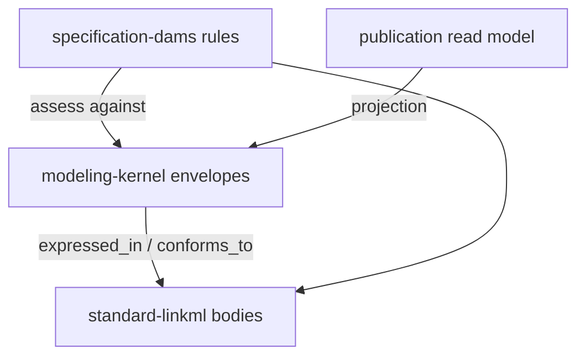

# moex-data-model: Architecture pack review

Вердикт: **архитектурная идея верная, пакет как спецификация ещё не готов.** Норматив — [docs/architecture/MODELING_ARCHITECTURE.md](docs/architecture/MODELING_ARCHITECTURE.md) (Proposed 0.2). [app_model.md](docs/architecture/app_model.md) и [modeling-kernel.yaml](docs/architecture/modeling-kernel.yaml) местами ей противоречат. [linkml_architecture.md](docs/architecture/linkml_architecture.md) полезен как Workbench, но всё ещё написан так, будто он верхний уровень.

Код ядра (`packages/modeling-kernel/` и т.д.) **не трогаем** в этом цикле. Сначала выровнять документы и схему.

## Что сделано хорошо

- Три роли `ModelingStandard` / `ReferenceSpecification` / `SpecificationImplementation` — правильная ось для мультиформальной платформы. «Роли ≠ технологии» (OpenAPI 3.1 vs API Profile vs `order-service/openapi.yaml`) — главный инвариант, его надо сохранить.
- Запрет `type + dict[str, Any]`, providers без `if standard == "linkml"`, Git vs PostgreSQL vs artifacts, first vertical slice `linkml → dams → trading-solution → publication` — разумный порядок.
- Viewer/Workbench явно производные. Это согласуется с уже существующим корневым [`viewer/`](viewer/), который не должен становиться source of truth.
- Kernel YAML уже содержит нужные координаты: `StandardRef` (constraint) vs `SpecificationRef`/`ImplementationRef` (exact), digest `sha256:…`, lifecycle, conformance phases, transformation kinds, relation kinds.

## Critical: ядро нарушает собственную политику расширения

В [modeling-kernel.yaml](docs/architecture/modeling-kernel.yaml):

- `settings.extension_policy: standard-specific-bodies-live-in-provider-schemas`
- при этом в том же файле живут `LinkMLImplementation`, `LinkMLImplementationBody`, `LinkMLClassElement` / Slot / Type / Enum

`SpecificationImplementation` сделан `abstract`. Тогда каждый новый стандарт — новый subclass в kernel. Это ломает инвариант 12 и правило «добавление OpenAPI не меняет kernel».

**Исправление схемы:** envelope в kernel — **конкретный** (identity, `conforms_to`, `implementation_kind`, `source`, provenance, digest, lifecycle). Typed body и element hierarchy — только в provider schema (`standard-linkml`), не в kernel. `ModelUniverse.implementations` хранит envelope, не LinkML-дерево.

Таблица тел в §4 MODELING_ARCHITECTURE остаётся **каталогом provider types**, не содержимым kernel schema.

## Critical: Protocol смешивает schema и instance

```python
class StandardProvider(Protocol, Generic[TBody, TElement]):
    def load_specification_body(...) -> TBody
    def load_implementation_body(...) -> TBody
```

Для LinkML/DAMS это разные объекты: spec body = schema (`SchemaView` / schema elements), implementation body = instance (`ModelPackage` YAML). Один `TBody` на оба метода не работает.

**Исправление в §5:** два параметра, например `TSpecBody` и `TImplBody` (или два protocol: `StandardSchemaProvider` + `ImplementationBodyProvider`). DAMS checker читает schema spec и instance implementation разными типами.

## Important: app_model.md моделирует роли наследованием

Верх дерева в [app_model.md](docs/architecture/app_model.md):

- `LinkMLStandard is_a ModelingStandard`
- `DamsSpecification is_a ReferenceSpecification`
- `DamsModelImplementation is_a LinkMLImplementation`

Это прямо спорит с §3 MODELING_ARCHITECTURE: DAMS — **экземпляр** reference specification на LinkML, не subclass kernel. Иначе «стандарт» снова становится типом файла.

Python-иерархия `ImplementationBody` (LinkML/OpenAPI/OWL elements) — правильная, но она живёт в **provider packages**, не как subclass kernel entities.

**Исправление:** переписать верх `app_model.md` как instances + `specification_kind`/`standard_family`. Убрать `MetaModel` как родителя всего. Пометить файл: «черновик раскладки пакетов, норматив — MODELING_ARCHITECTURE».

Отдельно: `specification-dams/domain/{package,conceptual,logical,...}.py` не должен стать второй рукописной копией DAMS. Типы — generated contracts из `moex-dams.yaml`; пакет владеет **rules + mappings + graph view**.

## Important: фактические ошибки относительно текущего репо

- **Root type DAMS.** §2 говорит root = `ModelPackage`. Фактически tree_root в [model_src/schemas/moex-dams.yaml](model_src/schemas/moex-dams.yaml) — `MOEXModelRepository`; `ModelPackage` вложен. Vertical slice «trading-solution» — instance package, но validate идёт через repository wrapper. Зафиксировать оба уровня: spec root class vs typical implementation document.
- **`ConformanceReport`** есть в §9 и срезе, в YAML только `ConformanceAssessment`. Либо переименовать, либо добавить report как агрегат assessment.
- **§10 mapping** требует authoritative source и transformation provenance. У `StandardMapping` нет этих слотов (`ProvenanceRecord` висит только на implementation).
- Enum `LinkMLElementKind` содержит `schema` и `instance`, классов `LinkMLSchemaElement` / `LinkMLInstanceElement` нет (и после выноса body в provider их надо добавить там).
- `ModelingStandard` описан как versioned, но это не `VersionedKernelElement`: нет `revision`/`content_digest`. Инвариант 1 («spec ссылается на version/**revision** стандарта») невыразим: `StandardRef` даёт только `version_constraint`.
- `diagnostic_details` — список строк, §9 хочет structured details.
- `implementation_kind` — голый `string`; логично `StandardFamily` (или тот же enum, что family).
- Relation `IMPLEMENTS` vs `CONFORMS_TO` не определены. Нужна одна фраза: implementation `conforms_to` spec; spec `expressed_in` standard; `implements` — для чего (ITSolution? generated contract?).

## Important: диаграмма hexagon перевёрнута

В §6 стрелки `LINKML/GIT/FS → PORTS`. Для outbound должно быть `APP → PORTS → adapters` (adapters реализуют ports). Сейчас выглядит, будто провайдеры вызывают ядро.

Domain §6 «владеет semantic rules», §7 отдаёт DAMS rules пакету `specification-dams`. Оставить в kernel только универсальные инварианты координат (1–12); MOEX/DAMS rules — в specification module.

## Minor: рассинхрон документов и дерева

- `app_model.md` без статуса/версии, целевые docs: `ARCHITECTURE.md` / `METAMODEL.md` / `MODULE_BOUNDARIES.md` — таких файлов нет.
- `linkml_architecture.md` header: «целевая архитектура приложения … на основе LinkML» + ADR-001 «LinkML YAML — канонический формат». §16 уже говорит, что это не верхний уровень. Нужен баннер: Workbench/LinkML toolchain, канон только для DAMS-активов, не для всей платформы.
- JSON Schema/SHACL в `StandardFamily` и в app_model как standards, а §10 — как derived artifacts. Одна ремарка: generated JSON Schema = `GENERATED_FROM`, не новый `SpecificationImplementation`, пока нет отдельного JSON Schema profile.
- Текущий [`viewer/`](viewer/) и [`packages/ontology/`](packages/ontology/) не обязаны переезжать в `apps/viewer` / `standard-owl` до стабилизации среза — это уже написано в §12, стоит повторить в `app_model.md` как «target after slice», не «now».
- [docs/IMPLEMENTATION_PLAN.md](docs/IMPLEMENTATION_PLAN.md) всё ещё рисует `apps/web` и `model-core`. Вне этой папки, но будет путать; одна отсылка в начале плана Workbench: «верхний канон — MODELING_ARCHITECTURE».

## LinkML-техническое в kernel (после выноса body)

- Вложенные `identifier: true` (`id`, `processor_id`, `element_id`) на inlined объектах плохо дружат с уникальностью.
- Полиморфный `linkml_elements: LinkMLElement` без type-designator (`type` / class_uri).
- `annotations: range string` — не key-value.
- `ConformanceAssessment is_a KernelElement` → обязательный `name` у каждого прогона.

Это править вместе с выносом LinkML types, не отдельным косметическим PR.

## Целевая граница после выравнивания



## Профилактика: почему это в принципе не должно повториться

Корень проблемы не в отдельных опечатках, а в том, что у пакета три файла без единого источника истины и без механической проверки собственных правил. Ниже — конкретные, воспроизводимые гварды. Все они не требуют `packages/modeling-kernel`: два первых работают прямо на `modeling-kernel.yaml`, третий — процессный.

### 1. Doc frontmatter contract (убирает «какой файл нормативный»)

Сейчас статус/версия — жирный markdown-текст (`**Статус:** Proposed`), машиной не читается. Перевести на настоящий YAML frontmatter, единый для всех `docs/architecture/*.md`:

```yaml
---
status: Proposed        # Draft | Proposed | Accepted | Superseded
version: "0.2"
normative: true          # true ровно у одного документа в директории
supersedes: []
superseded_by: null
---
```

Правило: `normative: true` может быть выставлен только у одного файла в `docs/architecture/`. `app_model.md` и `linkml_architecture.md` получают `normative: false` + `superseded_by: MODELING_ARCHITECTURE.md` — тогда сам факт противоречия нормативному документу становится видимым в заголовке файла, а не только в тексте §16.

### 2. `tools/architecture-check` — механическая проверка extension_policy

Новый маленький пакет по образцу [`viewer/pyproject.toml`](viewer/pyproject.toml) / [`packages/ontology/pyproject.toml`](packages/ontology/pyproject.toml) (свой `.venv`, `linkml-runtime` уже используется в репо, значит зависимость не новая):

```text
tools/architecture-check/
  pyproject.toml
  src/architecture_check/
    kernel_policy.py
    doc_consistency.py
  tests/
    test_kernel_policy.py
    test_doc_consistency.py
```

`kernel_policy.py` — грузит `modeling-kernel.yaml` через `SchemaView`, читает `settings.extension_policy`, и если он равен `standard-specific-bodies-live-in-provider-schemas`, падает на любом классе/слоте/enum с provider-специфичным именем вне allowlist:

```python
from linkml_runtime.utils.schemaview import SchemaView

FORBIDDEN_PREFIXES = ("LinkML", "OpenAPI", "OWL", "Shacl", "JsonSchema")
ALLOWLIST = {"StandardRef", "SpecificationRef", "ImplementationRef"}

def check_extension_policy(schema_path: str) -> list[str]:
    sv = SchemaView(schema_path)
    settings = sv.schema.settings or {}
    policy = settings.get("extension_policy", {}).get("value") if settings else None
    if policy != "standard-specific-bodies-live-in-provider-schemas":
        return []
    violations = []
    for name in list(sv.all_classes()) + list(sv.all_slots()) + list(sv.all_enums()):
        if name in ALLOWLIST:
            continue
        if name.startswith(FORBIDDEN_PREFIXES):
            violations.append(name)
    return violations
```

Это именно тот тест, который сразу поймал бы `LinkMLImplementation` / `LinkMLClassElement` в текущем `modeling-kernel.yaml` — то есть Critical-ошибку №1 из этого разбора. Запускается через `make architecture-check` (новый target в [Makefile](Makefile), по аналогии с `viewer` / `viewer-check`).

`doc_consistency.py` — вторая проверка, дешёвая и без парсинга LinkML:

- парсит frontmatter всех `docs/architecture/*.md`, падает если `normative: true` не ровно один раз;
- вытаскивает `tree_root: true` класс из `model_src/schemas/moex-dams.yaml` через `SchemaView.class_children`/`schema.classes`, сравнивает с именем root-класса, упомянутым в normative-документе (простой regex на `root =` / «Root type» рядом с именем класса) — если имена расходятся (как сейчас `ModelPackage` vs `MOEXModelRepository`), тест падает с явным диагнозом.

Обе проверки — pytest-тесты, а не только скрипты, чтобы жить в `make architecture-check` так же, как `make viewer-check` живёт для viewer.

### 3. `docs/architecture/CHECKLIST.md` — процессный гейт для того, что не автоматизируется

Часть найденных проблем (Protocol с одним `TBody` на schema и instance, hexagon-стрелки, `IMPLEMENTS` vs `CONFORMS_TO`) — про смысл, не про имена, их не поймает regex. Для них — обязательный чеклист, который должен быть отработан (галочки в PR description) при любом изменении `docs/architecture/*` или `modeling-kernel.yaml`:

- [ ] Новый/изменённый класс kernel не специфичен для одного standard family (проверяется `architecture-check`, но чеклист — явная точка «я подумал об этом»).
- [ ] Каждый `Protocol`/интерфейс, работающий с телом модели, различает specification body (schema) и implementation body (instance) — не один `TBody` на оба.
- [ ] Каждая новая relation (`RelationKind`) имеет однозначное определение «откуда → куда» и не дублирует смысл существующей.
- [ ] Инварианты §14 MODELING_ARCHITECTURE не нарушены; если нарушены — обновлён сам §14, а не проигнорирован.
- [ ] Диаграммы hexagon/flow отражают направление `application → ports → adapters`, а не наоборот.

Это ADR-уровня документ, не код; ссылка на него добавляется в шапку `MODELING_ARCHITECTURE.md`.

### 4. Тест-спецификация на будущее: раздельные TSpecBody/TImplBody

Код kernel ещё не существует, поэтому здесь фиксируется **требование к будущему тесту**, а не сам тест — он войдёт в `tests/architecture/test_public_apis.py` (путь уже зафиксирован в целевом дереве `app_model.md`) в момент, когда `packages/modeling-kernel` появится:

```python
def test_standard_provider_has_distinct_body_types():
    """StandardProvider must not collapse specification body and
    implementation body into a single TypeVar — that was Critical #2
    in docs/architecture review 2026-09-27."""
    hints = get_type_hints(StandardProvider.load_specification_body)
    impl_hints = get_type_hints(StandardProvider.load_implementation_body)
    assert hints["return"] is not impl_hints["return"], (
        "spec and implementation body types must differ per standard"
    )
```

Это гарантирует, что при первой реализации `StandardProvider` регрессия из этого разбора не проскочит в code review молча.

## Порядок правок (только docs/schema)

1. Kernel YAML: конкретный envelope; удалить LinkML* classes/slots/enum из kernel; добавить на mapping authoritative source + provenance; согласовать Report vs Assessment; version/revision стандарта.
2. MODELING_ARCHITECTURE §2/§5/§6: DAMS root (`MOEXModelRepository` vs `ModelPackage`); Protocol с двумя body-типами; стрелки hexagon; DEFINITION `IMPLEMENTS`.
3. `app_model.md`: статус Draft, instances not subclasses, package tree как target-after-slice, DAMS package = rules not second metamodel, имена docs как сейчас.
4. Баннер на `linkml_architecture.md` (§16).
5. Короткая пометка в `IMPLEMENTATION_PLAN.md`, что канон архитектуры — MODELING_ARCHITECTURE 0.2.
6. Frontmatter (status/version/normative/supersedes) во всех четырёх файлах `docs/architecture/*.md`.
7. `tools/architecture-check` (kernel_policy.py + doc_consistency.py) + `make architecture-check`; прогнать сразу после шага 1, чтобы проверить исправленный kernel YAML, а не только зафиксировать регрессию задним числом.
8. `docs/architecture/CHECKLIST.md` + ссылка на него из шапки `MODELING_ARCHITECTURE.md`.

Критерий готовности пакета: новый стандарт описывается descriptor + provider schema **без** правки `modeling-kernel.yaml` classes; DAMS остаётся instance spec; schema и instance не склеены в одном `TBody`; `make architecture-check` проходит; ровно один normative-документ; чеклист подшит к процессу ревью docs/architecture.
