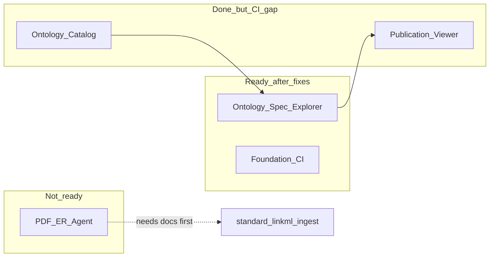

# moex-data-model: Close-out quality fixes

## Вердикт аудита

| Этап | Статус | Качество | Тесты |
|------|--------|----------|-------|
| **Ontology Spec Explorer** (PR #1 / `94448e7`) | Реализован | Mostly complete: FIBO nesting + UI + catalog export есть; catalog tree в preview почти flat; UX-copy DAMS-specific | CSV unit + build smoke есть; **нет** JsonNormalizer unit; catalog nesting assert условный; JS/DOM не тестируется |
| **Foundation CI + golden** | Closed | Strong | В `make check` + GHA |
| **Ontology Catalog** | Closed по плану | Packages + preview JSON ок; OAK unused | Тесты есть, **не в CI** |
| **Publication Viewer MVP** | Closed + post-MVP explorer | MVP+ | `make viewer-check` есть, **не в GHA** |
| **PDF→ER Dictionary agent** | **Не закрыт** | Только [design draft](docs/superpowers/specs/2026-09-28-pdf-to-er-dictionary-agent-design.md); `docs/agents/*` **отсутствуют** | Ingest 16/16 ок; agent-stage = 0% |

**Итог:** закрывать Spec Explorer можно после P0/P1 ниже. PDF-агент закрывать нельзя — нет playbook/contract.

---

## P0 — дефекты Spec Explorer (до «закрыто»)

### 1. Catalog nesting flat в preview

В [`publication_export.py`](packages/ontology-catalog/src/moex_ontology/publication_export.py) `parent_ref` ставится только если parent IRI уже в индексе той же онтологии. В committed [`ontology_explorer.json`](packages/ontology-catalog/publications/ontology_explorer.json) у всех узлов `"parent_ref": ""` — дерево не строится. Тест в [`test_catalog.py`](packages/ontology-catalog/tests/test_catalog.py) условный (`if day and kind`) и может молча пройти на flat data.

**Fix:** при parent вне indexed set — либо stub-узел parent в группе, либо `parent_ref` по curie/local если parent indexed под другим id; усилить тест: **жёсткий** assert nesting для `BusinessDay` → `OccurrenceKind` на mini_fibo (без `if`). Перегенерировать `ontology_explorer.json`.

### 2. Неверный placeholder / badge для ontology explorer

В [`viewer.js`](apps/viewer/static/viewer.js) ~1427: `"Use the left sidebar to explore schema packages."` — DAMS-only copy. Group card всегда badge `package` (~1062) для ontology domain groups.

**Fix:** нейтральный placeholder (`explore this module` / по `tags`); для `kind=group` с `ontology_id`/`source_domain` — badge `domain`/`ontology`, не `package`.

### 3. Typo «MOEX standart»

[`publish.yaml`](model-assets/specifications/moex-dams/0.1/publish.yaml) + assert в [`test_build.py`](apps/viewer/tests/test_build.py) → `MOEX standard`.

---

## P1 — пробелы тестов Spec Explorer

### 4. JsonNormalizer unit (был в плане Task 5, не сделан)

Добавить в [`test_normalizers.py`](apps/viewer/tests/test_normalizers.py): fixture nested `type: explorer` JSON → `JsonNormalizer` сохраняет groups + children (slice или мини-файл в `apps/viewer/tests/fixtures/`).

### 5. Усилить catalog export test

Заменить условный nesting assert на обязательный; при необходимости расширить mini_fibo fixture так, чтобы parent и child оба индексировались.

### 6. Build smoke: ontology-catalog обязателен

В [`test_build.py`](apps/viewer/tests/test_build.py) убрать `if cat is not None` — catalog module с `explorer` должен быть hard requirement (пакет в репо).

---

## P2 — CI: закрыть «тесты есть, но PR их не видит»

Сейчас [`.github/workflows/check.yml`](.github/workflows/check.yml) гоняет только `make check`. Viewer/ontology/linkml-ingest вне gate.

**Fix (один job или matrix):**
- `make viewer-check`
- pytest `packages/ontology-catalog`, `packages/standard-owl`, `packages/semantic-mappings` (через новые Makefile targets или один `packages-check`)
- опционально `make linkml-ingest-check` (уже изолирован в `.venv`)

Не раздувать Stage 0 `make check` без нужды — отдельный GHA job `viewer-and-packages` проще по deps.

---

## P3 — процесс / docs close-out

### 7. Отметить Spec Explorer план выполненным

- Todos в [`.cursor/plans/moex-data-model_ontology_spec_explorer.plan.md`](.cursor/plans/moex-data-model_ontology_spec_explorer.plan.md) → `completed`
- Checkboxes в [`docs/superpowers/plans/2026-09-28-ontology-spec-explorer.md`](docs/superpowers/plans/2026-09-28-ontology-spec-explorer.md)

### 8. PDF→ER agent — docs delivered

Agent docs are in place:
- [`docs/agents/er-dictionary-model-contract.md`](docs/agents/er-dictionary-model-contract.md)
- [`docs/agents/pdf-to-er-dictionary.md`](docs/agents/pdf-to-er-dictionary.md)

Design status: **delivered (agent docs)**. Runtime OKITA fill + `gaps.md` remain per-run (out of this close-out).

---

## Вне scope этого close-out (осознанно)

- OAK path в catalog (сейчас RDFLib-first; ADR-010 ок) — отдельный follow-up
- Browser/JS DOM tests для ontology cards — низкий ROI пока нет harness
- RU fields в catalog export (`definition_ru`) — нет в `OntologyEntityCard` model; отдельный data/model change
- JSON Schema manifest (ADR-011 partial) — deferred
- Полный OKITA PDF run

---

## Порядок выполнения

1. P0 fixes (nesting + copy/badge + typo) + тесты, которые ловятся
2. P1 missing unit/smoke
3. P2 CI job
4. P3 plan checkboxes + PDF status note
5. Прогон: `make viewer-check`, catalog pytest, локально убедиться FIBO + Catalog nested nav в `make viewer`
