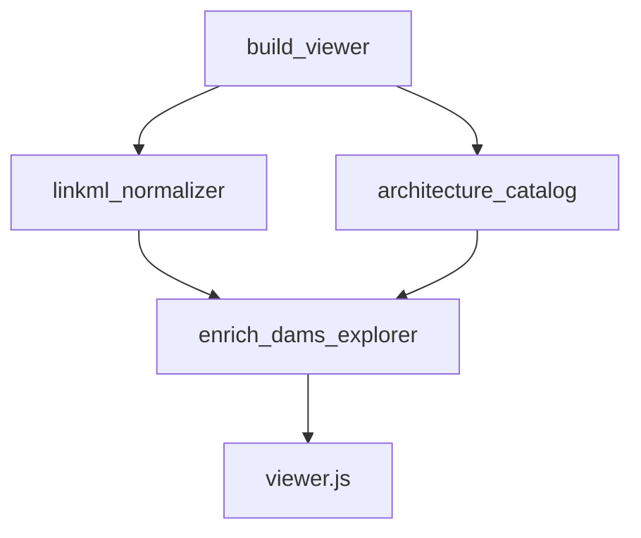

# moex-data-model: DAMS Spec triple-root explorer

## Locked decisions

| Topic | Choice |
|-------|--------|
| Tree roots | **3**: `Классы` / `Спецификация` / `Реализации` |
| Spec files | `specification.yaml` + `schemas/*.yaml` |
| Реализации | **A** — nodes from [architecture-catalog.yaml](model-assets/specifications/moex-dams/0.1/architecture-catalog.yaml) with `role: specification_implementation` and `conforms_to: moex-dams`; click → `navigateToNode` / module (не карточка внутри DAMS) |
| Approach | One `type: explorer` section; wrap existing package groups under `group:classes` |
| Scope | DAMS only; FIBO/Ontology Catalog explorers unchanged |
| Default expand | `Классы` open; `Спецификация` and `Реализации` collapsed |

```text
Specification explorer
├─ Классы                    ← group:classes
│   ├─ Root / Core / …       ← existing package groups
│   │   └─ Class / Enum
├─ Спецификация              ← group:spec-files
│   ├─ specification.yaml    ← kind: source_file
│   └─ schemas/*.yaml
└─ Реализации                ← group:implementations
    └─ Trading solution …    ← kind: implementation_ref → catalog/module
```



---

## Data contract

### `group:classes`
Current explorer items (package groups + classes/enums) become **children** of one root `PublicationItem(id=group:classes, title=Классы, kind=group)`.

### `group:spec-files`
Children `kind: source_file`:

| Attribute | Content |
|-----------|---------|
| `path` | repo-relative e.g. `schemas/moex-core.yaml` |
| `version` | from YAML if present |
| `description` | from file / curated for envelope |
| `text` | full file text |
| `refs_out` / `refs_in` | lists of other `file:…` item ids |

Item ids: `file:specification.yaml`, `file:schemas/moex-core.yaml`, …

### `group:implementations` (choice A)
Children `kind: implementation_ref`:

| Attribute | Content |
|-----------|---------|
| `catalog_node_id` | e.g. `trading-solution` |
| `module_id` | e.g. `moex:module:trading-solution` |
| `version` | from catalog node |
| `conforms_to` | `moex-dams` |

**No embedded module body** in DAMS explorer. Nav click calls existing catalog navigation (`navigateToNode` / module show).

Enrichment in [build.py](apps/viewer/src/moex_publication_viewer/build.py) **after** catalog load: inject third root on `moex:module:dams` explorer section.

---

## UI ([viewer.js](apps/viewer/static/viewer.js))

1. Nested `nav-explorer` for three roots.
2. `renderExplorerDetail`:
   - `source_file` → header + refs + collapsible YAML (indent fold, light key highlight; no CodeMirror).
   - `implementation_ref` → nav click navigates to catalog module (thin “Open…” card optional).
3. Architecture catalog sidebar behaviour unchanged.

---

## Files to touch

| Area | Path |
|------|------|
| Wrap classes + spec-file items | [linkml_normalizer.py](apps/viewer/src/moex_publication_viewer/normalizers/linkml_normalizer.py) |
| Inject implementations root | [build.py](apps/viewer/src/moex_publication_viewer/build.py) |
| Cards + nav | [viewer.js](apps/viewer/static/viewer.js), [viewer.css](apps/viewer/static/viewer.css) |
| Tests | [test_normalizers.py](apps/viewer/tests/test_normalizers.py), [test_build.py](apps/viewer/tests/test_build.py) |
| Spec doc | `docs/superpowers/specs/2026-09-28-dams-spec-triple-root-explorer-design.md` |

---

## Verification

- Unit: 3 roots; `group:classes` has packages; ≥1 `source_file`; `trading-solution` under implementations.
- Build `-Check`: HTML embeds `source_file` text and `implementation_ref`.
- Manual: Классы / Спецификация (file+fold) / Реализации → jump to Trading solution module.

## Out of scope

Ontology explorers; examples/README in Spec files; CodeMirror; editing YAML; SchemaRepository residual.
