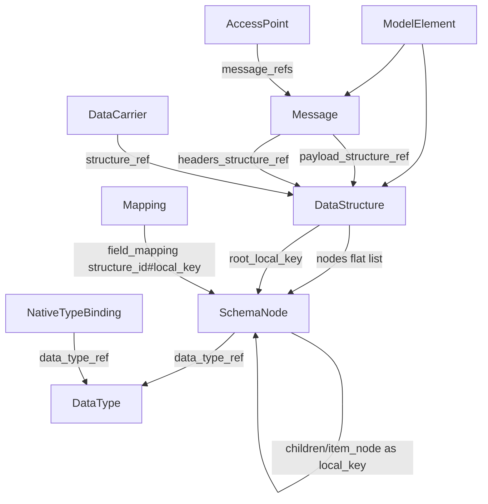

# moex-data-model: DataStructure и SchemaNode

**For agentic workers:** спайк — первый содержательный коммит PR-1, **до** `moex-structure.yaml`. Не править `generated/**` вручную; не трогать `modeling-kernel.yaml`.

**Goal:** структура носителя или сообщения — `DataStructure` с плоским списком `SchemaNode`; `Message` не `TechnicalAsset`; нет `PhysicalField`, `message_type` и transitional-пометок; `make check` и `make architecture-check` зелёные.

**Architecture:** плоский список узлов на корне (`nodes` + `root_local_key`); рёбра дерева — `local_key` (строки), не вложенные объекты. `Message` в `moex-integration.yaml`. Типы — существующие `DataType` / `NativeTypeBinding` ([moex-datatypes.yaml](model-assets/specifications/moex-dams/0.1/schemas/moex-datatypes.yaml)).

## Предусловие: CONFIRMED

TechnicalAsset на месте ([moex-technical.yaml](model-assets/specifications/moex-dams/0.1/schemas/moex-technical.yaml), Variant B в [moex-core.yaml](model-assets/specifications/moex-dams/0.1/schemas/moex-core.yaml), ADR-031/032/033). `PhysicalObject` в схемах нет.

Нюанс: enum-значения `payload` нет; legacy мапится в `message_type`. В mdm/crm/esed/ucd носителей `message_type` нет. `PhysicalField` жив: 209 полей (mdm 42).

Схема DAMS уже **1.0.0** (путь `0.1/` сохранён). Удаление `PhysicalField` — breaking → **2.0.0**, с деприкацией в PR-1.

**`schema_dialect` в инстансах нет** (только определение слота в схеме и зеркало в `moex-dams-full.yaml`). Миграция значений не нужна; слот всё равно депрекейтить в PR-1.

## Представление дерева: плоский список (зафиксировано до модуля)

Inlined-рекурсия `SchemaNode` в LinkML неизбежна, если нет идентификатора (`inlined` всегда true). Ссылки `structure_id#local_key` по сути плоские. Выбран запасной вариант ТЗ как **основной**:

- `DataStructure.nodes`: список `SchemaNode` (inlined list/dict).
- `DataStructure.root_local_key`: required, указывает на корневой узел.
- `SchemaNode.children`: `string` multivalued — `local_key` детей (object/union), не вложенные объекты.
- `SchemaNode.item_node`: `string` — `local_key` узла элемента (array/map), не объект.
- Циклы в `children`/`item_node` запрещены валидатором (дерево); рекурсия схемы — через `node_kind=reference`.

Viewer/проекции собирают дерево из рёбер. SQL, semantic diff и Mapping работают по плоскому ключу.

**Спайк (commit 1 PR-1, до модуля).** Прогнать **оба** представления (inlined-дерево vs плоский список) через все генераторы репозитория, не только YAML→Pydantic→JSON Schema:

- JSON Schema (`$ref` / `$defs`)
- Pydantic (`moex_dams_contracts`)
- OWL, SHACL
- DBML
- `dams_to_graph`

Критерии спайка:

- (а) глубина вложенности **4+**;
- (б) `local_key` как `identifier`/`key` внутри родителя — словарная форма, проверка уникальности;
- (в) обратная конвертация **без потери полей**.

Результат спайка пишется в черновик ADR-038. Форма модуля — плоский список, если спайк не покажет блокера именно для плоской формы. Inlined-дерево не брать, даже если генераторы его «переваривают»: оно хуже для diff/SQL/CURIE.

## Главные отклонения от ТЗ

- **Не создавать `DataType`/`NativeTypeBinding`.** Этап 6 ТЗ пропустить (ADR-036/037). ADR-041 только про узел ↔ тип.
- **`EmbeddedComponent` нет.** `EmbeddedElement` (`local_key`, `description` optional через `slot_usage`) в `moex-structure.yaml`. **Не конфликтовать с будущим `IdentifiedElement`:** `local_key` — слот только встраиваемых объектов (уникальность внутри родителя), не глобальный идентификатор; `description` уже глобальный — не вводить второй. Зафиксировать в ADR-038.
- **`Message` не mixin `HasStructure`.** `payload_structure_ref` / `headers_structure_ref`.
- **Сначала проверить импорт** `moex-core` → `moex-integration` (SchemaView + `make validate-schemas`). `Message` класть в `moex-integration.yaml`. В `moex-structure.yaml` — **только если** цикл ломает загрузку; тогда долг в ADR-040 (не закреплять второй цикл core↔structure как норму).
- **`HasStructure`:** `structure_ref.range` → `DataStructure` в PR-2. `schema_dialect` снять с миксина в PR-2 после deprecation в PR-1. `data_format` оставить на носителе (wire ≠ schema).
- Имена слотов: `native_name` не `node_name`; `ordinal_position` не `ordinal`; `name` не `message_name`; `dialect_native_type` не трогать; `TypeFamilyEnum` как есть.
- Coverage-слоты на `SchemaNode`. Ссылки Mapping/`schema_node_refs`/`foreign_key_target` — `uriorcurie` `structure_id#local_key`.
- Один `structure_ref` + `previous_version_ref`.
- Коллекции: добавить `data_structures` и `messages` (`data_types` уже есть).

## Версии и двухшаговая деприкация

Дисциплина как у attribute-semantics ([moex-deprecated-slots.yaml](docs/migration/archive/moex-deprecated-slots.yaml), `DAMS-DIFF-DEPRECATE-REMOVE`):

- **PR-1 (совместимый, schema `version: 1.1.0`):** на `PhysicalField`, слот `physical_fields`, слот `HasStructure.schema_dialect` выставить `deprecated:` + `deprecated_element_has_possible_replacement` (`dams:SchemaNode` / `dams:data_structures` / `dams:schema_dialect` на DataStructure). Живые модели пока с `physical_fields`.
- **PR-2 (breaking, schema `version: 2.0.0`, путь `0.1/` сохранить):** удалить класс и слоты. Semantic diff обязан видеть «was deprecated». Changelog: [docs/migration/CHANGELOG-attribute-semantics.md](docs/migration/CHANGELOG-attribute-semantics.md) как образец — новый `docs/migration/CHANGELOG-data-structure.md`.
- Не удалять `PhysicalField` в том же PR, где он только появился как deprecated.

## Решения ADR-038…041

**ADR-038 (D) DataStructure и SchemaNode**

- Форма и физика в одном узле (ODCS).
- Порядок/ключ на узле: `ordinal_position`, `is_primary_key`, `is_unique`, `foreign_key_target`. Реляционные признаки **только** при `schema_format=relational`. Узел в LinkML не знает родителя-структуру → проверка **целиком в DAMS-валидаторе**; `make validate-schemas` это **не** ловит. Негатив «реляционный признак в JSON» гонять через `moex-dams-assess` / `check_formal_requirements`.
- `realizes_attribute_ref` необязателен.
- Корень: relational → object; иначе object или array.
- `schema_format` — стартовый enum; перенос в реестр — отдельно.
- **Версия формата (заложить сейчас, не breaking потом):** слот `schema_dialect` (`uri`, optional) на `DataStructure` — диалект/версия языка схемы. Для JSON Schema — IRI диалекта (OpenAPI `jsonSchemaDialect`, JSON Schema 2020-12). Для AsyncAPI Multi Format Schema — идентификатор формата+версии payload schema. Для `relational` не заполнять. Так слот есть с 1.1.0, расширение значений не требует нового слота.
- Breaking 1.0.0 → 2.0.0 и окно деприкации 1.1.0 — явно в этом ADR.
- Плоский список узлов — решение спайка.

**ADR-039 (E) Адресация узлов**

- CURIE `dams:structure/…#local_key`; дополнить [ADR-030](docs/adr/ADR-030-dams-uri-and-prefix-policy.md).
- **Алфавит `local_key`:** `^[a-z0-9_.-]+$` (без `#`, `/`, пробелов). Генерация: lowercase slug сегментов пути, `.` как разделитель вложенности (`a.b.c`). Запрещённые символы исходного имени → `_`. Если slug пустой — `_`.
- **Коллизии slug:** суффикс `-2`, `-3`, …; каждая коллизия в `migration-report.md`. После записи в модель ключ **заморожен**.
- **Заморозка:** миграция один раз вычисляет ключ из `schema_path`/`native_name`. Дальше `local_key` **не** пересчитывается при переименовании `native_name`. Повторный запуск скрипта на уже мигрированной модели не меняет ключи (тест идемпотентности **по множеству ключей**, не только по счётчику). Ручная смена ключа — breaking для Mapping/selections.
- Версионирование структуры: новый `DataStructure` + `previous_version_ref`; ключи в новой версии независимы.

**ADR-040 (F) Message** — как раньше; импорт проверять до переноса класса; временный дом в `moex-structure` = долг.

**ADR-041 (G)** — не дублировать ADR-036.

Первоисточники ADR-038: AsyncAPI 3.0 Multi Format Schema Object; OpenAPI 3.1 Schema Object / jsonSchemaDialect; JSON Schema 2020-12; Apache Avro spec.

## Целевая модель

`SchemaNode` `is_a: EmbeddedElement`. Идентичность `(DataStructure.element_id, local_key)`.

Правила node_kind (children/item_node непусты/запрещены) — LinkML `rules` там, где достаточно слотов узла; уникальность `local_key` в `nodes`, ацикличность, реляционный профиль, Mapping ends, `message_refs` kind — DAMS (`packages/specification-dams/src/moex_dams/rules/data_structure.py`).

## Миграция данных

1. Группировать `physical_fields` по носителю.
2. `DataStructure` relational / `structure_version` 1.0.0 / корень object; `nodes` плоский список.
3. Старый `structure_ref` → `source_artifact_ref` если URI, иначе отчёт.
4. Новый `structure_ref` = id структуры.
5. Поля → scalar-узлы; dotted `schema_path` → промежуточные object-узлы + рёбра `children`.
6. `local_key` по правилам ADR-039; коллизии — суффикс + отчёт; **повторный прогон не меняет ключи**.
7. Mapping и `schema_node_refs` переписать на `structure_id#local_key`.
8. `message_type` → Message; неоднозначный канал — ошибка.
9. ruamel.yaml; digest как в [scripts/migrate_physical_to_technical_asset.py](scripts/migrate_physical_to_technical_asset.py).

Инварианты тестов:

- число **scalar**-узлов = число PhysicalField (mdm 42); промежуточные object от dotted path **не** входят в счётчик;
- число `field_mapping` и множество концов (после нормализации) совпадает до/после (переписанные CURIE);
- повторный запуск: пустой diff YAML **и** то же множество `local_key`.

**PR-2 дополнительно:** сравнение проекций **mdm до/после** — DBML, Mermaid ER, ER scene (таблицы/колонки не потеряны; имена колонок = `native_name`). Остаточный grep-тест `PhysicalField|physical_fields|message_type` (allowlist: миграционный скрипт, changelog, ADR, inventory, `tmp/`).

## Файлы

Схемы: новый [moex-structure.yaml](model-assets/specifications/moex-dams/0.1/schemas/moex-structure.yaml); правки `moex-dams.yaml`, `moex-core.yaml`, `moex-technical.yaml`, `moex-integration.yaml`, `moex-contract-binding.yaml`, `moex-types.yaml`. AccessPoint.`message_refs` + rule против interface.

Конформанс: новый `data_structure.py`; `formal_checks.py`, `technical_assets.py`, `element_index.py`, `dams_to_graph.py`, `cascade.py`, DBML/Mermaid/ER, `diff.py`, `catalog_validate.py`; [it-solution-requirements.yaml](model-assets/specifications/moex-dams/0.1/requirements/it-solution-requirements.yaml).

Потребители **в PR-2** (иначе `make check` красный после удаления класса): ingest [mapper.py](packages/standard-linkml/src/moex_standard_linkml/ingest/mapper.py), [ids.py](packages/standard-linkml/src/moex_standard_linkml/ingest/ids.py), [technical_asset.py](packages/standard-linkml/src/moex_standard_linkml/ingest/technical_asset.py); [apps/api yaml_mutate.py](apps/api/src/moex_model_api/yaml_mutate.py); [apps/web](apps/web); [packages/drawdb-adapter](packages/drawdb-adapter); [apps/viewer](apps/viewer) (дерево из плоского списка); [layer_boundaries.py](tools/architecture-check/src/architecture_check/layer_boundaries.py).

Фикстуры: 4 позитивные; негативные из ТЗ. «Реляционный признак в JSON» — assert через DAMS, не только `linkml-validate`.

Не делать: импортёры OpenAPI/AsyncAPI/ODCS; `Expression`; смена модели Mapping кроме формата ссылок; `modeling-kernel.yaml`.

## Нарезка PR

**PR-1 (аддитивный, 1.1.0):** PhysicalField жив и **deprecated**. Коммиты:

1. `chore: inventory of PhysicalField usages`
2. `chore: spike SchemaNode representation` — **до модуля**
3. `feat(dams): add moex-structure module (flat nodes) and deprecate PhysicalField`
4. `feat(dams): add Message and AccessPoint.message_refs` (после проверки SchemaView)
5. `docs(adr): draft ADR-038–041 (proposed)`

Проверка: `make validate-schemas`.

**PR-2 (2.0.0, самый рискованный):** удаление deprecated; миграция 209 полей; Mapping; ingest/web/drawdb/api/viewer; валидатор; остаточный тест; проекции mdm. Проверки: `validate-schemas`, `validate-examples`, полный `make check` и `make architecture-check`.

Коммиты: `refactor(dams): replace PhysicalField with SchemaNode` → `feat(dams): migrate examples, mdm and ingest` → `feat(conformance): update rules, requirements and consumers`.

**PR-3:** `make generate-contracts` / `generate-artifacts`; golden diff в отчёте; ADR Accepted; README; changelog. Коммиты: `chore: regenerate artifacts` → `docs: ADR-038–041 accepted`.

## Отчёт в PR

Было→стало; make; коллизии `local_key`; непрозрачные старые `structure_ref`; неоднозначные Message-каналы; негативы (явно: JSON+PK ловит DAMS, не LinkML); временные решения (`constraint_expressions`, string-диалекты, enum форматов); golden; результат спайка генераторов; SemVer 1.1.0 / 2.0.0.
