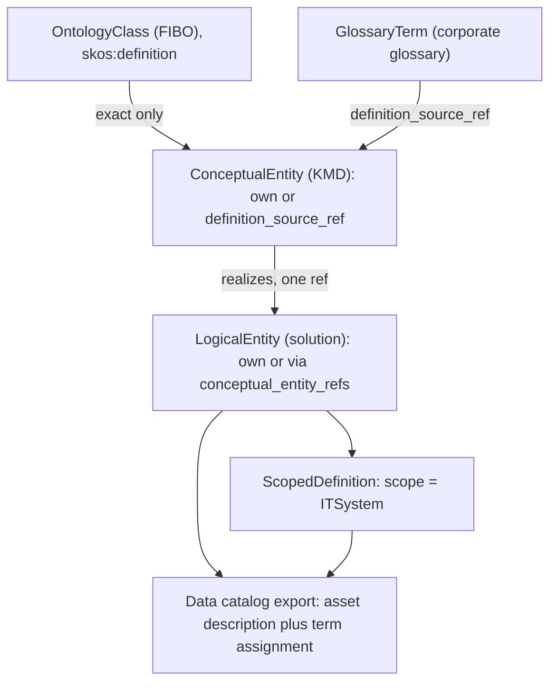

# moex-data-model: Definition cascade

## 1. Что нашёл в репозитории

"Глоссарий" сейчас означает шесть разных вещей, и ни одна не связана с остальными механизмом:

- `ModelElement.description` в [moex-core.yaml](model-assets/specifications/moex-dams/0.1/schemas/moex-core.yaml): required, de facto единственное определение. `LDM-002.c3` в [it-solution-requirements.yaml](model-assets/specifications/moex-dams/0.1/requirements/it-solution-requirements.yaml) называет его "однозначное определение". В импортах из xlsx (например `ucd-solution-model.yaml`) description по выборке совпадает с названием ("Соглашение").
- `glossary_term_refs` -> `GlossaryTerm` в [moex-registries.yaml](model-assets/specifications/moex-dams/0.1/schemas/moex-registries.yaml): `RegistryEntry`, локальная ссылка на запись внешнего мастера корпоративного глоссария.
- Секция viewer `glossary` (ADR-016/ADR-024): плоское представление классов онтологии, "не отдельный набор данных". Но для DAMS [dams_glossary.json](model-assets/specifications/moex-dams/0.1/publications/dams_glossary.json) написан вручную и не связан с моделью (второй источник правды).
- SKOS-схема [skos_concepts.yaml](model-assets/transformations/glossary/skos_concepts.yaml): дублирует определения; это проекция, но выглядит как источник.
- FIBO: `skos:definition` и `definition_ru` в preview CSV. Адаптер [literals.py](packages/standard-owl/src/moex_standard_owl/literals.py) склеивает несколько определений через `join_definitions`, то есть "эталона" и там нет.
- [LinkML_Glossary_DAMS.md](docs/LinkML_Glossary_DAMS.md) (и копия в `docs/dev/`): справочник по конструкциям LinkML, к бизнес-терминам отношения не имеет.

Каскад ADR-023 ([cascade.py](packages/specification-dams/src/moex_dams/rules/cascade.py)) работает только по containment внутри одного пакета. Наследование определения идёт по другой оси (смысловая цепочка, между пакетами и спецификациями). ADR-023 прямо отложил "inherit via `realizes`" как extension с явным приоритетом. Это он и есть.

## 2. Как это делают LinkML и индустрия

LinkML (проверено по `linkml_runtime/.../meta.yaml`):
- `description` имеет `slot_uri: skos:definition` (alias `definition`). То есть в LinkML description и есть определение, одно на элемент, по `is_a` не наследуется.
- `alt_descriptions` (`alt_description`: `source` + текст) - нативные атрибутированные альтернативные определения. Подходит под контекстные определения.
- `slot_usage` - переопределение слота в контексте класса (в том числе description). Это override на уровне схемы; эффективное значение даёт `SchemaView.induced_slot`. Идея та же, что у нашего резолвера: объявленное отдельно от эффективного.
- Есть `class_uri`, `definition_uri`, `exact_mappings` / `close_mappings` / `broad_mappings`, `source`, `in_language`, `see_also`, `structured_aliases` (`skosxl:altLabel`). Миксины значения экземпляров не наследуют, как и в ADR-023.
- Наследования определения из внешнего термина нет.

Стандарты и онтологии:
- ISO/IEC 11179: Designation и Definition принадлежат Context. Это точная аналогия контекстных определений уровня системы.
- ISO 704/1087 и OBO Foundry: один термин, одно текстовое определение плюс источник определения. Принцип "одно эталонное" - норма.
- SKOS: `skos:exactMatch` допускает взаимозамену, `closeMatch` и `broadMatch` - нет. Отсюда правило: определение наследуется только через exact.
- FIBO: `skos:definition` обязателен (уже в [annotation-profile.yaml](model-assets/specifications/moex-fibo-profile/0.1/metamodel/annotation-profile.yaml)), плюс `adaptedFrom` как атрибуция.

Каталоги данных (DataHub, OpenMetadata, Collibra, Purview, Atlan):
- Термин глоссария - одно определение, терм иерархичен и привязывается (term assignment) к датасету или полю. Описание самого актива - отдельное поле, обычно в двух слоях (из источника / отредактированное).
- Наследования определений в цепочке "онтология - концепт - логика - физика" нет. Есть материализованное копирование (propagation описаний по lineage).
- ODCS data contract имеет `authoritativeDefinitions` - ссылку на эталонное определение. Это соответствует нашему `definition_source_ref`.

Вывод по совместимости: наша схема "объявленное плюс вычисляемое эффективное с провенансом" совместима с каталогами через плоский экспорт. Эффективное определение идёт в `description` актива, а `glossary_term_refs` - в term assignment. Контекстное определение системы идёт в описание актива этой системы.

## 3. Оценка вашей схемы и улучшения

Схема оптимальна по сути (одно эталонное, override вниз, видно own или inherited). Нужны шесть уточнений:

1. Это вторая ось, не расширение `GOVERNED_FAMILIES`. Резолвер ADR-023 берёт один пакет, а определению нужен индекс по нескольким пакетам плюс внешние источники (онтология, `GlossaryTerm`). Новый модуль рядом с `cascade.py`.
2. Наследовать только через точное соответствие. Дефолтный мост в [MOEX_PARTY...PROFILE.md](docs/architecture/MOEX_PARTY_AND_TRADING_PARTICIPATION_PROFILE.md) использует `skos:closeMatch` как candidate. Поэтому на практике КМД чаще будет иметь своё определение с атрибуцией `definition_source_ref` ("adapted from"), а чистое наследование из FIBO - только при exactMatch / equivalentClass. Это честное следствие, его фиксируем в ADR.
3. Два варианта источника для КМД (как вы просили, плюс корпоративный глоссарий по ответу): own, либо inherited из онтологического класса, либо из `GlossaryTerm`. Режим выводится из данных: `description` задан - own; не задан, но есть `definition_source_ref` - inherited.
4. Контекстное определение (scoped) - не просто текст. Обязательны: `scope_kind` (v1 только `system`, enum расширяемый), `scope_ref`, `relation_to_reference` (refines / narrows / alternative / replaces), `rationale`, статус согласования. Проверка: система должна входить в `ITSolution.member_system_refs`.
5. Язык - отдельная ось, не override. FIBO английский, КМД русский. Резолвер возвращает язык результата, переводы (`definition_ru`) оставляем вне v1, ADR резервирует ось.
6. Дрейф: изменение определения у родителя тихо меняет эффективное определение потомков. Semantic diff (ADR-012) сравнивает объявленное. Резолвер отдаёт хэш источника, отчёт "эффективное определение изменилось" - follow-up.

## 4. Целевая модель

Правила резолва `resolve_definition(element, scope=None)`:

1. Есть `scoped_definitions` с подходящим `scope` - берём самое специфичное; режим `scoped`.
2. Иначе `description` задан - режим `own` (если есть `definition_source_ref`, то "own, adapted from").
3. Иначе `definition_source_ref` - рекурсивно эталонное определение цели; режим `inherited`. Для ссылки на онтологический терм требуется exact-соответствие.
4. Иначе для `LogicalEntity` с ровно одним `conceptual_entity_refs` - определение концепта (неявно, режим `inherited`). Если ссылок несколько - неоднозначность, нужен явный источник или own.
5. Иначе не разрешено - диагностика.

Результат: `(text, language, source_element_id, level, mode, scope, source_hash)`. Эффективное определение в YAML не пишется (как в ADR-023). Атрибуты в v1 - только own (концептуальных атрибутов нет). Физический уровень определений не несёт: его семантику задаёт `Mapping`.

Связь со статусом выравнивания (`ConceptualAlignmentStatusEnum`): `aligned` допускает наследование, `pending` / `local-only` / `not-applicable` требуют own.

## 5. Упорядочение терминов (раздел-норма в ADR)

- Term (обозначение): `name`, `title`, `aliases`.
- Definition: эталонное определение элемента, одно на уровень.
- Scoped definition: дополнительное определение в контексте, не заменяет эталонное вне контекста.
- Glossary - всегда представление (view) определений заданного охвата, не набор данных и не сущность. Три вида: онтологический (ADR-024), модельный (КМД и сущности решений), корпоративный (внешний мастер).
- `GlossaryTerm` - только ссылка на запись корпоративного глоссария (имя сохраняем, чтобы не плодить миграции). `glossary_term_refs` = привязка термина (как в каталогах), `definition_source_ref` = откуда определение; это разные вещи.
- SKOS и ручные JSON (`dams_glossary.json`) - проекции из модели, не источники.
- `LinkML_Glossary_DAMS.md` - developer-справочник, не глоссарий предметной области; убрать дубль в `docs/dev/`.

## 6. Реализация (выбрано: ADR + схема + резолвер, без viewer)

- ADR-025 [docs/adr/ADR-025-definition-cascade-and-glossary.md](docs/adr/ADR-025-definition-cascade-and-glossary.md) (Proposed) и строка в [docs/adr/README.md](docs/adr/README.md). Связи: уточняет ADR-023 (закрывает extension по оси realizes), обобщает ADR-024 ("glossary = view"), опирается на ADR-020 (отношения exact/close), ADR-013 (formal_checks), ADR-001. Содержание: контекст, терминология, правила резолва, схема, совместимость с каталогами и онтологиями, отвергнутые альтернативы (новый слот `definition` вместо `description`; copy-down; union определений; наследование через closeMatch; контекстные определения как отдельные сущности-термы).
- Схема. В [moex-governance.yaml](model-assets/specifications/moex-dams/0.1/schemas/moex-governance.yaml): mixin `HasDefinition` (`definition_source_ref`, `definition_rationale`, `scoped_definitions`), класс `ScopedDefinition` (с `HasProvenance`). В [moex-types.yaml](model-assets/specifications/moex-dams/0.1/schemas/moex-types.yaml): enum `DefinitionScopeKindEnum`, `ScopedDefinitionRelationEnum`. В [moex-core.yaml](model-assets/specifications/moex-dams/0.1/schemas/moex-core.yaml): mixin на `ConceptualEntity`, `LogicalEntity`, `LogicalAttribute` и `slot_usage: description: required: false` на них (по LinkML-идиоме; `description` остаётся `skos:definition`, новый слот не заводим). Регенерация `generated/`.
- Резолвер `packages/specification-dams/src/moex_dams/rules/definitions.py`: индекс по нескольким пакетам, `Protocol` внешнего провайдера (адаптеры к ontology-catalog и к `GlossaryTerm`), защита от циклов. Экспорт в [public.py](packages/specification-dams/src/moex_dams/public.py).
- Проверки в [formal_checks.py](packages/specification-dams/src/moex_dams/rules/formal_checks.py) и каталоге требований: `LDM-002.c3` переходит с сырого `description` на разрешимое эффективное определение. Новые диагностики: источник не найден или не exact (error), override без `definition_rationale` (warning), текст совпадает с унаследованным (info, как redundant override в ADR-023), `description` равен `title` (info), `scope_ref` не из `member_system_refs` (error), несколько `conceptual_entity_refs` без явного источника (error).
- Тесты `test_definition_resolver.py`: own / inherited / scoped, exact vs close, неоднозначные ссылки, цикл, `pending`, пустой источник.
- Документы: [IT_SOLUTION_MODEL_REQUIREMENTS.md](docs/architecture/IT_SOLUTION_MODEL_REQUIREMENTS.md) (LDM-002), [ontology-catalog.md](docs/architecture/ontology-catalog.md) (строка про глоссарий), таблица mixins в `LinkML_Glossary_DAMS.md`.

## 7. Вне объёма

- Viewer: показ own / inherited / scoped, провенанса и генерация model-glossary секции (ADR фиксирует контракт, UI - следующая волна). `dams_glossary.json` пока остаётся, помечается в ADR как кандидат на генерацию.
- Переводы определений (ось языка), отчёт об изменении унаследованного определения, scope кроме `system`.
- Переименование `GlossaryTerm`, миграция существующих моделей (они остаются валидными как own).