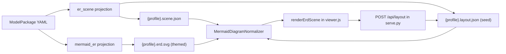

# moex-data-model: ER diagram theme and layout

## Контекст (что есть сейчас)

- `try_render_er_svg` в [packages/specification-dams/src/moex_dams/projection/mermaid_er.py](packages/specification-dams/src/moex_dams/projection/mermaid_er.py) вызывает `mmdc` с `-t neutral -b transparent`. SVG встраивается в Viewer как есть (`MermaidDiagramNormalizer`), раскладку считает сам Mermaid, влиять на неё нельзя.
- Viewer: `renderMermaidDiagram` в [apps/viewer/static/viewer.js](apps/viewer/static/viewer.js), стили `.erd-*` в [apps/viewer/static/css/50-renderers.css](apps/viewer/static/css/50-renderers.css) (`viewer.css` собирается из `static/css/*`), тема через `[data-theme="dark"]` и CSS-переменные `--surface-1`, `--text-primary`.
- Режим `serve` ([apps/viewer/src/moex_publication_viewer/serve.py](apps/viewer/src/moex_publication_viewer/serve.py)) уже умеет писать файлы через `POST /api/edit` и отдаёт `/api/capabilities`. Статическая сборка `dist/index.html` только читает.
- В Workbench layout store (`diagram_layout`, `PUT .../layout`) уже есть, формат `{element_id: {x, y}}`. Новый формат файла делаем совместимым с ним по ключам.

## Целевая схема

## Этап 1. Тема и CSS для Mermaid (запасной вид и быстрый результат)

- Добавить mermaid-конфиг (JSON) с `theme: base`, `themeVariables` и `themeCSS` и передавать его в `mmdc` через `-c` в `try_render_er_svg` и в [scripts/render-mermaid-erd.ps1](scripts/render-mermaid-erd.ps1). Конфиг лежит в одном месте и используется обоими.
- В `themeCSS` использовать `var(--erd-*, fallback)`, чтобы один и тот же SVG красился по теме Viewer (светлая/тёмная) без перегенерации.
- Стили: шапка таблицы (заливка, иконка не нужна), чётные/нечётные строки атрибутов, бейджи ключей, цвет линий и подписей связей, шрифт и скругления.
- В `50-renderers.css` определить `--erd-*` для `:root` и `[data-theme="dark"]`, поправить `.erd-canvas` и `.erd-svg`.
- Перед правкой отрендерить один SVG и свериться с реальными именами классов (`entityBox`, `attributeBoxOdd/Even`, `relationshipLine`, `relationshipLabelBox`), версия mermaid-cli закреплена `@11`.
- Не ломать id вида `entity-Name-N` и `id_entity-…_entity-…`: по ним работает `resolveErdClickTarget`.

## Этап 2. Структурная сцена диаграммы (`*.scene.json`)

- Новый модуль `moex_dams/projection/er_scene.py` рядом с `mermaid_er.py`; общие куски (имена таблиц, ключи PK/FK, подписи связей, кардинальности) переиспользовать из него, а не дублировать. Правки `mermaid_er.py` минимальные (вынос общих функций).
- Формат: `nodes[]` (`name`, `title`, `element_id`, `columns[]` с `name`, `type`, `keys`, `comment`) и `edges[]` (`id` = element_id связи или маппинга, `source`, `target`, кардинальности, `label`). Для conceptual таблицы без колонок.
- Писать сцену из `write_er_diagram_artifact` для всех профилей (`logical.scene.json` и т.д.), как сейчас пишется clickmap для conceptual. Clickmap оставить для совместимости.
- Дайджест и sidecar manifest по тому же шаблону, что `ErDiagramManifest`.

## Этап 3. Layout-файл (`*.layout.json`) и начальная раскладка

- Формат (версия 1): `nodes: {element_id: {x, y, color?}}`, `edges: {edge_id: {points?: [{x, y}], label?: {x, y}}}`. Ключ узла — `element_id`, для узлов без него — имя таблицы.
- Начальная раскладка в Python (`er_layout.py`, без новых зависимостей): слои по BFS по связям, сетка с шириной колонки по длине самой длинной строки. Цвет по умолчанию берётся из `HEADER_COLORS` в `dbml.py`.
- Правило безопасности: layout создаётся только если файла нет. При перегенерации существующий файл не перезаписывается: сохраняются позиции известных узлов, новые добавляются в свободные ячейки, удалённые убираются. Флаг `--reset-layout` в `moex-model diagram` ([apps/cli/src/moex_model_cli/commands/diagram.py](apps/cli/src/moex_model_cli/commands/diagram.py)) для полной пересборки.
- layout правится вручную и не является generated-артефактом: проверить [apps/cli/src/moex_model_cli/gates/digests.py](apps/cli/src/moex_model_cli/gates/digests.py), [scripts/compare_golden.py](scripts/compare_golden.py) и publish gate, чтобы они не требовали воспроизводимости layout (ADR-011).

## Этап 4. Рендерер в Viewer

- [apps/viewer/src/moex_publication_viewer/normalizers/mermaid_diagram_normalizer.py](apps/viewer/src/moex_publication_viewer/normalizers/mermaid_diagram_normalizer.py): подхватывать соседние `*.scene.json` и `*.layout.json` в `attributes` (`erd_scene`, `erd_layout`, `erd_layout_path`), по образцу `_load_clickmap`. Без сцены поведение прежнее (Mermaid-SVG).
- [apps/viewer/static/viewer.js](apps/viewer/static/viewer.js): `renderErdScene(scene, layout)` строит SVG вручную:
  - шапка таблицы с иконкой и названием, строки колонок с бейджами `PK/FK/UQ` и колонкой комментария (как на скриншоте);
  - связи как ортогональные ломаные от граней прямоугольников, маркеры «воронья лапка» в `<defs>`;
  - режим просмотра: панорамирование и масштаб колесом;
  - режим редактирования: перетаскивание таблиц (pointer events), связи пересчитываются; ручка на среднем сегменте связи сохраняет изгиб в `edges[id].points`; цветовой выбор для выбранной таблицы.
- Вкладки в `renderMermaidDiagram`: «Диаграмма» (новая, если есть сцена), «Mermaid» (прежний SVG), «Исходник», «DBML». Клик по таблице или связи открывает существующую карточку детали, `element_id` берётся прямо из сцены (без разбора id Mermaid).
- Стили `.erd-node*`, `.erd-edge*` в `50-renderers.css` на тех же `--erd-*` переменных, что и в этапе 1; пересобрать `viewer.css` штатным путём (`assets.py`).
- Шаблон [apps/viewer/templates/section_mermaid.html.j2](apps/viewer/templates/section_mermaid.html.j2) обновить минимально (вкладка и пустое состояние).

## Этап 5. Сохранение layout

- `serve.py`: `POST /api/layout` принимает `{path, layout}`, проверяет путь через `resolve_under_root` (только `*.layout.json` внутри корня), валидирует структуру и версию, пишет атомарно. В `/api/capabilities` добавить признак `layout_edit`.
- Статическая сборка: перетаскивание доступно, но вместо «Сохранить» показываются «Скачать layout.json» и подсказка запустить `serve`.
- Конфликты: передавать хеш прочитанного layout (по аналогии с `value_hash` в `edits.py`); при расхождении отвечать 409.

## Этап 6. Тесты и документация

- `packages/specification-dams/tests`: сцена и начальный layout детерминированы, существующий layout не перезаписывается, слияние добавляет новые и убирает удалённые узлы, mermaid-конфиг подключён.
- `apps/viewer/tests`: [test_normalizers.py](apps/viewer/tests/test_normalizers.py) (сцена и layout подхватываются, без них прежний путь), [test_build.py](apps/viewer/tests/test_build.py) (`renderErdScene` в `viewer.js`), [test_serve.py](apps/viewer/tests/test_serve.py) (`POST /api/layout`: успех, выход за корень, 409), [test_atlas_polish.py](apps/viewer/tests/test_atlas_polish.py) для CSS.
- Визуальная проверка в браузере на trading-platform (logical/physical) и enterprise conceptual, светлая и тёмная тема.
- Документация: короткое дополнение в [docs/adr/ADR-006-dbml-projection.md](docs/adr/ADR-006-dbml-projection.md) (layout-файл для Viewer, DB layout store для Workbench, общий ключ `element_id`), раздел про ER в [apps/viewer/README.md](apps/viewer/README.md).

## Вне объёма

- Подключение того же layout к drawDB в Workbench (UI, GET layout, поле color в `nodes_json`). Формат выбран так, чтобы потом можно было свести оба хранилища.
- Автоматическая маршрутизация связей с обходом препятствий (достаточно простого ортогонального пути и ручного изгиба).

## Риски

- Собственный рендерер заметно больше, чем CSS: нужен запас на ручную доводку внешнего вида и маршрутов связей.
- Для больших схем (например ENTERPRISE с десятками колонок) нужна компактная шапка и скролл или масштаб, иначе таблицы будут очень высокими.
- Нужно сверить имена классов Mermaid 11 и сохранение id для кликов, иначе сломаются карточки детали на запасной вкладке.