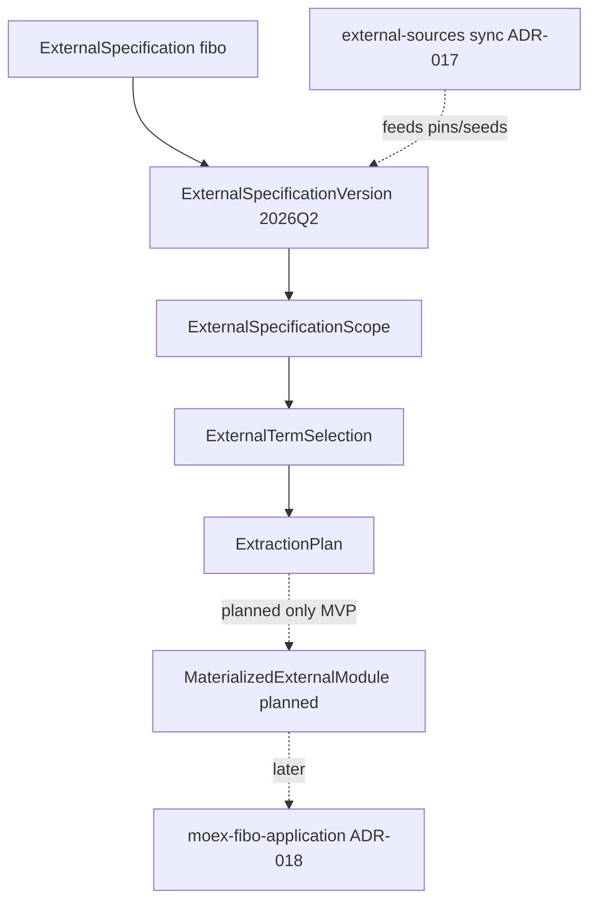

# moex-data-model: External Scope and Term Selection

I'm using the writing-plans skill to create the implementation plan.

**Goal:** Добавить управляемый отбор внешних спецификаций и терминов (`ExternalSpecificationScope` + `ExternalTermSelection`) как versioned YAML/LinkML-артефакты с валидацией, publication contract и страницами в static Publication Viewer; первый кейс — FIBO Party/Participation, модель обобщена на любые `ReferenceSpecification`-совместимые внешние стандарты.

**Architecture:** Три уровня governance отделены от sync (ADR-017) и application ontology (ADR-018). Метамодель — новый Spec `moex-external-alignment`; runtime — Pydantic + validator в kernel/CLI; публикация — ADR-019 `satisfies` + расширенный `PublicationSectionKind`; demo assets — scope/selection YAML с confirmed FIBO IRI из репозитория и placeholders для остальных.

**Tech stack:** LinkML (DSP + alignment schema), Pydantic in `modeling-kernel`, static viewer (`apps/viewer`), existing `publication_contract` checker, ROBOT only as planned extraction metadata (no auto-download).

## Global Constraints

- Backwards-compatible: existing `publish.yaml`, catalog nodes, ADR-016/019 checkers keep working.
- LinkML-first; extend existing entities (`external-sources` registry, DSP kinds, publication requirements) — no parallel shadow model.
- No full FIBO vendor, no auto-import of `included_areas`, no invented confirmed FIBO IRI.
- Default mapping relation `skos:closeMatch`; `owl:equivalentClass` / `owl:equivalentProperty` only when `review_status: approved`.
- Seed rule (locked): **draft** selection may use `extraction_role: seed` for `candidate` with severity **warning** + `draft_only: true`; **published/production** selection requires seed ⇒ `decision: accepted` ∧ `review_status: approved`.

## Layer map (locked)



| Layer | Role | Not |
|---|---|---|
| `external-sources/` (ADR-017) | fetch/materialize/lock | not scope, not selection governance |
| ExternalSpecification[+Version] | registered upstream identity + pin | not SpecImpl |
| ExternalSpecificationScope | search/interest boundary | not import of domains |
| ExternalTermSelection | reviewable term set + mappings + CQ | not full FIBO domain |
| MaterializedExternalModule | ROBOT extract output | not MOEX extension ontology |
| `moex-fibo-application` | MOEX application ontology | not selection register |

## Repository layout (locked)

**Do not** introduce top-level `external-specifications/` (duplicates ADR-017). Extend sync tree; add sibling governance folders:

```text
model-assets/
  external-sources/fibo/
    registry.yaml                    # identity (kind, title, adapter) — extend fields
    versions/2026Q2/
      specification.yaml             # ExternalSpecificationVersion + upstream meta
      README.md
    seeds/…  lockfile.yaml  modules/ # unchanged ADR-017

  external-scopes/
    moex-fibo-party-and-participation-scope/0.1/
      specification-scope.yaml
      README.md

  external-selections/
    moex-trading-participant-core/0.1/
      selection.yaml
      extraction-plan.yaml
      seeds/fibo-seed-terms.txt
      mappings/moex-fibo-mappings.yaml
      publish.yaml
      README.md
```

Document the decision in ADR-020 and READMEs: sync lives under `external-sources/`; scope/selection are governance artifacts referenced by version pin.

## Metamodel home (locked)

- **New ReferenceSpecification asset:** [`model-assets/specifications/moex-external-alignment/0.1/`](model-assets/specifications/moex-external-alignment/0.1/) with LinkML schema `schemas/moex-external-alignment.yaml` (classes + enums below). Envelope `specification.yaml` + short README. Pattern mirrors [`moex-fibo-profile`](model-assets/specifications/moex-fibo-profile/0.1/).
- **Runtime DTOs + invariants:** `packages/modeling-kernel/src/moex_modeling/external_alignment/` (Pydantic, `extra=forbid`, frozen where appropriate) — same style as [`external_sources/public.py`](packages/modeling-kernel/src/moex_modeling/external_sources/public.py).
- **Not** in DAMS body schemas (these are not `LogicalEntity`).
- **Publication projection** stays in DSP ([`moex-dsp.yaml`](model-assets/specifications/moex-dsp/0.1/schemas/moex-dsp.yaml)): new `PublicationSectionKind` values + publication requirements on FIBO profile / selection profile.

### LinkML classes (top-level or nested as marked)

| Concept | Shape |
|---|---|
| `ExternalSpecification` | top-level |
| `ExternalSpecificationVersion` | top-level |
| `ExternalSpecificationScope` | top-level |
| `ExternalSpecificationArea` | nested in scope (included/excluded) |
| `ExternalTermSelection` | top-level |
| `CompetencyQuestion` | nested in selection |
| `ExternalTermSelectionItem` | nested (`selected_terms`) |
| `ExternalTermReference` | nested/shared IRI+kind+module |
| `ExternalMappingAssertion` | nested list and/or sidecar mappings YAML |
| `ExtractionPlan` | nested or sibling file (demo: sibling `extraction-plan.yaml`) |
| `MaterializedExternalModule` | nested descriptor (`status: planned` allowed) |
| `SelectionReviewDecision` | nested review metadata on item / mapping |

### Required slots (enforce in schema + validator)

Match user invariants 1–10. Enums exactly as specified (`ExternalSpecificationKind`, `ExternalSpecificationAreaKind`, `ExternalTermKind`, `ExternalSelectionDecision`, `ExtractionRole`, `ExternalMappingRelation`, `ReviewStatus`). Align `ExternalSpecificationKind` with ADR-017 `SourceKind` via shared values (`ontology`, …) plus extras (`api-specification`, `reference-data-standard`, `other`) — document mapping in ADR-020.

### Seed rule (document in ADR + README)

```text
if selection.status in {published, approved} or not draft_only:
  seed ⇒ decision=accepted AND review_status=approved
else:  # draft
  seed may be candidate → WARNING + require draft_only: true on selection or item
```

## Publication contract (ADR-019 extension)

1. Amend ADR-016 / [`moex-dsp.yaml`](model-assets/specifications/moex-dsp/0.1/schemas/moex-dsp.yaml) / [`manifest_models.py`](apps/viewer/src/moex_publication_viewer/models/manifest_models.py) / [`publication_profiles.py`](apps/viewer/src/moex_publication_viewer/publication_profiles.py) — add kinds:

   - `external-specification-scope`
   - `competency-questions`
   - `term-selection`
   - `mapping-table` (distinct from `bindings` when content is selection mapping register; `bindings` remains for SpecImpl bridges)
   - `dependency-list`
   - `extraction-provenance`

2. Extend [`moex-fibo-profile/0.1/publication-requirements.yaml`](model-assets/specifications/moex-fibo-profile/0.1/publication-requirements.yaml) with profile `fibo-external-term-selection` (applies_to `implementation`) requiring:

   - `external:overview` → overview
   - `external:conformance` → conformance
   - `external:scope` → external-specification-scope
   - `external:competency-questions` → competency-questions
   - `external:term-selection` → term-selection
   - `external:mappings` → mapping-table
   - `external:extraction-provenance` → extraction-provenance
   - recommended: `external:dependencies` → dependency-list

3. Selection `publish.yaml` uses `profile: implementation`, `implements.profile_ref: fibo-external-term-selection`, local section ids/titles free, each with `satisfies: […]`.

4. If no materialized module (status planned/absent) → overall publication status **`draft-conformant`** visible in conformance report (reuse ADR-019 statuses); do not hard-fail MVP on missing TTL.

## Demo artifacts (minimum content)

1. **Version** `external-sources/fibo/versions/2026Q2/specification.yaml` — id `fibo`, kind `ontology`, `modeling_standard_ref: owl2`, upstream repo + `release_ref: 2026Q2` (pin; no full download).

2. **Scope** `moex-fibo-party-and-participation-scope` — purpose, domain_context, capabilities, included FND/BE/FBC, excluded SEC/DER/…, local_concept_refs as in spec (MOEX concepts as string refs; pages link if catalog has them).

3. **Selection** `moex-trading-participant-core` `0.1.0` — ≥4 CQ (CQ-TP-001…004), ≥8 terms:
   - **Confirmed IRI only** from repo artifacts: e.g. `LegalPerson`, `BusinessDay`, `FormalOrganization`, and module IRIs from [`fibo-architecture.yaml`](model-assets/specifications/moex-fibo-profile/0.1/metamodel/fibo-architecture.yaml) / seeds / SSSOM.
   - Remaining terms: explicit placeholders (`REPLACE_WITH_REAL_FIBO_IRI` or `https://spec.edmcouncil.org/fibo/ontology/_placeholder/...`) — never invent as real.
   - Mix: ≥2 `accepted`, ≥1 `deferred`, ≥1 `rejected`, rest `candidate`.

4. **Mappings** ≥4 assertions: `skos:closeMatch`, `skos:broadMatch`|`narrowMatch`, `rdfs:subClassOf`, `no-mapping`+rationale. No default `owl:equivalentClass`.

5. **Extraction plan:** `tool: robot`, `method: STAR`, source version ref, seed path, output `status: planned` (path under selection or `external-sources/fibo/modules/` — documented; **no** auto sync in this plan).

6. **README** (scope + selection): scope ≠ import; selection ≠ domain; extracted module ≠ extension; mapping ≠ owl equivalence.

## Viewer

- Discover selection `publish.yaml` via existing manifest scan (same as other modules under `model-assets/`).
- Catalog ([`architecture-catalog.yaml`](model-assets/specifications/moex-dams/0.1/architecture-catalog.yaml)): add nodes for FIBO external version (or reuse/annotate sync), scope, and selection — nav groups **External Specifications / External Scopes / External Term Selections** (extend explorer roots or catalog nesting; prefer catalog nodes + module_id like current FIBO pattern — do not invent a new frontend).
- Renderers: reuse `markdown-doc`, `entity-table`, `key-value`; add thin normalizers/selects for scope areas, CQ list, term table, mapping register, extraction provenance, conformance (wire through existing `YamlNormalizer` + optional `select:` helpers).
- UI rules in [`viewer.js`](apps/viewer/static/viewer.js) / CSS: status chips for decision + review_status (accessible contrast); IRI display = short label + copy-full; external link only if URL parses as http(s); **scope disclaimer** on scope overview:

  > Scope is a search and interest boundary over an external specification. Included areas (e.g. FIBO FND/BE) do not import those domains or select all of their terms.

- Candidate/non-approved mappings must not render as confirmed semantic mappings (visual + label distinction).

## Validation / CLI

- Loader + invariants in kernel `external_alignment` (unit-tested).
- CLI: `moex-model selection validate <path-or-id>` (thin command next to `source_*`); exit non-zero on hard errors; warnings for draft seed / `maximum_seed_terms` (>25 → warn for FIBO starter).
- Wire soft warnings into viewer build where selection module is published; hard-fail only on broken refs / accepted-without-rationale / equivalent without approved — align with ADR-019 phase-2 style in [`publication_contract.py`](apps/viewer/src/moex_publication_viewer/publication_contract.py).

## Docs

- **ADR-020** External Specification Scope and Term Selection (Proposed); Related: 014, 017, 018, 019; index bump in [`docs/adr/README.md`](docs/adr/README.md).
- Short notes in [`ontology-catalog.md`](docs/architecture/ontology-catalog.md) and alignment Spec README.
- Amend ADR-016 Related / kind table for new section kinds (additive, not supersede).

## Out of scope

- Production backend, search/AI retrieval services, full ROBOT CI download of FIBO release.
- Auto-materialize on validate; auto-merge selection into `moex-fibo-application`.
- Replacing SSSOM [`dams-fibo.sssom.yaml`](model-assets/transformations/mappings/dams-fibo.sssom.yaml) (selection mappings are governance; may reference SSSOM later).

## Success criteria

- LinkML + Pydantic model + ≥10 invariant tests green.
- Demo scope/selection validate; selection HTML pages show CQ, term table, mappings, provenance, draft-conformant report.
- Existing DAMS / fibo-profile / fibo-application publications unchanged in behavior.
- `make viewer-check` (or project equivalent) passes with new module.

## Implementation order

1. ADR-020 + DSP kind extensions + alignment LinkML schema envelope.
2. Kernel DTOs + validator + tests (TDD on invariants 1–10).
3. Demo YAML assets (version, scope, selection, plan, seeds, mappings, READMEs).
4. publication-requirements profile + selection `publish.yaml` + catalog nodes.
5. Viewer normalizers/nav/chips/disclaimer + conformance draft status.
6. CLI `selection validate` + docs cross-links.
