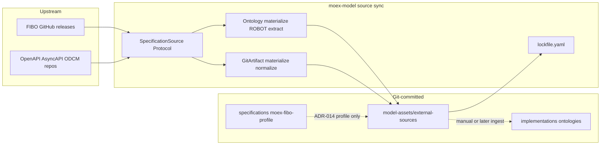

# moex-data-model: External source sync

## Goal

Единый lifecycle для внешних референсных спецификаций (**fetch → materialize → lock → diff → PR**), без наивного «обновить весь FIBO». Онтологии и API/schema-спеки делят интерфейс, но разные стратегии `materialize`.

## Decisions (locked)

1. **ADR-017** — External specification source sync (Proposed → `docs/adr/ADR-017-external-specification-source-sync.md`), индекс в [docs/adr/README.md](docs/adr/README.md).
2. **Port in kernel**, adapters in new package — тот же паттерн, что [MappingProvider](packages/modeling-kernel/src/moex_modeling/mapping/public.py) / [ImportDraftEngine](packages/modeling-kernel/src/moex_modeling/import_draft/public.py).
3. **Layout** — `model-assets/external-sources/<source_id>/` (не путать с `specifications/` и не подменять [ADR-014](docs/adr/ADR-014-fibo-profile-metamodel.md) profile).
4. **FIBO** — Mirror → Seed → ROBOT extract (STAR/BOT) → optional reason check → pin module TTL; **не** коммитить полный релиз.
5. **ROBOT** — pinned JAR (версия в lockfile), вызов через subprocess; cache gitignored (`.cache/robot/`). Полный ODK Docker — later, не MVP.
6. **schema-automator** остаётся в `moex-model import` ([ADR-009](docs/adr/ADR-009-schema-automator-draft-only.md)); sync **не** генерирует LinkML и **не** публикует в catalog/viewer (ADR-012).
7. **MVP slice order:** Protocol + lock/registry → FIBO adapter → GitArtifact adapter (OpenAPI/AsyncAPI/ODCM как конфиги одного адаптера) → CLI.

## Architecture



### Port (kernel)

New module `packages/modeling-kernel/src/moex_modeling/external_sources/public.py`:

- `SourceKind`: `ontology` | `api_spec` | `schema` | `data_contract_standard`
- DTOs: `SourceVersionRef`, `RawArtifactBundle`, `LocalArtifact`, `SpecDiff`, `LockEntry`, `MaterializationPolicy`
- `SpecificationSource` Protocol: `resolve_latest` / `fetch` / `materialize` / `diff` / `lock`
- Registry loader reads `registry.yaml` + `lockfile.yaml` only (no upstream I/O in kernel)

### Package `packages/external-sources`

| Adapter | kind | materialize |
|---|---|---|
| `FiboOntologySource` | ontology | download release → `robot extract` on seed → write `modules/*.ttl` |
| `GitArtifactSource` | api_spec / schema / data_contract_standard | checkout tag/commit → optional Redocly/Spectral normalize later → write `spec/` |

Plugin registry: `source_id` → adapter from `registry.yaml.kind` + `adapter` field.

### On-disk layout

```
model-assets/external-sources/
  fibo/
    registry.yaml          # upstream, cadence, license, kind=ontology
    seeds/counterparty.txt # IRI list (MOEX-used)
    lockfile.yaml          # upstream_ref, content_hash, robot_version, seed_hash, extraction_method
    modules/               # committed extract output
  openapi-fix44/            # later: same registry/lock + spec/
```

`moex-fibo-profile` under `specifications/` **не трогаем** — это metamodel Spec; external-sources кормит release/Impl content.

### CLI

Extend [apps/cli/src/moex_model_cli/__main__.py](apps/cli/src/moex_model_cli/__main__.py):

- `moex-model source list`
- `moex-model source sync <id> [--seed PATH] [--dry-run]`
- `moex-model source diff <id> [--from REF] [--to REF]`

Exit codes: 0 ok, 1 breaking/materialize failed, 2 usage.

### ADR-017 content (to write)

**Context:** Need reproducible local mirrors of FIBO/OpenAPI/…; full FIBO pull is wrong; ADR-010/014 already separate OWL validation and profile vs content.

**Decision:**

- Unified `SpecificationSource` lifecycle; kind-specific `materialize`.
- Ontologies: ROBOT modular extract + pin; never vendor whole FIBO into git.
- Git-based specs: pin tag/commit + content hash.
- Artifacts under `model-assets/external-sources/`; updates via PR + diff (ADR-002/012).
- ROBOT reason may gate ontology materialize consistency; does **not** become primary YAML validator (ADR-010 stands).

**Consequences:** new package + CLI; catalog ingest remains separate; optional later wire from module path → ontology-catalog rebuild.

**Alternatives rejected:** naive git submodule of full FIBO; ODK-first (heavier than needed); conflating sync with schema-automator import.

## Implementation tasks (after plan approval)

### Task 1 — ADR-017 + index

- Create `docs/adr/ADR-017-external-specification-source-sync.md` (same frontmatter style as ADR-014).
- Update [docs/adr/README.md](docs/adr/README.md) row for 017; bump index title to 001–017.

### Task 2 — Kernel port + tests

- Add `external_sources` package under modeling-kernel (Protocol + Pydantic DTOs, frozen/forbid extra).
- Tests mirroring `test_stage7_ports.py` / MappingProvider style.

### Task 3 — Package scaffold + registry/lock I/O

- `packages/external-sources` with `pyproject.toml`, depends on `moex-modeling-kernel`.
- Load/validate `registry.yaml` / `lockfile.yaml` schemas (Pydantic).
- Fixture tree under `packages/external-sources/tests/fixtures/`.

### Task 4 — FIBO adapter (MVP materialize)

- Seed file parser (IRI lines, `#` comments).
- Fetch: GitHub release asset or tagged tree URL from `registry.yaml` (mockable HTTP in tests).
- Materialize: invoke ROBOT (`extract -m BOT|STAR`); pin robot version; write TTL + update lockfile.
- Unit tests with mini OWL fixture (can reuse [packages/standard-owl/tests/fixtures/mini_fibo](packages/standard-owl/tests/fixtures/mini_fibo)) and stubbed robot or tiny extractable ontology when robot unavailable (`pytest.importorskip` / marker `requires_robot`).

### Task 5 — GitArtifact adapter

- Fetch by git ref (reuse patterns from [packages/git-adapter](packages/git-adapter) if suitable).
- Materialize: copy/normalize text artifact to `spec/`; content hash; file-level + optional path diff.
- Register example stub `openapi-fix44` registry only if a real upstream pin is available; otherwise fixture-only until first real source is added.

### Task 6 — CLI `source`

- `commands/source_cmd.py` + wire in `__main__.py`.
- Thin orchestration: resolve adapter → sync/diff → print LockEntry / SpecDiff (JSON flag).

### Task 7 — First real FIBO seed (small)

- Add `model-assets/external-sources/fibo/` with `registry.yaml`, minimal seed (IRIs already used in SSSOM / catalog, e.g. from [dams-fibo.sssom.yaml](model-assets/transformations/mappings/dams-fibo.sssom.yaml)), empty or placeholder module + lock documenting process.
- README under that folder: how to sync, ROBOT pin, relation to ADR-014 profile.

## Out of scope (explicit)

- Auto-ingest into ontology-catalog / viewer publish
- Full ODK pipeline / OntoFox
- oasdiff / AsyncAPI CLI / Spectral as hard deps (hooks later behind optional extras)
- Replacing `moex-fibo-profile` or changing ADR-010 primary validation

## Success criteria

- ADR-017 merged as Proposed draft.
- `moex-model source list` shows registered sources from `model-assets/external-sources/`.
- `source sync fibo` with fixture/seed produces deterministic module hash recorded in lockfile.
- Kernel has no ROBOT/HTTP dependency; adapters isolated in `packages/external-sources`.
