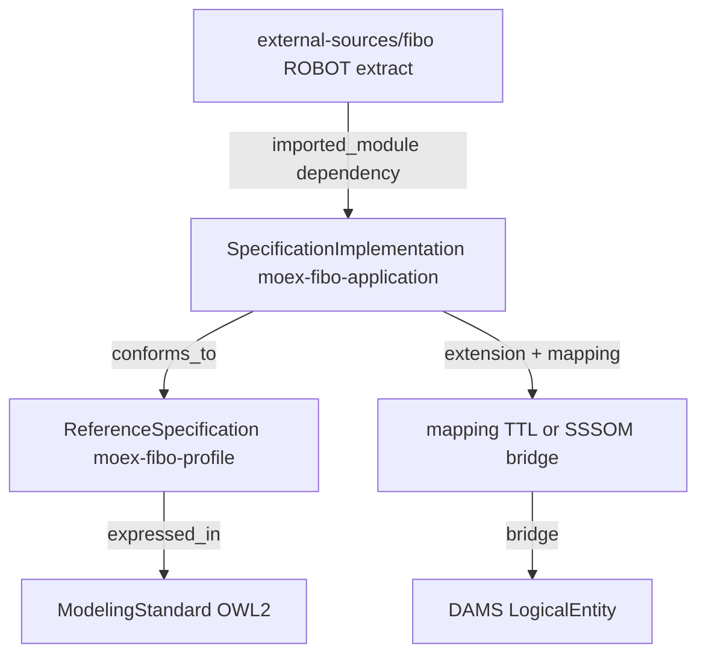

# moex-data-model: FIBO application ontology

I'm using the writing-plans skill to create the implementation plan.

**Goal:** Сделать роль `SpecificationImplementation` для онтологий такой же чистой, как DAMS: не «урезанная копия FIBO», а governed application ontology MOEX поверх pinned extract.

**Architecture:** ADR-014 остаётся для profile Spec; ADR-017 кормит extract; ADR-018 вводит Impl-слой application ontology с тремя артефактами и ontology-specific governance-полями в provider descriptor.

**Locked decision (user):** вариант **A** — новый Impl под `implementations/ontologies/moex-fibo-application/`; `moex-fibo-profile` не смешиваем с TTL.

## Layer map



| Role | Asset | Notes |
|---|---|---|
| ModelingStandard | [model-assets/standards/owl/2/standard.yaml](model-assets/standards/owl/2/standard.yaml) | unchanged |
| ReferenceSpecification | [moex-fibo-profile](model-assets/specifications/moex-fibo-profile/0.1/) | ADR-014 metamodel YAML; unchanged layout |
| Upstream pin | [external-sources/fibo](model-assets/external-sources/) (ADR-017) | read-only extract; **not** Spec, **not** Impl |
| Catalog index of upstream | [fibo.yaml](model-assets/implementations/ontologies/fibo.yaml) | reclassified as upstream/index read model |
| SpecificationImplementation | **new** `moex-fibo-application` | application ontology = import + extension + mapping |

## ADR-018 (to write)

**File:** [docs/adr/ADR-018-ontology-application-implementation.md](docs/adr/ADR-018-ontology-application-implementation.md)

**Title:** Ontology SpecificationImplementation = application / extension ontology

**Context:** OBO/FIBO practice separates reference ontology from application/extension ontology. ADR-014 correctly split profile Spec vs domain content, but labeled FIBO *release* as Impl — that conflates upstream content with MOEX-governed application ontology. ADR-017 pins extracts; still needs a governed Impl that *uses* them.

**Decision:**

1. For OWL, `SpecificationImplementation` is a **MOEX-owned application ontology** (project ontology): own namespace, version, lifecycle, publish — not a subset copy of FIBO.
2. Physical body is three committed artifacts under the Impl tree:
   - `metamodel/fibo-import-module.ttl` — pin/copy or symlink-ref to ADR-017 extract (read-only upstream slice)
   - `metamodel/moex-fibo-extension.ttl` — MOEX namespace additions (`subClassOf`, local classes/properties)
   - `metamodel/moex-dams-fibo-mapping.ttl` — bridge (equivalentClass / subClassOf / skos / custom); may also point at existing [dams-fibo.sssom.yaml](model-assets/transformations/mappings/dams-fibo.sssom.yaml)
3. Provider descriptor fields (not kernel core): `conformance_level` (e.g. `FIBO Extension Conformant`), `seed_ref` (path to seed used for extract), `imported_module_ref`, `extension_ref`, `mapping_ref`.
4. `moex:ontology:fibo` catalog descriptor remains an **upstream release index** for Ontology Catalog / preview glossary; it is **not** the governed SpecImpl. Architecture-catalog role for the governed Impl becomes `moex-fibo-application`.
5. Kernel `SpecificationImplementation` envelope stays generic (same governance as DAMS: owner/lifecycle via existing fields); OWL-specific fields live in provider descriptor YAML.

**Consequences:** ADR-014 refined (not superseded): profile Spec stands; “release = Impl” wording replaced by “release index ≠ application Impl”. Viewer/catalog can keep preview module on upstream index; new Impl node optional in MVP.

**Alternatives rejected:** TTL inside `moex-fibo-profile/metamodel/` (mixes Spec+Impl); treating ROBOT extract alone as SpecImpl; putting `conformance_level` on kernel envelope.

**Related:** ADR-010, ADR-014, ADR-017; MODELING_ARCHITECTURE §3 OWL example already matches this intent.

## On-disk layout (MVP)

```text
model-assets/implementations/ontologies/moex-fibo-application/0.1/
  implementation.yaml          # envelope: conforms_to moex-fibo-profile, kind=owl
  ontology-application.yaml    # provider: conformance_level, seed_ref, *_ref paths
  metamodel/
    fibo-import-module.ttl     # minimal stub or pointer/copy from external-sources
    moex-fibo-extension.ttl    # stub MOEX namespace + 1-2 local classes
    moex-dams-fibo-mapping.ttl # stub bridge to one DAMS entity / FIBO class
  README.md
```

Mirror DAMS pattern from [trading-platform/implementation.yaml](model-assets/implementations/solutions/trading-platform/implementation.yaml).

Stub namespace: `https://data.moex.com/ontology/fibo-ext/` (align with existing stub [application.yaml](model-assets/implementations/ontologies/application.yaml) — either deprecate stub or make it alias/redirect in README; prefer **replace stub role** with this real Impl id `moex:implementation:moex-fibo-application:0.1`).

## Code / docs touchpoints

- **ADR + index:** write ADR-018; bump [docs/adr/README.md](docs/adr/README.md) to 001–018; add Related links on ADR-014 and ADR-017.
- **Refine ADR-014:** short amendment paragraph — release/index content ≠ SpecImpl; SpecImpl = application ontology (points to ADR-018). Do **not** rewrite ADR-014 wholesale.
- **Docs:** update [ontology-catalog.md](docs/architecture/ontology-catalog.md) Spec/Impl table; note in [MODELING_ARCHITECTURE.md](docs/architecture/MODELING_ARCHITECTURE.md) §3 if needed (already roughly correct).
- **Catalog:** [architecture-catalog.yaml](model-assets/specifications/moex-dams/0.1/architecture-catalog.yaml) — change `moex:ontology:fibo` description/role note to upstream index; add `moex-fibo-application` as `specification_implementation`.
- **Provider types:** extend [packages/standard-owl](packages/standard-owl) with a small Pydantic `OntologyApplicationDescriptor` (conformance_level, seed_ref, three refs) + loader test; keep [OWLImplementationBody](packages/standard-owl/src/moex_standard_owl/domain/body.py) as loaded RDF — descriptor is sidecar, not axioms.
- **Tests:** load descriptor + assert three paths exist; optional RDFLib parse of stub TTLs; no ROBOT in this plan (ADR-017 owns sync).

## Out of scope

- Full MOEX extension content / production mapping set
- Auto-wire `source sync fibo` → copy into Impl (manual/path ref in MVP)
- Viewer UI redesign for three-file explorer
- Changing ADR-010 validation stance
- Kernel subclassing (`OWLSpecificationImplementation is_a …` forbidden)

## Success criteria

- ADR-018 Proposed + index row; ADR-014 cross-link refined.
- Asset tree exists with envelope + descriptor + three stub TTLs.
- Catalog distinguishes upstream FIBO index vs `moex-fibo-application` Impl.
- Provider test loads `OntologyApplicationDescriptor` and validates refs.
