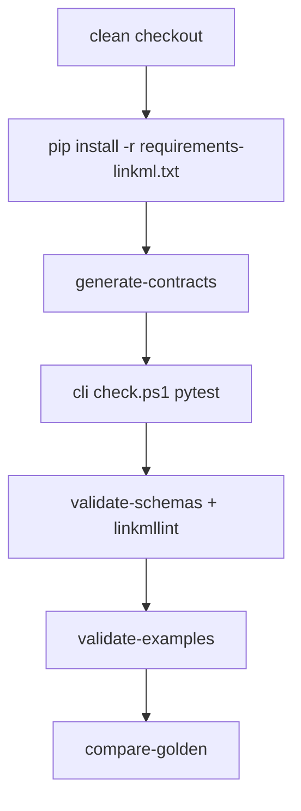

# moex-data-model: Foundation CI + golden compare

**Goal:** Stage 0 gate на чистом checkout: pinned LinkML toolchain, lint/validate схем и examples, regenerate + compare golden contracts, CI workflow. Без полного `uv.lock` workspace.

**Architecture:** Сохраняем существующий контур `pip` + `apps/cli/.venv` + PowerShell. Pin — [`requirements-linkml.txt`](requirements-linkml.txt) (точные версии). CI вызывает те же скрипты, что локальный [`Makefile`](Makefile) `check`. Golden compare в этом инкременте — только **воспроизводимые** outputs (`gen-pydantic` contracts + optional `gen-json-schema`); legacy OWL/SHACL/DBML в [`generated/artifacts/`](generated/artifacts/) не перегенерируем (Stage 6 follow-up).



## Decisions (locked)

| Topic | Choice |
|-------|--------|
| Lock strategy | `requirements-linkml.txt` (exact pins), not `uv.lock` |
| CI OS | `ubuntu-latest` with `pwsh` + Python 3.12 (primary); optional second job `windows-latest` same scripts |
| Golden scope | Contracts `__init__.py` digest vs manifest; plus regenerable `moex-dams.schema.json` if committed path exists |
| Manifest timestamps | `generated_at` kept for humans but **excluded from compare**; compare uses `content_digest` / byte hash of artifact |
| Full OWL/SHACL/DBML matrix | Out of this plan |

## 1. Pin LinkML toolchain

Create [`requirements-linkml.txt`](requirements-linkml.txt) at repo root with **exact** versions resolved once from a clean `pip install "linkml==X.Y.Z"` freeze of the LinkML stack used by generators (at minimum: `linkml`, `linkml-runtime`, and direct deps that affect `gen-pydantic` / lint / validate).

Update install lines in:

- [`scripts/generate-contracts.ps1`](scripts/generate-contracts.ps1)
- [`scripts/validate-schemas.ps1`](scripts/validate-schemas.ps1)
- [`apps/cli/scripts/check.ps1`](apps/cli/scripts/check.ps1)

from `pip install "linkml>=1.8,<2"` → `pip install -r requirements-linkml.txt` (path relative to repo root).

Add [`.python-version`](.python-version) with `3.12` (CI pin; local still tolerates 3.11+).

## 2. `.linkmllint.yaml`

Add root [`.linkmllint.yaml`](.linkmllint.yaml) with a conservative rule set (errors that already pass on `moex-dams.yaml`). Wire [`scripts/validate-schemas.ps1`](scripts/validate-schemas.ps1) to pass this config into `Linter` (or `linkml-lint -c .linkmllint.yaml`) instead of bare `Linter()`. Remove soft-skip on `UnicodeDecodeError` if `PYTHONUTF8=1` keeps lint stable; otherwise keep skip but fail CI when lint returns RuleLevel.error.

## 3. `validate-examples`

New [`scripts/validate-examples.ps1`](scripts/validate-examples.ps1):

- Schema: `model-assets/specifications/moex-dams/0.1/schemas/moex-dams.yaml`
- Explicit target map (examples are not all `ModelPackage`):

| File | Target class |
|------|----------------|
| `examples/client-contract-binding.yaml` | `DataModelBinding` |
| `examples/client-data-flow.yaml` | `DataFlow` |
| `examples/registries.yaml` | skip or validate as multi-doc / known limitation — **at implement**: if LinkML rejects bare list, document skip with reason in script comment and validate only the two mapping roots |

Use same Python discovery / `requirements-linkml.txt` as other scripts. Fail on any validation error.

Makefile target: `validate-examples`.

## 4. Golden compare (contracts + JSON Schema)

### Deterministic contracts

In [`scripts/generate_contracts.py`](scripts/generate_contracts.py):

- Keep writing `generated_at` OR move it under `meta.generated_at` — compare ignores it either way.
- Add `generator_version` from pinned `linkml.__version__` into manifest (ADR-011).

New [`scripts/compare-golden.ps1`](scripts/compare-golden.ps1) / small Python helper [`scripts/compare_golden.py`](scripts/compare_golden.py):

1. Read committed `generated/manifests/moex-dams-contracts.json` → `content_digest`, `output_path`.
2. Hash committed artifact file; assert equals `content_digest`.
3. Regenerate contracts into a **temp dir** (or regenerate in place after copying baseline aside) with same script; assert new digest == committed digest. Prefer: run generate to temp copy of output path, hash, compare — without dirtying worktree if digests match.
4. Optional Phase A+: if `generated/artifacts/moex-dams/0.1/moex-dams.schema.json` exists, regenerate via `JsonSchemaGenerator` to temp and byte/digest compare.

Fail with clear message listing mismatched paths (ADR-011: mismatch is error).

Makefile: `compare-golden`; include in `check` **after** `generate-contracts`.

### Refresh baseline process

Document in README / IMPLEMENTATION_PLAN: toolchain bump = update `requirements-linkml.txt` + regenerate contracts + commit new digests in one PR.

## 5. Extend `make check`

Update [`Makefile`](Makefile):

```make
check:
	generate-contracts
	apps/cli/scripts/check.ps1
	validate-schemas
	validate-examples
	compare-golden
```

Add phony targets: `validate-examples`, `compare-golden`, `lint-schemas` (alias to validate-schemas lint portion or full validate-schemas).

Do **not** fold `api-check` / `web-check` / `viewer-check` into Stage 0 `check` (keep optional).

## 6. GitHub Actions

Add [`.github/workflows/check.yml`](.github/workflows/check.yml):

- Triggers: `push` + `pull_request` to default branches
- Job `check` on `ubuntu-latest`:
  - `actions/checkout@v4`
  - `actions/setup-python@v5` with `python-version: "3.12"`
  - Install PowerShell if needed (`pwsh` is preinstalled on ubuntu GHA images)
  - `make check` **or** invoke the `.ps1` files in order if `make` is awkward — prefer installing `make` via apt for parity with local docs
- Optional job `check-windows` on `windows-latest` same steps (nice-to-have in same PR if green locally on Windows; drop if flaky encodings)

No secrets required.

## 7. Docs (minimal)

- [`docs/IMPLEMENTATION_PLAN.md`](docs/IMPLEMENTATION_PLAN.md) Stage 0: mark pin via `requirements-linkml.txt`, CI, validate-examples, compare-golden contracts done; note uv.lock deferred; full artifact matrix deferred.
- [`docs/adr/ADR-011-reproducible-artifacts.md`](docs/adr/ADR-011-reproducible-artifacts.md): one sentence — CI compare-golden for contracts exists; full matrix still Stage 6.
- Root [`README.md`](README.md) if it describes `make check` — align step list.

## Out of scope

- `uv` workspace / `uv.lock`
- Regenerating committed OWL/SHACL/DBML/mermaid under `generated/artifacts/`
- Accepting ADR-001–012
- Folding web/api/viewer into default `make check`
- `tests/golden/` pytest package (PowerShell + digest script is enough for Stage 0)

## Verification

```text
# local (Windows)
make check
# or
powershell -File scripts/generate-contracts.ps1
powershell -File apps/cli/scripts/check.ps1
powershell -File scripts/validate-schemas.ps1
powershell -File scripts/validate-examples.ps1
powershell -File scripts/compare-golden.ps1

# intentional fail: tweak contracts __init__.py → compare-golden exits non-zero
```

CI: open PR and confirm workflow green on clean Ubuntu runner.

## Key files

| Action | Path |
|--------|------|
| Create | `requirements-linkml.txt`, `.linkmllint.yaml`, `.python-version`, `scripts/validate-examples.ps1`, `scripts/compare_golden.py`, `scripts/compare-golden.ps1`, `.github/workflows/check.yml` |
| Modify | `Makefile`, `scripts/generate_contracts.py`, `scripts/generate-contracts.ps1`, `scripts/validate-schemas.ps1`, `apps/cli/scripts/check.ps1`, Stage 0 notes in IMPLEMENTATION_PLAN + ADR-011 |
