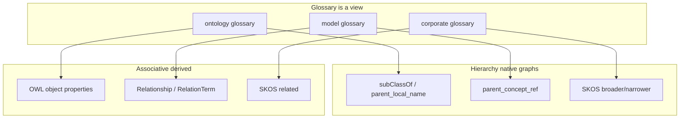

# moex-data-model: Glossary related terms

## Ответ

**Да, связанные термины стоит показывать. Нет — не внутри иерархии как дополнительные рёбра дерева.**

Это совпадает с ISO 25964 / SKOS Primer и с уже принятыми ADR: глоссарий — **view** определений ([ADR-025](docs/adr/ADR-025-definition-cascade-and-glossary.md)), иерархия онтологии — asserted `subClassOf` ([ADR-024](docs/adr/ADR-024-unified-class-entity.md)), связи термин↔термин корпоративного глоссария — SKOS-проекция ([ontology-catalog.md](docs/architecture/ontology-catalog.md)), не слоты на `GlossaryTerm`.

Сейчас в viewer уже есть кусок иерархии на карточке глоссария (`extends` через `parentMeta` в [`viewer.js`](apps/viewer/static/viewer.js)), полный parents/children — в explorer, а `related` живёт только в неподключённом образце [`skos_concepts.yaml`](model-assets/transformations/glossary/skos_concepts.yaml). Задача — зафиксировать **третий смысловой слой** (ассоциации), не смешивая его с таксономией и не создавая четвёртый источник правды.

## Три семейства связей (норматив)

Не смешивать в одном списке и не класть в дерево:

| Семейство | Смысл | Где живёт в UI | Не является |
|---|---|---|---|
| **Иерархия** | «вид / подкласс / BT–NT» | дерево + блок Taxonomy / `extends` | related |
| **Эквивалентность** | синоним, exactMatch, assignment | aliases, mapping, `glossary_term_refs` | related и не иерархия |
| **Ассоциация (RT)** | «см. также», не транзитивно | блок **See also** на карточке | parent/child, closeMatch, источник определения |

Правила ISO/SKOS, которые мы принимаем:

- Related **симметрично** и **не транзитивно**. Его нельзя вешать как ребёнка в tree — появятся циклы и ложная «is-a».
- Parent/child **не дублировать** в See also.
- Сиблинги **не** автоматически related.
- `closeMatch` / `broadMatch` / `narrowMatch` — качество **выравнивания** (ADR-020/026), не RT и не BT.

## Откуда брать related (проекция, не новый SoT)

Глоссарий **не** получает поле `related_terms`, которое кто-то руками пишет в CSV/JSON. Как и определения, related **вычисляется** из канона слоя.

- **Онтология (FIBO):** иерархия = `rdfs:subClassOf` (`parent_local_name`). Related = именованные **object properties** между классами, попавшими в тот же coverage (когда свойства появятся — ADR-024 §7). Пока свойств в preview нет — блок See also пустой, не выдумывать сиблингов. Обратные ссылки `related_glossary_terms` на карточке онтологии — это **assignment** корпоративного термина (SSSOM `glossary_term`), семейство эквивалентности/привязки, не RT.
- **Model glossary:** иерархия = `parent_concept_ref` (уже в YAML КМД, **ещё не** в [`build_model_glossary`](packages/specification-dams/src/moex_dams/rules/glossary.py)). Related = другие сущности, связанные `Relationship` / словарём [`RelationTerm`](model-assets/specifications/moex-dams/0.1/schemas/moex-core.yaml). `definition_source_ref` — провенанс текста, не related. `glossary_term_refs` — привязка к корпоративному термину, не related.
- **Корпоративный:** `GlossaryTerm` остаётся тонкой `RegistryEntry`. Иерархия и related живут в **SKOS-проекции** (`broader` / `narrower` / `related` в [`skos_glossary.py`](packages/semantic-mappings/src/moex_semantic_mappings/skos_glossary.py)), мастер внешний. Слоты SKOS в DAMS-класс **не** добавлять (уже решено в ontology-catalog increment).

Инлайн-гиперссылки в тексте определения (вики-стиль) — **вторая очередь**: удобно для чтения, но это подсветка упоминаний, а не граф. Не заменяют See also и не пишутся в иерархию.

## Как показывать (когда дойдёт очередь viewer)

Один UX-контракт на все три view:

1. **Дерево / Classes** — только иерархия. Related в рёбрах tree нет.
2. **Карточка термина** (glossary card, tree detail pane, explorer detail) — три блока:
   - Taxonomy: parents / children (уже есть в explorer; в glossary — только `extends`).
   - See also: чипы с deep-link `#module&section&item=` внутри того же coverage.
   - Assignment / mapping: корпоративный термин, exactMatch — отдельно, другой заголовок.
3. Битая ссылка: чип без перехода, как сейчас внешний parent в `parentMeta` (`inSection: false`).
4. Не резолвить related через границы glossary-видов без явного mapping (Client в КМД ↛ автоматически Client в FIBO, пока нет exactMatch / SSSOM).

## Альтернативы (отклонены)

- **Related как рёбра в иерархии** — ломает ADR-024 (tree = `subClassOf`) и SKOS (RT ≠ BT).
- **Авторское поле `related` в `model_glossary.json` / FIBO CSV** — второй граф, против «glossary = view».
- **SKOS-слоты на `GlossaryTerm`** — термин стал бы concept scheme внутри DAMS; мастер внешний.
- **Считать `glossary_term_refs` / `definition_source_ref` related** — это assignment и каскад определений, другие оси ADR-025.

Рекомендация: **карточка See also + вывод из нативного графа слоя**. Сейчас — только нормативный текст, без схемы и UI.

## Что сделать в этой волне

Не трогать viewer, CSV, `build_model_glossary`, DAMS-схему.

- Новый короткий **ADR-027** (term relations: hierarchy vs associative vs equivalence; таблица источников по трём glossary kinds; запрет related-в-дереве; SKOS остаётся проекцией).
- Перекрёстные ссылки: [ADR-024](docs/adr/ADR-024-unified-class-entity.md) (иерархия ≠ related), [ADR-025](docs/adr/ADR-025-definition-cascade-and-glossary.md) (терминология), [ontology-catalog.md](docs/architecture/ontology-catalog.md) (уже есть строка «связи между терминами = SKOS» — уточнить, что это корпоративный слой; для ontology/model — native graphs → тот же UX).
- Строка в [docs/adr/README.md](docs/adr/README.md).

Позже (не в этом плане): parent в model glossary из `parent_concept_ref`; See also из `Relationship`; object properties в FIBO preview; подключение SKOS-проекции в publication pipeline.
