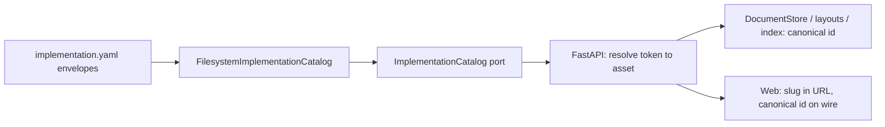

# moex-data-model: Implementation catalog

> P0 до дальнейшего развития редактора. Правило: никаких копий маршрутов под MDM/UCD/CRM/ЕСЭД и никакой условной логики по slug.

**Goal:** Workbench работает с любой DAMS LinkML реализацией через один catalog port; `trading` — одна из записей registry, а не ось кода.

**Architecture:** Kernel-port `ImplementationCatalog` + filesystem adapter в composition root (`apps/cli`), собираемый из `model-assets/implementations/**/implementation.yaml`. API принимает coordinate **или** slug, всегда нормализует в canonical `id`. Хранилища (`doc_key`, `implementation_id`, layout, index) видят только canonical id.



## Что изменилось по результатам проверки плана

1. **Убран runtime fallback `doc_key="trading"`.** Он сам был бы условной логикой по slug. Вместо него одноразовая Alembic data-migration.
2. **Добавлены пропущенные трещины, которые ломали бы MDM/UCD/CRM/ЕСЭД молча:**
   - `semantic-diff` и `diagrams` не имеют implementation в контракте.
   - `diagram_layout.diagram_id = moex:diagram:{ws}:{profile}` — коллизия между implementations в одном workspace.
   - `GET /model-index/search` глобальный, без фильтра по implementation.
   - `implementation_id` в jobs/validation-runs/publications сейчас **декоративный**: тело всегда из `SlicePaths` (trading). Клиент с id MDM получил бы отчёт по trading. Теперь id резолвится через catalog и пишется canonical.
   - Формы редактора (`dams:logical/trading/NewEntity` и др.) и Import Wizard привязаны к trading.
3. **Меньше диффа:** вместо замены ~15 вызовов `SlicePaths.resolve()` на разную логику — один helper `_paths(token)`, собирающий `SlicePaths` с явными `schema`/`implementation` из catalog. `run_compile`, `assess_implementation`, `diff_implementations` не трогаем.
4. **Чище порт:** `workbench_editable` убран из kernel (это знание Workbench). `schema_path` ленивый (у OWL нет `schema_body`, список не должен падать). Типизированные ошибки вместо `KeyError`.
5. **Contract suite без хардкод-ожиданий:** oracle = прямой вызов `assess_implementation` для того же asset. Параметризация по `catalog.list()`, а не по ручному списку slug; отдельный guard проверяет, что 5 solutions присутствуют.
6. **Regression guard:** архитектурный тест запрещает литерал `trading` и `SlicePaths.resolve(` без аргументов в `apps/api/src` и `apps/web/src`.
7. **Web:** один hook `useImplementation(slug)` вместо протаскивания slug по компонентам; на wire уходит canonical id.
8. Выкинуто: опциональный `--implementation-id` в CLI (YAGNI, вне P0).

## Текущий блокер (факты)

[`apps/api/src/moex_model_api/app.py`](apps/api/src/moex_model_api/app.py): фиксированный `ImplementationOut`, маршруты `/implementations/trading/*` и `/documents/trading`, `doc_key="trading"`, дефолты `moex:implementation:trading:1.0.0` в `ValidationRunRequest`, `JobCreate`, `PublicationCreate`, `model-index/rebuild`, `DiagramLayout`; ~15 вызовов `SlicePaths.resolve()` без аргументов. Web: [`client.ts`](apps/web/src/api/client.ts), [`App.tsx`](apps/web/src/App.tsx), [`ModelDetailPage.tsx`](apps/web/src/pages/ModelDetailPage.tsx) («Only trading is wired»), `EditorPage`/`ValidationPage` с `IMPL`, `*Forms.tsx` с `trading` в дефолтных id.

Что **не** привязано к implementation и менять не нужно: `verify_publish_gate` (golden-артефакты спецификации DAMS), `run_compile` (schema → contracts), `yaml_mutate` (generic, в api/src нет литерала trading вне `app.py`/`models.py`), `DocumentStore` port (generic по `doc_key`). Viewer / `publish.yaml` / `architecture-catalog.yaml` уже multi-impl — не трогаем.

В repo 9 envelopes; Workbench-editable = `implementation_kind: linkml` + `implementation_profile: dams-data-model`: trading, mdm, ucd, crm, esed (+ 2 enterprise LinkML; OWL и CSV draft — в списке, но не editable). Id-пространство bodies = slug (`dams:logical/mdm/ENTERPRISE`).

## Порт (kernel)

По конвенции пакета (`implementations/domain.py` + `public.py`):

- Новый [`packages/modeling-kernel/src/moex_modeling/assets/domain.py`](packages/modeling-kernel/src/moex_modeling/assets/domain.py)
- Расширить [`assets/public.py`](packages/modeling-kernel/src/moex_modeling/assets/public.py) (рядом с `SchemaRepository`, он грузит body по известному пути; catalog — discovery и mapping) и экспорты в `assets/__init__.py` и [`moex_modeling/public.py`](packages/modeling-kernel/src/moex_modeling/public.py)

```python
# domain.py
@dataclass(frozen=True, slots=True)
class ImplementationAsset:
    id: str                              # moex:implementation:mdm:0.1.0 (canonical coordinate)
    slug: str                            # mdm (presentation alias, derived from id)
    title: str                           # envelope name | title | id
    version: str
    implementation_kind: str             # linkml | owl | ...
    implementation_profile: str | None   # dams-data-model | ...
    dams_model_level: str | None
    envelope_path: Path
    body_path: Path
    specification_envelope_path: Path | None
    publication_manifest_path: Path | None   # sibling publish.yaml

@dataclass(frozen=True, slots=True)
class PublicationTarget:
    repo_path: str                       # posix, relative to repo root: file to commit
    manifest_path: Path | None

class ImplementationNotFound(LookupError): ...
class AssetResolutionError(RuntimeError): ...   # missing schema_body / body / path escapes root

# public.py
@runtime_checkable
class ImplementationCatalog(Protocol):
    def list(self) -> tuple[ImplementationAsset, ...]: ...
    def resolve(self, token: str) -> ImplementationAsset: ...        # coordinate or slug
    def load_body(self, token: str) -> str: ...
    def resolve_schema(self, token: str) -> Path: ...
    def publication_target(self, token: str) -> PublicationTarget: ...
```

Правила:

- `slug` выводится из `id` (`moex:implementation:{slug}:{version}`), поле в YAML не добавляем.
- Дубликат slug или id при сборке — ошибка сборки (не last-wins).
- Невалидный envelope: warning + skip (как [`transform_catalog.py`](apps/api/src/moex_model_api/transform_catalog.py)), список не падает.
- `list()` / `resolve()` — метаданные из памяти; `load_body()` читает файл на каждый вызов (контент свежий). Envelope-метаданные кешируются при старте, перезапуск при смене envelope (достаточно для P0; `refresh()` в порт не добавляем).
- Path-safety: `body_path` и schema после `resolve()` обязаны лежать внутри repo root, иначе `AssetResolutionError`.
- Envelope парсится как сырой YAML-словарь, **не** kernel Pydantic: у trading нет `source`, у CSV draft нет `name`.

## Adapter

Новый [`apps/cli/src/moex_model_cli/asset_registry.py`](apps/cli/src/moex_model_cli/asset_registry.py) (не раздувать `bootstrap.py`, но переиспользовать его `find_repo_root`, `resolve_body_from_implementation_envelope`, `resolve_schema_from_specification_envelope`). API уже зависит от `moex_model_cli.bootstrap`, новых слоёв не вводим.

`SlicePaths` остаётся как есть (CLI по-прежнему принимает path override). Workbench его без аргументов больше не вызывает.

## API

Composition в `create_app`: `app.state.implementation_catalog = FilesystemImplementationCatalog(find_repo_root())`; опциональный параметр `implementation_catalog=` для тестов (как `git_provider`).

Единый слой ошибок: `ImplementationNotFound` → 404, `AssetResolutionError` → 409 (через `app.exception_handler`, не try/except в каждом маршруте).

Helper внутри `create_app`:

```python
def _asset(token: str) -> ImplementationAsset: ...          # resolve + canonical
def _paths(asset: ImplementationAsset) -> SlicePaths:
    return SlicePaths.resolve(
        root=catalog_root,
        schema=catalog.resolve_schema(asset.id),
        implementation=asset.body_path,
    )
```

Маршруты (один набор):

- `GET /implementations` — все assets: `id`, `slug`, `title`, `version`, `implementation_path`, `implementation_kind`, `implementation_profile`, `workbench_editable`. `workbench_editable` считает **API** (`kind == linkml and profile == dams-data-model`), не kernel.
- `GET /implementations/{implementation_id}` — один asset (явный пункт требований)
- `GET /implementations/{implementation_id}/body`
- `GET /implementations/{implementation_id}/conformance`
- `GET|PUT /workspaces/{workspace_id}/documents/{implementation_id}`
- `POST /workspaces/{workspace_id}/documents/{implementation_id}/mutations`
- `POST /workspaces/{workspace_id}/documents/{implementation_id}/semantic-diff` (переезд со старого `/workspaces/{id}/semantic-diff`)
- не-editable asset на document/mutation/diagram/publish → 409 «not editable in Workbench»; `GET body/conformance` для OWL/CSV не блокируем, если schema резолвится

`{implementation_id}` принимает coordinate или slug; в ответах везде canonical `id`. Старые URL `/implementations/trading/body` и `/documents/trading` продолжают работать **как slug-alias тем же хендлером**, без отдельных маршрутов; существующие тесты остаются зелёными.

Остальные потоки:

- **Jobs / validation-runs / publications / model-index rebuild:** убрать дефолты `trading`; `implementation_id` обязателен (иначе 422), резолвится через catalog, **canonical id** пишется в `JobRecord`, `ValidationRunRecord`, fingerprint идемпотентности и `PublicationRecord`.
- **Diagrams:** `DiagramCreate.implementation_id` (обязателен); поле `implementation_id` в `DiagramSession` (in-memory); submit/apply/layout берут его из сессии. `diagram_id` меняется на `moex:diagram:{workspace}:{implementation_id}:{profile}` (убирает коллизию).
- **Publication:** коммитится `catalog.publication_target(id).repo_path`; в `verify_publish_gate` передаётся `publish_target=asset.body_path`, чтобы `refuse_generated_draft` реально работал.
- **Model index:** `rebuild` берёт body из catalog; `GET /model-index/search?q=&implementation_id=` — опциональный фильтр (join по `ModelIndex.implementation_id` в `SqlModelIndexProvider.search`; сигнатура порта `ModelIndexProvider.search` получает `implementation_id: str | None = None`).
- Audit details вида `f"{ws}:trading"` → canonical id.

## doc_key = coordinate и миграция

- Во всех `SqlDocumentStore.get/upsert` и `PublicationRecord` `doc_key = asset.id`. Убрать ORM default `"trading"` в [`db/models.py`](apps/api/src/moex_model_api/db/models.py).
- Новая Alembic `apps/api/alembic/versions/0007_doc_key_coordinate.py`:
  - `workspace_document.doc_key` и `publication_request.doc_key`: `String(64)` → `String(256)`
  - `UPDATE ... SET doc_key = 'moex:implementation:trading:1.0.0' WHERE doc_key = 'trading'` в обеих таблицах
  - `diagram_layout.diagram_id`: переписать существующие строки на новый формат (все они trading)
- Юнит-тесты работают на `create_all`, миграция проверяется отдельным smoke-тестом на SQLite (upgrade с seed-строкой `trading`).
- Известный риск: coordinate содержит версию, bump `1.0.0` → `1.1.0` осиротит drafts. В P0 принимаем (единообразно с `implementation_id` во всех таблицах), фиксируем в README; смена версии требует миграции `doc_key`. Если нужен version-independent ключ — отдельное решение, не P0.

## Web

- Новый hook `apps/web/src/model/useImplementation.ts`: `useImplementation(slug)` → `{ asset, editable, isLoading, error }` на базе `api.listImplementations` (react-query, общий кеш).
- [`App.tsx`](apps/web/src/App.tsx): `models/:slug/edit`, `models/:slug/diagram` вместо хардкода trading.
- [`client.ts`](apps/web/src/api/client.ts): `implementationBody(id)`, `implementationConformance(id)`, `getDocument(ws, id)`, `putDocument`, `mutateDocument`, `semanticDiff(ws, id)`; id через `encodeURIComponent`. `tradingBody/tradingConformance` удалить.
- `useModelDraft(workspaceId, implementationId)`, `EditorPage`, `DiagramPage`, `ValidationPage`, `ModelDetailPage` берут asset из hook; убрать `IMPL`, gate «Only trading», `slug = "trading"` default, текст «Workbench publish trading draft».
- Rebuild/search индекса в `ModelDetailPage` передают `implementation_id`.
- Формы (`EntityForms`, `RelationshipForms`, `PhysicalForms`, `MappingForms`): дефолтные id строятся из пропа `idNamespace` (= slug): `dams:logical/${ns}/NewEntity`.
- `ImportWizardPage`: целевой implementation из `?impl=<slug>`; если не задан — select из editable assets. Ссылки «Open editor» ведут на `/models/${slug}/edit`.
- `DashboardPage`: ссылка на `/models`, не на `/models/trading/validate`.
- Не-editable asset: страница модели без Edit/Diagram, с пояснением.

## Тесты

Порядок TDD, каждый шаг зелёный:

1. **Task 0 (spike):** прогнать `assess_implementation` на 5 bodies, зафиксировать результат; убедиться, что `apply_mutation` и `diff_implementations` работают на MDM/ЕСЭД. Если какой-то body не conformant, это не блокер: oracle сравнивает с библиотекой, а не с константой.
2. Kernel: `packages/modeling-kernel/tests/test_implementation_catalog_port.py` — stub удовлетворяет `ImplementationCatalog` (как `test_schema_repository_wire.py`).
3. Adapter: `apps/cli/tests/test_asset_registry.py` на реальном repo root и на `tmp_path`-fixture:
   - 5 solutions присутствуют; `resolve("mdm") == resolve("moex:implementation:mdm:0.1.0")`
   - `publication_manifest_path` у mdm/trading = sibling `publish.yaml`
   - unknown token → `ImplementationNotFound`; дубликат slug → ошибка сборки; битый envelope → skip + warning; body вне root → `AssetResolutionError`
4. **Contract suite** `apps/api/tests/contracts/test_implementation_contract.py` с фикстурой `asset` параметризованной `[a for a in catalog.list() if editable(a)]` (новый implementation подхватывается автоматически). Один и тот же набор use cases для каждого:
   - list/detail возвращает `id` и `slug`; resolve по slug и по id даёт тот же объект
   - body: 200, `path` == `asset.body_path` относительно root, digest совпадает
   - conformance: `overall_result` == прямой `assess_implementation(...)` для этого asset
   - document PUT → GET round-trip в изолированном workspace; `doc_key == asset.id` (не slug)
   - mutation `add_logical_entity` с id в namespace slug → draft изменился
   - semantic-diff draft vs published: 200, для немодифицированного draft нет breaking
   - validate job `source=draft` → canonical `implementation_id`
   - model-index: rebuild + search с фильтром возвращает только элементы этого implementation
   - diagram: open → layout id содержит implementation; два implementation в одном workspace не перетирают layout
   - publish (на `publish_client`): если oracle conformant → коммит файла `publication_target.repo_path`, иначе 422. Один код, ветвление по oracle, не по slug
   - negative: неизвестный id → 404; job без `implementation_id` → 422
   - Отдельный guard: `{"trading","mdm","ucd","crm","esed"} <= {a.slug for a in catalog.list()}`
5. Правки [`test_api.py`](apps/api/tests/test_api.py): `test_list_implementations` → `>= 5` и содержит trading; тесты, смотрящие `doc_key == "trading"`, переводятся на coordinate; URL-alias `/implementations/trading/...` оставить как отдельный тест на alias.
6. Миграция: smoke-тест `0007` на SQLite.
7. Architecture: `tests/architecture/test_workbench_no_trading_literal.py` — grep-тест: в `apps/api/src` и `apps/web/src` (кроме `*.test.*`) нет литерала `trading` и нет `SlicePaths.resolve(` без `schema=`/`implementation=`.
8. Web: обновить моки (`EditorPage.test`, `EntityForms.test`, `PhysicalForms.test`, `ImportWizardPage.test`, `ModelsPage.test`, `client.publish.test`), `e2e/diagram-bridge.spec.ts`; новый тест `useImplementation`, тест ModelDetailPage для не-trading slug.

## Документация

- [`apps/api/README.md`](apps/api/README.md): новый список маршрутов (в нём сейчас нет diagram/transform/import), правило coordinate vs slug, риск version bump.
- [`apps/web/README.md`](apps/web/README.md): `/models/:slug`, `/edit`, `/diagram`, `/validate`.
- [`docs/IMPLEMENTATION_PLAN.md`](docs/IMPLEMENTATION_PLAN.md): строка про `ImplementationCatalog` рядом с `SchemaRepository`.

## Порядок и коммиты

Каждый коммит зелёный; backward-compat достигается alias-резолвом, а не дублированием маршрутов.

1. Task 0 spike (без кода в репо)
2. Kernel port + adapter + тесты (маршруты не трогаем)
3. API: catalog в `app.state`, `GET /implementations[/{id}]`, `body`, `conformance` на параметризованных маршрутах (trading-хендлеры удалены, alias работает)
4. API: documents/mutations/semantic-diff, `_paths` вместо `SlicePaths.resolve(root=root)`, doc_key = coordinate + миграция 0007
5. API: jobs/validation-runs/publications/model-index/diagrams, canonical id, снятие дефолтов trading
6. Contract suite + architecture guard
7. Web (hook, routes, client, формы, import wizard) + обновление web-тестов
8. README / docs

## Вне скоупа

- `slug:` в каждом `implementation.yaml`
- Редактор OWL / CSV draft
- Version-independent `doc_key`
- Viewer, `architecture-catalog.yaml`, publication contract
- Смена CLI default
- Выбор workspace (остаётся `ws-workbench`)

## Проверка

```text
pytest packages/modeling-kernel/tests/test_implementation_catalog_port.py apps/cli/tests/test_asset_registry.py apps/api/tests tests/architecture
npm --prefix apps/web test
```

Вручную: `/models` показывает MDM/UCD/CRM/ЕСЭД; `/models/mdm/edit` грузит body и мутирует draft с id `dams:logical/mdm/...`; `/models/trading/edit` без регрессии; draft MDM и trading в одном workspace независимы (включая diagram layout).
