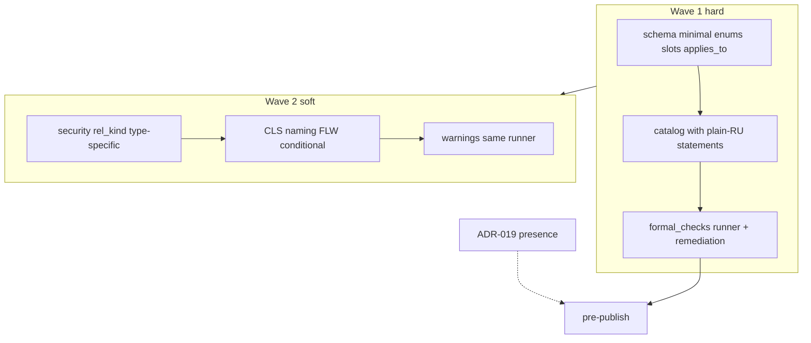

# moex-data-model: IT-solution model requirements

## Goal

Сделать §10 («Требования к модели ИТ-решения») машиночитаемым каталогом и исполняемым assess-gate перед публикацией, без смешения с publication-contract (ADR-019) и без правил, которые дают ложные fail / провоцируют фиктивное заполнение.

## Locked decisions

1. **Носитель:** [`it-solution-requirements.yaml`](model-assets/specifications/moex-dams/0.1/requirements/it-solution-requirements.yaml) (ADR-013).
2. **Два контура gate:** body assess (`formal_checks`) vs ADR-019 presence. Не дублировать.
3. **Mapping канон:** класс `Mapping` + `mapping_type`; Entity/AttributePhysicalMapping — только alias в pub-contract.
4. **Пользовательская формулировка:** у каждого `SpecificationRequirement` обязателен слот [`statement`](model-assets/specifications/moex-dams/0.1/schemas/moex-requirements.yaml) — полная формальная формулировка **на русском**, без сленга метамодели и без имён LinkML-классов/слотов. Имена слотов и kinds живут только в `formal_checks` / `title` (технический ярлык). Viewer показывает `statement` как основной текст карточки.
5. **Жёсткость:** Wave 1 = error на существование и связность модели; Wave 2 = warning на качество моделирования; harden — follow-up.
6. **Не угадывать «есть ли physical в жизни»:** нет нового `implementation_state` в Wave 1 только ради GEN. Полнота «вся логика реализована физически» — Wave 2+.
7. **Ownership / mapping / alignment:** `at_least_one` / status-driven branches; **не** XOR там, где override или (field+expression) нормальны. XOR допустим только где оба значения одновременно бессмысленны (редко).
8. **Governance v1:** не ломаем `GovernanceClassificationEnum`. `security_classification` — Wave 2.
9. **Identity v1:** `identity_rule` + `business_key_kind` + `key_attribute_refs`. Без nested `BusinessKey`. Без `none` в enum. `surrogate` один не закрывает LDM-004 для нетехнических сущностей.
10. **Один vocabulary исключений mapping:** `MappingCoverageStatusEnum` + слот **`mapping_coverage_status`** (не `logical_mapping_status`) на `LogicalAttribute`, `PhysicalField` и при необходимости `PhysicalObject`. Смысл: статус покрытия элемента mapping’ом на соседнем уровне модели. Рядом — `mapping_rationale`. Rationale-слоты: `alignment_rationale` ≠ `isolation_rationale` ≠ `mapping_rationale`.
11. **Коды:** только `{SECTION}-{NNN}` (текущий pattern). Вместо GEN-003A/B → **GEN-003** и **GEN-004**.
12. **Вертикальные волны:** schema → catalog → runner → examples/negative fixtures → trading-platform baseline → ADR/docs → viewer representation.
13. **Статус одобрения:** Wave 1 **одобрен к исполнению** после уточнений ниже (GEN-004 scope, PDM-003 explicit entity mapping, `planned` guard). Package-level `implementation_state` в Wave 1 **не** добавлять.

### Final pre-code clarifications (approved)

1. **GEN-004 / PDM-003 — только data-carrying PhysicalObject.** Проверка не применяется автоматически к инфраструктурным контейнерам (database instance, schema namespace, storage bucket-as-container, connection, consumer group, service account, index, partition, DLQ, migration table). Allowlist по существующему `object_kind` (без нового slot): `table`, `view`, `file`, `dataset`, `api`/`endpoint`, `topic`/`message`/`queue`, payload-bearing kinds. Либо объект имеет `physical_fields` / payload/schema → data-carrying. Иначе не в target проверки или `mapping_coverage_status: technical-only` + rationale.
2. **PDM-003 — только explicit entity-level Mapping.** Проходит, если есть `Mapping` с характером entity↔physical (через `mapping_type` / договорённый kind, напр. `field_mapping` на уровне entity не подходит; нужен entity-level kind — зафиксировать в schema: допустим `implementation` или явное значение вроде `entity_physical` если добавим в `MappingTypeEnum`), где участвует данный PhysicalObject и ≥1 LogicalEntity. **Не** выводить entity coverage из attribute/field mappings. Альтернатива: `mapping_coverage_status: technical-only` + непустой `mapping_rationale` на объекте.
3. **`planned` не постоянный обход.** `mapping_coverage_status: planned` ⇒ обязателен непустой `mapping_rationale`. Для артефактов с `lifecycle_status` ∈ {`active`, и если появятся `approved`/`released`} — `planned` даёт **warning** в Wave 1 (error — later/harden). Для `draft`/`deprecated` — допустим с rationale. В ADR/каталоге явно: `planned` не является постоянным способом обхода mapping requirement.

### Где сознательно не согласен / уточняю

| Замечание | Позиция |
|-----------|---------|
| Не вводить status-enum в Wave 1 | **Отклонено:** `MappingCoverageStatusEnum` остаётся в Wave 1. |
| Имя слота `logical_mapping_status` | **Переименовать в `mapping_coverage_status`** (симметрично для attribute и field). |
| `projection` в Wave 1 | **Оставляем** с явным отличием от `derived`. |
| Полный RACI ownership | **Не делаем.** |
| Package `implementation_state` | **Не в Wave 1.** |

---

## Acceptance criteria

**Wave 1 done when:**

- У каждого требования в каталоге заполнен `statement` (plain RU) + `applies_to` + ≥1 `formal_check` с `diagnostic_code` и `remediation` (или собираемый runner’ом текст).
- Example + skeleton проходят assess без error.
- Runner исполняет: `slot_required`, `slot_min_cardinality`, `ref_resolves`, `at_least_one_slots`, `conditional_branch` (для LDM-006 и mapping coverage).
- Negative fixtures: fail с сообщением, содержащим element id, норму из statement (кратко) и remediation.
- Baseline trading-platform: прогнан; gaps явны (fix или documented known warning), не silent.
- ADR-013: wiring undeferred + пункты про executable subset / severity / composite gate.

**Wave 2 done when:** severity matrix опубликована; soft checks warning-only на fixtures.

---

## Wave 1 — Schema

Files: [`moex-types.yaml`](model-assets/specifications/moex-dams/0.1/schemas/moex-types.yaml), [`moex-core.yaml`](model-assets/specifications/moex-dams/0.1/schemas/moex-core.yaml), [`moex-governance.yaml`](model-assets/specifications/moex-dams/0.1/schemas/moex-governance.yaml), [`moex-requirements.yaml`](model-assets/specifications/moex-dams/0.1/schemas/moex-requirements.yaml)

### Enums

**EntityTypeEnum** +=

- `projection` — представление сущности/набора под use case; нужны source + filter/projection rule (Wave 2 conditional).
- `technical` — нет самостоятельного бизнес-смысла вне реализации.

**DataClassEnum** += `operational_data` с definition: данные для непосредственного выполнения операций решения, не являющиеся master/reference, transactional-событием, analytical-результатом или metadata. Не default-корзина.

**BusinessImportanceEnum** += `critical` (важность **сущности** в модели решения; не путать с criticality бизнес-процесса — отдельный dimension позже).

**BusinessKeyKindEnum:** `natural` | `composite` | `external` | `local` | `surrogate` | `derived`. Без `none`. Descriptions как в review.

**ConceptualAlignmentStatusEnum:**

| Value | Meaning |
|-------|---------|
| `aligned` | Есть 1..* `conceptual_entity_refs` |
| `pending` | Связь должна быть, ещё не утверждена; rationale обязателен |
| `local-only` | Бизнес-смысл только в решении; корпоративный аналог не требуется сейчас; rationale обязателен |
| `not-applicable` | Техническая/служебная; **не** conceptual layer; только при `entity_type: technical` |

**MappingCoverageStatusEnum** (единый vocabulary): `mapped` | `derived` | `planned` | `inherited` | `technical-only` | `not-applicable`.

**MappingTypeEnum** (Wave 1): добавить явное значение для entity-level physical link (кандидат: `entity_physical` / reuse `implementation` — выбрать одно при schema PR и использовать только его в PDM-003; attribute-level остаётся `field_mapping`).

### Slots / classes

- `LogicalEntity`: `identity_rule`, `business_key_kind`, `conceptual_alignment_status`, `alignment_rationale`, `isolation_rationale`; optional `ownership_inheritance_rule` (string) если ещё нет.
- `LogicalAttribute` / `PhysicalField` / data-carrying `PhysicalObject`: **`mapping_coverage_status`** (`MappingCoverageStatusEnum`), `mapping_rationale`.
- `ModelPackage` / ownership: опираться на `data_owner_ref` (+ steward); optional package-level `ownership_inheritance_rule`.
- `SpecificationRequirement`: усилить описание `statement`; добавить `applies_to` (inline): `target_class` / `target_kinds`, optional `implementation_scope` / `dams_model_level` / `implementation_profile`.
- `FormalCheck`: += `remediation` (string); kinds += `at_least_one_slots`, `conditional_branch` — **только строго заданные шаблоны** (when status=X → required slots; when object_kind in allowlist → …). Без произвольного mini-language / graph queries. **Не** XOR для LDM-006/ATR-005/ownership.

### Relationship to existing flags

- `identifying` / `associative` на Relationship — Wave 1 без `relationship_kind`.
- Cardinality slots уже есть (`source_min_cardinality` …); Wave 1 требует все четыре для non-draft связей (см. REF-002). Значение `unbounded` — как принято в схеме (часто `null` max или явное); зафиксировать в check/docs. `unknown` — только если lifecycle draft/imported + rationale (если rationale-слота нет — Wave 1: require numeric cardinalities для `lifecycle_status: active`).

---

## Wave 1 — Catalog

Каждая строка: короткий tech-title + **statement (пользовательская формулировка)** + formal_checks. Ниже — канонические `statement` (можно слегка править при авторстве YAML, смысл не менять).

| Code | Title | statement (пользовательская формулировка) | Severity | Notes |
|------|-------|---------------------------------------------|----------|-------|
| GEN-001 | Идентичность и ответственность пакета | У пакета модели данных ИТ-решения должны быть стабильный идентификатор, понятное название, описание, версия и статус жизненного цикла. Должен быть указан ответственный за данные (владелец данных) либо явно описано, от какого объекта наследуется эта ответственность (например от ИТ-решения или доменного контекста). Локальное уточнение ответственности поверх правила наследования допускается. | error | at_least_one(owner, inheritance_rule); оба сразу OK |
| GEN-002 | Привязка к ИТ-решению | Пакет модели конкретного ИТ-решения должен ссылаться на одно ИТ-решение и быть помечен как модель уровня решения, а не как общекорпоративная концептуальная модель. | error | applies_to solution scope only |
| GEN-003 | Непустой состав модели | Пакет модели ИТ-решения должен содержать хотя бы одну логическую сущность или хотя бы один физический объект данных. Пустой пакет не допускается. | error | was 003A; formalizable |
| GEN-004 | Физические объекты связаны со смыслом | Если в пакете описан физический объект, который сам несёт или предоставляет данные (таблица, представление, файл, набор данных, конечная точка API, топик/сообщение и т.п.), для него должно быть показано соответствие логическому смыслу либо явно указано, что объект только технический/служебный, с кратким обоснованием. Инфраструктурные контейнеры (экземпляр БД, пространство имён схемы, бакет как контейнер, соединение, индекс и т.п.) этим требованием не покрываются автоматически. | error | data-carrying allowlist via `object_kind` / fields; no infra auto-fail |
| LDM-001 | Контекст и роль данных | Каждая логическая сущность должна быть отнесена к доменному контексту внутри пакета и к роли данных решения (создаёт/хранит, потребляет или посредничает). | error | keep |
| LDM-002 | Обозначение и ответственность сущности | У логической сущности должны быть русское бизнес-название, техническое имя, однозначное определение, статус жизненного цикла и ответственный за данные либо применимое правило наследования ответственности. | error | at_least_one ownership; not XOR |
| LDM-003 | Классификация сущности | Для логической сущности должны быть независимо указаны архитектурная роль, природа данных, важность для бизнеса и базовая классификация управления доступом/чувствительностью. Эти признаки не подменяют друг друга. | error | axes independent (CLS detail Wave 2) |
| LDM-004 | Правило идентичности | Для логической сущности должно быть описано, по каким деловым признакам два экземпляра считаются одним и тем же объектом, и указан характер ключа (натуральный, составной, внешний, локальный, суррогатный, производный) и/или состав ключевых атрибутов. Одного технического суррогатного ключа без делового правила для нетехнической сущности недостаточно. | error | surrogate-alone fails for non-technical |
| LDM-005 | Наличие характеристик | У логической сущности должен быть хотя бы один логический атрибут. Исключение — техническая сущность с письменным обоснованием, почему характеристик нет. | error | technical + rationale |
| LDM-006 | Связь с корпоративными понятиями | Логическая сущность должна быть прослеживаемо связана с корпоративным понятием либо иметь допустимый статус выравнивания с обоснованием: «ожидает решения», «только локальный смысл» или «не применимо» (только для технических сущностей). Ссылка на корпоративное понятие и пояснение характера реализации могут присутствовать одновременно. | error | status-driven; **not** XOR |
| LDM-007 | Семантическая включённость | Нетехническая логическая сущность не должна быть изолированной: должна быть связь с другой логической сущностью, либо выравнивание/реализация корпоративного понятия, либо письменное обоснование изоляции. Одного только отображения на таблицу/API недостаточно, чтобы считать сущность включённой в смысловую модель. | error | mapping ≠ semantic inclusion |
| ATR-001 | Основные свойства атрибута | У логического атрибута должны быть указаны владеющая сущность, логический тип, обязательность заполнения и признак множественности. | error | keep |
| ATR-005 | Отображение атрибута на реализацию | Для логического атрибута, который считается подлежащим физической реализации в этом пакете (не помечен как планируемый, производный, унаследованный, неприменимый или только технический), должно быть задано соответствие физическому полю и/или правило вычисления, либо письменное обоснование отсутствия. Поле и правило вычисления могут быть указаны вместе. Статус «планируется» требует обоснования и не должен быть постоянным обходом для уже активных элементов. | error | at_least_one; planned+rationale; planned on active → warning |
| REF-001 | Концы связи | У логической связи должны быть явно указаны исходная и целевая сущности, и обе ссылки должны указывать на сущности того же пакета. | error | keep |
| REF-002 | Кардинальность связи | У активной логической связи должны быть заданы минимальная и максимальная кардинальность с обеих сторон. Для черновика или импортированной связи допускается незаполненность только при соответствующем статусе жизненного цикла и кратком обосновании. | error | require 4 cardinality slots when active |
| PDM-001 | Основные свойства физического объекта | У физического объекта данных должны быть указаны ИТ-система, вид объекта, нативное имя/идентификатор, технология и ссылка на нативную схему или формат, а также статус жизненного цикла. | error | no Field/Mapping mix-in |
| PDM-002 | Основные свойства физического поля | У физического поля должны быть указаны родительский объект, нативное имя, нативный тип и семантика обязательности (допустимость пустого значения). | error | |
| PDM-003 | Отображение сущности и физического объекта | Для data-carrying физического объекта, не помеченного как только технический, должно существовать **явное** отображение уровня сущности на одну или несколько логических сущностей. Наличие отображений отдельных полей само по себе не засчитывается как доказательство на уровне объекта. | error | explicit entity-level Mapping only; allowlist kinds |
| PDM-004 | Отображение поля и атрибута | Для физического поля, не помеченного как только техническое, должно быть отображение на логический атрибут и/или правило преобразования, либо documented exception. Источник-поле и expression вместе допустимы. | error | same `mapping_coverage_status` vocabulary |

**Не в Wave 1:** publication/viewer (ADR-019); CLS soft; naming/atomicity; type-specific currency/unit; REF relationship_kind / M:N heuristics; PDM endpoint SLA; FLW; «вся логика имеет physical»; package `implementation_state`.

LDM-006 status matrix (исполняемая):

| status | conceptual_entity_refs | alignment_rationale |
|--------|------------------------|---------------------|
| aligned | обязательны 1..* | рекомендуется |
| pending | 0..* | обязателен |
| local-only | 0..* | обязателен |
| not-applicable | 0 (и только `entity_type: technical`) | обязателен |

---

## Wave 1 — Assess + diagnostics

- Module `formal_checks.py` + register in [`rules_runner.py`](packages/specification-dams/src/moex_dams/application/rules_runner.py).
- Filter requirements by `applies_to` (solution / target class).
- Diagnostic shape:
  - `diagnostic_code` (stable, e.g. `DAMS-REQ-LDM-004.c1`)
  - message: subject (`LogicalEntity "…"`) + what failed
  - short required-by from `statement`
  - `remediation` from FormalCheck
- Reuse STRUCT/REF codes where identical; else REQ codes.
- Update [ADR-013](docs/adr/ADR-013-specification-requirements-catalog.md):
  - catalog = structured rules source;
  - not every normative sentence is executable;
  - `formal_checks` = executable subset;
  - no checks ⇒ human-review, not silence;
  - stable diagnostic code + severity;
  - gate = body-assess + publication-contract + schema validation;
  - severity matrix (ниже).

---

## Severity matrix (в ADR-013 / requirements README)

| Category | Wave 1 | Wave 2 | Later |
|----------|--------|--------|-------|
| Package identity / EAM link | Error | Error | Error |
| Logical entity core metadata | Error | Error | Error |
| Identity rule | Error | Error | Error |
| Entity/attribute/physical mappings (with declared exceptions) | Error | Error | Error |
| Ref resolution / cardinality | Error | Error | Error |
| Naming | — | Warning | Error after baseline |
| Atomicity | — | Warning | Selective error |
| Currency/unit/timezone | — | Warning | Error by data class |
| entity_type/data_class conditionals | — | Warning | Error after calibration |
| DataFlow / integration | — | Warning | Error for critical flows |
| Security/regulatory | — | Warning | Error after policy alignment |
| Full logical↔physical completeness (planned/as-is) | — | Warning (needs explicit state) | Error when state model exists |

---

## Wave 2 (summary)

- `security_classification`; optional governance regulatory values; don’t use `not-applicable` as escape for business entities (already constrained in Wave 1).
- `relationship_kind`; ATR naming (`slot_pattern`); atomicity heuristics; type-specific; FLW; CLS axis-confusion checks.
- Optional package/entity `implementation_state` → then GEN physical-completeness / «as-is must map».
- Pub-requirements: clarify Mapping aliases in descriptions only.

## Out of scope

AI lineage UI; EAM live lookup; auto composite-string detection; full DAMS-F-* markdown rewrite; full RACI; nested BusinessKey; new LinkML EntityPhysicalMapping classes.

---

## Wave 1 risk controls

| Area | Risk | Mitigation |
|------|------|------------|
| `conditional_branch` | Medium | Only fixed templates (status→slots; kind allowlist); no general rule language |
| `applies_to` | Medium | target class/kind + profile + level only; no graph queries |
| `MappingCoverageStatus` / `planned` | Low–med | rationale required; planned on active → warning; document non-permanent bypass |
| trading-platform baseline | Med–high | Known gaps explicit; no silent bypass |
| Cardinality | Medium | Canonical min/max representation + fixtures first |
| Ownership inheritance | Low | at_least_one; override OK |
| Wave 2 creep | High | Soft checks stay out of Wave 1; boundary in ADR-013 |

## Appendix — Review disposition

| # | Topic | Disposition |
|---|-------|-------------|
| 0 | Пользовательская формулировка | Locked: `statement` = plain RU |
| 1 | GEN-003/004 | Split; data-carrying scope on GEN-004 |
| 2 | LDM-006 | Status-driven conditional |
| 3 | ATR-005 / PDM-004 | at_least_one; `mapping_coverage_status`; planned guard |
| 4 | Ownership | at_least_one; no RACI |
| 5 | LDM-007 | Semantic inclusion; mapping insufficient |
| 6 | REF-002 | Four cardinalities when active |
| 7 | BusinessKeyKindEnum | Closed; no none; surrogate-alone rule |
| 8 | PDM-003 | Explicit entity-level Mapping only |
| 9 | Slot name | `mapping_coverage_status` (not logical_mapping_status) |
| + | applies_to + remediation | Wave 1 |
| + | ADR-013 doctrine + severity matrix | Wave 1 |
| ✓ | Wave 1 execution | **Approved** after clarifications above |
