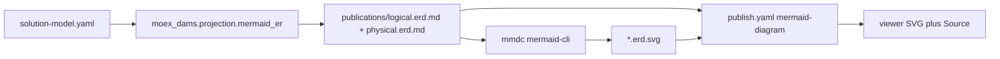

# moex-data-model: Mermaid erDiagram

## Цель

В модулях реализаций (trading-platform, mdm, ucd, crm, esed) рядом с таблицами Logical / Physical показать ER-диаграмму в стиле crow’s foot: **SVG по умолчанию**, кнопка **исходник Mermaid**. Runtime mermaid.js во viewer не кладём (ADR-015: один HTML, без CDN).

Канон по-прежнему YAML. Диаграмма — derived projection, как DBML (ADR-006).

## Поток



Viewer **не** строит диаграмму из YAML (ADR-015: без DAMS-логики в UI). Он только читает уже сгенерированные файлы.

## 1. Проекция (ядро)

Новый модуль [`packages/specification-dams/src/moex_dams/projection/mermaid_er.py`](packages/specification-dams/src/moex_dams/projection/mermaid_er.py), по образцу [`dbml.py`](packages/specification-dams/src/moex_dams/projection/dbml.py):

```python
def project_model_package_to_er_diagram(data: dict, *, profile: Literal["logical", "physical"]) -> str
def write_er_diagram_artifact(*, implementation_path: Path, out_md: Path, profile: str) -> ErDiagramManifest
```

**Logical:** `logical_entities` + `attributes` + `relationships`.

**Physical:** `physical_objects` + `physical_fields`; рёбра — те же `mappings`, что уже идут в DBML (`field_mapping` по полям; `object_mapping` / `entity_mapping` по объектам).

Пример выхода (logical):

```text
erDiagram
    Client["Client"] {
        identifier clientId PK
        string fullName
    }
    Account {
        identifier accountId PK
        identifier clientId FK
    }
    Client ||--o{ Account : "Account_owned_by_Client"
```

Правила:

- Идентификатор сущности/атрибута — тот же `_ident`, что в DBML (`[^A-Za-z0-9_]` → `_`).
- Русский `title` — только alias: `CONTACT["Контакт"]`.
- Тип атрибута: logical → `logical_type`, physical → `native_type`, иначе `string`.
- `PK` если `logical_type == identifier` или атрибут в `key_attribute_refs` / `business_key_kind`.
- `FK` если имя атрибута совпало с `relationship.source_role` (logical) или поле участвует в `field_mapping` (physical).
- Комментарий атрибута: `title` в кавычках, `"` экранировать.
- Кардинальность из `source_*` / `target_*` (дефолт как у DBML `>`: много source → один target → `Target ||--o{ Source`):

| source max | target max | ребро |
|---|---|---|
| >1 | 1 | `Target ||--o{ Source` |
| 1 | 1 | `Target ||--|| Source` |
| >1 | >1 | `Target }o--o{ Source` |
| 1 | >1 | `Target }o--|| Source` |

`max == 999999` считаем «много». `min == 0` меняет `||` на `|o` / `}|` на `}o` на соответствующей стороне.

Пропущенные / висячие FK — сущность рисуем, ребро пропускаем (как DBML).

Тесты: [`packages/specification-dams/tests/test_mermaid_er_projection.py`](packages/specification-dams/tests/test_mermaid_er_projection.py) на том же `MINI`, что в [`test_dbml_projection.py`](packages/specification-dams/tests/test_dbml_projection.py): logical содержит `erDiagram`, `Client`, `||--o{`; physical — объекты и mapping-ребро; escaping кавычек/кириллицы/ведущей цифры.

Экспорт из [`projection/__init__.py`](packages/specification-dams/src/moex_dams/projection/__init__.py) и [`public.py`](packages/specification-dams/src/moex_dams/public.py).

## 2. CLI и артефакты

Расширить [`apps/cli/src/moex_model_cli/commands/diagram.py`](apps/cli/src/moex_model_cli/commands/diagram.py): `--format mermaid` + `--profile logical|physical`.

Запись в каталог реализации (не в `generated/artifacts`, чтобы viewer видел файлы рядом с `publish.yaml`):

- `model-assets/implementations/solutions/{slug}/publications/logical.erd.md`
- `…/physical.erd.md`
- соседние `logical.erd.svg` / `physical.erd.svg`

`.md` — fenced block ` ```mermaid ` + текст проекции. Всегда пишется из Python.

`.svg` — `npx --yes @mermaid-js/mermaid-cli@11` (`mmdc -i … -o … -t neutral -b transparent`). Pin версии в скрипте. Нет Node → warning в отчёте, SVG не обязателен для unit-тестов; для пяти решений SVG коммитим, чтобы `make viewer` остался Python-only.

Обёртка: [`scripts/render-mermaid-erd.ps1`](scripts/render-mermaid-erd.ps1) (вход `.md`, выход `.svg`). Вызов из `write_er_diagram_artifact` или из CLI после записи md.

`import-solution` после `export-slice` пишет оба профиля (md всегда, svg если mmdc есть). Scaffold [`scaffold.py`](packages/standard-linkml/src/moex_standard_linkml/solution_xlsx/scaffold.py) добавляет две секции.

Секции в каждом `publish.yaml` (после соответствующих таблиц):

```yaml
- id: logical-erd
  title: Logical ER diagram
  kind: classes
  type: mermaid-diagram
  source: { format: markdown, path: publications/logical.erd.md }
- id: physical-erd
  title: Physical ER diagram
  kind: bindings
  type: mermaid-diagram
  source: { format: markdown, path: publications/physical.erd.md }
```

Новый `PublicationSectionKind` не вводим (ADR-016 закрытый enum). Новый **wire** `type` — да.

Правка пяти манифестов: [trading-platform](model-assets/implementations/solutions/trading-platform/publish.yaml), [mdm](model-assets/implementations/solutions/mdm/publish.yaml), [ucd](model-assets/implementations/solutions/ucd/publish.yaml), [crm](model-assets/implementations/solutions/crm/publish.yaml), [esed](model-assets/implementations/solutions/esed/publish.yaml).

Сгенерировать и закоммитить md+svg для всех пяти.

## 3. Viewer

Контракт:

- [`publication-manifest.schema.json`](apps/viewer/schema/publication-manifest.schema.json) — `type: mermaid-diagram`
- [`manifest_models.py`](apps/viewer/src/moex_publication_viewer/models/manifest_models.py) — в `SectionType`

Нормализатор (рядом с markdown): читает `.md`, вытаскивает тело `erDiagram`, ищет sibling `.svg` (тот же stem).

- `content` = SVG markup (вырезать `<script>`)
- `attributes.mermaid_source` = сырой mermaid
- нет SVG → `content` пустой, source всё равно есть (muted: «SVG не сгенерирован»)

Шаблон `apps/viewer/templates/section_mermaid.html.j2`: контейнер `.erd-canvas` (overflow auto) + вкладки/кнопка **Диаграмма** / **Исходник**. Исходник — `<pre>` + copy (существующий clipboard).

[`html_renderer.py`](apps/viewer/src/moex_publication_viewer/renderers/html_renderer.py) — маппинг типа на шаблон.

[`viewer.js`](apps/viewer/static/viewer.js) — ветка `mermaid-diagram` по аналогии с `markdown-doc`, плюс переключение панели source.

CSS в [`50-renderers.css`](apps/viewer/static/css/50-renderers.css) (или viewer.css fallback): холст на всю ширину content, SVG `max-width: 100%` / scroll если шире (ЕСЭД, 12 таблиц). Одна светлая SVG на обе темы — v1, без второго рендера.

Тесты viewer:

- normalizer: md+svg → content содержит `<svg`, `mermaid_source` начинается с `erDiagram`
- md без svg → source есть, content пустой
- `test_build.py`: секция в фикстуре не ломает сборку; HTML без `https://cdn` (уже есть `assert_no_required_cdn`)

## 4. Документация

- [`docs/dev/cheatlist.md`](docs/dev/cheatlist.md): `moex-model diagram --format mermaid --profile logical`
- [`docs/dev/solution-xlsx-import.md`](docs/dev/solution-xlsx-import.md): после импорта появляются erd-файлы
- Короткая пометка в ADR-006: Mermaid er — ещё одна derived projection
- README specification-dams / viewer: как смотреть диаграмму

Не трогаем golden DAMS `classDiagram` (`gen-mermaid-class-diagram`) — это другая проекция (metamodel, не решения).

## Вне скоупа

- Conceptual erDiagram
- Интерактивный pan/zoom (кроме нативного scroll)
- Вшивка mermaid.js в `index.html`
- drawDB / dbml-renderer
- Новый section kind
- Правка канонических YAML решений ради картинки
