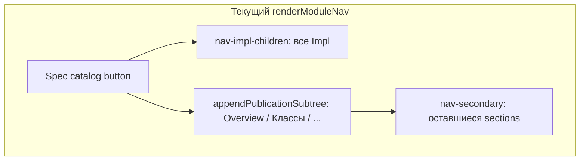
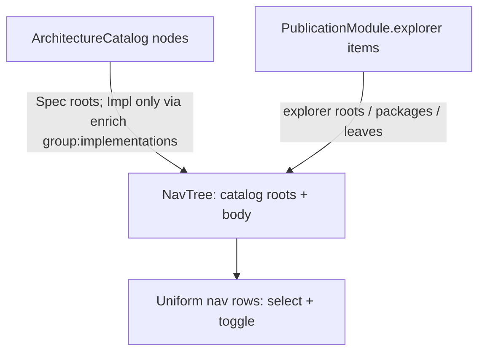

# moex-data-model: Nav hierarchy cleanup

## Диагноз (что не так сейчас)

Сайдбар собирается в [`apps/viewer/static/viewer.js`](apps/viewer/static/viewer.js) из **трёх несвязанных слоёв**, а не из одной иерархии:



1. **Catalog-слой** (`rootSpecifications` + `implementationsOf` → `nav-impl-children`): Impl всегда висят сразу под Spec **вне** раздела «Реализации». Это то, что на скриншоте: Spec → Impl → Impl, потом отдельно Overview.
2. **Explorer-слой** (`wrap_dams_explorer_roots` + `enrich_dams_explorer_implementations`): уже есть правильные корни Overview / Классы / Спецификация / Требования / **Реализации** — но они дописываются *после* catalog-Impls.
3. **Secondary** (`.nav-secondary`): плоский список `PublicationSection`, не попавших в nest Overview. Для DAMS сейчас пуст (overview/classes/slots/enums спрятаны), для FIBO/ontology — glossary/hierarchy и т.п. **«Второе меню» на скрине — не secondary**, а explorer Spec, визуально оторванный catalog-Impls.

Дополнительно:
- У Spec/Impl **нет** tree-toggle; expand/collapse есть только у explorer-групп/`nav-tree-node`.
- Клик по Spec с `module_id` сразу открывает module landing, **catalog description часто нет** (в [`architecture-catalog.yaml`](model-assets/specifications/moex-dams/0.1/architecture-catalog.yaml) у `moex-dams` / `trading-solution` нет `description`).
- `implementation_ref` в explorer сразу `navigateToNode` — нет стабильной «карточки описания» как у groups.
- Иерархия **не в объектной модели навигации**: DOM склеивается императивно; `PublicationItem` уже несёт `purpose` / `structure_why`, но catalog-слой их игнорирует.

Уже принятые design docs ([`dams-spec-explorer-hierarchy-design`](docs/superpowers/specs/2026-09-28-dams-spec-explorer-hierarchy-design.md), triple-root) говорят: реализации живут в `group:implementations`. Catalog-Impl siblings этому противоречат.

## Целевая архитектура (выбрано)

**Одно дерево слева = architecture catalog roots + тело активного publication module.**

```text
Spec moex.dams                    ← selectable, collapsible, description
├─ Overview                       ← group (уже в explorer)
├─ Классы
├─ Спецификация
├─ Требования
└─ Реализации                     ← единственное место Impl
   ├─ moex.dsp                    ← implementation_ref → select + open Impl
   └─ Trading solution

Spec edmc.fibo
├─ Overview
├─ … metamodel …
└─ Реализации
   └─ FIBO release …

(orphans / other publications — только если реально без Spec)
```

При открытии Impl: под выбранным Spec (или orphan-корнем) показывается **explorer модуля Impl**, без повторного списка sibling-Impl над деревом.



**Принципы (войдут в design note):**
- Source of truth связей Spec↔Impl — `architecture-catalog` (`conforms_to`); в nav они появляются **только** как дети `group:implementations` (build уже делает `enrich_*_implementations`).
- Source of truth разделов спецификации — `PublicationItem` explorer (`kind: group|section_ref|…` + `purpose`/`structure_why`/`description`).
- Viewer **не изобретает** третий список (`nav-impl-children`, дублирующий secondary для уже вложенных секций).
- Каждый узел: **selectable** + **description** (catalog / item / module fallback); узел с детьми — **toggle** (▶/▼), клик по label = select (+ expand если было закрыто; повторный клик по уже выбранному родителю = collapse — как у groups сейчас).
- Secondary nav остаётся **только** для секций, **не** достижимых из explorer (FIBO glossary и т.п.); если секция вложена через `section_ref` / `section_root` — в secondary не дублировать.

## Design note

Создать [`docs/superpowers/specs/2026-09-28-viewer-nav-hierarchy-design.md`](docs/superpowers/specs/2026-09-28-viewer-nav-hierarchy-design.md):

- Problem / decisions / UX tree (как выше)
- Контракт узлов (`NavNode` логический: id, title, description, role/kind, children, navigation target)
- Откуда берётся иерархия (catalog + explorer wrap + enrich) — **не** ad-hoc DOM
- Interaction matrix (Spec / group / section_ref / class / implementation_ref)
- Что удаляется: `nav-impl-children` как siblings Spec; Implementations block в chrome при дублировании nav (уточнить: оставить в content card Spec — да; в sidebar — нет)
- Supersedes/clarifies: dual placement of Impls; «второе меню» = miscomposed explorer

## Implementation (после approve design note)

### 1. Nav composition — [`viewer.js`](apps/viewer/static/viewer.js)

- Убрать блок `nav-impl-children` из `renderModuleNav` (строки ~603–609).
- Spec row: сделать collapsible parent; children = `appendPublicationSubtree` **только** когда Spec раскрыт / активен.
- При активном Impl под Spec: не рисовать catalog-Impl list; рисовать explorer модуля Impl под Spec (или заменить body на Impl body — выбрать: **body = explorer текущего `currentModuleId`**, Spec остаётся предком в chrome/breadcrumb).
- Унифицировать row renderer (сейчас три: `makeCatalogBtn`, `nav-group-btn`, `appendNavClassNode`) → один паттерн toggle + label + optional badge.
- Spec select: показывать карточку описания (catalog `description` || module `description` + role/version), **не** терять identity Spec; explorer остаётся раскрытым.
- `implementation_ref`: сначала select + detail card с description; явная кнопка «Open» (убрать auto-navigate-only path как единственный UX), либо select+navigate но с description в карточке до/после — **default: select показывает карточку, кнопка Open переходит в модуль** (меньше сюрпризов).
- Secondary: оставить filter; для DAMS не показывать пустой border.

### 2. Данные описаний

- Дописать `description` в [`architecture-catalog.yaml`](model-assets/specifications/moex-dams/0.1/architecture-catalog.yaml) для узлов без него (`moex-dams`, `trading-solution`, FIBO nodes по необходимости).
- `section_ref` / top Spec: description из целевой секции или purpose родителя (минимально: не `None` у `_section_ref` где возможно).

### 3. Тесты

- JS/поведение косвенно через build fixtures: убедиться что `group:implementations` содержит catalog impls ([`test_build.py`](apps/viewer/tests/test_build.py) уже частично).
- Добавить/расширить тест: в собранном HTML **нет** класса/паттерна, который бы требовал dual Impl list — или unit на будущий `buildNavModel` если вынести helper; минимум — assert explorer children ids включают `moex-dsp` / `trading-solution` under `group:implementations`.
- Ручной smoke: Spec expand → Overview…Реализации; Impl только там; клик Spec/group даёт description; toggle на каждом родителе.

### 4. Не трогать без нужды

- `wrap_dams_explorer_roots` / enrich — уже правильная модель тела Spec; менять только если не хватает description у refs.
- React `apps/web` ModelExplorer — вне scope.

## Порядок работ

1. Design note → review
2. Catalog descriptions
3. `renderModuleNav` / uniform rows / Spec collapse / remove impl siblings
4. implementation_ref select card
5. Tests + rebuild viewer smoke
