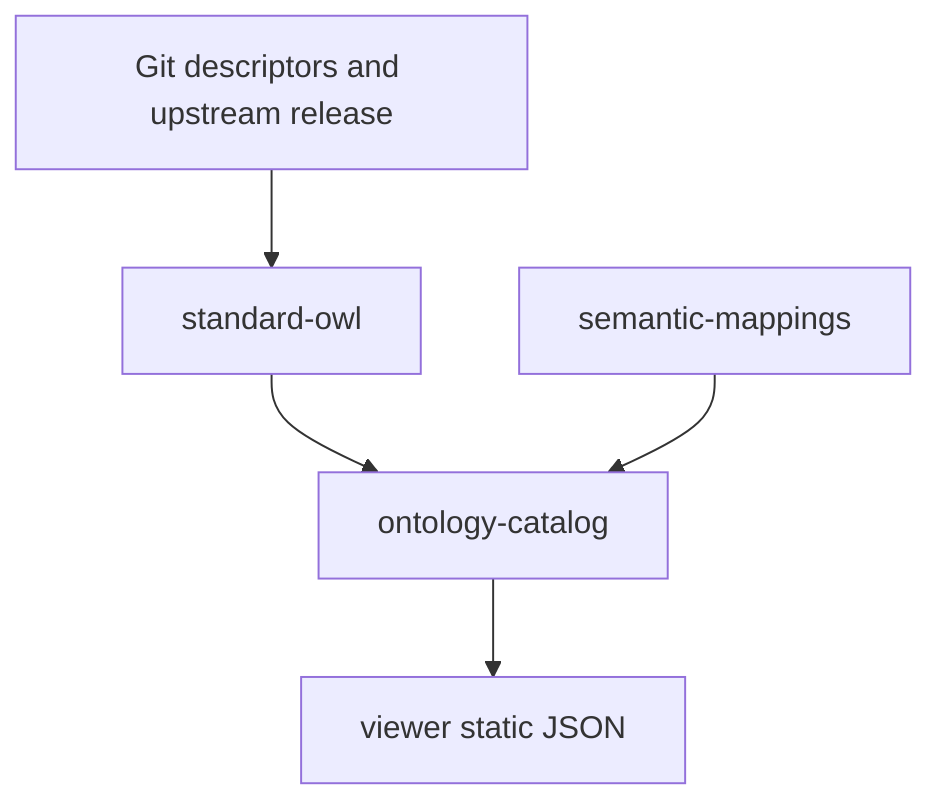

# moex-data-model: Ontology Catalog

Норматив платформы не меняется: [docs/architecture/MODELING_ARCHITECTURE.md](docs/architecture/MODELING_ARCHITECTURE.md). OWL 2 — экземпляр `ModelingStandard`, FIBO — `ReferenceSpecification`, корпоративные онтологии — `SpecificationImplementation`. Новых `OWL*` классов в [docs/architecture/modeling-kernel.yaml](docs/architecture/modeling-kernel.yaml) нет. `packages/modeling-kernel` не создаём.

Модуль — не редактор OWL. Полные аксиомы остаются в OWL provider. `OntologyEntity` — read model для поиска и карточки.

## Границы пакетов

Сейчас [packages/ontology](packages/ontology) — офлайн RDFLib-парсер и `python -m ontology.fibo` в CSV. Viewer показывает только [packages/ontology/publications/fibo_glossary.preview.csv](packages/ontology/publications/fibo_glossary.preview.csv). Решения viewer ([docs/architecture/viewer-decisions.md](docs/architecture/viewer-decisions.md)): сборка статическая, HTML видит только `PublicationItem`, поиск — клиентский фильтр, `viewer/` не переезжает.

Три новых пакета. `packages/ontology` остаётся тонким совместимым входом `ontology.fibo` → экспорт CSV из `standard-owl`, чтобы текущие тесты и preview-путь не сломались.

- [packages/standard-owl](packages/standard-owl) — «как прочитать OWL»: перенос [rdf_parser.py](packages/ontology/src/ontology/rdf_parser.py), literals, FIBO discovery/aggregation/export. Адаптеры `oak_adapter.py` (oaklib, implementation `rdflib:`), `rdflib_adapter.py`, `import_resolver.py` только внутри локального checkout. Без reasoner, без semsql/ROBOT.
- [packages/ontology-catalog](packages/ontology-catalog) — «какие онтологии и сущности доступны»: домен, порты, SQLite-проекция, read models, CLI пересборки индекса.
- [packages/semantic-mappings](packages/semantic-mappings) — LinkML `class_uri` / `slot_uri` / `meaning` / `*_mappings` и SSSOM. Не импортирует viewer и не пишет в DAMS-класс `Mapping` ([moex-core.yaml](model_src/schemas/moex-core.yaml)): тот связывает conceptual/logical/physical внутри модели.

Зависимости: `viewer → catalog public read models`. `catalog → порты`. Реализации портов подключаются в composition root. `standard-owl` не знает про DAMS. `semantic-mappings` не знает про RDF-парсер.

## Объектная модель

Pydantic, frozen, как в §5 MODELING_ARCHITECTURE. Поля — как в постановке: `OntologyRelease`, `OntologyEntity`, `OntologyRelation` (`asserted=true` в этом этапе), `SemanticBinding`.

`OntologyEntity.kind`: `class | object_property | data_property | annotation_property | individual`.

Read models для публикации: `OntologySummary`, `OntologyEntityCard`, `OntologyTreeNode`, `SemanticBindingView`. Карточка собирает label, definition, aliases, kind, asserted parents/children, domain/range, deprecated/replaced_by и backlinks. Аксиомы в карточку не копируются.

Индекс SQLite полностью перестраиваемый. Канон — Git descriptor + зафиксированный upstream. PostgreSQL и OLS4 не входят в этап.

## Что регистрируем

Дескрипторы в `model_src/ontologies/` (временный корень активов; целевой путь из [app_model.md](docs/architecture/app_model.md) — `model-assets/specifications/moex-ontology-profile`, без переезда всего дерева).

- Индексируется только FIBO `master_2026Q2`. RDF в Git не кладётся: локальный clone или `tests/fixtures/mini_fibo`.
- Заглушки со статусом `registered`, без ingestion: Corporate Ontology, PROV-O (reference), MOEX HR / MOEX Data / Application Ontology (implementation).

## Связи с DAMS и глоссарием

Правило из постановки сохраняется.

- `class_uri` / `slot_uri` — только если IRI онтологии и есть первичная семантика элемента схемы. На метамодельные классы (`ConceptualEntity`, `LogicalEntity`, …) `class_uri` не ставим: это не FIBO-классы.
- Экстрактор LinkML проверяется на фикстурной схеме с `class_uri`, `slot_uri`, `meaning`, `exact_mappings`.
- Управляемый набор — один SSSOM YAML `moex:mappings:dams-fibo`. Реальные строки, не выдуманный `dams:LegalEntity`: `dams:concept/Client` → `skos:closeMatch` → `fibo-be-le-lp:LegalPerson` (IRI из mini-fixture `LegalPersons.rdf`), justification `semapv:ManualMappingCuration`.
- `GlossaryTerm` в [moex-registries.yaml](model_src/schemas/moex-registries.yaml) остаётся `RegistryEntry`. Отдельный маленький SKOS concept scheme (prefLabel, definition, broader/narrower/related) проецируется в read model. Термин не становится `owl:Class`. Схема DAMS слотами SKOS в этом этапе не расширяется.

## Viewer

Сборка индекса пишет JSON, уже похожий на записи viewer (`id`, `title`, `description`, `children`, скалярные атрибуты). [json_normalizer.py](viewer/src/moex_publication_viewer/normalizers/json_normalizer.py) и существующие секции `glossary`, `tree`, `entity-table` их рисуют. Новый backend и новый section type не нужны.

В коммит — preview JSON с mini_fibo, по тому же принципу, что preview CSV. Полный SQLite и полный FIBO — локальные, gitignored. `publish.yaml` каталога: каталог релизов, поиск сущностей, дерево asserted `rdfs:subClassOf`, карточка, backlinks. UI не парсит RDF.

## Вне этапа

Reasoning, редактор OWL, SPARQL, triplestore, OLS4, PostgreSQL, `linkml-owl` как основа браузера, `gen-owl` как публикация каталога, перенос `viewer/` в `packages/publication`.

## Документ

Черновик [docs/architecture/ontology-catalog.md](docs/architecture/ontology-catalog.md): frontmatter `status: Draft`, `normative: false`, отсылка к MODELING_ARCHITECTURE. Короткий указатель в [app_model.md](docs/architecture/app_model.md) (строка про `standard-owl`) и в [packages/ontology/README.md](packages/ontology/README.md). `make architecture-check` остаётся зелёным.
