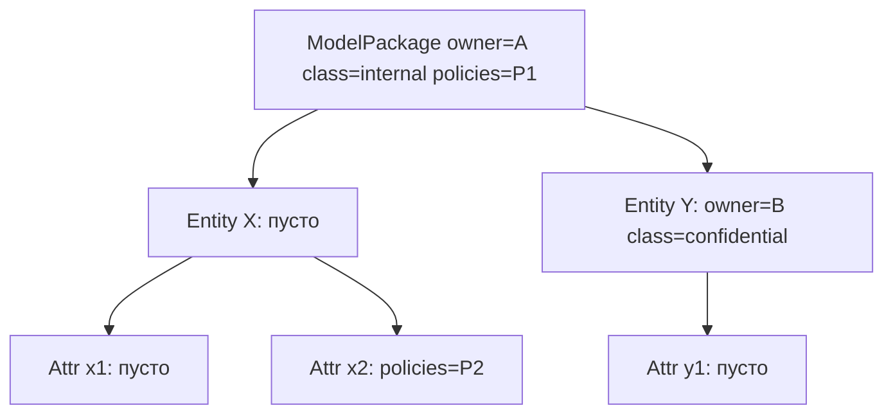

# moex-data-model: Governed property cascade

## Что нашёл в коде

- `HasOwnership` / `HasGovernanceClassification` / `HasPolicyBindings` живут в [moex-governance.yaml](model-assets/specifications/moex-dams/0.1/schemas/moex-governance.yaml). Слоты необязательные, поэтому «пусто = не задано» уже выразимо.
- Сейчас mixin-покрытие неровное ([moex-core.yaml](model-assets/specifications/moex-dams/0.1/schemas/moex-core.yaml)):
  - ownership: пакет, контекст, концепт, логическая сущность, физический объект — **нет** на `LogicalAttribute` / `PhysicalField`
  - classification: логическая сущность и атрибут — **нет** на пакете и `PhysicalField`
  - policies: логическая сущность, атрибут, физический объект — **нет** на пакете и `PhysicalField`
- Наследование фиктивное: `GEN-001.c7` / `LDM-002.c5` принимают свободную строку `ownership_inheritance_rule`. `LDM-003.c4` требует локальный `governance_classification` на сущности. Для атрибута в [IT_SOLUTION_MODEL_REQUIREMENTS.md](docs/architecture/IT_SOLUTION_MODEL_REQUIREMENTS.md) §7.1 уже написано «classification либо правило её наследования», но правила нет.
- Копирование вниз: [enrich.py](packages/standard-linkml/src/moex_standard_linkml/solution_xlsx/enrich.py) штампует `data_owner_ref` и `governance_classification` на каждую сущность (и classification на атрибут). YAML не отличает inherit от override.
- `ClassificationAssignment` / `PolicyBinding` — отдельные dated-объекты (valid_from/to, approval). Это другая ось, не inline-каскад.

## Целевая семантика механизма

Один алгоритм на все governed-семейства. Цепочка — containment (решено: `DomainContext` не входит):

- solution: `ModelPackage` -> `LogicalEntity` -> `LogicalAttribute`
- conceptual: `ModelPackage` -> `ConceptualEntity` (атрибут — когда появится класс)
- physical: `ModelPackage` -> `PhysicalObject` -> `PhysicalField`

Правила:

- слот **отсутствует** → взять эффективное значение родителя
- слот **задан** → override на этом уровне; потомки наследуют уже его
- override **покомпонентный**: атрибут может сменить только стюарда или только classification
- эффективное значение **не пишется** в YAML; резолвер отдаёт `(value, source_element_id, level)`
- списки (`policy_refs`): absent = inherit; присутствующий список (в том числе пустой) = **замена целиком**, не union

Эффективно: x1 = A / internal / P1; x2 = A / internal / P2; Y и y1 = B / confidential / P1.

Семейства v1:

- **ownership:** `data_owner_ref`, `data_steward_ref`, `owning_unit_ref`. Корень обязан иметь `data_owner_ref`.
- **classification:** `governance_classification` (не `entity_type` / `data_class` / `business_importance` — это intrinsic сущности; не `security_classification` в v1).
- **policies:** `policy_refs`.

## ADR-023 — природа и функционал (главный документ волны)

Файл: [docs/adr/ADR-023-governed-property-cascade.md](docs/adr/ADR-023-governed-property-cascade.md). Статус `Proposed`. Строка в [docs/adr/README.md](docs/adr/README.md) (индекс 001–023). Связанные: ADR-007 (DTO ≠ validator), ADR-013 (каталог требований / formal_checks), ADR-001 (YAML канон).

Содержание ADR (это и есть норма механизма):

1. **Context.** Mixins дают слоты, но не семантику экземпляров. Сегодня «наследование» = свободный текст или copy-down. Classification и политики уже нужны на атрибуте, но без каскада либо копируются, либо теряются.
2. **Decision — что это за механизм.** *Containment cascade of governed properties*: вычисляемые эффективные значения optional-слотов вдоль дерева вложенности. Не фича LinkML-mixin, не материализация в YAML, не текстовое `ownership_inheritance_rule`.
3. **Функционал.**
   - Реестр семейств: имя, набор слотов, cardinality (`scalar` | `list-replace`), корневой класс, цепочка containment.
   - Объявленное vs эффективное; provenance `(source_element_id, level)`.
   - Проверки каталога смотрят `effective: true`, а не сырой YAML.
   - Viewer/проекции в будущем читают эффективный слой; semantic diff сравнивает **объявленное** (override), не раздутый copy-down.
4. **Три семейства v1** — таблица слотов, корня, обязательств (`data_owner_ref` на пакете; эффективный `governance_classification` на логической сущности; `policy_refs` без обязательности).
5. **Не входит в каскад.** `entity_type`, `data_class`, `business_importance`; `security_classification` / `sensitivity_term_refs` (Wave 2); `DomainContext`; ось `realizes`.
6. **Отношение к Assignment-классам.** Inline-слот = declared default на элементе. `ClassificationAssignment` / `PolicyBinding` (+ будущий `OwnershipAssignment`) = dated/approved исключения. v1 резолвер читает только inline; точка расширения — второй источник с приоритетом «assignment перекрывает cascade на периоде действия».
7. **Absent vs empty** для списков: нет ключа = inherit; `policy_refs: []` = «политик нет» (override).
8. **Consequences.** Схема: mixin на каждом узле цепочки. Импорт не штампует потомков. `ownership_inheritance_rule` — rationale, не источник истины. Избыточный override = info-lint.
9. **Alternatives rejected.** Copy-down в YAML; XOR owner/rule; union политик; наследование через `realizes`; отдельный DSL наследования.

## Реализация (минимальные правки под ADR)

1. **Схема.** На узлах цепочки, где mixin отсутствует:
   - `LogicalAttribute`, `PhysicalField`: `HasOwnership`, `HasGovernanceClassification`, `HasPolicyBindings`
   - `ModelPackage`: `HasGovernanceClassification`, `HasPolicyBindings`
   - описания: пусто = cascade; `ownership_inheritance_rule` — deprecated rationale; `owner_entity_ref` — структурный родитель, не data owner
2. **Резолвер** `packages/specification-dams/src/moex_dams/rules/cascade.py` (не `ownership.py`): реестр семейств + один обход дерева `resolve_governed(body_data)`. Экспорт в [public.py](packages/specification-dams/src/moex_dams/public.py).
3. **Формальные проверки** ([formal_checks.py](packages/specification-dams/src/moex_dams/rules/formal_checks.py)): флаг `effective: true` на существующих `kind` (`slot_required` / `at_least_one_slots`). Каталог:
   - `GEN-001.c7`: обязателен пакетный `data_owner_ref`; строка-правило не достаточна
   - `LDM-002.c5`: `effective: true` на owner/steward
   - `LDM-003.c4`: `effective: true` на `governance_classification` (сущность может наследовать пакет)
   - warning: эффективный владелец ≠ `DATA_OWNER_PENDING`, один раз на источнике
   - атрибуты без новых MUST: всегда могут наследовать
4. **XLSX** ([enrich.py](packages/standard-linkml/src/moex_standard_linkml/solution_xlsx/enrich.py)): убрать copy-down `data_owner_ref` (стр. 41) и `governance_classification` на сущность/атрибут (стр. 42, 69–70). Пакетные дефолты профиля остаются.
5. **Существующие модели** не переписывать. Info-lint «избыточный override» на все три семейства.
6. **Тесты:** `test_cascade_resolver.py` + правки [test_formal_checks.py](packages/specification-dams/tests/test_formal_checks.py) — inherit/override по owner, classification, policies; `[]` vs absent; пустой корень; плейсхолдер; правило без владельца больше не проходит.
7. **Документация вокруг ADR.** [IT_SOLUTION_MODEL_REQUIREMENTS.md](docs/architecture/IT_SOLUTION_MODEL_REQUIREMENTS.md) (§ про `DataOwnerRef OR Rule` ~330, 442–455, 1102–1113; §7.1 classification inherit); [docs/LinkML_Glossary_DAMS.md](docs/LinkML_Glossary_DAMS.md). Регенерация `generated/` штатным пайплайном.

## Челлендж: почему каскад, а не «переопределяемый миксин»

- LinkML mixins не наследуют **значения экземпляров**. Миксин = набор слотов; каскад = семантика резолвера.
- Copy-down ломает распространение изменения на пакете и semantic diff.
- Текстовое правило наследования неисполняемо.
- Три семейства — один реестр, иначе classification и policies получат второй ad-hoc механизм.
- Union политик и ось `realizes` отложены: два источника требуют явного приоритета (зафиксировано в ADR как extension).

## Допущения и вне объёма

- `DomainContext` вне цепочки.
- Enterprise conceptual-пакеты formal_checks пока пропускает; резолвер для концептов есть, обязательные проверки — с каталогом enterprise.
- `ConceptualAttribute` не создаём.
- `ClassificationAssignment` / `PolicyBinding` в v1 не смешиваются с inline-каскадом.
- Viewer в этой волне не рисует provenance; ADR описывает контракт, UI — follow-up.
- Mermaid ER из соседнего плана не затрагивается.
