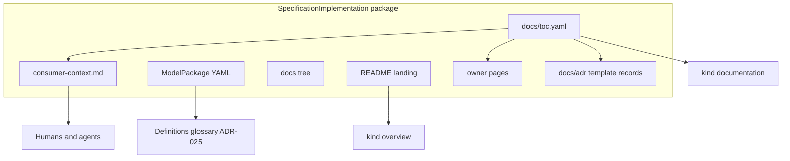

# moex-data-model: Package documentation section

## Ответ

**Да, включать. Нет — не как свободную вики без контракта и не как слоты прозы в `ModelPackage`.**

Имеет смысл дать владельцу место **в пакете реализации** (рядом с телом модели, в той же revision), чтобы зафиксировать контекст, который схема не выражает: зачем модель, чего в ней нет, какие инварианты нельзя формализовать, как её читать агенту, **почему модель менялась**. Обязательным должен быть не весь дерево файлов, а **оглавление + consumer-context**. Папка `docs/adr/` — зарезервированная, с шаблоном; записи появляются по мере решений, пустой комплект не обязателен. Прочие страницы — свободные, но проиндексированные.

Это закрывает дыру, которую сейчас не закрывают ни [ADR-025](docs/adr/ADR-025-definition-cascade-and-glossary.md) (определения сущностей), ни [ADR-016](docs/adr/ADR-016-publication-section-kinds-and-profiles.md) (`overview` = назначение публикации), ни README: у demo-решения [trading-platform](model-assets/implementations/solutions/trading-platform/publish.yaml) narrative нет вовсе, overview — key-value YAML; у [enterprise conceptual](model-assets/implementations/enterprise/moex-enterprise-conceptual-model/0.1/README.md) README уже тянет distinctions/scope disclaimer — ровно тот класс текста, которому нужно постоянное место.

## Что уже есть и чего не хватает

- **Определения** живут в `description` / cascade / glossary view. Туда нельзя складывать how-to и «не выдумывай сущности».
- **`overview`** в DSP: «назначение публикации, состав, быстрый старт». Viewer-гайд уже говорит: structured overview, README **после** него, README его не заменяет.
- **`DomainContext`** — ограниченный логический контекст с терминологией, не папка документов.
- **Закрытый `PublicationSectionKind`** — произвольный kind заводить нельзя; нужен один новый kind или явное расширение `overview`.
- Репозиторные `docs/agents/*.md` — контракт для агентов **этой** платформы, не для потребителя опубликованной модели решения.
- В `model-assets/**` нет `docs/` и нет TOC: narrative сегодня = `README.md` + секции `publish.yaml`.
- Viewer `[MarkdownNormalizer](apps/viewer/src/moex_publication_viewer/normalizers/markdown_normalizer.py)` читает **один** файл. Дерево по TOC — новая работа, не «включить папку».
- [ADR-001](docs/adr/ADR-001-linkml-yaml-canonical.md) называет documentation **производным** (LinkML gen-doc). Owner-authored `docs/` — не gen-doc, а часть пакета реализации, как уже существующий README в `overview`. Не смешивать эти два слоя.
- Несколько `markdown-doc` секций уже бывают (ADR-020 selections). Это путь-костыль без индекса; kind `documentation` + TOC его заменяет, а не плодит ещё секции.

## Практики, которые сюда ложатся

- **Diátaxis:** модель уже является *reference*. В docs класть *explanation* и *how-to*. Не дублировать таблицы классов/слотов markdown-ом.
- **docs-as-code + обязательный nav:** mdBook/GitBook `SUMMARY.md`, MkDocs `nav`. Оглавление — контракт обнаружения, не «ещё один README».
- **Вход для агентов короче полного корпуса:** `llms.txt`, `AGENTS.md`. Агент начинает с индекса и одной страницы правил, а не читает всё дерево.
- **Проза не в схеме:** OpenAPI `info` + `externalDocs`, JSON Schema `description` ≠ эссе, dbt `description` на нодах + docs site. В LinkML `description` уже занят как `skos:definition`.
- **ISO 11179 / DCAT / ODCS:** designation и definition — на элементе; supplementary documentation — связанный ресурс. Purpose/limitations можно частично держать структурированно, остальное — в docs.
- **Не второй глоссарий и не related-дерево** ([ADR-027](docs/adr/ADR-027-glossary-term-relations.md)).
- **Nygard / MADR:** решение = context → decision → consequences. Не changelog каждого коммита. [ADR-012](docs/adr/ADR-012-semantic-diff-review.md) остаётся машиной *что* сломалось; model ADR — *зачем* так смоделировали или изменили.

## Три подхода

**A. Только усилить README.** Минимум работы, уже есть `type: markdown-doc`. Не масштабируется: один файл смешивает landing, disclaimer, agent rules; нет индекса для агента.

**B. Свободный `docs/` + обязательный `INDEX.md`.** Близко к исходной идее. Риск: вики-гниль, оглавление-простыня без семантики, дубли определений, агент не знает, с чего начать.

**C. Рекомендуемый (этот вариант).** Sidecar `docs/` в пакете; машинное оглавление `docs/toc.yaml`; если дерево есть — обязательны TOC и `consumer-context.md`; зарезервирован `docs/adr/` с шаблоном; остальные страницы свободны, но все в TOC; публикация отдельным kind `documentation` (recommended для `implementation`, не required). Прозу в YAML `ModelPackage` не кладём.

Почему не required на каждый пакет: пустые заглушки хуже отсутствия. Почему не YAML-страницы внутри instance: плохой diff, враждебно к длинному тексту, дублирует файловую модель Git.

## Рекомендуемый контракт

Расклад пакета:

- `README.md` — landing для `overview` (как сейчас у spec/ontology).
- `docs/toc.yaml` — единственный обязательный индекс, если раздел включён.
- `docs/consumer-context.md` — единственная обязательная страница: purpose, non-goals, инварианты вне схемы, do/don't для потребителей и агентов, указатель «куда дальше» и на принятые model ADR.
- `docs/adr/` — **зарезервированный** каталог эволюции модели (не платформенные ADR репозитория).
- Прочие `.md` — произвольная иерархия вне `adr/`.

`toc.yaml` (смысл полей, не финальная схема):

- `entry_for_agents` — путь к первой странице (обычно `consumer-context.md`).
- `pages[]`: `id`, `path`, `title`, `audience` (`human` / `agent` / `both`), `role` (`contract` / `explanation` / `how-to` / `example` / `decision`), опционально `applies_to` → `element_id`.
- Записи из `docs/adr/` входят в TOC с `role: decision` (можно сверять с файлами на проверке, индекс остаётся каноном).

## Model ADR (`docs/adr/`)

`consumer-context` говорит, как читать модель *сейчас*. `docs/adr/` говорит, *почему она стала такой* и какие решения нельзя молча откатить. Git и [ADR-012](docs/adr/ADR-012-semantic-diff-review.md) показывают дельту YAML; они не заменяют обоснование.

Правила:

- Путь фиксирован: `docs/adr/`. Решения не класть в свободные how-to.
- Записи **не обязательны**, пока нечего фиксировать. Пустой `ADR-000` не заводим.
- Появился файл — обязан пройти шаблон и попасть в TOC.
- Идентификатор **со scope пакета** (`trading-platform:adr:001` или `MADR-001` в frontmatter). Голое `ADR-001` не использовать — столкнётся с [docs/adr/](docs/adr/) платформы.
- Не дублировать платформенные ADR (DAMS/DSP/viewer). Сюда только решения **этой** модели: split сущности, отказ от наследования, breaking rename, scoped definition, exception rationale, который не умещается в слот.
- Не вести параллельный `CHANGELOG.md`. Хронология = список `role: decision` по `date` / `model_revision`.
- Breaking / крупный modeling change **стоит** сопровождать записью; мелкий compatible typo — нет. Класс изменения стыковать с ADR-012 (`breaking` / `compatible` / `governance` / `modeling`), не изобретать вторую таксономию.

Шаблон файла (`NNNN-slug.md`, MADR-lite):

- frontmatter: `id`, `title`, `date`, `status` (`proposed` / `accepted` / `superseded`), `model_revision`, `change_class`, `affects` (element_id), `supersedes`
- тело: Context / Decision / Consequences (как платформенные ADR, короче)
- `affects` резолвится в элементы пакета; `status: superseded` требует `superseded_by`

Агенту: после `consumer-context` читать accepted ADR с `change_class: breaking` и те, что `affects` затрагиваемую сущность. Не читать весь git log.

Проверки (soft → formal_checks позже):

- Все `path` из TOC существуют; файлы вне TOC — warning.
- Файлы в `docs/adr/` без шаблона / вне TOC — error.
- `applies_to` и ADR `affects` резолвятся в элементы пакета.
- Info/warning, если страница пересказывает `description` сущности (определения остаются в модели).
- Раздел **recommended** в ProfileSpec `implementation`; для spec/ontology достаточно README+glossary, docs — по желанию.

Публикация (ADR-016):

- Новый kind `documentation` в [moex-dsp.yaml](model-assets/specifications/moex-dsp/0.1/schemas/moex-dsp.yaml) и [publication-manifest.schema.json](apps/viewer/schema/publication-manifest.schema.json).
- `type` остаётся render: дерево markdown по TOC (сейчас нормализатор однофайловый — его надо научить индексу, либо собрать секцию на билде из `toc.yaml`).
- `overview` не раздувать: structured summary + README; длинный контекст — в `documentation`.

Владелец docs = владелец `ModelPackage`. Docs входят в revision/digest пакета, не живут «где-то в Confluence».

## Что в docs класть нельзя

- Эталонные определения и scoped definitions — ADR-025.
- Иерархия терминов и See also — ADR-024/027.
- Требования и assessment findings — `model-assessment` / catalog.
- Инструкции, которые противоречат схеме («агент может добавить слот»). Схема побеждает, как в [er-dictionary-model-contract.md](docs/agents/er-dictionary-model-contract.md).
- Платформенные ADR репозитория и сырой git log — не копировать в `docs/adr/`.
- Semantic-diff output — не канон обоснования; при необходимости сослаться на revision, не вклеивать отчёт.

## Если согласны

Отдельный цикл реализации: платформенный ADR на раздел `documentation` + схему TOC и шаблон model ADR; поправка ADR-016 ProfileSpec; viewer tree (включая группу Decisions); один demo-пакет с 1–2 sample records. Пока не делать: обязательный docs/adr на все пакеты, прозу в LinkML, второй глоссарий, произвольные section kinds, автогенерацию ADR из semantic-diff.
