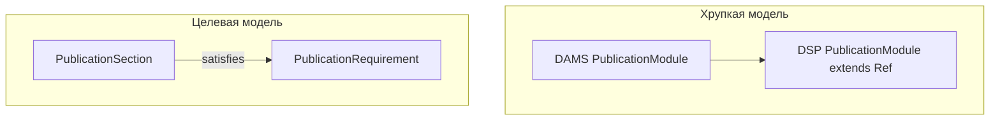

# moex-data-model: Publication contract inheritance

I'm using the writing-plans skill to create the implementation plan.

**Goal:** Сделать conformance реализаций по **обязательствам publication profile**, а не по идентичности модулей/файлов; оформить это ADR + нормативной архдокой + метамоделью DSP.

**Architecture:** Три независимых слоя требований (базовый ProfileSpec артефакта → унаследованные PublicationRequirement эталона → локальный manifest с `satisfies`). Conformance на уровне `PublicationSection`, не one-to-one наследования `PublicationModule`. Kernel `ConformanceReport` (семантика тела модели) **не смешивается** с publication-contract отчётом.

**ADR number:** **ADR-019** (ADR-018 уже зарезервирован планом FIBO application ontology).

## Проблема (зачем)

Сейчас при провале в Impl (скрин `moex.dsp`) сайдбар показывает непрозрачные корни **«Разделы»** и пакет **«Dsp»** (LinkML `groupby: schema`), а ADR-016 проверяет только наличие `PublicationSectionKind` для типа артефакта. Реализация может заявить `conforms_to` / catalog nesting под DAMS, не покрывая обязательные publication capabilities эталона. Trading-solution и будущие DSP-draft CSV публикуют локальные секции без явной связи `satisfies → requirement`.

Инвариант (зафиксировать дословно в ADR и § архдоки):

> Реализация reference specification наследует не идентичность publication modules, а обязательства publication profile. Каждый обязательный `PublicationRequirement` родительского профиля должен быть покрыт хотя бы одним `PublicationSection` реализации с явной связью `satisfies`, допустимым renderer и семантически валидным источником. Имена, число, группировка и порядок локальных `PublicationModule` могут отличаться.

Формула: `∀r ∈ Required(P_reference): ∃s ∈ Sections(I) | s ⊨ r` — **не** `Modules(I) = Modules(Reference)`.

## Границы слоёв (locked)

| Уровень | Где живёт | Что наследуется / задаётся |
|---|---|---|
| 1. Базовый профиль артефакта | ADR-016 `ProfileSpec` / `PublicationProfileId` | required/recommended/forbidden **kinds** для `linkml-specification` \| `ontology` \| `implementation` |
| 2. Контракт эталона | новые `PublicationRequirement` на Spec (DSP-слой) | semantic capabilities (`logical-entities`, …), cardinality, accepted renderers, `applies_when` |
| 3. Локальный manifest | `publish.yaml` Impl | `PublicationModule` / `PublicationSection`: title, path, renderer, **`satisfies: [req_id…]`** |

Допустимы агрегация (один section → много requirements) и декомпозиция (много sections → один requirement при `1..*`). Запрещена семантическая подмена (id/title без валидного semantic source).

Четыре **kind** требования: `required-section` | `required-semantic-content` | `required-binding` | `required-evidence`.

Три **статуса** publication conformance (отдельно от kernel `ConformanceResult`): `conformant` | `partially-conformant` | `draft-conformant`. Для generated/inferred DSP-default: `draft-conformant` + `semantic_assertion_status: inferred` + `approval_status: pending-review`.

## Что менять в репозитории

### 1. ADR-019 — Publication contract inheritance

Файл: [`docs/adr/ADR-019-publication-contract-inheritance.md`](docs/adr/ADR-019-publication-contract-inheritance.md)

Содержание (развёрнуто из формулировки пользователя):

- Context: различие OWL/`is_a` vs publication contract; почему one-to-one module inheritance ломает DSP/FIBO/OpenAPI/Data Contract.
- Decision: трёхслойная модель; `satisfies` на **section**; сущности `PublicationRequirement`, расширение `PublicationProfile` (`parent_profile_ref`, `requirements`); `PublicationConformanceReport` (DSP); статусы; правила агрегации/декомпозиции/запрет подмены; инвариант + формула.
- Relationship to ADR-016: ADR-016 = закрытый словарь kinds + базовый ProfileSpec типа артефакта; ADR-019 = наследуемые capabilities + coverage. Не supersede ADR-016.
- Out of scope первой итерации: deep OWL reasoning, жёсткий CI fail (сначала warnings, как ADR-016 soft validation).
- Alternatives rejected: module `extends`; profile = `ModelingStandardFamily`; требования только как kinds без semantic content checks.

Обновить индекс: [`docs/adr/README.md`](docs/adr/README.md) → `001–019`. Related-ссылки в ADR-016, ADR-014, ADR-015.

### 2. Раздел архдокументации

В [`docs/architecture/MODELING_ARCHITECTURE.md`](docs/architecture/MODELING_ARCHITECTURE.md) добавить **§17 Publication contract inheritance** (publication остаётся production/projection из §16, но контракт — нормативный инвариант проекции):

- Три уровня таблицы (semantic contract / publication profile / local manifest).
- Разделение «профиль типа» vs «унаследованные требования эталона» через `implements` / `conforms_to` + `conformance_profile`.
- Ссылка на ADR-019 + DSP schema; явное: kernel `ConformanceAssessment` проверяет **тело модели**; publication checker — **покрытие publication requirements**.
- Новый инвариант §14 (п.13): реализация покрывает Required(P_ref) через `satisfies`, не копируя modules.

Дополнительно развернуть практику в [`model-assets/specifications/moex-dsp/0.1/README.md`](model-assets/specifications/moex-dsp/0.1/README.md) и коротко в [`docs/architecture/viewer-decisions.md`](docs/architecture/viewer-decisions.md) (новый decision: Impl nav = section roots по kind/`satisfies`, не raw LinkML package groups; пакеты схемы — только для `profile: linkml-specification` как вторичная ось под «Классы»/schema-files).

### 3. Метамодель DSP

Файл: [`model-assets/specifications/moex-dsp/0.1/schemas/moex-dsp.yaml`](model-assets/specifications/moex-dsp/0.1/schemas/moex-dsp.yaml)

Добавить классы/слоты (минимальный набор из спеки пользователя):

- `PublicationRequirement` — `requirement_id`, `kind` (enum 4 значений), `semantic_capability`, `obligation`, `min_occurs`/`max_occurs`, `accepted_section_types` / accepted renderers, `expected_semantic_types`, `applies_when`, `inherited_from`, `applies_to_profile`
- `PublicationProfile` — расширить: `applies_to` / `parent_profile_ref`, `requirements` → `PublicationRequirement` (сохранить ADR-016 `required_kinds` как проекцию/совместимость base profile)
- `PublicationSection` — слот `satisfies` → `PublicationRequirement` [0..*]
- `PublicationConformanceReport` + `RequirementResult` — `overall_status` enum (`conformant` | `partially-conformant` | `draft-conformant`), не путать с kernel `ConformanceReport`
- Enums: `PublicationRequirementKind`, `PublicationObligation`, `PublicationConformanceStatus`

Обновить glossary JSON и Cursor rule [`.cursor/rules/publication-section-profiles.mdc`](.cursor/rules/publication-section-profiles.mdc): `satisfies` обязателен для Impl при наличии inherited requirements.

**Не** добавлять эти классы в [`docs/architecture/modeling-kernel.yaml`](docs/architecture/modeling-kernel.yaml) (граница ADR-016: publication projection ∈ DSP).

### 4. Нормативные примеры активов

- [`model-assets/specifications/moex-dams/0.1/publication-requirements.yaml`](model-assets/specifications/moex-dams/0.1/publication-requirements.yaml) — профиль(и) эталона (`dams-logical-modeling`, `dams-logical-and-physical`) с requirements (`logical-entities`, `logical-attributes`, `relationships`, `physical-mappings`, …).
- Расширить [`model-assets/implementations/solutions/trading-platform/publish.yaml`](model-assets/implementations/solutions/trading-platform/publish.yaml): `profile: implementation`, `kind` на секциях, `satisfies` на logical/physical/slice-conformance.
- [`model-assets/specifications/moex-dsp/0.1/publish.yaml`](model-assets/specifications/moex-dsp/0.1/publish.yaml): `profile: linkml-specification` + явные `kind` на overview/classes/glossary — это **документация метамодели плеера**, не DAMS logical-model Impl. Catalog nesting под DAMS остаётся навигационным; publication contract на DAMS logical capabilities к самому `moex.dsp` **не** навязывается (иначе снова путаем плеер и data Impl). Future CSV-draft units — отдельные `SpecificationImplementation` с `profile: implementation` и `satisfies` к dams:*.

### 5. Следствие для кривой иерархии (viewer)

Корневая причина «Разделы» / «Dsp»: explorer без profile/`kind` + `groupby: schema` → ad-hoc корни и имя пакета схемы.

В этой итерации (после ADR/схемы):

- Валидатор: расширить [`apps/viewer/src/moex_publication_viewer/validators.py`](apps/viewer/src/moex_publication_viewer/validators.py) / [`publication_profiles.py`](apps/viewer/src/moex_publication_viewer/publication_profiles.py) — загрузка requirements + soft warnings: missing `satisfies` coverage, forbidden semantic substitute stubs (по kind + declared semantic types, без полного instance scan сначала).
- Nav: для `implementation` — корни = секции по `kind` (overview, conformance, bindings, …), **без** обёртки «Разделы» и без package-folder как primary axis. Для `linkml-specification` — корни ADR-016 (Overview / Classes / Schema files / …); package groups только **внутри** Classes, с человекочитаемым title пакета, не отдельным sibling «Разделы».
- Design note (короткий): `docs/superpowers/specs/2026-09-28-publication-contract-nav.md` — контракт дерева Impl vs Spec.

Полный runtime checker semantic-content (подсчёт `LogicalEntity` в source) и CI hard-fail — **фаза 2** после soft warnings.

## Порядок работ

1. Написать ADR-019 + обновить ADR index / Related ADR-016.
2. §17 + инвариант в MODELING_ARCHITECTURE; DSP README; viewer-decisions пункт.
3. Расширить `moex-dsp.yaml` + glossary + cursor rule.
4. Добавить `publication-requirements.yaml` для DAMS; обновить trading + dsp `publish.yaml`.
5. Soft validator coverage + тесты; минимальная правка nav labels для Impl / linkml package roots.
6. (Фаза 2, отдельно) semantic-content checker, `PublicationConformanceReport` артефакт в build, hard CI, пример CSV-draft Impl.

## Явно не делаем в этом плане

- Наследование `PublicationModule extends …` в схеме.
- Перенос publication entities в modeling-kernel.
- Замена ADR-018 (FIBO application ontology).
- Требовать от `moex.dsp` покрытия dams:logical-entities (плеер ≠ data Impl).
