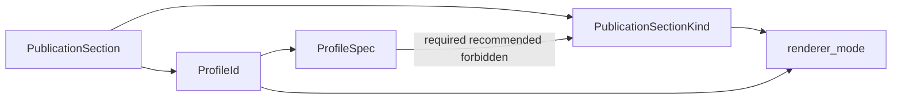

# moex-data-model: Publication section profiles

## Pivot (от прежней редакции плана)

Предыдущая редакция вводила `PublicationSectionRole` и для OWL требовала `classes` (переименовать FIBO metamodel → «Классы»). Это **отменено**.

Правильное разведение:

| Ось | LinkML `classes` | OWL taxonomy / classes |
|---|---|---|
| Смысл | Структура данных (slots, constraints) | Логическая категория / таксономия знаний |
| Иерархия | Вторична (`is_a`) | Первична (`subClassOf`) |
| Навигация | Пакеты и типы | Дерево таксономии |
| Публикация | Таблица атрибутов | Дерево + определения |

**Не** плодить `OWL Classes` / `SHACL Classes` section kinds. Один kind `classes`, разный **renderer mode** от профиля. Kind `taxonomy` — **отдельный** (для онтологий primary nav), не view поверх `classes`.

Частично уже лежащий в репо код (`PublicationSectionRole`, `modeling_standard: linkml|owl`, FIBO→classes) **переписать** под этот контракт.

## Решения (зафиксировано)

| Тема | Выбор |
|---|---|
| Закрытый словарь | enum `PublicationSectionKind` (семантика раздела) |
| Render | `get_renderer_mode(kind, profile)` — не отдельный OWL-Classes kind |
| Профиль | `ProfileSpec`: `required` / `recommended` / `forbidden` |
| Поле в publish.yaml | `profile:` (`linkml-specification` \| `ontology` \| `implementation`) |
| Якорь схемы | DSP [`moex-dsp.yaml`](model-assets/specifications/moex-dsp/0.1/schemas/moex-dsp.yaml) + viewer; **не** `modeling-kernel.yaml` |
| Валидация | soft: missing required / present forbidden → **warning** (не block build для legacy без `profile`); с `profile` — warning в CI лог, error только если явно включим strict позже (**эта итерация: warning**) |
| Deep `TaxonomySection` | **out of scope** (`root_class`, `depth_limit`, `show_equivalent`, OWL reasoning, module filter) — следующая итерация |



### `PublicationSectionKind` (канон)

`overview`, `classes`, `slots`, `enumerations`, `schema-files`, `taxonomy`, `glossary`, `identity`, `bindings`, `data-flows`, `conformance`, `source`

- `taxonomy`: только онтологии; primary nav; **не** дублирует `classes` — tree-first view того же conceptual set.
- `classes`: типы/концепции; renderer от профиля.

### `ProfileSpec`

```text
linkml-specification:
  required:    overview, classes, schema-files
  recommended: enumerations, slots
  forbidden:   taxonomy

ontology:
  required:    overview, taxonomy, glossary
  recommended: classes, identity
  forbidden:   schema-files, enumerations, slots
  # classes = ontology-list (IRI, definition, source_domain), НЕ таблица slots

implementation:
  required:    overview, conformance
  recommended: bindings, data-flows
  forbidden:   taxonomy
```

### Renderer mode для `classes`

```python
def get_renderer_mode(section_kind: str, profile: str) -> str:
    if section_kind == "classes":
        if profile == "ontology":
            return "ontology-list"
        return "data-structure"
    return section_kind
```

## Слои работ (эта итерация)

### 0. ADR-016 (обязательно, до/вместе с кодом)

Создать [`docs/adr/ADR-016-publication-section-kinds-and-profiles.md`](docs/adr/ADR-016-publication-section-kinds-and-profiles.md) в формате существующих ADR (Proposed, parent MODELING_ARCHITECTURE).

**Context:** одно слово «classes» для LinkML и OWL смешивает data-structure и taxonomy; ad-hoc корни FIBO «metamodel» vs DAMS «Классы»; риск комбинаторного взрыва (`OWL Classes`, `SHACL Classes`, …).

**Decision (зафиксировать в ADR):**

1. Закрытый enum **`PublicationSectionKind`** в DSP (не в modeling-kernel); `PublicationModule` остаётся открытым классом экземпляров.
2. Kind **`taxonomy`** — отдельный, primary nav для онтологий; **не** вариант `classes`.
3. Один kind **`classes`**; renderer mode от **`profile`**: `data-structure` (LinkML) vs `ontology-list` (OWL) — без отдельных `*Classes` kinds.
4. **`ProfileSpec`**: `required` / `recommended` / `forbidden` для `linkml-specification` | `ontology` | `implementation`.
5. Manifest `type:` (explorer, glossary, …) = wire/render format; `kind` = семантика. Ортогональны.
6. Якорь метамодели публикации — DSP; soft validation в этой итерации.

**Related:** уточняет UI/publication layer относительно [ADR-014](docs/adr/ADR-014-fibo-profile-metamodel.md) (Spec body vs Impl content): explorer Spec для ontology-профиля навигируется через **taxonomy** (+ glossary), а не через label «metamodel»/«classes» как primary axis. ADR-014 по Spec vs Impl **не отменяется**.

**Alternatives в ADR:** OWL-Classes section kind; taxonomy как view на classes; enum всех module_id; профиль = ModelingStandardFamily напрямую.

### 1. DSP + glossary

В [`moex-dsp.yaml`](model-assets/specifications/moex-dsp/0.1/schemas/moex-dsp.yaml):

- Заменить/`supplant` черновик `PublicationSectionRole` → enum **`PublicationSectionKind`** с descriptions как выше.
- Класс **`PublicationProfile`** / `ProfileSpec`: slots `profile_id`, `required_kinds`, `recommended_kinds`, `forbidden_kinds`.
- Enum **`PublicationProfileId`**: `linkml-specification`, `ontology`, `implementation`.
- У `PublicationModule`: slot `profile` → `PublicationProfileId` (вместо/поверх сырого `modeling_standard` как единственного ключа профиля).
- `SectionKind` (старый render: explorer / markdown_doc / …) **оставить** как presentation type в manifest `type:`; не смешивать с `PublicationSectionKind`. В docs явно: kind = семантика, type = render wire format.
- Сохранить `ModelingStandardFamily` если уже добавлен (метка языка); профиль публикации выбирается **`profile`**, не family напрямую.
- Обновить [`dsp_glossary.json`](model-assets/specifications/moex-dsp/0.1/publications/dsp_glossary.json).

### 2. Manifest / profiles / validate

- [`publication-manifest.schema.json`](apps/viewer/schema/publication-manifest.schema.json): `profile` enum; у section — `kind` (`PublicationSectionKind`); legacy `role` удалить или alias→kind.
- [`publication_profiles.py`](apps/viewer/src/moex_publication_viewer/publication_profiles.py): `PROFILES` dict + `get_renderer_mode` + collect kinds from module (section.kind + explorer `section_root` map: `classes`/`spec-files`→`schema-files`/`taxonomy`/`glossary`/…).
- Soft validate в [`validators.py`](apps/viewer/src/moex_publication_viewer/validators.py): если `profile` задан — предупреждения по missing required / present forbidden / missing recommended; **не** fail build в этой итерации (лог + опциональный список warnings в build summary).
- Pydantic models: `profile`, `kind` на module/section.

### 3. FIBO (`profile: ontology`)

- [`publish.yaml`](model-assets/specifications/moex-fibo-profile/0.1/publish.yaml): `profile: ontology`; секции/корни: **overview → taxonomy → glossary**; recommended: classes (ontology-list), identity.
- [`fibo_explorer_roots.py`](apps/viewer/src/moex_publication_viewer/normalizers/fibo_explorer_roots.py): корень **`group:taxonomy`** (title Taxonomy / Таксономия), не `group:classes` / metamodel; плюс glossary (+ stubs identity/classes list при наличии данных).
- Explorer JSON: убрать UI «metamodel»; доменное дерево = taxonomy content.
- Tests: ожидать `group:taxonomy`, не `group:fibo-metamodel` / не mandatory `group:classes` как primary.

### 4. DAMS (`profile: linkml-specification`)

- [`publish.yaml`](model-assets/specifications/moex-dams/0.1/publish.yaml): `profile: linkml-specification`; kinds overview / classes / schema-files (explorer root «Спецификация» = `schema-files`); glossary — recommended или optional вне required (required профиля = overview, classes, schema-files).
- [`dams_explorer_roots.py`](apps/viewer/src/moex_publication_viewer/normalizers/dams_explorer_roots.py): `section_root` map на kinds; **не** вводить taxonomy; сохранить Требования/Реализации как вне-профильные или отдельные kinds позже (не forbidden в linkml-spec — допустимы как extras вне ProfileSpec lists).
- Classes renderer = `data-structure`.

### 5. Docs + Cursor prompt

- DSP README: kind vs manifest `type`; три профиля; taxonomy ≠ classes; ссылка на **ADR-016**.
- Правило в [`.cursor/rules`](.cursor/rules): при новом `PublicationModule` — `profile` + `PublicationSectionKind` + ProfileSpec (см. ADR-016).

## Follow-up (не эта итерация)

- `TaxonomySection` params: `root_class`, `depth_limit`, `show_equivalent`, `show_disjoint`, `domain_grouping`
- OWL reasoning / module filters (BE, DER, FBC)
- Strict CI fail on profile violations
- Полный `implementation` profile на trading-solution

## Вне scope

- Enum всех `module_id`
- Kernel `ModelingStandard` → pure enum
- Удаление Требования/Реализации у DAMS
