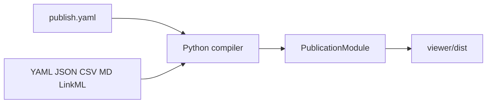

# moex-data-model: Publication Viewer MVP

## Оценка исходной постановки

Постановка **архитектурно верная** для этого репозитория: viewer — вторичный Git-native артефакт, не мастер-данные и не Workbench (`apps/web` из [docs/IMPLEMENTATION_PLAN.md](docs/IMPLEMENTATION_PLAN.md)). Принцип «новый раздел = `publish.yaml`, без правок UI» — правильный критерий качества.

Буквальная реализация спеки **не взлетит** на текущем дереве:

- Целевых путей нет: нет `schemas/dams/` (в старых docs фигурировало `schemas/mdms/`), `ontology/fibo/`, корневого `Makefile`, CI, корневого `pyproject.toml`. Данные живут в [`model_src/schemas/`](model_src/schemas/), [`model_src/examples/`](model_src/examples/), [`packages/ontology/`](packages/ontology/).
- Корневая схема сейчас `moex-mdms.yaml` (после rename — `moex-dams.yaml`) почти пустая (один класс `MOEXModelRepository`); реальные classes/slots/enums — в imported файлах. Single-file LinkML из спеки даст пустой DAMS-раздел. Нужен `SchemaView` по корневой схеме с imports.
- FIBO CSV (`packages/ontology/output/`) в `.gitignore` (~2700 терминов, 4181 entity). CI и свежий clone не увидят источник. Для MVP — **закоммиченный preview CSV**, полный mart остаётся опциональным.
- Глобальный `.gitignore` уже игнорирует `dist/` — `viewer/dist` не коммитим, это согласуется со спекой.
- 8 итераций — дорожная карта, не один цикл. Ниже — сжатый MVP (ваш выбор), без GitHub Pages и без Phase 2 `section.type`.

Что **не копировать** из спеки в код: emoji-иконки как обязательное поле; client-side YAML; React/AG Grid/Lunr; рендер 2700 `<tr>` из Jinja; зависимость от миграции каталогов.

## Архитектура MVP

```text
**/publish.yaml  +  YAML/JSON/CSV/MD/LinkML
        ↓
  discovery → validate → normalize → PublicationModule
        ↓
  Jinja shell + inline JSON + viewer.css/js
        ↓
  viewer/dist/index.html   (gitignored)
```



UI читает **только** нормализованную модель. Новый модуль появляется после добавления `publish.yaml`.

**Именование метамодели:** везде **DAMS**, не MDMS. В этом цикле — полный rename репозитория (не только подписи во viewer). Расшифровку акронима в заголовках не выдумываем: пишем «DAMS»; если в исходных docs есть полное имя MDMS — заменяем на DAMS, не на новую длинную фразу.

**Стек:** Python 3.11+, Pydantic v2, PyYAML, Jinja2, Markdown, `linkml-runtime` (SchemaView), pytest. HTML/CSS/Vanilla JS. Без React/Vite.

**Пакет:** корневой [`viewer/`](viewer/) по спеке, по образцу [`packages/ontology/pyproject.toml`](packages/ontology/pyproject.toml). Manifest-ы **рядом с данными**, не в вымышленных каталогах.

## 0. Rename MDMS → DAMS (первый шаг, до viewer)

Отдельной папки `mdms/` в текущем дереве **нет**. Имя живёт в файлах, префиксах LinkML, URI и текстах. Переименовываем **везде в исходниках**, включая то, что в целевой архитектуре было `schemas/mdms/` → `schemas/dams/`.

Правила:

- `MDMS` → `DAMS`, `mdms` → `dams` (в т.ч. в CURIE, `default_prefix`, `name`, путях).
- Файлы через `git mv`, не copy+delete.
- Generated (`model_src/generated/moex-mdms.*`) не правим руками — **перегенерируем** после rename схем.
- Бинарные `.docx` в этом цикле не трогаем (не round-trip); markdown-копии — да.

Карта файлов:

- [`model_src/schemas/moex-mdms.yaml`](model_src/schemas/moex-mdms.yaml) → `model_src/schemas/moex-dams.yaml`: `id`/`prefixes` `https://data.moex.com/dams/…`, `name: moex_dams`, `default_prefix: dams`. Остальные `model_src/schemas/moex-*.yaml` — те же URI/prefix.
- Imports вида `- moex-mdms` (если появятся) → `- moex-dams`. Корневые `imports` сейчас на `moex-types` и т.д. — без смены имени модуля, только prefix/URI.
- Примеры: `mdms:` CURIE и `api_version: mdms.moex/v0.1` → `dams:` / `dams.moex/v0.1` в [`model_src/examples/`](model_src/examples/).
- Docs: [`docs/mdms_entities_list.md`](docs/mdms_entities_list.md) → `docs/dams_entities_list.md`; [`docs/LinkML_Glossary_MDMS.md`](docs/LinkML_Glossary_MDMS.md) / [`docs/dev/LinkML_Glossary_MDMS.md`](docs/dev/LinkML_Glossary_MDMS.md) → `…_DAMS.md`; правки в [`docs/IMPLEMENTATION_PLAN.md`](docs/IMPLEMENTATION_PLAN.md) (`schemas/dams/`, `moex:dams`), [`docs/architecture/ARCHITECTURE.md`](docs/architecture/ARCHITECTURE.md), [`model_src/README.md`](model_src/README.md), markdown-спека.
- [`model_src/moex-mdms-drawdb-colored.dbml`](model_src/moex-mdms-drawdb-colored.dbml) → `model_src/moex-dams-drawdb-colored.dbml` + текстовые замены внутри.
- Viewer: `module_id` вида `moex:module:dams`, hash `#module=dams&…`, title «DAMS». Целевой каталог из старой спеки: `schemas/dams/publish.yaml` — **не создаём** (данные остаются в `model_src/`); только имя в текстах/ADR.

Проверка шага: `rg -i mdms` по репо (исключая `.venv`, `generated` до регенерации, `docs/dialogs`) — пусто в исходниках. Ссылки `imports` и `linkml-lint`/`SchemaView` на новый корневой файл проходят.

Этот шаг **перед** skeleton viewer, чтобы CLI/fixtures сразу ссылались на `moex-dams.yaml`.

## Решения, которые фиксируем в ADR

Файл: [`docs/architecture/viewer-decisions.md`](docs/architecture/viewer-decisions.md)

1. Viewer — published artifact, не source of truth.
2. Manifest-ы декларативные и module-local.
3. Сборка статическая, без runtime backend.
4. HTML потребляет только `PublicationModule/Section/Item`.
5. MVP-форматы: yaml, json, csv, markdown, linkml-yaml. LinkML — через SchemaView (imports обязательны).
6. UI: HTML + CSS + Vanilla JS.
7. Поиск: build-time index, client-side filter. Без Lunr/Elastic.
8. Разделы добавляются только manifest-ом.
9. `viewer/dist` не в Git (уже покрыто корневым `dist/`).
10. Большие таблицы: данные в `<script type="application/json">`, DOM рисует JS (сортировка/фильтр/пагинация). Jinja не разворачивает тысячи строк.
11. Метамодель называется DAMS (не MDMS): префикс `dams`, URI `https://data.moex.com/dams/`, корневой файл `moex-dams.yaml`. Старые CURIE `mdms:` не поддерживаем.

## Структура файлов

```text
viewer/
  README.md
  pyproject.toml
  src/moex_publication_viewer/
    cli.py
    discovery.py
    manifest_loader.py
    validators.py
    build.py
    models/manifest_models.py
    models/publication_models.py
    normalizers/base.py
    normalizers/yaml_normalizer.py
    normalizers/json_normalizer.py
    normalizers/csv_normalizer.py
    normalizers/markdown_normalizer.py
    normalizers/linkml_normalizer.py
    renderers/html_renderer.py
  templates/base.html.j2
  templates/section_table.html.j2
  templates/section_tree.html.j2
  templates/section_glossary.html.j2
  templates/section_markdown.html.j2
  templates/section_keyvalue.html.j2
  static/viewer.css
  static/viewer.js
  schema/publication-manifest.schema.json
  .gitignore
  tests/fixtures/...
  tests/test_*.py

model_src/publish.yaml
model_src/examples/publish.yaml
packages/ontology/publish.yaml
packages/ontology/publications/fibo_glossary.preview.csv
Makefile
docs/architecture/viewer-decisions.md
```

`renderers/html_renderer.py` — тонкий диспетчер: по `section.type` выбирает шаблон (`entity-table` и `enum-table` оба рендерятся `section_table.html.j2` с разным набором колонок; `glossary` — свой шаблон с алфавитным индексом; `tree`, `markdown-doc`, `key-value` — по одному шаблону каждый) и передаёт ему только `PublicationSection`. Логика фильтрации/сортировки/поиска — в `viewer.js` на готовых данных, не в Jinja.

`viewer/.gitignore`: `.venv/`, `dist/`, `__pycache__/`, `*.egg-info/` — по образцу [`packages/ontology/.gitignore`](packages/ontology/.gitignore).

CLI: `python -m moex_publication_viewer.cli build --root <repo>` из `viewer/` (editable install). Корневой `make viewer` / `make viewer-check`.

## Контракт данных (минимум)

Manifest: `module_id`, `kind`, `version`, `order`, `icon?`, `title`, `description?`, `sections[]`.

Секция: `id`, `title`, `description?`, `type`, `source.{format,path,select?}`, `columns?`, `filterable?`, `groupby?`, `sort?`, `key_column?`, `default_collapsed?`, `tags?`.

`source.path` резолвится **от директории manifest-а**. Discovery: `**/publish.yaml`, skip `.git`, `.venv`, `venv`, `dist`, `node_modules`, `__pycache__`.

MVP `section.type`: `entity-table`, `enum-table`, `glossary`, `tree`, `markdown-doc`, `key-value`.

MVP `source.format`: `yaml`, `json`, `csv`, `markdown`, `linkml-yaml`.

`version` — строка (пример в спеке даёт `1` как int; Pydantic коэрсит int→str). `kind` фиксирован как `"publication_module"` — discovery пропускает файлы с другим/отсутствующим `kind`, а не падает (задел на будущие типы manifest-ов).

Диагностики (fail build): missing file, unsupported `source.format`, unknown `section.type`, duplicate `module_id`, duplicate `section.id` в модуле, empty section после normalize. Каждая ошибка указывает путь к `publish.yaml` и (если применимо) к source-файлу.

## Три стартовых модуля

**DAMS** — [`model_src/publish.yaml`](model_src/publish.yaml)

- `markdown-doc` из [`model_src/README.md`](model_src/README.md)
- три отдельные секции на одном source-файле `schemas/moex-dams.yaml` (`format: linkml-yaml`, SchemaView снимет imports: core, types, registries, …), различаются `id` и `source.select`:
  - `id: classes`, `type: entity-table`, `select: classes`
  - `id: slots`, `type: entity-table`, `select: slots`
  - `id: enums`, `type: enum-table`, `select: enums`
- `id: class-tree`, `type: tree` — те же classes, но нормализатор строит иерархию по `is_a` (корень — классы без `is_a` / abstract roots), а не плоский список

**FIBO** — [`packages/ontology/publish.yaml`](packages/ontology/publish.yaml)

- `glossary` из **закоммиченного** `packages/ontology/publications/fibo_glossary.preview.csv` (`local_name,label,definition,iri,module_path,source_domain`)
- фильтр по `source_domain`; алфавитный индекс в JS
- preview CSV создаётся **один раз вручную**: 40–80 строк, отобранных из уже сгенерированного `output/fibo_glossary.csv` (по ~10 записей на каждый из доменов FND/BE/FBC/SEC/DER — разнообразие важнее объёма). Никакого скрипта регенерации в MVP: `output/` требует локального FIBO clone, которого нет ни у свежего контрибьютора, ни в CI. Обновление preview — вручную через PR.
- полный `output/fibo_glossary.csv` не используем в MVP (gitignore + размер ~2700 строк). В README `viewer/` — как переключить `source.path` на полный файл локально после `python -m ontology.fibo`, если нужно проверить производительность таблицы на реальном объёме

**Solution demo** — [`model_src/examples/publish.yaml`](model_src/examples/publish.yaml)

- `yaml` по [`trading-solution-model.yaml`](model_src/examples/trading-solution-model.yaml): `select` = `conceptual_entities` | `logical_entities` | `physical_objects`
- `key-value` на корневые поля пакета (`title`, `model_version`, `solution_ref`)
- `tree` опционально: conceptual → logical по `conceptual_entity_refs`, если это дёшево; иначе три таблицы достаточно

## LinkML normalizer

Не парсить «один YAML как dict». Использовать:

```python
from linkml_runtime.utils.schemaview import SchemaView
sv = SchemaView(str(source_path))  # moex-dams.yaml
```

`select`: `classes` | `slots` | `enums` | `types`.

Classes → `PublicationItem(id=name, attributes={description, is_a, abstract, mixins, class_uri})`.  
Slots → `PublicationItem(id=name, attributes={description, range, required, multivalued, slot_uri})`.  
Enums → `PublicationItem(id=enum_name)` с `children`: один child-`PublicationItem` на каждое permissible value (`id=value`, `description=value.description`). Никакого отдельного поля `values` — только `children`, чтобы `enum-table`-рендерер не знал про два разных представления.  
Tree (`class-tree`): рекурсивно строим `children` по обратным рёбрам `is_a` (родитель → его прямые потомки); классы без `is_a` и без родителя — корни верхнего уровня.

Fixtures: мини-схема из 2–3 файлов с import (не копировать весь DAMS).

## Viewer shell (desktop-first)

Один SPA-подобный `index.html` + скопированные `viewer.css` / `viewer.js`. Данные и search-index **inline JSON** (чтобы работало с `file://` без fetch CORS).

- Слева: модули (icon/title, badge числа секций).
- Сверху: поиск, light/dark (`localStorage`), expand/collapse sections, copy deep link.
- Контент: секции выбранного модуля.
- Hash: `#module=dams&section=classes&item=LogicalEntity`.
- Таблицы: sticky header, горизонтальный скролл, sort, filter chips, expand длинного description, copy cell, пагинация если rows > 100.
- Glossary: A–Z jump, поиск term/definition, карточка.
- Tree: expand/collapse, default depth 2, details (description + attributes). Без lazy virtualization — DAMS-дерево маленькое; FIBO taxonomy OWL в MVP нет (в preview CSV нет `superclasses`).

Не в MVP: export CSV, GitHub Pages, CI workflow, `relationship-list` / graph, LinkML imports как отдельная фаза (они входят сразу через SchemaView).

## Тесты и команды

Зеркало [`packages/ontology`](packages/ontology): pytest, fixtures, без сети.

- discovery: find/skip/duplicate module_id
- path resolve relative to manifest
- каждый normalizer: snapshot JSON `PublicationSection`
- LinkML fixture с import
- CLI: `build` пишет `dist/index.html` + css/js; `check` = validate+build без пропущенных path
- golden: в HTML есть три `module_id` и якоря секций

Корневой Makefile (нового файла сейчас нет; в репо нет и корневого `pyproject.toml`/venv — `packages/ontology` держит свой `.venv`, `viewer/` делает так же):

- `make viewer` — `python -m pip install -e viewer[dev]` (система/PATH python, без предположений про уже активированный venv) + `python -m moex_publication_viewer.cli build --root .`
- `make viewer-check` — `pytest viewer/tests` + `make viewer`

CI **не добавляем** в этом плане (нет `.github`). `viewer-check` готов к подключению позже без изменений.

## Риски MVP

- **LinkML imports дороже, чем кажется**: `SchemaView` тянет весь граф imports `moex-dams.yaml` (7 файлов). Если это медленно/шумно — держим один `SchemaView` инстанс на процесс сборки, не пересоздаём на секцию.
- **Rename ломает внешние CURIE** (`mdms:logical/…`): в репо примеров мало, снаружи могут быть черновики. В ADR фиксируем breaking change префикса/URI; compatibility-слой не делаем.
- **FIBO preview устареет молча**: preview CSV не связан с `output/` автоматически. Смягчение — заголовочный комментарий в manifest/README: "preview, обновляется вручную PR-ом", не претендует на полноту.
- **Один Jinja-шаблон на тип секции может не покрыть все нюансы** (например, `key-value` для solution demo vs будущих модулей) — расширяем шаблон точечно, не заводим универсальный "one template to rule all".
- **Discovery найдёт чужой `publish.yaml`** с опечаткой в `kind` и тихо проигнорирует — покрываем unit-тестом на "manifest без `kind: publication_module` не подхватывается, но и не роняет build".

## Порядок работ

Сгруппировано так, чтобы каждый шаг оставлял рабочий CLI, а не «скелет на 8 итераций».

1. Rename MDMS → DAMS (`git mv`, URI/prefix, docs, регенерация generated).
2. ADR + `viewer/` skeleton (модели, CLI `build` → минимальный `index.html`).
3. Discovery + validation + diagnostics + unit tests.
4. Normalizers yaml/json/csv/markdown + LinkML SchemaView; snapshot tests.
5. Три `publish.yaml` + FIBO preview CSV; `make viewer` собирает реальные данные.
6. HTML shell + CSS/JS: nav, theme, hash, table/glossary/tree, search.
7. README модуля: как добавить публикацию, как собрать, почему FIBO — preview; grep MDMS пуст.

## Явно вне scope

- GitHub Pages / GitHub Actions artifact
- RDF/OWL/TTL/DBML, TSV/JSONL
- Phase 2 section types
- Редактирование, auth, API, reasoner, drawDB
- Миграция `model_src/` → `schemas/dams/` (только переименование в целевых docs; физический перенос каталога не делаем)
- Правка бинарных `.docx`
- Коммит `viewer/dist`
- Полноразмерный FIBO glossary в Git
