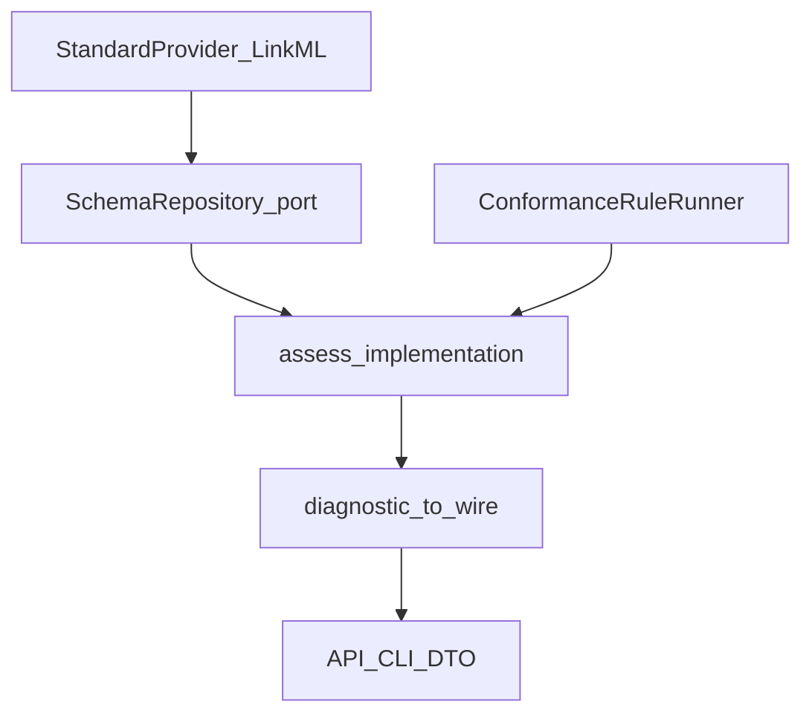

# moex-data-model: Stage 1 SchemaRepository residual

## Вердикт: блокеров нет

| Кандидат в блокеры | Факт |
|--------------------|------|
| `feat/semantic-diff-preview` / ADR-012 | Не блокирует. Diff CLI уже на `main`; preview — ортогональный publish/UI слой. PR attach остаётся отдельно. |
| OpenAPI provider | Наоборот **ждёт** стабилизации Stage 1 ([MODELING_ARCHITECTURE](docs/architecture/MODELING_ARCHITECTURE.md) §13). Сейчас не начат. |
| Отсутствие `SchemaRepository` | Это и есть работа, не блокер. |
| Неполный ModelGraph | `DamsModelGraphView` достаточно для residual; ядровой abstract ModelGraph — follow-on. |

Можно начинать. Процесс: ветка `feat/stage1-schema-repository` от текущего HEAD (или от `main` после merge semantic-diff) — технически без разницы.



---

## Locked scope (residual, не весь Stage 1)

**In:**

1. **`SchemaRepository` Protocol** в kernel + DAMS/LinkML concrete adapter
2. **Единый diagnostics wire surface** (mapper + API/CLI alignment) без rename kernel fields
3. **`ConformanceRuleRunner`** — регистрация существующих правил по `ConformancePhase`
4. Рефактор [`assess_implementation`](packages/specification-dams/src/moex_dams/application/assess.py) / [`diff_implementations`](packages/specification-dams/src/moex_dams/application/diff.py) на repository (пути остаются входными параметрами; registry lookup по `SpecificationRef` — stub с default DAMS path)

**Out (follow-on Stage 1 / позже):**

- Kernel abstract `ModelGraph` (schema+instance); оставляем `DamsModelGraphView`
- CURIE/URI resolver service
- Новые MOEX rules (`governance` / `mappings` / `compatibility`)
- `standard-openapi`
- PR automation ADR-012

---

## Design decisions (locked)

### SchemaRepository

Не дублирует `StandardProvider` — **композиция**: резолвит asset path + делегирует load.

Новый модуль [`packages/modeling-kernel/src/moex_modeling/assets/`](packages/modeling-kernel/src/moex_modeling/assets/):

```python
@runtime_checkable
class SchemaRepository(Protocol):
    def resolve_specification_path(self, specification: SpecificationRef) -> Path: ...
    def load_specification(self, specification: SpecificationRef) -> Any: ...  # typed in impl
    def load_implementation(
        self, implementation: ImplementationRef, *, path: Path | str
    ) -> Any: ...
```

Concrete: [`packages/specification-dams/.../repository.py`](packages/specification-dams/) `DamsAssetRepository`:

- держит `LinkMLStandardProvider`
- `resolve_specification_path` для `moex:spec:dams` / `0.1` → известный `model-assets/specifications/moex-dams/0.1/schemas/moex-dams.yaml` (как сейчас `SlicePaths`)
- неизвестный `SpecificationRef` → явная ошибка
- `load_*` → `provider.load_specification_body` / `load_implementation_body`

Экспорт из `moex_modeling.public` + `moex_dams.public`.

### Diagnostics wire surface

Kernel [`Diagnostic`](packages/modeling-kernel/src/moex_modeling/conformance/domain.py) **не переименовываем** (`diagnostic_code`, `subject_ref`, `source_location`).

Добавить:

```python
def diagnostic_to_wire(d: Diagnostic) -> dict[str, Any]:
    # code, severity, message, path, element_id, source, line, suggestion
```

Маппинг:

| Wire (IMPLEMENTATION_PLAN) | Kernel |
|----------------------------|--------|
| `code` | `diagnostic_code` |
| `message` | `diagnostic_message` |
| `element_id` | `subject_ref` |
| `path` | `source_location.json_pointer` |
| `source` | `source_location.source_uri` |
| `line` | `source_location.line` |
| `suggestion` | detail `suggestion` или `None` |

Расширить API [`DiagnosticRecord`](apps/api/src/moex_model_api/ports.py) теми же полями (optional path/line/element_id/suggestion). CLI validate/assess JSON — через тот же mapper. Правила/validator по возможности заполняют `json_pointer` где уже есть `subject_ref` (минимум: pointer = `/`-style от element path, без полного YAML line tracking).

### ConformanceRuleRunner

В `packages/specification-dams/src/moex_dams/application/rules_runner.py`:

```python
@dataclass(frozen=True)
class RuleSet:
    phase: ConformancePhase
    assessment_id: str
    description: str
    run: Callable[[LinkMLImplementationBody], tuple[Diagnostic, ...]]

def run_rule_sets(body, sets: Sequence[RuleSet]) -> list[tuple[RuleSet, tuple[Diagnostic, ...]]]: ...
```

Зарегистрировать существующие: LinkML `validate_standard` → `STANDARD_VALIDATION`; `check_structural` → structural phase; `check_references` → semantic/reference phase (как сейчас в assess). `assess_implementation` вызывает runner вместо трёх hardcoded блоков.

### Element index (тонкий bonus в том же PR)

Один тип `ElementIndexEntry` + `build_element_index(body)` поверх `package_index` / логики [`elements_from_package`](apps/api/src/moex_model_api/indexing.py); API model-index rebuild перевести на него. Не раздувать до full ModelGraph.

---

## Tasks

### 1. Kernel: SchemaRepository Protocol + `diagnostic_to_wire`

- Create `packages/modeling-kernel/src/moex_modeling/assets/public.py` (+ `__init__`)
- Create `packages/modeling-kernel/src/moex_modeling/conformance/wire.py` with `diagnostic_to_wire`
- Export from [`public.py`](packages/modeling-kernel/src/moex_modeling/public.py)
- Unit tests: wire mapping round-trip shapes; Protocol importable

### 2. DAMS: `DamsAssetRepository` + RuleRunner

- Implement repository wrapping `LinkMLStandardProvider` + DAMS path table
- Implement `rules_runner.py`; refactor [`assess.py`](packages/specification-dams/src/moex_dams/application/assess.py) to use both
- Refactor [`diff.py`](packages/specification-dams/src/moex_dams/application/diff.py) loads through repository (schema resolve + load impl from left/right paths)
- Keep public `assess_implementation(schema_path=..., implementation_path=...)` signature for CLI/API compatibility; internally `DamsAssetRepository(default_schema_path=...)`

### 3. Wire into API + CLI diagnostics

- Map `Diagnostic` → expanded `DiagnosticRecord` via `diagnostic_to_wire`
- CLI JSON output (validate/assess if present) uses same helper
- Tests: assess still green; API validation-run persists new optional fields without breaking old clients

### 4. Element index unify

- Move/share index builder in specification-dams; API `indexing.py` calls it
- One unit test: trading fixture yields stable `element_id` set

### 5. Docs

- [`docs/IMPLEMENTATION_PLAN.md`](docs/IMPLEMENTATION_PLAN.md) Stage 1 Progress: SchemaRepository + wire diagnostics + rule runner done; abstract ModelGraph / CURIE / remaining rules deferred
- Short note in [`docs/architecture/app_model.md`](docs/architecture/app_model.md) under already-shipped

---

## Verification

```text
# from repo root
make check                    # Stage 0 unchanged
powershell -File apps/api/scripts/check.ps1
powershell -File apps/cli/scripts/check.ps1
# or Makefile targets if present
pytest packages/modeling-kernel/tests packages/specification-dams/tests -q
```

Критерий готовности residual: assess/diff/CLI/API больше не создают «голый» `LinkMLStandardProvider` вне repository; diagnostics в API имеют `code`/`element_id`/`path` wire shape; OpenAPI provider всё ещё не трогаем.
