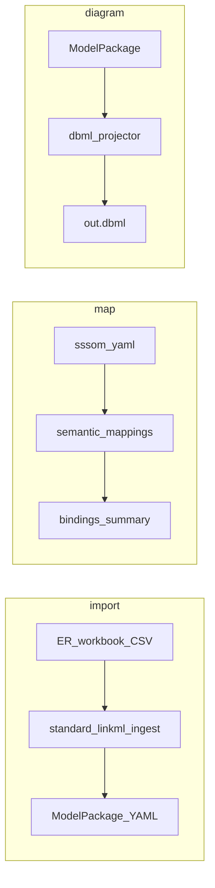

# moex-data-model: Stage 2 CLI close-out

## Locked scope

Полный Stage 7 (`schema-automator` wizard, `linkml-map` / `MappingProvider` engine) **не входит**. ADR-008/009 остаются Proposed для следующего этапа.

| Команда | Сейчас | Цель этого инкремента |
|---------|--------|------------------------|
| `import` | stub exit 2 | Facade над [`moex_standard_linkml.ingest`](packages/standard-linkml/src/moex_standard_linkml/ingest/cli.py) (ER-dictionary → DAMS ModelPackage) |
| `map` | stub exit 2 | Load/summary SSSOM + extract LinkML bindings via [`moex-semantic-mappings`](packages/semantic-mappings/) — **не** `linkml-map` |
| `diagram` | `shutil.copy` metamodel golden | One-way DBML из **implementation** ModelPackage (`logical` / `physical`) |

Metamodel golden [`moex-dams-drawdb-colored.dbml`](generated/artifacts/moex-dams/0.1/moex-dams-drawdb-colored.dbml) **не трогаем** (Stage 6 / schema-level projection).



---

## 1. `moex-model diagram` — реальная проекция

**Где код:** новый модуль [`packages/specification-dams/src/moex_dams/projection/dbml.py`](packages/specification-dams/src/moex_dams/projection/dbml.py) + тонкий [`apps/cli/.../commands/diagram.py`](apps/cli/src/moex_model_cli/commands/diagram.py).

**Поведение:**

- Вход: implementation YAML через существующий [`SlicePaths`](apps/cli/src/moex_model_cli/bootstrap.py) (как `validate`/`publish`).
- `--profile logical` (default для полезного trading fixture) → `LogicalEntity` → `Table`, attributes → columns (`logical_type` → string note; `required` → `not null`).
- `--profile physical` → каждый `PhysicalObject` → `Table` (включая `topic`/`api` с `Note: 'object_kind=…'`); fields → columns (`native_type`, `required`).
- `--format` только `dbml` (другие форматы → exit 2 с сообщением).
- Cross-layer `mappings` с `field_mapping`: если оба конца попали в projected tables — эмитить `Ref:`.
- Писать sidecar manifest рядом с `.dbml`: `{content_digest, profile, source_path, generator: "moex-dams-dbml/0.1"}` (критерий Stage 2 «artifact has manifest» для нового output).
- Цвета headercolor по ADR-006 слоям: logical `#4285F4`, physical `#0F9D58`.

**Не в scope:** round-trip, drawDB embed, layout store, реген metamodel golden, compare-golden для DBML.

**Тесты:** unit на projector (мини-dict fixture) + CLI: `diagram --profile logical` на trading → файл содержит `Table TradingClient` и `clientId`; обновить [`test_diagram_and_import_stub`](apps/cli/tests/test_cli.py).

---

## 2. `moex-model import` — ER ingest facade

**Где код:** [`apps/cli/.../commands/import_.py`](apps/cli/src/moex_model_cli/commands/) (имя модуля не `import.py`) + вызов тех же функций, что `cmd_ingest` в ingest CLI (не subprocess).

**CLI surface:**

```text
moex-model import --workbook PATH --profile PATH --out DIR
                  [--schema PATH] [--name NAME] [--skip-validate] [--root PATH]
```

- `--schema` default = DAMS schema из `SlicePaths` / envelope (как сейчас у других команд).
- Exit codes: 0 success; 1 validation/mapping failure; 2 usage/missing args.
- Help явно: «ER-dictionary → ModelPackage draft; schema-automator = Stage 7 (ADR-009)».

**Тесты:** прогон на [`packages/standard-linkml/tests/fixtures/er-dictionary/`](packages/standard-linkml/tests/fixtures/er-dictionary/) → `--out` tmp → package YAML существует; stub-тест на «not implemented» удалить.

**Deps:** `moex-standard-linkml` уже в CLI; убедиться, что ingest extras (если нужны для xlsx) не ломают CSV path.

---

## 3. `moex-model map` — SSSOM / LinkML extract

**Где код:** [`apps/cli/.../commands/map_cmd.py`](apps/cli/src/moex_model_cli/commands/) + dep `moex-semantic-mappings` в [`apps/cli/pyproject.toml`](apps/cli/pyproject.toml).

**CLI surface (взаимоисключающие режимы):**

```text
moex-model map --sssom PATH [--json]
moex-model map --extract-schema PATH [--json]
```

- `--sssom`: `load_sssom_yaml` → summary (set id, binding count) или JSON dump bindings; parse error → exit 1.
- `--extract-schema`: `extract_linkml_bindings` → count/list; empty OK exit 0.
- Без флага → exit 2 + usage (не silent stub).
- Help: «SSSOM / LinkML mapping extract; linkml-map engine = Stage 7 (ADR-008)».

**Тесты:** `--sssom` на [`model-assets/transformations/mappings/dams-fibo.sssom.yaml`](model-assets/transformations/mappings/dams-fibo.sssom.yaml); `--extract-schema` на mini fixture из semantic-mappings tests (скопировать path или использовать существующий test schema).

---

## 4. Wiring + docs

- [`__main__.py`](apps/cli/src/moex_model_cli/__main__.py): заменить stubs на реальные parsers/handlers; удалить использование `run_not_implemented` для import/map (оставить модуль stubs только если больше нигде не нужен — иначе удалить).
- [`docs/IMPLEMENTATION_PLAN.md`](docs/IMPLEMENTATION_PLAN.md) Stage 2 Progress: 9/9 CLI surface closed (thin); Stage 7 still owns automator + linkml-map.
- CLI README / cheatlist: примеры трёх команд.
- Не расширять GHA отдельным job — покрывается существующим `make check` → CLI pytest.

---

## Verification

```text
make check   # или apps/cli pytest
moex-model diagram --root . --profile logical --out /tmp/t.dbml
moex-model import --workbook packages/standard-linkml/tests/fixtures/er-dictionary \
  --profile …/profile.yaml --out /tmp/ingest --schema model-assets/.../moex-dams.yaml
moex-model map --sssom model-assets/transformations/mappings/dams-fibo.sssom.yaml
```

## Explicitly out

- `schema-automator`, JSON Schema/SQL/RDF import wizard
- `linkml-map` ObjectTransformer / migration mappings
- DBML → ModelPatch round-trip (Stage 5)
- Golden compare for metamodel DBML / OWL/SHACL matrix (Stage 6)
- API job kinds для import/map/diagram (можно follow-up; CLI-only в этом плане)
