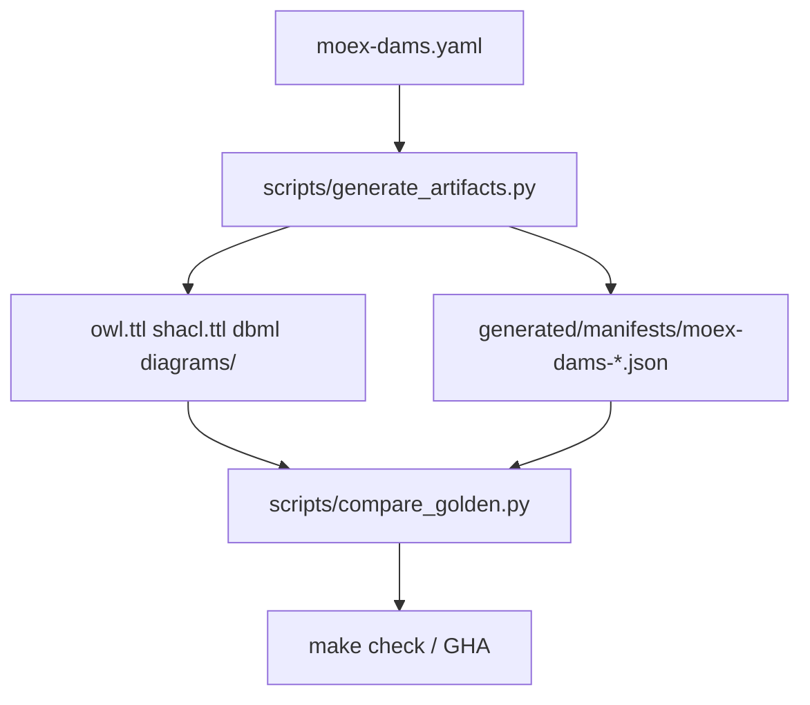

# moex-data-model: Stage 6 golden matrix (OWL/SHACL/DBML/Mermaid)

I'm using the writing-plans skill to create the implementation plan.

**Goal:** Сделать OWL, SHACL, DBML и Mermaid воспроизводимыми артефактами DAMS 0.1 с manifests и проверкой в `make compare-golden` / GHA `check` (как уже для contracts + JSON Schema).

**Architecture:** Один скрипт генерации LinkML-артефактов пишет файлы + manifests; `compare_golden.py` регенерирует во temp и сравнивает digests/байты. CI не меняет состав job'ов — расширяется существующий `compare-golden` внутри `make check`.

**Tech Stack:** pinned `linkml==1.11.1` ([requirements-linkml.txt](requirements-linkml.txt)), `OwlSchemaGenerator`, `ShaclGenerator`, `DBMLGenerator`, `MermaidClassDiagramGenerator`, `rdflib` (уже в pin).

## Global Constraints

- Schema source: [`model-assets/specifications/moex-dams/0.1/schemas/moex-dams.yaml`](model-assets/specifications/moex-dams/0.1/schemas/moex-dams.yaml) (+ imports).
- Toolchain pin: `requirements-linkml.txt`; bump = regenerate all goldens + digests in one PR (ADR-011).
- `generated/` не править вручную после подключения regen.
- Colored drawDB sample [`moex-dams-drawdb-colored.dbml`](generated/artifacts/moex-dams/0.1/moex-dams-drawdb-colored.dbml) **не** в compare-golden (hand-curated; `gen-dbml` не даёт headercolor).
- Solution-level DBML (`moex_dams.projection.dbml` / CLI `diagram`) — вне этого инкремента.
- Out of scope: gen-python, gen-doc bundle, gen-rdf as separate artifact, drawDB import check, API release bundle, publish gate on generators.

## Locked decisions

| Topic | Choice |
|-------|--------|
| OWL | `OwlSchemaGenerator(schema, format="ttl", skip_vacuous_min_zero_cardinality_axioms=True, skip_vacuous_local_range_axioms=True, consolidate_cardinality_axioms=True)` → `generated/artifacts/moex-dams/0.1/moex-dams.owl.ttl` |
| SHACL | `ShaclGenerator(schema)` default options → `…/moex-dams.shacl.ttl` |
| DBML | Fix `FormalCheck.check_id` → `identifier: true`; `DBMLGenerator` → **new** `…/moex-dams.dbml` (not colored) |
| Mermaid | `MermaidClassDiagramGenerator(...).generate_class_diagrams()` → `…/diagrams/*.md` (replace committed set) |
| Import resolution | Run generators with `cwd` = schema directory (same trap as DBML probe) |
| Compare | Per-artifact manifest + regen byte/digest compare; LF normalize |
| Smoke | rdflib parse OWL+SHACL; mermaid files contain ` ```mermaid `; DBML contains `Table ` |
| CLI | Extend `compile --json-schema` path to `--artifacts` / `--all` calling the same script |



## Key files

| Action | Path |
|--------|------|
| Create | [`scripts/generate_artifacts.py`](scripts/generate_artifacts.py), [`scripts/generate-artifacts.ps1`](scripts/generate-artifacts.ps1) |
| Modify | [`scripts/compare_golden.py`](scripts/compare_golden.py), [`Makefile`](Makefile), [`apps/cli/.../compile.py`](apps/cli/src/moex_model_cli/commands/compile.py), [`model-assets/.../moex-requirements.yaml`](model-assets/specifications/moex-dams/0.1/schemas/moex-requirements.yaml) |
| Regenerate | `generated/artifacts/moex-dams/0.1/{moex-dams.owl.ttl,moex-dams.shacl.ttl,moex-dams.dbml,diagrams/*.md}` + new manifests |
| Docs | [`docs/IMPLEMENTATION_PLAN.md`](docs/IMPLEMENTATION_PLAN.md) Stage 6 progress; one line in [`docs/adr/ADR-011-reproducible-artifacts.md`](docs/adr/ADR-011-reproducible-artifacts.md); README `make check` note |

---

### Task 1: Schema unblock for gen-dbml

**Files:** Modify [`moex-requirements.yaml`](model-assets/specifications/moex-dams/0.1/schemas/moex-requirements.yaml) — on slot `check_id` set `identifier: true` (FormalCheck currently has no identifier; `DBMLGenerator` raises `Referenced class 'FormalCheck' does not have an identifier slot`).

- [ ] Add identifier; run existing `make validate-schemas` / examples to confirm no break.
- [ ] Commit schema fix separately or with generator PR.

---

### Task 2: `generate_artifacts.py`

**Files:** Create `scripts/generate_artifacts.py` (+ thin `generate-artifacts.ps1` mirroring `generate-contracts.ps1`: install `requirements-linkml.txt`, `PYTHONUTF8=1`, call Python).

Responsibilities:
1. Resolve schema path; `os.chdir(schema.parent)` for import load.
2. Emit four targets with shared helper `write_artifact(path, text) -> digest`.
3. Write manifests under `generated/manifests/`:
   - `moex-dams-owl.json`
   - `moex-dams-shacl.json`
   - `moex-dams-dbml.json`
   - `moex-dams-mermaid.json` (digest = sha256 of sorted `path\0content` over all `diagrams/*.md`, or tree digest)

Manifest shape (align with contracts):

```json
{
  "artifact_id": "moex:artifact:dams-owl:0.1",
  "generator": "gen-owl",
  "generator_module": "linkml.generators.owlgen",
  "generator_version": "<linkml>",
  "schema_path": "model-assets/specifications/moex-dams/0.1/schemas/moex-dams.yaml",
  "schema_digest": "sha256:…",
  "output_path": "generated/artifacts/moex-dams/0.1/moex-dams.owl.ttl",
  "content_digest": "sha256:…",
  "generator_options": { "format": "ttl", "skip_vacuous_min_zero_cardinality_axioms": true, "…": true },
  "generated_at": "<iso>"
}
```

CLI flags: `--only owl|shacl|dbml|mermaid` (repeatable) and default = all four.

Makefile: `generate-artifacts` phony target.

---

### Task 3: Baseline refresh

- [ ] Run `python scripts/generate_artifacts.py` once; commit replaced OWL/SHACL, new `moex-dams.dbml`, refreshed `diagrams/*.md`, four manifests.
- [ ] Expect OWL/SHACL digests to differ from legacy committed files (LinkML 1.11.1 + pinned owl options) — that is intentional.
- [ ] Leave `moex-dams-drawdb-colored.dbml` untouched; add one-line comment in artifact README or IMPLEMENTATION_PLAN: colored = curated sample, golden = `moex-dams.dbml`.

---

### Task 4: Extend `compare_golden.py`

Reuse existing contracts + JSON Schema checks; add:

1. For each single-file artifact (owl/shacl/dbml): load manifest → hash committed file → regenerate to temp via same functions as generate script (import shared helpers from `generate_artifacts`, do not duplicate generator kwargs) → compare digests/bytes (LF-normalize text).
2. Mermaid: regenerate to temp dir → compute tree digest → compare to manifest.
3. Smoke (fail compare if smoke fails):
   - `rdflib.Graph().parse(owl_path, format="turtle")`
   - same for SHACL
   - assert `b"Table "` in dbml bytes
   - every mermaid `.md` contains fence `mermaid`

Success line e.g. `compare-golden OK (contracts, json-schema, owl, shacl, dbml, mermaid)`.

No new GHA job — [`check.yml`](.github/workflows/check.yml) already runs `make check` → `compare-golden`.

---

### Task 5: CLI `compile` wiring

In [`compile.py`](apps/cli/src/moex_model_cli/commands/compile.py): add `--artifacts` (and keep `--json-schema`). When set, subprocess/call `generate_artifacts.py` after contracts. Wire flag in [`__main__.py`](apps/cli/src/moex_model_cli/__main__.py). Extend one CLI test asserting exit 0 with `--artifacts` on clean checkout (or unit-test generate helpers only if full regen is too heavy — prefer one integration smoke in `apps/cli/tests`).

---

### Task 6: Docs

- IMPLEMENTATION_PLAN Stage 6: progress note — OWL/SHACL/DBML(`moex-dams.dbml`)/Mermaid in compare-golden; colored DBML and gen-python/gen-doc/RDF/bundle still open.
- ADR-011: update current-slice sentence to list the four new goldens.
- Root README / cheatlist: `make generate-artifacts` + mention colored vs regenerable DBML.

---

## Verification

```text
make generate-artifacts
make compare-golden
make check
# intentional fail: tweak moex-dams.owl.ttl → compare-golden exits 1
```

## Self-review vs Stage 6 criteria

| Criterion | This plan |
|-----------|-----------|
| OWL/SHACL/DBML/Mermaid in golden/CI | Yes |
| JSON Schema metaschema / Python compile / SHACL fixtures / drawDB import | No (deferred) |
| Pipeline via CLI | Yes (`compile --artifacts`) |
| Unified release bundle / block publish | No (deferred) |
