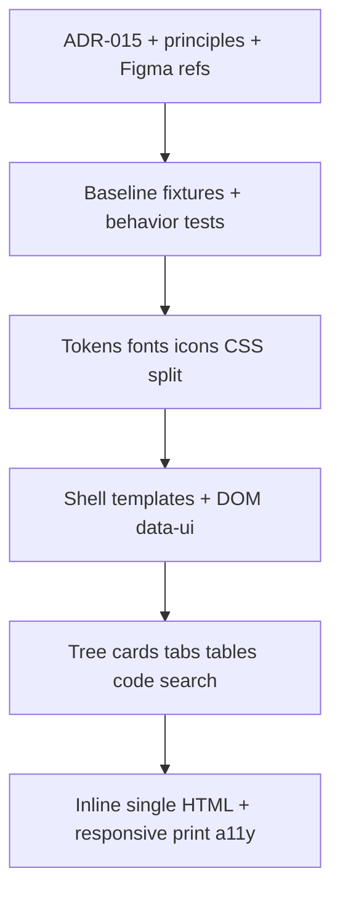

# moex-data-model: Viewer Atlas redesign

## Цель

1. **Документы:** ADR по UI выходного артефакта, принципы формирования интерфейса, скриншоты/выжимка Figma-референса.
2. **Код:** визуальный редизайн Viewer («MOEX Atlas») — максимально близко по графике к [ERP B2B Design Kit](https://www.figma.com/community/file/1220373386573896297/erp-b2b-design-kit) (поверхности, плотность, sidebar/table/card), с брендом и IA из вашего стандарта (MOEX Red, дерево → объект, не Shop Floor).

Не меняются: `publish.yaml`, publication model, modeling kernel, DAMS/FIBO semantics. Меняется только presentation layer.

## Визуальный контракт (зафиксированное решение)

| Из Figma-кита берём | Из ADR оставляем |
|---|---|
| Светлый app-bg, белые панели, тонкие borders | MOEX Red `#d71920` как brand/focus (не синий Figma) |
| Sidebar + sticky topbar + content cards | Каркас Overview / Class / FIBO / File / Search |
| Плотные tree-rows, KPI-strip на overview | Прогрессивное раскрытие tabs |
| Чистые таблицы со sticky header | Единый shell без DAMS/FIBO conditionals |
| Минимальные тени только у float UI | Встроенные шрифты/иконки, без CDN |

Текущий акцент `--accent: #1f6feb` в [`apps/viewer/static/viewer.css`](apps/viewer/static/viewer.css) заменяется токенами Atlas.

## Текущее состояние (якоря)

- Shell: один [`apps/viewer/templates/base.html.j2`](apps/viewer/templates/base.html.j2) — sidebar + inline search + текстовые toolbar-кнопки.
- Стили/JS: монолиты [`viewer.css`](apps/viewer/static/viewer.css), [`viewer.js`](apps/viewer/static/viewer.js) (~2.5k строк).
- Сборка: [`build.py`](apps/viewer/src/moex_publication_viewer/build.py) пишет `index.html` **и копирует** `viewer.css` / `viewer.js` рядом — ещё не один автономный HTML.
- Архитектурные решения UI сегодня: [`docs/architecture/viewer-decisions.md`](docs/architecture/viewer-decisions.md); индекс ADR: [`docs/adr/README.md`](docs/adr/README.md).

## Phase 0 — Дизайн-артефакты (без кода UI)

Создать:

1. **[`docs/adr/ADR-015-viewer-ui-atlas.md`](docs/adr/ADR-015-viewer-ui-atlas.md)** — Proposed 0.1, содержание вашего стандарта (цель, constraints, MOEX Atlas, shell, IA, mocks, tokens, components, DOM-контракт, JS modules, DoD, запреты). Сократить дублирующиеся длинные CSS-блоки до нормативных токенов + ссылки на исходники CSS после внедрения.
2. **[`docs/design/viewer-atlas/README.md`](docs/design/viewer-atlas/README.md)** — принципы формирования:
   - объект раньше источника;
   - progressive disclosure;
   - единый shell;
   - технические ID не доминируют;
   - keyboard first;
   - responsive через перестройку;
   - графический маппинг Figma → Atlas (таблица выше).
3. **[`docs/design/viewer-atlas/reference/`](docs/design/viewer-atlas/reference/)** — 3–6 скриншотов community-превью Figma + короткие captions (hero devices, preview grid, sidebar/table density). Источник: community page (без логина в editable file).
4. Обновить [`docs/adr/README.md`](docs/adr/README.md) (строка ADR-015) и [`docs/architecture/viewer-decisions.md`](docs/architecture/viewer-decisions.md) (ссылка: UI presentation → ADR-015; инварианты pipeline остаются).

## Phase 1 — Baseline

- Собрать текущий Viewer (`make viewer`), сохранить fixture HTML/CSS/JS snapshot под `apps/viewer/tests/fixtures/ui-baseline/` (не править вручную).
- Зафиксировать smoke: Overview / Class / Slot / Enum / Schema / FIBO term / Search / Theme / Deep link / Expand-Collapse (расширить [`apps/viewer/tests/test_build.py`](apps/viewer/tests/test_build.py) и при необходимости лёгкие DOM asserts).
- Publication manifests не трогать.

## Phase 2 — Токены, шрифты, иконки

Разбить CSS по ADR §15 (под [`apps/viewer/static/css/`](apps/viewer/static/css/)):

- `10-tokens.css` — light/dark Atlas tokens из ADR §8 (замена текущих `--accent` blue).
- `20-base` … `80-print` по слоям.
- Встроить **Inter Variable** (как `MOEX UI`) и **JetBrains Mono** 400/500 как WOFF2 data URI на этапе сборки.
- Lucide SVG icons → статика/инлайн при build; без base64 PNG и CDN.

Hardcoded colors/spacing в component CSS запрещены после этого этапа.

## Phase 3 — Shell и DOM-контракт

Разделить Jinja:

- `shell.html.j2`, `sidebar.html.j2`, `topbar.html.j2`, `content.html.j2`, `components/*`
- Стабильные `data-ui`, `data-tree-node`, `data-renderer`, ARIA из ADR §14
- Topbar: search trigger → palette; overflow `⋯`; theme; Expand как контекст
- Бренд-подпись: **MOEX Model Explorer** (вместо «Data Specification Player»)

Поведение данных (modules JSON, catalog, search index) без изменения контракта payload в [`html_renderer.py`](apps/viewer/src/moex_publication_viewer/renderers/html_renderer.py), кроме атрибутов разметки.

## Phase 4 — Компоненты и страницы

Реализовать macros/partials и клиентскую отрисовку под Atlas:

- Tree (chevron slot, type marks `C`/`F`, red active rail, keyboard Up/Down/Left/Right/Home/End)
- Content card, badges, definition list, tabs, data table shell, code viewer, copy field
- Макеты: Publication Overview (KPI strip + structure), Class card, FIBO term (middle-ellipsis IRI), Schema file Overview/Source
- Filter input для дерева активной публикации
- Sidebar resize 240–420 px (desktop)

JS разнести из монолита: `state`, `navigation`, `tree`, `search`, `theme`, `clipboard`, `tables`, `dialogs`, `accessibility` — bundling/concat при build.

## Phase 5 — Search, responsive, a11y, print

- Command palette `Ctrl/Cmd+K` и `/`; группы результатов; Escape возвращает focus
- Breakpoints 1199 / 899 / 599; drawer sidebar; touch 44px
- Focus trap, один `h1`, `aria-live`, `prefers-reduced-motion`
- Print: скрыть sidebar/topbar/dialog

## Phase 6 — Один автономный HTML + hardening

- Изменить [`build.py`](apps/viewer/src/moex_publication_viewer/build.py): CSS/JS/fonts/icons **инлайнятся** в `dist/index.html`; отдельные `viewer.css`/`viewer.js` в dist не требуются для runtime (опционально оставить dev-копию только для отладки — в финале не нужны).
- Тесты: нет обязательных внешних URL; один HTML; deep links; light/dark tokens; 375px не обрезает; print rules.
- Visual regression: desktop/tablet/mobile screenshots против baseline после редизайна (обновить golden UI после принятия Atlas).
- Graph renderer contract (ADR §13) — **отдельный follow-up PR** после стабилизации shell; в этом плане только зарезервировать `data-renderer` / unsupported-renderer fallback.

## Порядок PR (как в ADR §23, сжато)

1. `docs: ADR-015 Atlas + design principles + Figma reference`
2. `viewer: UI baseline fixtures and behavior tests`
3. `viewer: design tokens and embedded fonts`
4. `viewer: split shell templates and static sources`
5. `viewer: redesign sidebar tree and page cards`
6. `viewer: tables, code viewer, command palette`
7. `viewer: responsive drawer, print, a11y`
8. `viewer: inline single HTML artifact`

Каждый PR сохраняет `make viewer` / `make viewer-check`.

## Definition of Done

Совпадает с ADR §24: один автономный HTML; все публикации; shell без DAMS/FIBO branching; keyboard tree/search/tabs; light/dark; 375px; 76ch reading column; embedded fonts/icons; неизвестный renderer не валит Viewer; print читаем.
