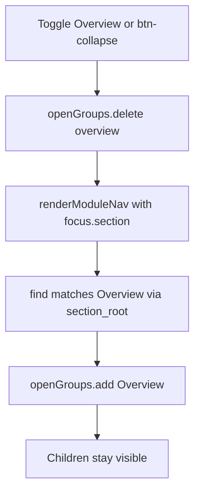

# moex-data-model: Viewer collapse Overview

Решения пользователя: owl-классы показываются в самом `edmc.fibo` (частично отменяет ADR-014); объём — ADR плюс реализация.

## Часть A. Overview не схлопывается (dams и все корни)

Подтверждено [DAMS overview collapse](8d37eeaf-cf95-4ef3-a1c3-86534d5fe4a1): причина только в JS-состоянии, CSS и `default_collapsed` ни при чём.

### Корневая причина

В [`apps/viewer/static/viewer.js`](apps/viewer/static/viewer.js) при каждом `renderModuleNav` блок ~496-509 делает:

```javascript
const overviewGroup = explorerItems.find(
  (g) =>
    g.attributes?.section_root === "overview" ||
    (g.children || []).some((c) => c.attributes?.section_id === focus.section)
);
if (overviewGroup) openGroups.add(overviewGroup.id);
```

`find` всегда матчит Overview первым (`section_root === "overview"`), поэтому при любом `focus.section` из nested ids (overview, classes, slots, enums, glossary) Overview снова попадает в `openGroups`. Chevron, второй клик по лейблу и toolbar `btn-collapse` сбрасывают состояние, а следующий рендер его возвращает. Асимметрия вторая: в `openExplorerItem` (~553-568) группа с `section_root === "overview"` ведёт себя как `section_ref`, а у остальных корней (Классы, Требования) такой ветки нет.



### Решение

1. Удалить per-render force-open Overview (блок ~496-509). Раскрытие предков делает только навигация: `openExplorerItem` для `section_ref` уже добавляет `found.group` и ancestors.
2. Сузить `openExplorerItem` до `attrs.kind === "section_ref"` (убрать `section_root === "overview"`). Клик по группе Overview идёт как у «Классы»: `section=explorer&item=group:overview`.
3. Данные: убрать `section_id` с Overview-группы в [`dams_explorer_roots.py`](apps/viewer/src/moex_publication_viewer/normalizers/dams_explorer_roots.py) и [`fibo_explorer_roots.py`](apps/viewer/src/moex_publication_viewer/normalizers/fibo_explorer_roots.py), оставить только на `_section_ref` детях. Поправить assert в `test_normalizers.py` и `test_dams_explorer_roots.py`.
4. Default-open `group:classes` (~690-697) не трогаем.

### Проверки

В [`test_atlas_polish.py`](apps/viewer/tests/test_atlas_polish.py) / [`test_build.py`](apps/viewer/tests/test_build.py) (стиль существующих статических контрактов JS):

- в `viewer.js` нет предиката `section_root === "overview" ||` в блоке авто-раскрытия;
- в `openExplorerItem` нет ветки `section_root === "overview"`;
- остаётся раскрытие родителя для `kind === "section_ref"`.

## Часть B. Сквозная сущность Class

### Что нашли ([FIBO OWL classes data trace](a2294996-6db0-4bc9-bab3-74fa2c7f59f2))

- `edmc.fibo` (`moex:module:fibo-profile`): в Taxonomy только узлы метамодели (`fibo_domain`, `fibo_module`, `ontology_document`, `iri_pattern`, ...), глоссарий из 5 строк `kind: concept`. OWL-классов нет; `group:classes` и `group:identity` пустые заглушки в [`fibo_explorer_roots.py`](apps/viewer/src/moex_publication_viewer/normalizers/fibo_explorer_roots.py). Заглушка ложно закрывает recommended `classes` через `SECTION_ROOT_TO_KIND`.
- Реальные классы: [`fibo_glossary.preview.csv`](packages/ontology/publications/fibo_glossary.preview.csv), 50 строк (`local_name`, `label`, `label_ru`, `definition`, `iri`, `parent_local_name`, `source_domain`), модуль `moex:module:fibo` без `profile:` и `kind:`. Каталог онтологий (12 сущностей, `kind: class`, `parents`/`children`) — параллельный preview из `mini_fibo`.
- Одно понятие названо по-разному: `class` (catalog, explorer-default), `concept` (profile glossary), taxonomy node, glossary term. Это и есть «разброд»: [ADR-016](docs/adr/ADR-016-publication-section-kinds-and-profiles.md) делает у ontology `taxonomy` обязательной, а `classes` рекомендованной.

### ADR-024: единая сущность Class

Новый [`docs/adr/ADR-024-unified-class-entity.md`](docs/adr/ADR-024-unified-class-entity.md) (следующий свободный номер после ADR-023). Решения:

- Одно имя `class` для LinkML `class` и `owl:Class`; различие только в renderer по профилю (`data-structure` или `ontology-list`), как уже в ADR-016.
- Glossary для ontology — плоское алфавитное представление тех же class-сущностей из того же источника, не отдельные данные. Профильные термины метамодели (`FiboDomain` и др.) в glossary не дублируются: они остаются в README и `metamodel/*.yaml`.
- Иерархия классов строится по `subClassOf`; группировка по `source_domain` (BE, DER, FBC, FND, SEC) внутри Классов. Мульти-наследование: один канонический id карточки, узел может повторяться в нескольких ветках. Импортированные (`owl:imports`) классы помечаются атрибутом `origin`; в preview-данных все `own`.
- Анонимные классы и restrictions в дерево не попадают, только в карточку (вне объёма реализации сейчас).
- Метамодель FIBO больше не отдельная «taxonomy»: домены, модули, ontology documents — корень «Модули» (kind `schema-files`, аналог файлов LinkML и `owl:imports`); IRI/prefix/annotation — корень Identity (kind `identity`).
- Профиль `ontology`: required `overview`, `classes`, `glossary`; recommended `schema-files`, `identity`; forbidden `enumerations`, `slots`. Kind `taxonomy` остаётся в enum для совместимости, но помечен deprecated и не используется новыми модулями. Properties (object/data/annotation) фиксируются в ADR как следующий этап: данных в preview нет.
- ADR-014 получает пометку, что Spec-модуль показывает класс-индекс из release-данных (частичная отмена), метамодель остаётся нормативной. ADR-016 получает обновлённую таблицу профилей.

### Реализация

1. `ProfileSpec` и `SECTION_ROOT_TO_KIND` в [`publication_profiles.py`](apps/viewer/src/moex_publication_viewer/publication_profiles.py) и enum/профили в `model-assets/specifications/moex-dsp/0.1/schemas/moex-dsp.yaml`, [`manifest_models.py`](apps/viewer/src/moex_publication_viewer/models/manifest_models.py) под новые required/recommended/forbidden; правило [`.cursor/rules/publication-section-profiles.mdc`](.cursor/rules/publication-section-profiles.mdc) обновить под ADR-024.
2. [`publish.yaml`](model-assets/specifications/moex-fibo-profile/0.1/publish.yaml) `edmc.fibo`: explorer получает `kind: classes`; glossary-секция берёт `source.path` на общий `../../../../packages/ontology/publications/fibo_glossary.preview.csv` (один источник и для дерева, и для плоского списка), `kind: glossary`. Файл `publications/fibo_profile_glossary.json` удаляется.
3. [`fibo_explorer_roots.py`](apps/viewer/src/moex_publication_viewer/normalizers/fibo_explorer_roots.py): корни Overview, Классы (наполняется на сборке), Модули (группа доменов из JSON метамодели, `section_root: schema-files`), Identity (группы IRI/prefix/annotation, `section_root: identity`), Glossary (`section_ref`), Реализации. Пустых заглушек не остаётся.
4. [`build.py`](apps/viewer/src/moex_publication_viewer/build.py): новая `enrich_fibo_explorer_classes(modules)` по образцу `enrich_fibo_explorer_implementations`. Берёт нормализованные строки glossary-секции, строит дерево через существующий `items_to_domain_explorer` (иерархия по `parent_local_name`, группы по `source_domain`), проставляет `kind: class` и кладёт в `group:classes`. Карточки открываются существующим `renderOntologyExplorerDetail` (определяется по атрибуту `iri`).
5. Модуль `moex:module:fibo` (FIBO Glossary) не меняется: остаётся release-preview представлением того же CSV; его выравнивание под профиль вне объёма.

### Проверки

- [`test_normalizers.py`](apps/viewer/tests/test_normalizers.py): корни FIBO — overview, classes, schema-files, identity, glossary, implementations; ни одного пустого корня, кроме implementations до enrich.
- Инвариант «одни данные, два представления»: множество id класс-узлов в `group:classes` совпадает с множеством id строк glossary (50 строк), у каждого есть `iri`.
- Контрактный тест: все модули репозитория с `profile: ontology` не имеют missing required kinds (регрессия, чтобы заглушка снова не маскировала отсутствие `classes`); мягкие warning в сборке по ADR-016 п.7 не меняются.
- [`test_publication_profiles.py`](apps/viewer/tests/test_publication_profiles.py) и [`test_seamless_impl_nav.py`](apps/viewer/tests/test_seamless_impl_nav.py): новые required/forbidden для ontology, корни FIBO.
- Прогон: точечный pytest по `apps/viewer/tests` и `make check` для связанных пакетов.

## Вне объёма

- Properties, restrictions в карточке, ленивая отрисовка тысяч классов, реализация `ontology-list` в `viewer.js` (ADR фиксирует направление, данных и потребности в preview пока нет).
- Слияние `moex:module:fibo` и `moex:module:ontology-catalog` с `edmc.fibo`.
- Структура Overview children в DAMS (All classes / slots / enums как `section_ref`).
