# moex-data-model: Solution models import

## Зафиксированные решения

- Режим данных A: в модель попадают только target-строки, то есть строки с заполненными `ObjectCode` и `AttributeCode`. Режим B (src-only в physical) это roadmap. Хук закладываем сейчас: строки `src_only` хранятся в промежуточной модели, а переключатель `src_only: ignore | physical` лежит в профиле (в v1 значение `ignore`).
- Physical строится только по target-строкам: `SrcObjectCode` даёт `PhysicalObject`, `SrcAttributeCode` и `SrcDataType` дают `PhysicalField`, плюс mappings.
- Канон хранится в YAML: `model-assets/implementations/solutions/{mdm,ucd,crm,esed}/`. Конвертер нужен для bootstrap и повторного импорта. Он никогда не перезаписывает существующие файлы без `--force`.
- Исходные xlsx и png в git не попадают. Конвертер принимает путь `--xlsx`. В репозиторий идут YAML решений и маленькие тестовые fixtures.
- Slug и `solution_ref`: mdm - `eam:solution/MDM`, ucd - `eam:solution/UCD`, crm - `eam:solution/CRM`, esed - `eam:solution/ESED`.

## Архитектура

Слои (зависимости только внутрь, ADR-004):

```mermaid
flowchart LR
  xlsx[xlsx_external] --> reader[source_reader]
  profile[solution_xlsx_profile] --> reader
  reader --> ir[SolutionIR_with_SourceRef]
  ir --> rules[rule_registry_SXI]
  rules --> diag[Diagnostics]
  ir --> tables[WorkbookTables_in_memory]
  tables --> mapper[existing_map_er_dictionary]
  mapper --> enrich[enrich_profile_defaults]
  enrich --> writer[yaml_writer_safe]
  writer --> yamls[solution_yaml_in_git]
  yamls --> assess[moex_dams_assess_in_apps_cli]
  assess --> trace[trace_map_to_xlsx_cells]
  trace --> report[import_report_md_json]
  diag --> report
```

- Пакет конвертера: `packages/standard-linkml/src/moex_standard_linkml/solution_xlsx/`. Он переиспользует `ingest.ids`, `ingest.envelope`, `ingest.validate`, `ingest.mapper`. В нём нет ни одного импорта из `moex_dams`: `specification-dams` зависит от `standard-linkml`, и обратная связь создала бы цикл.
- Оркестрация находится в `apps/cli`, это composition root: команда `import-solution` в `apps/cli/src/moex_model_cli/commands/import_solution.py`. Порядок шагов: convert, LinkML validate, `moex_dams.assess_implementation`, `moex_publication export-slice`, отчёт. Обёртка для PowerShell: `scripts/import-solution-xlsx.ps1`.
- Архитектурный fitness-тест `tests/architecture/test_import_boundaries.py` проверяет, что `moex_standard_linkml` не импортирует `moex_dams`.

### Модули `solution_xlsx/`

- `profile.py` - pydantic-модель `SolutionXlsxProfile`:
  - листы и колонки (заголовок ищется по названиям колонок, а не по жёсткой шестой строке);
  - раздел `systems:` с настройками каждой системы: slug, `solution_ref`, `system_ref`, `object_kind`, `technology`, `direction`, шаблон `native_schema_ref`, свой `type_map`;
  - значения по умолчанию для обязательных слотов it-solution (`data_owner_ref`, `governance_classification`, `business_key_kind` и др.);
  - переопределение severity правил и переключатель `src_only`.
- `source.py` - чтение xlsx, на выходе строки с `SourceRef(sheet, row, column)`.
- `normalize.py` - нормализация кодов: trim, замена `\xa0`, ключ сопоставления через casefold. Каноническое имя берётся с листа `Object`, если совпадение найдено. Иначе используется написание из `ObjectAttribute`.
- `ir.py` - нейтральная модель `SolutionIR`: объекты, атрибуты, FK, физические привязки, `src_only`, `BaseSrc*` (первичные источники).
- `diagnostics.py` - `Diagnostic(code, severity, message_ru, remediation, source_ref, element_ref)`.
- `rules/` - реестр правил `SXI-*` (список ниже).
- `build.py` - IR в `WorkbookTables` в памяти, вызов `map_er_dictionary`, затем `enrich.py`:
  - relationships по FK;
  - `mapping_coverage_status`;
  - `entity_physical` mapping на пару (сущность, физический объект);
  - `field_mapping` на каждую target-строку, в описание кладутся данные `BaseSrc*`;
  - слоты it-solution из профиля.
- `envelope.py` - `implementation.yaml` в форме trading-platform: `implementation_profile: dams-data-model`, `dams_model_level: solution`, `implementation_body`, `specification_envelope`. Вместо пути `file:///F:/...` записываются имя файла и sha256. Для этого в `ingest/envelope.py` добавляется необязательный параметр `source_label` (минимальная правка).
- `trace.py` - карта `element_id` в `SourceRef`. Через неё диагностики assess получают привязку к ячейке xlsx.
- `report.py` - вывод в консоль, `import-report.md` и `import-report.json`.
- `writer.py` - безопасная запись: если файл существует и нет `--force`, результат пишется в каталог отчёта (код SXI-IO-001, exit 3). В начало файла добавляется комментарий «bootstrap-generated, edit freely».
- `scaffold.py` - `publish.yaml` из шаблона, создаётся только если файла нет.

### Реестр проверок входа (SXI-*)

Все правила выдают русский комментарий, remediation и привязку к листу, строке и колонке.

- SRC: SXI-SRC-001 нет листа или обязательной колонки (error). SXI-SRC-002 пустой или неизвестный `SrcSystem` (error). SXI-SRC-010 пропущено src-only строк с разбивкой по системам (info, задел под режим B). SXI-SRC-011 листы `1`, `2` и `Блок api` вне v1 (info).
- OBJ: SXI-OBJ-001 `ObjectCode` есть в `ObjectAttribute`, но нет в `Object` (warning). SXI-OBJ-002 пустая строка в `Object` (ЕСЭД), объект синтезируется (warning). SXI-OBJ-003 совпадение только без учёта регистра (warning).
- ATTR: SXI-ATTR-001 пробелы или `\xa0` в коде, нормализовано (warning). SXI-ATTR-002 дубликат атрибута (error). SXI-ATTR-003 нет `DataType` (warning, тип `string`). SXI-ATTR-004 тип отсутствует в `type_map` (warning, тип `string`). SXI-ATTR-005 нет `SrcAttributeCode`, physical field не создаётся (warning).
- KEY: SXI-KEY-001 у объекта нет PK, и он не является связующим (warning). Для PK и FK задаётся `business_key_kind` и `key_attribute_refs`.
- FK: SXI-FK-001 формат не `Object.Attribute` (error). SXI-FK-002 целевой объект не найден (error). SXI-FK-003 целевой атрибут не найден (error). SXI-FK-004 FK-колонка не существует в объекте (error).
- PHY: SXI-PHY-001 технология или `system_ref` взяты из профиля по умолчанию, нужно подтвердить (info).
- IO: SXI-IO-001 файл существует и записан не поверх (warning).

Режим `--strict` превращает warning в ошибки. Exit codes: 0 - ok, 1 - есть error, 2 - ошибка использования, 3 - запись не поверх.

### Требования DAMS (контур assess)

Правила it-solution (GEN, LDM, ATR, REF, PDM) повторно не реализуются. Источник один: `moex_dams.assess_implementation` и каталог `it-solution-requirements.yaml`. Диагностики assess попадают в тот же отчёт:
- для сущностей из xlsx - со ссылкой на ячейку через trace;
- для слотов из профиля - с пометкой «задано профилем по умолчанию, проверьте поле X в YAML».

Незаполненные данные не выдумываются. Реальные пробелы остаются видимыми в отчёте и в секции model-assessment viewer.

## Что нашли в реальных данных

- Target-строк всего 208: MDM 42, UCD 40, CRM 58, ЕСЭД 68. FK-связей 31. У всех target-строк есть `SrcAttributeCode`.
- Src-only строк около 869 (MDM 631, CRM 169, ЕСЭД 69). В v1 они только в отчёте.
- ЕСЭД: 12 объектов (`instance`, `document`, `file`, `file_binary`, `attorney_check_info`, `common_state`, `common_type`, `division`, `employee`, `organization`, `organization_employee`, `universal_item`).
- CRM: регистр кодов не совпадает с листом `Object`.
- UCD: опечатка `EMPOYEE`. Автоправка запрещена, после bootstrap правится вручную в YAML.
- ERD есть для MDM, CRM и ЕСЭД. Для UCD картинки нет.

## Файлы

Создать:
- `packages/standard-linkml/src/moex_standard_linkml/solution_xlsx/` (модули выше) и `rules/`;
- `packages/standard-linkml/templates/solution-xlsx.profile.yaml` (шаблон);
- `model-assets/implementations/solutions/solution-xlsx.profile.yaml` (рабочий профиль MOEX, четыре системы);
- `packages/standard-linkml/tests/test_solution_xlsx_*.py` и `tests/fixtures/solution-xlsx/` (урезанный xlsx со всеми дефектами: nbsp, регистр, пустой `Object`, битый FK, дубликат, неизвестный тип);
- `apps/cli/src/moex_model_cli/commands/import_solution.py` и тест рядом с остальными тестами CLI;
- `scripts/import-solution-xlsx.ps1`;
- `tests/architecture/test_import_boundaries.py`;
- `docs/adr/ADR-022-solution-xlsx-import.md` (архитектура конвертера, граница пакетов, политика перезаписи);
- `docs/dev/solution-xlsx-import.md` (запуск, профиль, коды SXI, как править после bootstrap);
- по каждому решению в `model-assets/implementations/solutions/{mdm,ucd,crm,esed}/`: `implementation.yaml`, `{slug}-solution-model.yaml`, `publish.yaml`, `publications/vertical_slice.json`.

Изменить минимально:
- `apps/cli/src/moex_model_cli/__main__.py` (подкоманда `import-solution`);
- `packages/standard-linkml/src/moex_standard_linkml/ingest/envelope.py` (параметр `source_label`);
- `packages/standard-linkml/README.md` (раздел про solution-xlsx);
- `.gitignore` (каталог отчётов `tmp/solution-import/`, если он ещё не игнорируется).

Файл `scripts/build-viewer.ps1` не меняется: он находит любой `publish.yaml` через `discover_manifest_paths`. Новые модули получают `profile: implementation`, `implementation_profile: dams-data-model`, `dams_model_level: solution`, секции по образцу trading-platform (package, conceptual, logical, physical, slice-summary, slice-nodes, slice-relations, model-assessment) и `satisfies` на требования DAMS. Модули: `moex:module:mdm-solution`, `moex:module:ucd-solution`, `moex:module:crm-solution`, `moex:module:esed-solution`, порядок 310, 320, 330, 340.

## Редактирование после bootstrap

- Править нужно `{slug}-solution-model.yaml`: сущности, атрибуты, title, description, governance. Структура плоская и совпадает с trading-platform.
- Повторный импорт без `--force` ничего не затирает. Для сравнения используется существующий semantic diff (`moex-model semantic-diff`).
- Если изменится формат листа, меняется только профиль.

## Порядок работ

1. Оформить ADR-022, профиль и `diagnostics` (контракт).
2. Написать `source`, `normalize`, `ir` и fixtures, TDD.
3. Реализовать реестр правил SXI-* с тестами на каждое правило.
4. Написать `build`, `enrich`, `envelope`, `writer`, `scaffold`. Тест: fixture даёт ModelPackage, проходящий `validate_model_package`.
5. Сделать `trace` и `report`, затем команду `import-solution` в `apps/cli` с вызовом assess и export-slice. Добавить PowerShell-обёртку и fitness-тест границ.
6. Запустить на реальном xlsx для четырёх систем. Просмотреть отчёты, вручную исправить опечатки и проверить технологии и `system_ref` в профиле.
7. Выполнить `scripts/build-viewer.ps1`, проверить четыре реализации в дереве и сверить сущности и атрибуты с ERD (MDM, CRM, ЕСЭД). У UCD сверка идёт по листу `Object`.
8. Обновить документацию и прогнать check-скрипты пакетов.

## Roadmap к режиму B

Переключатель `src_only: physical` в профиле. Src-only строки превращаются в `PhysicalField` с lineage из `BaseSrc*`, logical не создаётся, отчёт получает отдельный раздел. Рефакторинг не нужен: строки `src_only` уже хранятся в `SolutionIR`.