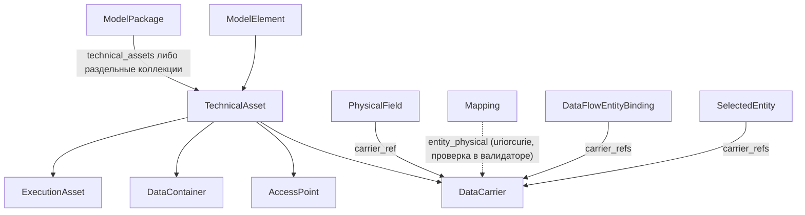

# moex-data-model: TechnicalAsset migration

## Оценка задумки

**Сильные стороны.** Разделение `PhysicalObject` на носитель, точку доступа, контейнер и исполнителя семантически верно: сейчас в один enum смешаны `column`, `database`, `endpoint`, `message`. Идентичность `namespace + qualified_name` по OpenLineage, правило «поля не кванты», идемпотентная миграция на ruamel.yaml, негативные фикстуры, отказ от хранения `realizes_refs` (источник истины `Mapping`), три отдельных enum по подклассам вместо `any_of`, сохранение `element_id`, отказ угадывать `interface_ref` и родительские контейнеры — всё разумно и остаётся в плане.

**Расхождения ТЗ с репозиторием (разведка).**
- Объём шире ТЗ. `PhysicalObject`/`object_kind`/`physical_objects` используют ещё: `apps/web` (`PhysicalForms.tsx`, `yamlMutate.ts`), `packages/drawdb-adapter`, `packages/standard-linkml` (XLSX-импорт: `ingest/mapper.py`, `workbook.py`, `solution_xlsx/*`), `packages/semantic-mappings` (SSSOM), `packages/ontology-catalog`, `apps/api/yaml_mutate.py`, `solution-xlsx.profile.yaml`; модели `mdm`, `crm`, `esed`, `ucd`, `moex-dams-full.yaml`, `draft-model.yaml`, `it-solution-model.example.yaml`. Делаем всё, но нарезаем на PR (см. ниже).
- `DataFlow` физические объекты НЕ ссылает. Ссылки только в `DataFlowEntityBinding.physical_object_refs` (`moex-integration.yaml`) и `SelectedEntity.physical_object_refs` (`moex-contract-binding.yaml`). `DataModelBinding`, `ModelSelection`, `SelectedAttribute` на физ. объекты не ссылаются (у `SelectedAttribute` только `physical_field_refs`). Негативный тест «DataFlow на DataContainer» переформулируем: `DataFlowEntityBinding`/`SelectedEntity` с `DataContainer` в списке носителей.
- Слоты. Глобальный слот `namespace` уже есть у `DomainContext` с другой семантикой. `slot_usage` меняет ограничения слота, но не его смысл: один URI `dams:namespace` с двумя значениями исказит OWL/SHACL/RDF и раздел «All slots» во viewer. Поэтому сразу вводим слот `asset_namespace` (без `slot_usage`-варианта). Тот же принцип для остальных слотов: переиспользуем существующий только при одинаковой семантике. Одинаковая семантика: `system_ref`, `qualified_name`, `technology`, `native_name` (имя в нативной системе), `direction` (`FlowDirectionEnum`); различия required/optional — через `slot_usage`. Иначе — новое имя.
- `HasLifecycle` уже на `ModelElement`, не дублируем. Справочника технологий нет: `technology` остаётся string, пометка в ADR. `HasClassification` как такового нет: берём `HasGovernanceClassification` (как у `PhysicalObject`).
- Потеря данных: у `PhysicalObject` обязательные `direction`, `native_schema_ref`, `mapping_coverage_status`, `mapping_rationale`, на них опираются FLW-001 (`flw001_soft_presence`) и PDM-001..004. Решение: `native_schema_ref` -> `structure_ref` (`HasStructure`); `direction` — опциональный слот на `TechnicalAsset`, значения ограничены правилом по классу (у `DataContainer` и `ExecutionAsset` запрещён; у `DataCarrier` допустимы `inbound|outbound|internal|bidirectional`; у `AccessPoint` — через `HasProtocolBinding`); `mapping_coverage_status`/`mapping_rationale` только на `DataCarrier`.
- `id_prefixes`: в схеме единый CURIE-префикс `dams:`, поэтому `id_prefixes: [dams]`; `element_id` (`dams:physical/...`) не переименовываем. Фиксируем в ADR-B как осознанное отклонение от «единого префикса актива».
- `entity_physical` описан в `MappingTypeEnum` как `PhysicalObject <-> LogicalEntity`: обновляем описание; `Mapping.source_refs/target_refs` остаются `uriorcurie`, типы концов проверяет DAMS-валидатор.
- `DataFlowEntityBinding` и `SelectedEntity` ссылаются только на `DataCarrier` (слоты переименовать в `carrier_refs`; `AccessPoint` данные не несёт и достижим через `serves_refs`). Потоки через Kafka моделируются как контейнер (`broker`/`cluster`) плюс носитель `stream_topic`, а транзитный `payload` — носитель `message_type` с пометкой transitional. Явный пример кладём в ADR-C.

## Целевая модель

## Главный риск и решение: форма коллекции в ModelPackage

Полиморфная `technical_assets` (`range: TechnicalAsset`, abstract) с дискриминатором `asset_class` (`designates_type: true`) проходит `linkml-validate`, но генераторы ведут себя хуже: Pydantic для поля с типом абстрактного родителя может валидировать только базовый класс (поля подклассов теряются или отклоняются); JSON Schema по умолчанию даёт схему базового класса (проверить флаг включения потомков range в используемой версии `gen-json-schema`).

Спайк в PR-1 (до фиксации формы, результат в черновик ADR-A):
- Прогнать сквозной цикл: YAML с четырьмя подклассами -> Pydantic (`moex_dams_contracts`) -> JSON Schema -> обратно; сравнить с исходником без потерь полей.
- Прогнать `unique_keys` в `linkml-validate` на подклассах абстрактного родителя.
- Критерий выбора: если хоть одно из (Pydantic round-trip, JSON Schema валидация полей подклассов) даёт потери или требует хаков, берём запасной вариант.
- Вариант A (основной, если спайк чистый): `ModelPackage.technical_assets` + `asset_class`.
- Вариант B (запасной): раздельные коллекции `data_carriers`, `access_points`, `data_containers`, `execution_assets`; единый реестр — вычисляемое представление в `ModelGraph`; `asset_class` не нужен; `unique_keys` по `(asset_namespace, qualified_name)` проверяется межколлекционно в DAMS-валидаторе. B заметно проще для генераторов.
Остальной план от выбора не зависит, кроме имени корневого слота и миграции (скрипт пишет в выбранную форму).

## Выбор механизмов проверки
- Основной механизм уникальности `(asset_namespace, qualified_name)`, отсутствия циклов `parent_ref`, допустимых `asset_kind` и типов концов `Mapping` — DAMS-валидатор (`packages/specification-dams`). `linkml-validate` с `unique_keys` и `rules` — дополнительный слой (JSON Schema и Pydantic `unique_keys` не выражают).
- Версионирование: удаление `PhysicalObject` — breaking change DAMS и `moex_dams_contracts`. Нужны запись в changelog, классификация изменений (удаление класса, переименование `physical_objects` -> новая коллекция, `physical_object_ref` -> `carrier_ref`) в semantic diff (`packages/specification-dams/.../application/diff.py`), решение по номеру версии в ADR-A (0.1 черновик, но фиксируем явно).

## Нарезка на PR

**PR-1: инвентаризация, аддитивный модуль, спайк, черновики ADR.** Мержится независимо, `PhysicalObject` остаётся.
- `chore: inventory of PhysicalObject usages`: `docs/migration/technical-asset-inventory.md` (файл, строка, тип; web/drawdb/XLSX/solutions/generated/tmp).
- `feat(dams): add moex-technical module`: новый `model-assets/specifications/moex-dams/0.1/schemas/moex-technical.yaml`, импорт в `moex-dams.yaml`; классы, миксины (`HasStructure`, `HasProtocolBinding`, `Contains`, `HasLocation`), три enum (`DataCarrierKindEnum`, `AccessPointKindEnum`, `DataContainerKindEnum`/`ExecutionAssetKindEnum` по подклассам), `rules`, `unique_keys`, `id_prefixes`, слот `asset_namespace`. Корневая коллекция в `ModelPackage` пока не подключается (или подключается рядом с `physical_objects`, если спайк это потребует).
- Спайк (см. выше) и его результат.
- `docs(adr): draft ADR-A/B/C (proposed)`: решения принимаются здесь, чтобы не разойтись с кодом; ADR-C включает пример Kafka (контейнер + топик + transitional payload) и граничное правило кванта.
- Проверка: `make validate-schemas`, `make architecture-check`.

**PR-2: переключение ссылок, миграция, конформанс (этапы 3-5 вместе). Примеры не красные.**
- Схемы: `moex-core.yaml` (удалить `PhysicalObject`, `PhysicalField.carrier_ref`, корневая коллекция вместо `physical_objects`), `moex-types.yaml` (удалить `PhysicalObjectKindEnum`, обновить `MappingTypeEnum`), `moex-integration.yaml`, `moex-contract-binding.yaml`.
- `scripts/migrate_physical_to_technical_asset.py` (ruamel.yaml, идемпотентный, порядок и комментарии сохраняются), тесты на мини-фикстурах. Таблица миграции значений — как в ТЗ (раздел 4). Пометка transitional: `annotations: {transitional: "true"}` в данных, проверяется валидатором.
- Namespace-эвристика (`<technology>://<system id>`, например `oracle://MDM`) применяется только для активов, помеченных transitional; отчёт содержит отдельный список таких активов для последующего уточнения. Правило (в ADR-B): изменение `asset_namespace` у transitional-актива не меняет `element_id` и не считается breaking; у не-transitional — считается.
- Родительские database/schema активы миграция не создаёт. Решение для XLSX-импорта (PR-3): импортёр создаёт `DataContainer` для schema/БД, если они есть в источнике; это фиксируется в ADR-C заранее.
- Отчёт миграции содержит проверяемые инварианты: множество `element_id` не изменилось (кроме явно перечисленных новых/удалённых); нет «висячих» ссылок после замены; число полей до и после совпадает; список ошибок `endpoint` без однозначного `api`.
- `integrity_digest` в `DataModelBinding`: пересчитывается только для fixtures и demo-данных (иначе нарушается неизменяемость ревизии). Для не-демо моделей миграция не пересчитывает дайджест, а выпускает новую ревизию с `compatibility_baseline_ref` на предыдущую. Правило фиксируется в ADR-A.
- Данные: `examples/**`, `requirements/examples`, mdm, crm, esed, ucd, `moex-dams-full.yaml`, `draft-model.yaml`.
- Конформанс: `packages/specification-dams` (`formal_checks.py`: `_iter_targets`, `DATA_CARRYING_KINDS` -> по классу и `asset_kind`, `applies_target_kinds`, `flw001_soft_presence`; `graph.py`, `dams_to_graph.py`, `element_index.py`, `dams_levels.py`, `catalog_validate.py`, `projection/dbml.py`, `mermaid_er.py`, `er_scene.py`, `diff.py`, `cascade.py`). Новые проверки: самоссылка и цикл `parent_ref`, уникальность ключа, допустимые `asset_kind`, ограничение `direction` по классу, типы концов `Mapping` (`entity_physical`, `field_mapping`), согласованность `PhysicalField.carrier_ref` с вложением. Требования в `it-solution-requirements.yaml`: PDM-001..004, FLW-001 сохраняют `code`, обновляются `target_class`/`statement`; добавляются новые `PDM-*`.
- Негативные фикстуры в `tests/`: цикл `parent_ref`; operation без `interface_ref`; `in_memory` с `location_uri`; `asset_kind` не из допустимых; `entity_physical` с неверными типами концов; `DataFlowEntityBinding` на `DataContainer`; дубликат ключа; `direction` у `DataContainer`.
- Проверка: `make validate-schemas`, `make validate-examples`, затем полный `make check` и `make architecture-check` (минимум для пакетов `specification-dams` и API/CLI, которые читают модели).

**PR-3: потребители и viewer.** `apps/web` (форма актива с выбором подкласса, `yamlMutate`), `packages/drawdb-adapter`, `packages/standard-linkml` (ingest/mapper, workbook, solution_xlsx, profile; создание `DataContainer`), `packages/semantic-mappings`, `packages/ontology-catalog`, `apps/api`, `apps/cli`; `packages/publication` и `apps/viewer` (группировка по подклассу, иерархия `parent_ref`); `make generate-contracts`, `make generate-artifacts`, ручной просмотр golden diff и его описание в PR, `compare-golden`, publish-gate. `generated/**` и `vertical_slice.json` только через генерацию.

**PR-4: ADR и документация.** Перевод ADR-A/B/C из proposed в accepted (нумерация после ADR-030, проверить фактически), README спецификации и standard-linkml, `docs/architecture/**`, `docs/architecture/uml/*.puml`, `docs/LinkML_Glossary_DAMS.md`, `docs/dams_entities_list.md`, changelog. Финальный grep-критерий в тесте/CI.

Ограничения неизменны: `modeling-kernel.yaml` и provider-специфичные классы не трогаем; `DataStructure`, `SchemaNode`, `Message`, `Operation` не вводим; новые зависимости не добавляем.

## Критерии приёмки
- Поиск `PhysicalObject|PhysicalObjectKindEnum|physical_objects` даёт совпадения только в миграционном скрипте, отчёте миграции, инвентаризации и ADR; проверяется тестом (исключения: `tmp/**`, `.cursor/plans`, нерегенерированные golden до PR-3).
- Повторный запуск миграции даёт пустой diff; mdm мигрирован без ручных правок; инварианты миграции зелёные.
- `make check`, `make architecture-check` зелёные; предупреждения LinkML lint не выросли.
- Для актива заданы `unique_keys` и `id_prefixes`; тест с дубликатом падает на DAMS-валидаторе.
- Спайк задокументирован в ADR-A, выбрана форма коллекции с обоснованием.
- Отчёт в PR: таблица «было -> стало», выбранные ranges и причины, оставшиеся transitional и список transitional-namespace, перечень негативных тестов, классификация breaking change в semantic diff.
