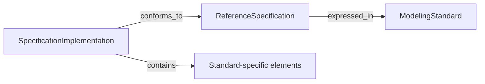
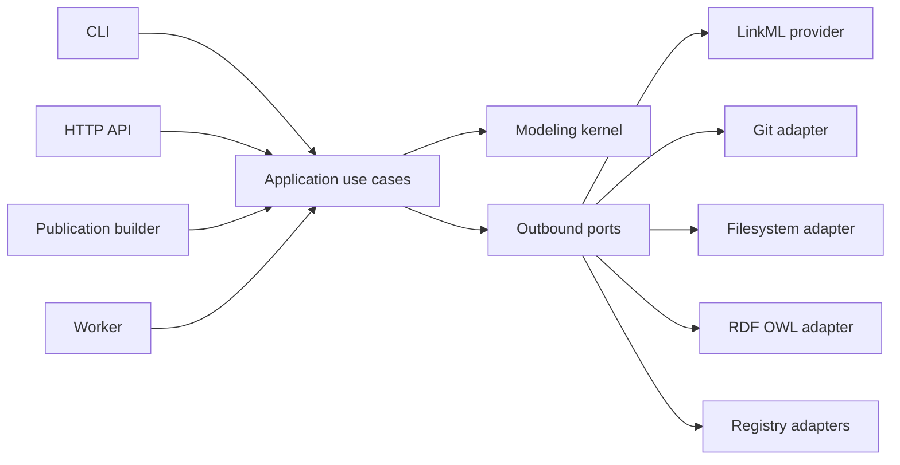
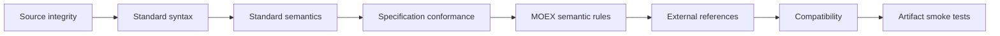

# MOEX Data Model: архитектурное ядро

**Назначение:** краткий нормативный обзор архитектуры MOEX Data Model  
**Подробности реализации:** выносятся в ADR, module contracts и схемы  
**Ревью при изменениях:** [CHECKLIST.md](CHECKLIST.md)  
**Машинная проверка:** `make architecture-check`

## 1. Архитектурная идея

MOEX Data Model — платформа управления формальными модельными активами. Её архитектура строится вокруг трёх разных сущностей:

1. **`ModelingStandard`** — язык или формализм, на котором можно определить модель: LinkML, OpenAPI, OWL, JSON Schema, SHACL.
2. **`ReferenceSpecification`** — нормативная спецификация или профиль, выраженный на определённом стандарте: MOEX DAMS, корпоративный OpenAPI Profile, ontology profile.
3. **`SpecificationImplementation`** — конкретное версионированное тело модели, соответствующее точной ревизии спецификации: модель решения, описание API, доменная онтология.



Это **моделирующее ядро** системы. CLI, API, validation pipeline, generators, graph views, publication viewer и Git workflow работают поверх него и не определяют его смысл.

## 2. Семантика трёх уровней

### ModelingStandard

`ModelingStandard` задаёт:

- семейство и версию формализма;
- immutable revision и content digest;
- нормативный URI и metamodel/dialect;
- semantic regime: open world, closed world или mixed;
- поддерживаемые capabilities;
- допустимые media types;
- совместимые processors.

Стандарт не является Python SDK. LinkML и `linkml-runtime`, OWL и RDFLib, OpenAPI и parser library — разные объекты. SDK регистрируется как processor, реализующий работу с версией стандарта.

### ReferenceSpecification

`ReferenceSpecification` задаёт:

- нормативные типы и ограничения предметной области;
- точную ревизию нормативного содержимого;
- primary modeling standard (включая pin на revision стандарта, когда требуется);
- root type;
- imports и profiles;
- conformance policy;
- обязательные rule sets.

Например, MOEX DAMS — **экземпляр** reference specification, выраженный на LinkML, а не subclass ядра.

Для MOEX DAMS 0.1:

- **spec root type** (`tree_root` схемы) — `MOEXModelRepository` ([model_src/schemas/moex-dams.yaml](../../model_src/schemas/moex-dams.yaml));
- **типичный implementation document** решения — `ModelPackage` (conceptual / logical / physical entities), вложенный в repository при полной проверке.

Vertical slice «trading-solution» работает с instance package; validate относительно полного среза идёт через repository wrapper.

### SpecificationImplementation

`SpecificationImplementation` задаёт:

- identity конкретной модели;
- собственную version и immutable revision;
- точную revision `ReferenceSpecification`;
- opaque `body_ref` на provider-owned typed body (не dict-универсал в ядре);
- provenance и content digest;
- lifecycle state.

Версия implementation не равна версии specification. Изменение нормативной DAMS-схемы не должно задним числом менять смысл опубликованной модели решения.

## 3. Роли не равны технологиям

Одна технология может встречаться в разных ролях:

```text
OpenAPI Specification 3.1       → ModelingStandard
MOEX API Profile 1.0            → ReferenceSpecification
order-service/openapi.yaml      → SpecificationImplementation
```

```text
OWL 2                           → ModelingStandard
MOEX/FIBO ontology profile      → ReferenceSpecification
Trading domain ontology        → SpecificationImplementation
```

```text
LinkML                          → ModelingStandard
MOEX DAMS 0.1                   → ReferenceSpecification
Trade Platform model 2.4       → SpecificationImplementation
```

Поэтому `LinkML`, `OpenAPI` и `OWL` нельзя моделировать только как enum вида спецификации, как тип файла или как subclass kernel-сущностей (`LinkMLStandard is_a ModelingStandard` запрещён).

## 4. Standard-specific object model

Общая модель (kernel) содержит только универсальные координаты:

- identity;
- version и revision;
- provenance;
- content digest;
- conformance references;
- diagnostics;
- lifecycle;
- opaque body reference.

Содержимое implementation остаётся типизированным по стандарту и живёт **только в provider schemas**, не в `modeling-kernel.yaml`:

| Standard | Body (provider) | Основные элементы | Характерное поведение |
|---|---|---|---|
| LinkML | `LinkMLImplementationBody` | schema, class, slot, type, enum, instance | imports, inheritance, induced slots, instance validation |
| OpenAPI | `OpenAPIImplementationBody` | document, path, operation, parameter, request, response, schema | `$ref`, HTTP semantics, API compatibility |
| OWL | `OWLImplementationBody` | ontology, class, property, individual, axiom | imports, open-world semantics, reasoning |

Запрещена универсальная модель `type + dict[str, Any]`. Она стирает семантику и позволяет применять операции одного стандарта к объектам другого.

Generated JSON Schema / SHACL / DBML без отдельного reference profile — это `GENERATED_FROM` артефакты, а не новые `SpecificationImplementation`.

## 5. Объекты и поведение

Pydantic-модели являются строгим immutable state:

```python
ConfigDict(
    extra="forbid",
    frozen=True,
    strict=True,
    validate_default=True,
)
```

I/O и standard-specific операции выполняют providers. Specification body (schema) и implementation body (instance) — **разные типы**:

```python
class StandardProvider(Protocol, Generic[TSpecBody, TImplBody, TElement]):
    family: StandardFamily

    def load_specification_body(...) -> TSpecBody: ...
    def load_implementation_body(...) -> TImplBody: ...
    def enumerate_elements(self, body: TImplBody) -> tuple[TElement, ...]: ...
    def validate_standard(self, body: TImplBody) -> tuple[Diagnostic, ...]: ...
```

Для LinkML/DAMS: `TSpecBody` — schema view / schema elements; `TImplBody` — instance (`ModelPackage` / repository wrapper). Один `TypeVar` на оба метода запрещён.

Specification-specific правила реализуются отдельно:

```python
class SpecificationConformanceChecker(Protocol, Generic[TSpecBody, TImplBody]):
    specification_id: SpecificationId

    def assess(
        self,
        specification: ReferenceSpecification,
        specification_body: TSpecBody,
        implementation: LoadedImplementation[TImplBody],
    ) -> tuple[Diagnostic, ...]: ...
```

Provider выбирается registry по standard identity/family. В application-коде не должно быть распределённых `if standard == "linkml"`.

Будущий fitness-тест: `tests/architecture/test_public_apis.py::test_standard_provider_has_distinct_body_types` (когда появится `packages/modeling-kernel`).

## 6. Hexagonal architecture



Outbound adapters **реализуют** ports; application вызывает ports. Adapters не вызывают domain напрямую.

### Domain

Содержит:

- root entities и value objects (координаты standard / specification / implementation);
- универсальные инварианты координат (§14);
- typed relations;
- mapping/projection semantics (контракт, не concrete generators);
- domain graph views (bounded).

Не знает о LinkML runtime, RDFLib, Git, filesystem, HTTP, Jinja или PostgreSQL.  
MOEX/DAMS semantic rules живут в `specification-dams`, не в kernel.

### Application

Содержит:

- commands, queries и results;
- use-case orchestration;
- ports;
- provider selection;
- conformance pipeline;
- transaction boundary, когда она реально появится.

Не знает о concrete SDK, HTML/RDF/SQL деталях или прямом чтении файлов.

### Inbound adapters

CLI, HTTP API, worker и static publication builder преобразуют transport DTO в commands/queries и вызывают application handlers. Они не владеют бизнес-правилами и не вызывают outbound adapters напрямую.

### Outbound adapters

Реализуют ports для LinkML, Git, filesystem, object storage, RDF/OWL и registry APIs. Adapter не владеет use-case workflow.

### Read models

Publication, search и API views являются производными проекциями. Они не изменяют domain state и могут перестраиваться из канонических активов.

### Bootstrap

Composition root создаёт registry, repositories, providers, handlers и configuration. Только bootstrap знает concrete implementations всех зависимостей.

## 7. Domain-модули

| Модуль | Владеет | Отвечает на вопрос |
|---|---|---|
| `standards` | standards, dialects, capabilities, processor compatibility | На каком формализме это выражено? |
| `specifications` | specifications, profiles, imports, conformance policy | Какой норме это должно соответствовать? |
| `implementations` | model envelopes, revisions, lifecycle, body refs | Какое конкретное тело модели создано? |
| `conformance` | assessments, reports, diagnostics, rule execution orchestration | Соответствует ли implementation спецификации? |
| `transformations` | mappings, projections, semantic loss, provenance | Как актив преобразован в другой формализм? |
| `universe` | registry graph и bounded views | Как активы связаны между собой? |

DAMS является specification-модулем, а LinkML — standard-provider-модулем. Это две разные границы.

## 8. ModelUniverse

`ModelUniverse` — реестр корневых активов и их типизированных связей:

```text
ModelUniverse
├── standards
├── specifications
├── implementations
└── relations
    ├── EXPRESSED_IN   # specification → standard
    ├── CONFORMS_TO    # implementation → specification
    ├── IMPORTS        # specification → specification
    ├── CONTAINS       # parent → nested asset / element identity
    ├── IMPLEMENTS     # implementation → external ITSolution / system
    ├── MAPS_TO
    ├── PROJECTS_TO
    └── GENERATED_FROM
```

`IMPLEMENTS` не синоним `CONFORMS_TO`: первое связывает модель с внешним решением/системой, второе — с нормативной спецификацией.

`ModelUniverse` не заменяет standard-specific object model. Для операций строятся bounded views:

- `DamsModelGraphView`;
- `OpenAPIOperationGraphView`;
- `OWLAxiomGraphView`;
- traceability view;
- conformance view;
- publication projection.

Таким образом, система имеет единое пространство identity и связей, но не сводит LinkML, OpenAPI и OWL к искусственно одинаковым nodes.

## 9. Conformance pipeline



Каждая стадия возвращает typed `Diagnostic` и может дать `ConformanceAssessment`. Весь запуск — immutable `ConformanceReport` (агрегат assessments).

Ожидаемая невалидность модели не является exception. Exceptions используются для отказа инфраструктуры или нарушения внутреннего контракта.

Диагностика имеет стабильные поля:

- `code`;
- `severity`;
- `phase`;
- `subject`;
- `source_location`;
- `message`;
- structured `diagnostic_details` (key/value).

## 10. Трансформации

Любой переход между формализмами описывается `StandardMapping`:

```text
source standard/specification
        ↓ mapping rules
transformation kind
        ↓
target standard/specification
```

Допустимые виды:

- `lossless`;
- `lossy`;
- `partial`;
- `derived`.

Mapping обязан указывать:

- preserved semantics;
- lost semantics;
- round-trip capability;
- authoritative source;
- transformation provenance.

JSON Schema, DBML, RDF/OWL и documentation artifacts не становятся каноническими только потому, что они сгенерированы из LinkML.

## 11. Источники истины

Разделяются три уровня истины:

1. **Git revision** — неизменяемая версия опубликованного model asset.
2. **Specification coordinates** — standard/specification/version/revision, определяющие смысл implementation.
3. **Authoritative representation** — файл или source bundle, из которого воспроизводятся derived artifacts.

PostgreSQL используется для operational state, drafts, jobs, search и audit. Object storage хранит generated artifacts. Ни одно из них не подменяет опубликованные Git assets.

## 12. Репозиторий

```text
packages/
  modeling-kernel/
  standard-linkml/
  standard-openapi/       # позднее
  standard-owl/           # OWL provider (есть); ontology-catalog поверх
  specification-dams/
  publication/

model-assets/
  standards/
  specifications/
  implementations/
  transformations/

generated/
  contracts/
  artifacts/
  manifests/

apps/
  cli/                    # есть: moex-model validate / publish
  viewer/                 # сегодня: корневой viewer/
  api/                    # позднее
  worker/                 # позднее
```

- `packages/` — исполняемый код.
- `model-assets/` — управляемые model assets.
- `generated/` — только воспроизводимые результаты.
- `apps/` — inbound entry points.

Физический перенос текущих файлов (`model_src/`, корневой `viewer/`, `packages/ontology/`) выполняется **после** внедрения вертикального среза; архитектурные identities не должны зависеть от временного пути файла. Целевое дерево в [app_model.md](app_model.md) — target-after-slice, не текущее состояние репозитория.

## 13. Первый вертикальный срез

```text
linkml@1.x
    → moex-dams@0.1
        → trading-solution implementation
            → LinkML native validation
                → DAMS semantic validation
                    → ConformanceReport
                        → ModelUniverse
                            → DamsModelGraphView
                                → PublicationModule
```

Этот срез считается каркасом приложения. OpenAPI и OWL добавляются только после его стабилизации.

## 14. Обязательные инварианты

1. Specification ссылается на зарегистрированную version/revision стандарта.
2. Implementation ссылается на точную immutable revision specification.
3. Body kind совместим с primary standard specification.
4. Root type существует в normative body specification.
5. Root object implementation допустим для root type.
6. Content digest соответствует нормализованному source bundle.
7. Standard validation выполняется до MOEX semantic rules.
8. Derived artifact содержит provenance до implementation revision.
9. Cross-standard mapping явно фиксирует semantic loss, authoritative source и provenance.
10. Read model не изменяет domain state.
11. Domain/Application не импортируют concrete infrastructure SDK.
12. Добавление нового стандарта не меняет существующие providers, handlers и classes `modeling-kernel.yaml`.

## 15. Правило расширения

Новый standard требует:

1. Standard descriptor (instance of `ModelingStandard`).
2. Typed implementation body **в provider schema**.
3. Typed element hierarchy **в provider schema**.
4. Provider implementation.
5. Provider contract tests (включая раздельные `TSpecBody` / `TImplBody`).
6. Registration в composition root.
7. При необходимости — specification modules и mappings.

Если добавление OpenAPI требует `if openapi` в modeling kernel или application handlers, либо новых `OpenAPI*` classes в `modeling-kernel.yaml`, граница реализована неправильно. Проверка: `make architecture-check`.

## 16. Что остаётся производным

Следующие возможности строятся поверх ядра и не определяют его:

- static publication viewer;
- HTML rendering;
- search index;
- drawDB projection и controlled patch;
- API endpoints;
- asynchronous jobs;
- Git pull-request workflow;
- PostgreSQL operational model;
- artifact storage;
- observability;
- IAM/RBAC.

Старый [linkml_architecture.md](linkml_architecture.md) остаётся полезным как проектирование Workbench и LinkML-based toolchain, но **не является** верхним уровнем архитектуры (`normative: false`). LinkML — первый standard provider, DAMS — первая reference specification, Workbench — приложение над общим modeling kernel.
