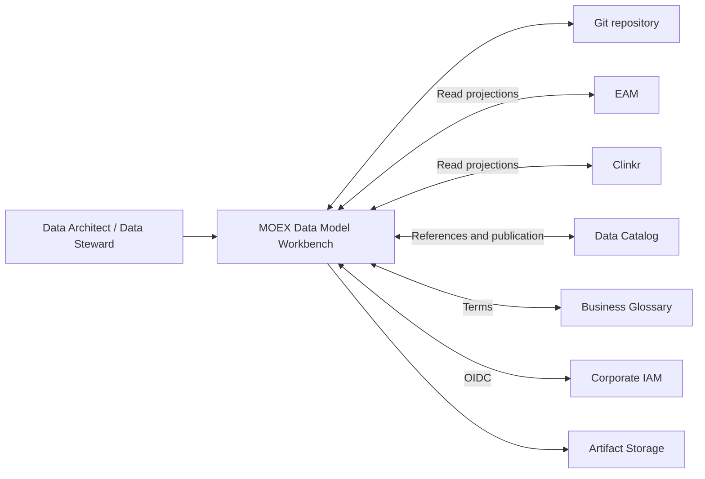
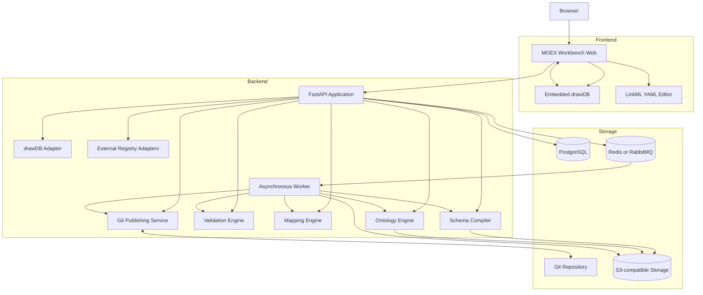
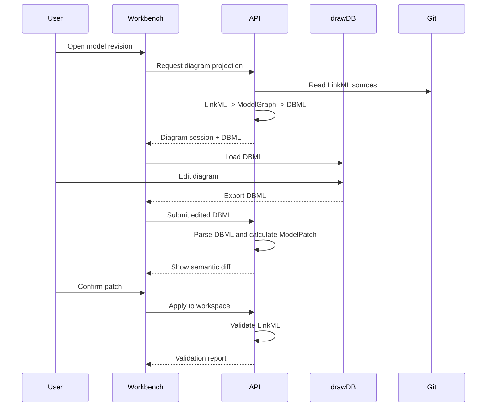

# MOEX Data Model Workbench

> **Не верхний уровень архитектуры.** Нормативный канон платформы — [MODELING_ARCHITECTURE.md](MODELING_ARCHITECTURE.md) (Proposed 0.2). Этот документ описывает Workbench и LinkML-based toolchain: LinkML — первый standard provider, DAMS — первая reference specification. ADR-001 «LinkML YAML — канонический формат» действует для DAMS-активов и LinkML toolchain, не для всей мультиформальной платформы.

**Назначение:** целевая архитектура приложения для разработки, проверки, публикации и визуального редактирования моделей данных MOEX (LinkML как первый provider).

## Цели системы

MOEX Data Model Workbench должен предоставлять единую среду для:

- Разработки корпоративных, концептуальных, логических и физических моделей.
- Хранения канонических спецификаций в LinkML YAML.
- Проверки структуры схем и экземпляров моделей.
- Управления версиями и жизненным циклом моделей.
- Генерации производных представлений: JSON Schema, Python, Pydantic, RDF, OWL, SHACL, DBML и документации.
- Визуального редактирования ER-проекций через drawDB.
- Описания преобразований между внешними схемами и метамоделью MOEX.
- Связывания моделей с EAM, Clinkr, дата-каталогом, бизнес-глоссарием и data contracts.
- Согласования и публикации версий моделей через Git workflow.
- Предоставления API для других инструментов MOEX.

## Не входит в систему

Первая версия приложения не должна пытаться заменить:

- EAM как мастер-систему IT-систем, IT-решений и платформ.
- Clinkr как мастер-систему интеграций.
- Корпоративный дата-каталог.
- Бизнес-глоссарий.
- BPMN-репозиторий.
- Средства проектирования конкретных СУБД.
- Полноценный ontology editor уровня Protégé.
- ETL-платформу для преобразования больших промышленных наборов данных.

Workbench хранит локальные проекции и стабильные ссылки на эти системы, но не становится второй мастер-системой.

## Архитектурные принципы

### LinkML как источник истины

Каноническое представление метамодели и моделей решений — LinkML YAML. JSON Schema, Pydantic, DBML, RDF, OWL и остальные форматы считаются производными артефактами.

Редактирование производного формата не должно напрямую изменять опубликованную LinkML-схему. Изменение сначала преобразуется в контролируемый patch, после чего повторно проверяется и применяется к канонической модели.

### Git как реестр версий

Опубликованные модели хранятся в Git:

- Версия модели связана с неизменяемым commit SHA.
- Изменения проходят через branch и pull request.
- Теги используются для релизов метамодели и профилей.
- Все сгенерированные артефакты воспроизводимы из конкретной ревизии.

PostgreSQL используется для operational state, поиска, черновиков, заданий и аудита, но не подменяет Git как источник опубликованных спецификаций.

### Разделение авторинга и генерации

Пользователь изменяет только:

- LinkML-схемы.
- Экземпляры моделей.
- LinkML Map specifications.
- Управляемые настройки генерации.
- Визуальные изменения, преобразованные в LinkML patch.

Каталоги `generated/` не редактируются вручную.

### Многоуровневая проверка

Каждая модель проходит последовательно:

1. Проверку YAML.
2. Проверку LinkML-схемы относительно метамодели.
3. `linkml-lint`.
4. Проверку экземпляров модели.
5. MOEX semantic rules.
6. Проверку ссылочной целостности.
7. Проверку совместимости с предыдущей версией.
8. Генерацию и smoke-тест целевых артефактов.

`linkml-validate` умеет проверять как данные относительно схемы, так и саму схему относительно LinkML metamodel; он поддерживает YAML, JSON, CSV и TSV. `linkml-lint` применяется отдельно: валидная схема может оставаться некачественной с точки зрения соглашений об именовании, обязательности описаний и других практик.

## Контекст системы



## Контейнерная архитектура



## Выбранный стиль

Для первой промышленной версии выбирается **модульный монолит**, а не набор микросервисов.

Причины:

- Все операции объединены общим понятием модели и общей транзакцией публикации.
- Команда разработки на старте, вероятно, будет небольшой.
- LinkML-компоненты работают в одном Python runtime.
- Микросервисы преждевременно усложнят версионирование схем, диагностику и развёртывание.
- Длительные операции всё равно отделяются в worker.
- Границы модулей позволяют позднее выделить compiler, integration adapters или ontology engine в отдельные сервисы.

## Компоненты backend

### Model Registry

Отвечает за:

- Список model packages.
- Версии и revisions.
- Жизненный цикл.
- Связь модели с ITSolution.
- Домены и bounded contexts.
- Поиск сущностей, атрибутов, физических объектов и mappings.
- Отображение опубликованных версий и черновиков.

Модуль хранит поисковую проекцию в PostgreSQL. Опубликованное содержимое загружается из Git.

### Schema Service

Работает с LinkML schema documents через `linkml-runtime` и `SchemaView`.

Функции:

- Загрузка схемы и imports.
- Разрешение классов, slots, enums, mixins.
- Нормализация относительных путей.
- Вычисление наследуемых slots.
- Построение внутреннего графа модели.
- Формирование API-friendly DTO.
- Сравнение ревизий схемы.

### Validation Engine

Содержит четыре независимых вида проверки:

- **Metamodel validation:** является ли YAML корректной LinkML-схемой.
- **Instance validation:** соответствует ли ModelPackage метамодели MOEX.
- **Lint validation:** соблюдены ли стандарты моделирования.
- **MOEX semantic validation:** выполнены ли корпоративные инварианты.

Примеры MOEX-инвариантов:

- У каждого опубликованного `ModelPackage` есть `model_version`.
- У каждого `LogicalEntity` определён `DomainContext`.
- У каждого `PhysicalObject` определены `system_ref`, `technology` и `native_schema_ref`.
- `Mapping` содержит хотя бы один source и target.
- `DataFlow` ссылается на существующую интеграцию Clinkr.
- `DataModelBinding` содержит immutable revision и integrity digest.
- Классификация атрибута не может быть слабее запрещённого политикой уровня.
- Ссылки на registry objects должны быть разрешены или явно помечены как external/unresolved.

### Generator Service

Предоставляет унифицированный интерфейс генерации:

```python
class ArtifactGenerator(Protocol):
    artifact_type: str

    def generate(
        self,
        schema_revision: SchemaRevision,
        options: dict,
    ) -> GeneratedArtifact:
        ...
```

Рекомендуемые генераторы первой версии:

| Результат | Инструмент | Назначение |
|---|---|---|
| JSON Schema | `gen-json-schema` | Формы, browser validation, внешний обмен |
| Pydantic | `gen-pydantic` | DTO и типизированный Python API |
| Python dataclasses | `gen-python` | Reference object model и compatibility tests |
| Markdown | `gen-doc` | Документация модели |
| Mermaid | `gen-mermaid-class-diagram` | Документирование структуры |
| DBML | `gen-dbml` плюс MOEX postprocessor | Проекция для drawDB |
| RDF | `gen-rdf` | RDF-представление схемы |
| OWL | `gen-owl` | Онтологическое представление схемы |
| SHACL | `gen-shacl` | Проверка RDF-данных |
| SQL DDL | `gen-sqlddl` | Экспериментальная реляционная проекция |

LinkML generators преобразуют одну модель в JSON Schema, программные классы, RDF/OWL/SHACL, документацию и другие представления. Генерация JSON Schema должна выполняться без timestamps либо с иным контролем недетерминированных полей, чтобы одинаковый commit давал одинаковый результат.

### Mapping Engine

`linkml-map` применяется для:

- Импорта структур EAM, Clinkr и дата-каталога.
- Преобразования внешних payloads в экземпляры MOEX metamodel.
- Миграции данных между версиями метамодели.
- Формирования специализированных профилей.
- Управляемого reverse mapping, если преобразование обратимо.

Transformation Specification хранится в Git рядом с моделями. Для production используется Python `ObjectTransformer`; SQL backend не должен применяться без отдельного conformance-теста, поскольку его поддерживаемое подмножество ограничено, а часть конструкций может быть пропущена при компиляции.

`linkml-map` пока не следует считать полностью стабильным API. Он размещается за внутренним интерфейсом `MappingProvider`, чтобы его можно было обновлять или заменить без изменения прикладных модулей.

### Import Engine

`schema-automator` применяется только для bootstrapping:

- Импорт JSON Schema.
- Импорт SQL/DDL.
- Импорт RDF/OWL.
- Вывод предварительной схемы из CSV/TSV/JSON.
- Первичное извлечение enums и типов.

Результат автоматического импорта всегда получает статус `generated-draft` и проходит ручное обогащение. Он не публикуется автоматически: LinkML прямо характеризует importers как экспериментальные и не рекомендует полагаться на них как на production-механизм без дополнительной проверки.

### Ontology Engine

Следует различать три операции:

- `gen-rdf` — RDF-представление LinkML-схемы.
- `gen-owl` — OWL-представление классов, свойств и ограничений схемы.
- `linkml-owl` — преобразование экземпляров LinkML в OWL TBox/ABox.

OWL нельзя использовать как единственный валидатор данных: OWL следует open-world semantics, тогда как LinkML validation опирается на более закрытую модель ограничений. Поэтому:

- LinkML validation — основная проверка YAML/JSON.
- SHACL/pySHACL — проверка RDF instances.
- OWL — reasoning, семантическая публикация и анализ непротиворечивости.
- `linkml-owl` — optional experimental adapter, а не обязательная зависимость ядра.

### Git Publishing Service

Поддерживает workflow:

1. Создание workspace.
2. Создание Git branch.
3. Изменение одного или нескольких source-файлов.
4. Validation pipeline.
5. Генерация preview artifacts.
6. Формирование semantic diff.
7. Создание pull request.
8. Согласование.
9. Merge.
10. Тегирование релиза.
11. Публикация артефактов.

Git provider должен быть скрыт за интерфейсом:

```python
class GitProvider(Protocol):
    def create_branch(self, base_revision: str, branch_name: str) -> None: ...
    def commit_files(self, branch_name: str, files: list[FileChange]) -> str: ...
    def create_review(self, branch_name: str, title: str) -> ReviewRef: ...
    def get_file(self, revision: str, path: str) -> bytes: ...
```

Первая реализация может использовать GitHub, но прикладные модули не должны зависеть от GitHub-specific DTO.

## Внутреннее представление

Между LinkML и редакторами вводится собственная нормализованная модель — `ModelGraph`.

```text
LinkML YAML
    ↓ parse
LinkML SchemaView / generated models
    ↓ normalize
MOEX ModelGraph
    ├── Validation
    ├── Search projection
    ├── Semantic diff
    ├── DBML projection
    ├── Documentation
    └── API DTO
```

`ModelGraph` не является новым форматом хранения. Это transient/internal representation.

Минимальные узлы:

- ModelPackage.
- DomainContext.
- ConceptualEntity.
- LogicalEntity.
- LogicalAttribute.
- Relationship.
- PhysicalObject.
- PhysicalField.
- Mapping.
- DataFlow.
- DataModelBinding.
- RegistryReference.

Минимальные типы рёбер:

- Contains.
- IsA.
- Implements.
- HasAttribute.
- RelatesTo.
- MapsTo.
- Physicalizes.
- Produces.
- Consumes.
- RefersTo.

## Интеграция drawDB

### Стратегия

drawDB (https://github.com/drawdb-io/drawdb) следует разворачивать как отдельное self-hosted frontend-приложение и встраивать в Workbench как editor component или iframe/microfrontend. drawDB уже является browser-based ERD editor, умеет импортировать и экспортировать SQL, а sharing server для него необязателен.

На первом этапе не рекомендуется глубоко смешивать код drawDB с основным frontend. Отдельное развёртывание:

- Снижает стоимость обновления drawDB.
- Изолирует React и frontend dependencies.
- Позволяет ограничить CSP и права editor frame.
- Исключает зависимость доменной логики Workbench от внутреннего формата drawDB.
- Позволяет заменить editor без изменения backend.

### Модель взаимодействия



### Ограничения round-trip

DBML не может без потерь представить все возможности LinkML:

- Mixins.
- Abstract classes.
- Slot usage.
- Несколько форм наследования.
- URI/CURIE semantics.
- Rules.
- Class expressions.
- Annotation extensions.
- Governance bindings.
- Полиморфные ranges.
- Cross-layer mappings.

Поэтому устанавливаются разные режимы:

| Уровень | Режим первой версии |
|---|---|
| Physical model | Управляемый двусторонний round-trip |
| Logical entities and attributes | Частичный round-trip |
| Conceptual model | Визуализация, ограниченное добавление сущностей |
| Governance | Только Workbench forms |
| Integration/DataFlow | Отдельная диаграмма, не ERD |
| Ontology | Только просмотр/экспорт |

### MOEX DBML profile

Существующий файл `moex-dams-drawdb-colored.dbml` уже задаёт цветовую кодировку слоёв, таблицы, enums и relationships. Его следует превратить из вручную поддерживаемого файла в golden sample для генератора.

MOEX DBML profile должен поддерживать:

- `headercolor` по архитектурному слою.
- `Note` с идентификатором LinkML element.
- Стабильное соответствие table/column и element/slot.
- Отдельные `Ref` для optional relationships.
- Сохранение layout metadata вне LinkML.
- Фильтрацию по layer, package, domain и solution.
- Явную маркировку projection-only объектов.

Layout хранится отдельно:

```json
{
  "diagram_id": "moex:diagram:solution-x:logical",
  "model_revision": "commit-sha",
  "projection": "logical",
  "nodes": {
    "moex:entity:Order": {"x": 120, "y": 80},
    "moex:entity:Trade": {"x": 540, "y": 80}
  }
}
```

Координаты и настройки canvas не должны попадать в семантическую LinkML-модель.

### Разрешённые изменения

На первом этапе drawDB может менять:

- Название новой logical/physical entity.
- Атрибуты и поля.
- Типы из контролируемой таблицы соответствий.
- Required/nullability.
- Primary key/identifier.
- Foreign key/relationship.
- Cardinality, если она однозначно выводится.
- Description/note.
- Группировку и layout.

Через drawDB нельзя напрямую менять:

- `element_id` опубликованного элемента.
- Ownership.
- Security classification.
- Model lifecycle.
- EAM/Clinkr/catalog references.
- Approval status.
- Compatibility policy.
- Data contract binding.
- Semantic mapping expression.

Такие изменения выполняются через формы Workbench.

## Хранение данных

### Git

Хранит:

- LinkML schemas.
- Model instances.
- LinkML Map specifications.
- Validation configuration.
- Generator configuration.
- MOEX policies.
- Examples и conformance fixtures.
- Документацию архитектуры.
- Migration specifications.

### PostgreSQL

Хранит:

- Users и role mappings.
- Workspaces.
- Draft operations.
- Job state.
- Audit events.
- Pull request references.
- Cached semantic index.
- Search documents.
- External registry cache.
- Diagram layout.
- Generated artifact metadata.
- Validation reports.

Для разграничения доменов и рабочих пространств можно использовать PostgreSQL Row-Level Security: политики ограничивают доступ к отдельным строкам и работают по принципу default deny, если RLS включён, но подходящая policy отсутствует.

### Artifact storage

S3-compatible storage хранит:

- Generated ZIP.
- JSON Schema.
- DBML.
- RDF/OWL/SHACL.
- Generated documentation.
- Validation reports.
- Preview bundles.

Ключ артефакта должен включать:

```text
/{model-id}/{revision}/{generator}/{generator-version}/{config-hash}/artifact
```

## API

Базовые endpoints:

```text
GET    /api/v1/models
POST   /api/v1/workspaces
GET    /api/v1/models/{modelId}/revisions/{revision}
GET    /api/v1/models/{modelId}/graph
POST   /api/v1/workspaces/{workspaceId}/validate
POST   /api/v1/workspaces/{workspaceId}/generate
POST   /api/v1/workspaces/{workspaceId}/publish
GET    /api/v1/jobs/{jobId}
GET    /api/v1/artifacts/{artifactId}
GET    /api/v1/diagrams/{modelId}
POST   /api/v1/diagrams/{modelId}/import-dbml
POST   /api/v1/diagrams/{modelId}/apply-patch
POST   /api/v1/import/schema
POST   /api/v1/mappings/validate
POST   /api/v1/mappings/execute
GET    /api/v1/registry/{registryType}
GET    /api/v1/diff
```

Длительные операции возвращают `202 Accepted` и `job_id`.

## Асинхронные задания

В worker выносятся:

- Полная генерация артефактов.
- Импорт крупных схем.
- LinkML Map transformations.
- Ontology generation.
- SHACL validation.
- Синхронизация внешних реестров.
- Полная переиндексация.
- Publication pipeline.

Celery подходит как начальная реализация очереди, поскольку поддерживает распределённое и запланированное выполнение заданий. Broker выбирается конфигурацией: Redis для локальной разработки, RabbitMQ или согласованный корпоративный broker для production.

## Безопасность

### Аутентификация

Рекомендуется OIDC Authorization Code Flow с корпоративным IAM. Keycloak можно использовать для development и test environments; он поддерживает OIDC, OAuth 2.0 и SAML federation.

### Авторизация

Минимальные роли:

- Viewer.
- Modeler.
- Data Steward.
- Domain Architect.
- Reviewer.
- Publisher.
- Platform Administrator.
- Integration Service.

Права вычисляются из:

- Роли пользователя.
- Бизнес-домена.
- ITSolution.
- Workspace.
- Lifecycle status.
- Классификации данных.
- Конкретной операции.

### Дополнительные меры

- Запрет произвольного Python evaluation в LinkML Map.
- Изоляция schema-automator jobs.
- Allowlist внешних URLs и imports.
- Ограничение размера загружаемых схем.
- Проверка ZIP и path traversal.
- CSP для embedded drawDB.
- Проверка generated artifacts.
- Secret scanning.
- Dependency scanning.
- Полный audit log публикаций и approval decisions.

## Наблюдаемость

Каждая операция должна иметь:

- `trace_id`.
- `workspace_id`.
- `model_id`.
- `revision`.
- `job_id`.
- `generator`.
- `generator_version`.
- `duration`.
- `result`.
- Количество warnings и errors.

Рекомендуемый стек:

- OpenTelemetry.
- Structured JSON logging.
- Prometheus-compatible metrics.
- Корпоративный tracing backend.
- Sentry либо корпоративный аналог для frontend errors.

## Развёртывание

Минимальный production deployment:

- `web` — основной frontend.
- `drawdb` — статическое self-hosted приложение.
- `api` — FastAPI.
- `worker` — фоновые операции.
- `postgres`.
- `broker`.
- `object-storage`.
- Внешний Git provider.
- Корпоративный IAM.

Каждый компонент поставляется отдельным OCI image. API и worker собираются из одного Python package, но запускаются разными entrypoints.

## Ключевые решения

Проекты: [docs/adr/](../adr/README.md) (`status: Proposed`). При расхождении побеждает MODELING_ARCHITECTURE.

| ADR | Решение |
|---|---|
| [ADR-001](../adr/ADR-001-linkml-yaml-canonical.md) | LinkML YAML — канонический authoring format для DAMS-активов и LinkML toolchain (не для всей мультиформальной платформы; см. MODELING_ARCHITECTURE) |
| [ADR-002](../adr/ADR-002-git-published-source.md) | Git — источник опубликованных версий |
| [ADR-003](../adr/ADR-003-postgres-operational.md) | PostgreSQL — operational и search projection |
| [ADR-004](../adr/ADR-004-modular-monolith.md) | Модульный монолит вместо микросервисов |
| [ADR-005](../adr/ADR-005-drawdb-isolated.md) | drawDB — изолированное self-hosted приложение |
| [ADR-006](../adr/ADR-006-dbml-projection.md) | DBML — проекция, а не источник истины |
| [ADR-007](../adr/ADR-007-pydantic-dto-not-validator.md) | Pydantic — API DTO, но не единственный validator |
| [ADR-008](../adr/ADR-008-linkml-map-provider.md) | LinkML Map скрывается за provider interface |
| [ADR-009](../adr/ADR-009-schema-automator-draft-only.md) | schema-automator используется только для draft import |
| [ADR-010](../adr/ADR-010-owl-not-primary-validation.md) | OWL не применяется как основной механизм validation |
| [ADR-011](../adr/ADR-011-reproducible-artifacts.md) | Generated artifacts должны быть воспроизводимыми |
| [ADR-012](../adr/ADR-012-semantic-diff-review.md) | Все изменения публикуются через semantic diff и review |
