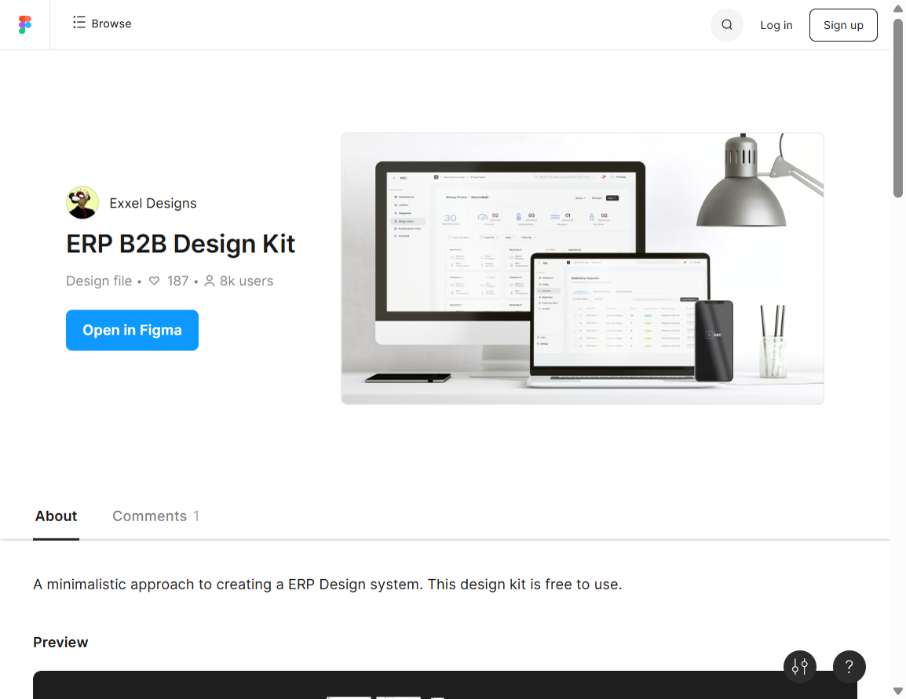
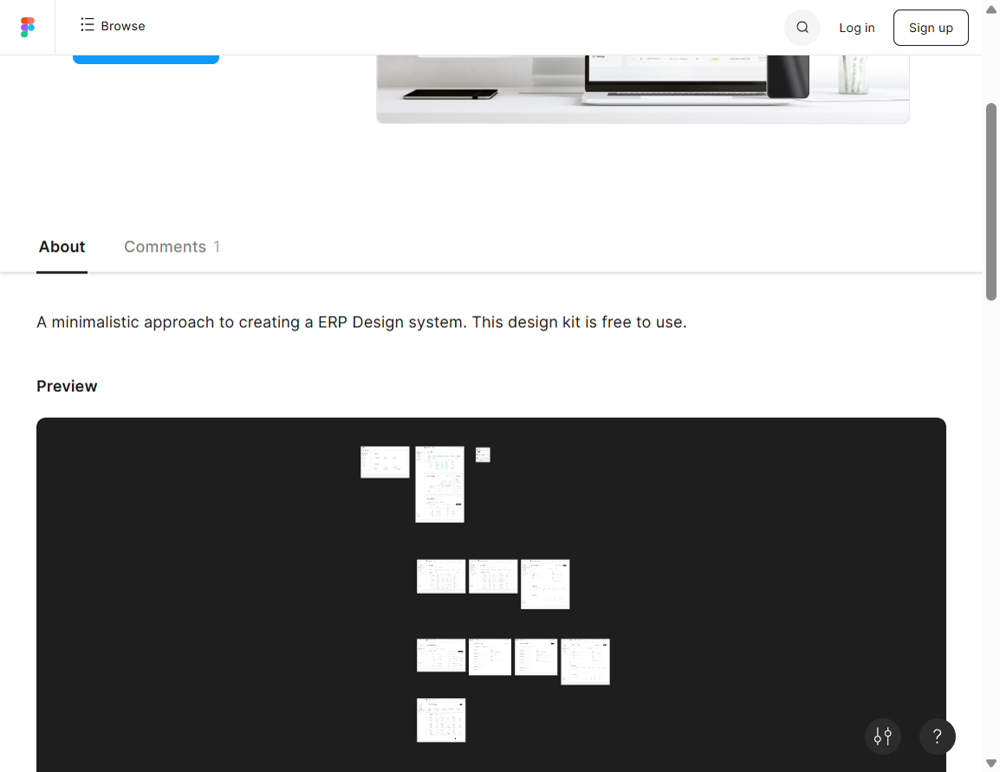
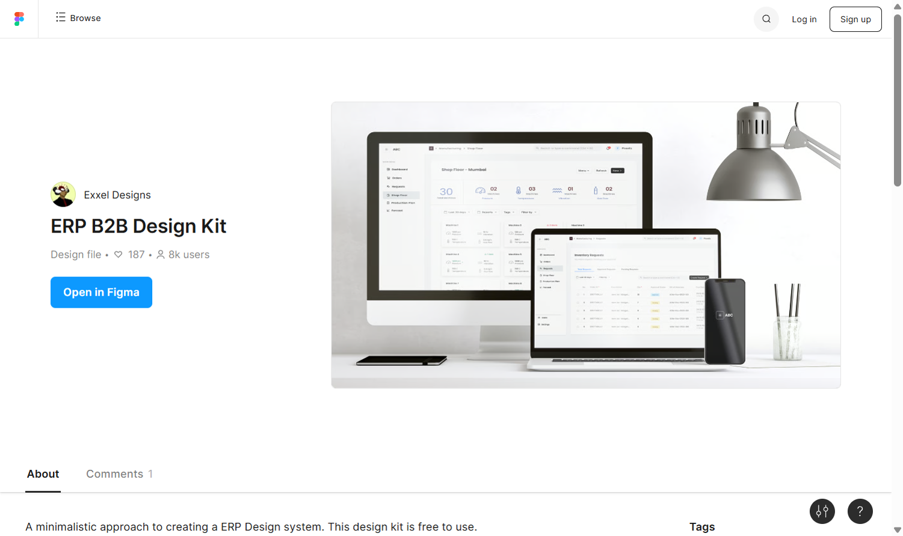

# Visual reference — ERP B2B Design Kit

**Source:** [ERP B2B Design Kit (Figma Community)](https://www.figma.com/community/file/1220373386573896297/erp-b2b-design-kit)  
**Author:** Exxel Designs  
**License:** [CC BY 4.0](https://creativecommons.org/licenses/by/4.0/)  
**Captured:** 2026-09-28 from the public community preview (editable file layers not opened).

These screenshots document the **graphic** language used as a reference for MOEX Atlas. Functional IA of the kit (Shop Floor, Inventory Requests) is not adopted.

## Captions

### 01 — Hero devices

Desktop + laptop + phone mockups on a light gray stage. Note: white content panels, left sidebar with icon+label nav, KPI numbers, status chips, and a clean data table on the laptop. Mobile splash stays minimal.

**Atlas takeaway:** surface hierarchy, sidebar density, table air, KPI strip pattern for publication Overview.

### 02 — Preview grid

Community «Preview» mosaic: many dashboard/table/sidebar compositions. Consistent light chrome, rounded cards (~8–12 px), thin separators.

**Atlas takeaway:** repeatable card/table/sidebar grammar across screens; avoid one-off layouts per publication type.

### 03 — Community page chrome

Page chrome around the kit (metadata, Open in Figma). Useful as a reminder that the kit is a free CC BY resource and that our brand (MOEX Red) replaces the kit’s blue CTAs.

**Atlas takeaway:** attribution and license stay with the reference docs; product UI uses MOEX brand tokens.
