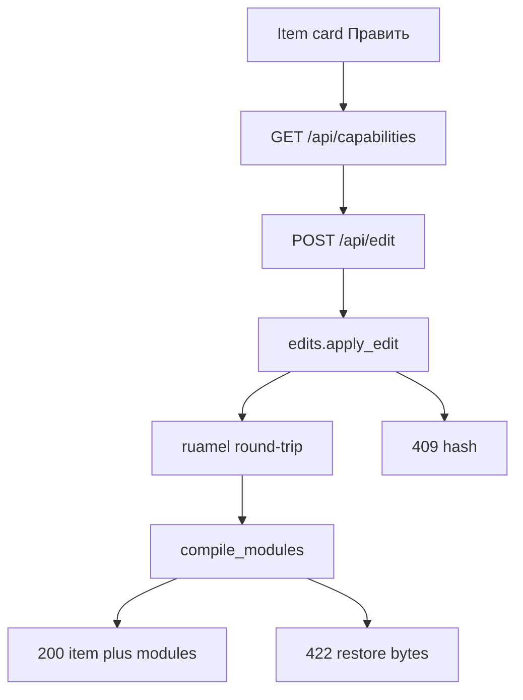

# moex-data-model: Viewer inline edit

> **For agentic workers:** REQUIRED SUB-SKILL: Use superpowers:subagent-driven-development (recommended) or superpowers:executing-plans. Spec: [docs/superpowers/specs/2026-10-05-viewer-inline-edit-design.md](docs/superpowers/specs/2026-10-05-viewer-inline-edit-design.md). After implementation, also save this plan to `docs/superpowers/plans/2026-10-05-viewer-inline-edit.md`.

**Goal:** Владелец модели правит `description` / `title` / `aliases` в карточке viewer; изменение пишется в канонический YAML/LinkML в working tree.

**Architecture:** `index.html` остаётся автономным read-only. Новый `serve` на `127.0.0.1` отдаёт ту же страницу и `/api/*`. Нормализаторы ставят `edit_target` только на поля, которые лежат в файле. Запись — `ruamel.yaml` round-trip + атомарный replace + rollback, если `compile_modules` падает.

**Tech Stack:** stdlib `http.server`, `ruamel.yaml` (pinned в viewer), существующий build pipeline, vanilla JS в `static/js/edit.js`.

## Global constraints

- Не менять контракт `file://` build: кнопки правки только если `GET /api/capabilities` ответил.
- Не править идентификаторы (`id`, `name`, `element_id`) и поля ADR-025 (`definition_source_ref`, `definition_rationale`, `scoped_definitions`).
- Git не трогать. Автор/дата в YAML не пишутся.
- Viewer **не** зависит от `moex_dams` в основных deps. `formal_checks` — optional import; rollback только при ошибке rebuild.
- `assemble_js()` сегодня при любом файле в `JS_ORDER` **выкидывает** `viewer.js`. `edit.js` **не** класть в `JS_ORDER`; дописывать после fallback.
- `ruamel.yaml` только для записи; чтение нормализаторов остаётся на PyYAML.

## File structure

- Create [apps/viewer/src/moex_publication_viewer/edits.py](apps/viewer/src/moex_publication_viewer/edits.py) — `EditTarget`, hash, path parse, ruamel apply, registry, rollback
- Create [apps/viewer/src/moex_publication_viewer/serve.py](apps/viewer/src/moex_publication_viewer/serve.py) — HTTP `127.0.0.1`, CSRF, rebuild, JSON API
- Create [apps/viewer/static/js/edit.js](apps/viewer/static/js/edit.js) — capabilities probe, inline editors, POST, re-render
- Create [apps/viewer/static/css/45-edit.css](apps/viewer/static/css/45-edit.css) — кнопки/поля (подключить из `40-components.css` или добавить в `CSS_ORDER` **перед** `50-renderers.css`; не ломая fallback monolith)
- Create tests: `test_edits.py`, `test_edit_targets.py`, `test_serve.py`, `test_edit_ui.py`
- Modify [publication_models.py](apps/viewer/src/moex_publication_viewer/models/publication_models.py) — `edit_target: dict | None`
- Modify [helpers.py](apps/viewer/src/moex_publication_viewer/normalizers/helpers.py) + [yaml_normalizer.py](apps/viewer/src/moex_publication_viewer/normalizers/yaml_normalizer.py) — YAML list keyed by `element_id`/`id`
- Modify [linkml_normalizer.py](apps/viewer/src/moex_publication_viewer/normalizers/linkml_normalizer.py) — `classes.X.description` / `aliases` в файле `from_schema`
- Modify [html_renderer.py](apps/viewer/src/moex_publication_viewer/renderers/html_renderer.py) `_item_to_dict` — прокинуть `edit_target`
- Modify [build.py](apps/viewer/src/moex_publication_viewer/build.py) `compile_modules` — relativize `file` к `--root`; собрать registry
- Modify [assets.py](apps/viewer/src/moex_publication_viewer/assets.py) — concat `js/edit.js` после `viewer.js`
- Modify [cli.py](apps/viewer/src/moex_publication_viewer/cli.py) — **реально ветвить** `build`/`check`/`serve` (сейчас `check` тоже просто вызывает `build`)
- Modify [viewer.js](apps/viewer/static/viewer.js) минимально: `let modules`, `data-module-id`/`data-section-id` на карточках, `window.__moexReplacePublicationData`
- Modify [pyproject.toml](apps/viewer/pyproject.toml), [Makefile](Makefile) `viewer-serve`, [apps/viewer/README.md](apps/viewer/README.md)

Протокол `Normalizer.normalize(section, source_path)` **не** расширять. Нормализатор кладёт абсолютный `file`; `compile_modules` делает posix-путь относительно `root`.

## yaml_path

Строка, не JSONPath:

- map: `classes.ConceptualEntity.description`
- list: `logical_entities[element_id=dams:logical/trading/Client].description`
- nested: `logical_entities[element_id=X].attributes[element_id=Y].aliases`

Поля v1: `description` | `title` | `aliases`. Hash: SHA-256 канонического JSON значения (`json.dumps(..., ensure_ascii=False, separators=(",", ":"))`; list aliases как есть).

**Когда не эмитить:** `select` = `model_glossary` / `flattened_requirements`; CSV/JSON/Markdown/Mermaid; LinkML `title` если он равен идентификатору (`name`); inherited/computed rows.

**LinkML `file`:** не корневой `moex-dams.yaml`, а файл пакета (`_group_source_file(schema_key)` рядом с `source_path.parent`). Иначе правка создаст дубль класса.

**LinkML `title`:** `PublicationItem.title` сейчас = имя класса — **не** редактируется. Редактируются `description` и `aliases` (слот LinkML).

**DAMS YAML:** `title` / `description` / `aliases` на записях с `element_id`. Ключ можно вставить, если его ещё нет (это не computed field).

## API and security

- Bind only `127.0.0.1`. Process CSRF token (`secrets.token_urlsafe`), не single-use — иначе нельзя править два поля подряд. Спека «one-time» = один токен на процесс serve, не на каждый POST.
- `GET /api/capabilities` → `{edit: true, token}`
- `POST /api/edit` body `{token, edit_target, new_value}` → `{ok, diagnostics, item, modules, search_index}`
- 403 bad token / Origin не `http://127.0.0.1:<port>`; 404 unknown registry key; 409 hash; 422 validation (empty title, duplicate sibling title in the same list) or rebuild fail (file restored from in-memory bytes)
- Registry keyed by `(file, yaml_path, field)` from last successful compile. Произвольные пути не принимаются.
- `formal_checks`: optional `from moex_dams.rules.formal_checks import check_formal_requirements`. ERROR/WARNING возвращаются в `diagnostics`, файл **не** откатывается (WIP description может нарушать LDM-002). Rollback только если YAML/rebuild сломан.

Sibling title: среди соседних mapping/list entries того же parent, не глобально по репо.

## UI

`edit.js` слушает `#content` (MutationObserver). Карточка с `data-publication-item` + `data-module-id` + `data-section-id` + `data-item-id` → lookup `edit_target` в modules.

- «Править» рядом с Definition, title (instance Identity), aliases.
- Description/title: textarea/input. Aliases: одна строка = один alias.
- Нет `edit_target`: короткий hint («поле вычисляется / нет в источнике»).
- Успех: `__moexReplacePublicationData` заменяет `modules` + search index и заново обрабатывает текущий hash (без reload).
- Ошибка: поле остаётся в edit mode, текст 409/422.

Не раздувать логику правки внутри `viewer.js`. Точки касания: `const modules` → `let`; data-атрибуты в `renderInstanceDetail`, `renderExplorerDetail` (class/enum), `renderGlossaryTermDetail`; экспорт replace helper.

Стили: `.edit-btn`, `.edit-field`, `.edit-error` в новом CSS-слое. Если `CSS_ORDER` неполный, fallback monolith `viewer.css` тоже должен содержать те же правила (сейчас `assemble_css` пишет monolith в `static/viewer.css` при build — слой подхватится, если файл есть в `CSS_DIR`).

## Tasks

### Task 1: EditTarget model + ruamel apply (no HTTP)

Tests first in `apps/viewer/tests/test_edits.py`:

- Round-trip preserves comments and key order; diff touches only the changed value
- `aliases` replaces the whole list
- Path escape / symlink / non-`.yaml` → reject
- Unknown registry key → reject
- `base_hash` mismatch → conflict
- Empty title / duplicate sibling title → validation error before write
- Simulated rebuild failure restores original bytes

Implement `EditTarget`, `value_hash`, `parse_yaml_path`, `resolve_under_root`, `apply_edit(root, target, new_value, registry) -> ApplyResult`, in-memory backup.

Pin `ruamel.yaml==0.18.10` (or current 0.18.x) in [apps/viewer/pyproject.toml](apps/viewer/pyproject.toml).

### Task 2: Normalizers emit `edit_target`

Tests `test_edit_targets.py`:

- DAMS-like YAML list: items get `logical_entities[element_id=...].description` etc.
- `select: model_glossary` → no targets
- CSV section → no targets
- LinkML class: `classes.Foo.description`, `file` ends with the package yaml (`moex-core.yaml`), not the root aggregator; no title target

`dict_to_item` / YamlNormalizer: after `records_to_items`, walk selected list with select prefix. `compile_modules` relativizes `file`.

Forward in `_item_to_dict`. Existing normalizer tests stay green.

### Task 3: `serve` + CLI branch

Fix `cli.py` to dispatch on `args.command`. Add `serve --root --dist --port` (default 8765).

`serve.py`: build once, hold registry + CSRF; handlers for capabilities/edit/static `index.html`. After apply: `compile_modules` + optional formal_checks; refresh registry; return rebuilt `modules_payload` + `build_search_index`.

Tests `test_serve.py` via `ThreadingHTTPServer` + `http.client` on port 0 (tmp repo with one YAML module).

Makefile `viewer-serve`. README: `python -m moex_publication_viewer.cli serve --root .`

### Task 4: UI layer

`assemble_js`: append `static/js/edit.js` if present, **after** viewer.js fallback.

`test_edit_ui.py`: assembled JS contains `GET /api/capabilities` and `Править`; `build()` HTML still has no live API (probe fails on `file://`); Atlas `assert_no_required_cdn` still holds.

Minimal `viewer.js` hooks as above. `edit.js` implements enhance/save/error.

Run `pytest apps/viewer/tests -q` and `python -m moex_publication_viewer.cli check --root .`.

## Out of scope

Workbench (`apps/web` Monaco/forms), Git commit, cascade fields, FIBO CSV, generated glossaries, adding new keys beyond the three fields, live merge with IDE (409 only).
