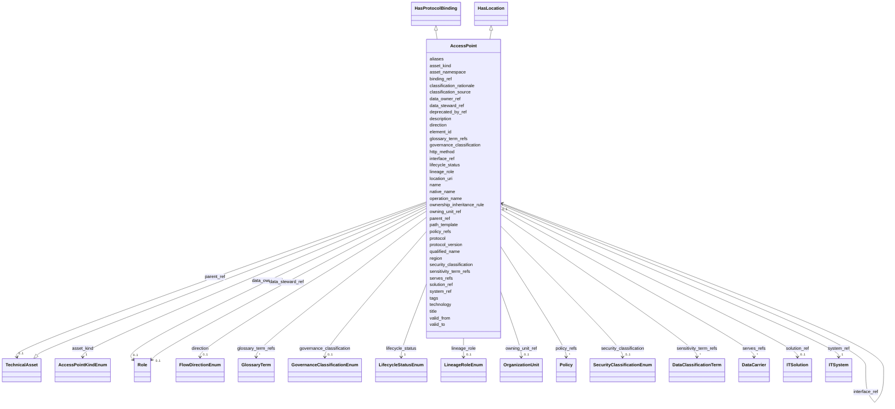

```mermaid
 classDiagram
    class AccessPoint
    click AccessPoint href "../AccessPoint"
      HasProtocolBinding <|-- AccessPoint
        click HasProtocolBinding href "../HasProtocolBinding"
      HasLocation <|-- AccessPoint
        click HasLocation href "../HasLocation"
      TechnicalAsset <|-- AccessPoint
        click TechnicalAsset href "../TechnicalAsset"
      
      AccessPoint : aliases
        
      AccessPoint : asset_kind
        
          
    
        
        
        AccessPoint --> "1" AccessPointKindEnum : asset_kind
        click AccessPointKindEnum href "../AccessPointKindEnum"
    

        
      AccessPoint : asset_namespace
        
      AccessPoint : binding_ref
        
      AccessPoint : classification_rationale
        
      AccessPoint : classification_source
        
      AccessPoint : data_owner_ref
        
          
    
        
        
        AccessPoint --> "0..1" Role : data_owner_ref
        click Role href "../Role"
    

        
      AccessPoint : data_steward_ref
        
          
    
        
        
        AccessPoint --> "0..1" Role : data_steward_ref
        click Role href "../Role"
    

        
      AccessPoint : deprecated_by_ref
        
      AccessPoint : description
        
      AccessPoint : direction
        
          
    
        
        
        AccessPoint --> "0..1" FlowDirectionEnum : direction
        click FlowDirectionEnum href "../FlowDirectionEnum"
    

        
      AccessPoint : element_id
        
      AccessPoint : glossary_term_refs
        
          
    
        
        
        AccessPoint --> "*" GlossaryTerm : glossary_term_refs
        click GlossaryTerm href "../GlossaryTerm"
    

        
      AccessPoint : governance_classification
        
          
    
        
        
        AccessPoint --> "0..1" GovernanceClassificationEnum : governance_classification
        click GovernanceClassificationEnum href "../GovernanceClassificationEnum"
    

        
      AccessPoint : http_method
        
      AccessPoint : interface_ref
        
          
    
        
        
        AccessPoint --> "0..1" AccessPoint : interface_ref
        click AccessPoint href "../AccessPoint"
    

        
      AccessPoint : lifecycle_status
        
          
    
        
        
        AccessPoint --> "1" LifecycleStatusEnum : lifecycle_status
        click LifecycleStatusEnum href "../LifecycleStatusEnum"
    

        
      AccessPoint : lineage_role
        
          
    
        
        
        AccessPoint --> "0..1" LineageRoleEnum : lineage_role
        click LineageRoleEnum href "../LineageRoleEnum"
    

        
      AccessPoint : location_uri
        
      AccessPoint : name
        
      AccessPoint : native_name
        
      AccessPoint : operation_name
        
      AccessPoint : ownership_inheritance_rule
        
      AccessPoint : owning_unit_ref
        
          
    
        
        
        AccessPoint --> "0..1" OrganizationUnit : owning_unit_ref
        click OrganizationUnit href "../OrganizationUnit"
    

        
      AccessPoint : parent_ref
        
          
    
        
        
        AccessPoint --> "0..1" TechnicalAsset : parent_ref
        click TechnicalAsset href "../TechnicalAsset"
    

        
      AccessPoint : path_template
        
      AccessPoint : policy_refs
        
          
    
        
        
        AccessPoint --> "*" Policy : policy_refs
        click Policy href "../Policy"
    

        
      AccessPoint : protocol
        
      AccessPoint : protocol_version
        
      AccessPoint : qualified_name
        
      AccessPoint : region
        
      AccessPoint : security_classification
        
          
    
        
        
        AccessPoint --> "0..1" SecurityClassificationEnum : security_classification
        click SecurityClassificationEnum href "../SecurityClassificationEnum"
    

        
      AccessPoint : sensitivity_term_refs
        
          
    
        
        
        AccessPoint --> "*" DataClassificationTerm : sensitivity_term_refs
        click DataClassificationTerm href "../DataClassificationTerm"
    

        
      AccessPoint : serves_refs
        
          
    
        
        
        AccessPoint --> "*" DataCarrier : serves_refs
        click DataCarrier href "../DataCarrier"
    

        
      AccessPoint : solution_ref
        
          
    
        
        
        AccessPoint --> "0..1" ITSolution : solution_ref
        click ITSolution href "../ITSolution"
    

        
      AccessPoint : system_ref
        
          
    
        
        
        AccessPoint --> "1" ITSystem : system_ref
        click ITSystem href "../ITSystem"
    

        
      AccessPoint : tags
        
      AccessPoint : technology
        
      AccessPoint : title
        
      AccessPoint : valid_from
        
      AccessPoint : valid_to
        
      
```
