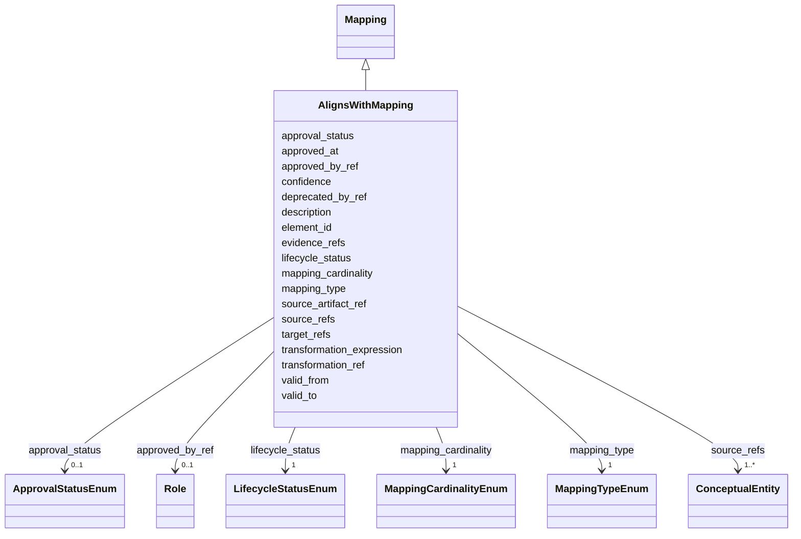

```mermaid
 classDiagram
    class AlignsWithMapping
    click AlignsWithMapping href "../AlignsWithMapping"
      Mapping <|-- AlignsWithMapping
        click Mapping href "../Mapping"
      
      AlignsWithMapping : approval_status
        
          
    
        
        
        AlignsWithMapping --> "0..1" ApprovalStatusEnum : approval_status
        click ApprovalStatusEnum href "../ApprovalStatusEnum"
    

        
      AlignsWithMapping : approved_at
        
      AlignsWithMapping : approved_by_ref
        
          
    
        
        
        AlignsWithMapping --> "0..1" Role : approved_by_ref
        click Role href "../Role"
    

        
      AlignsWithMapping : confidence
        
      AlignsWithMapping : deprecated_by_ref
        
      AlignsWithMapping : description
        
      AlignsWithMapping : element_id
        
      AlignsWithMapping : evidence_refs
        
      AlignsWithMapping : lifecycle_status
        
          
    
        
        
        AlignsWithMapping --> "1" LifecycleStatusEnum : lifecycle_status
        click LifecycleStatusEnum href "../LifecycleStatusEnum"
    

        
      AlignsWithMapping : mapping_cardinality
        
          
    
        
        
        AlignsWithMapping --> "1" MappingCardinalityEnum : mapping_cardinality
        click MappingCardinalityEnum href "../MappingCardinalityEnum"
    

        
      AlignsWithMapping : mapping_type
        
          
    
        
        
        AlignsWithMapping --> "1" MappingTypeEnum : mapping_type
        click MappingTypeEnum href "../MappingTypeEnum"
    

        
      AlignsWithMapping : source_artifact_ref
        
      AlignsWithMapping : source_refs
        
          
    
        
        
        AlignsWithMapping --> "1..*" ConceptualEntity : source_refs
        click ConceptualEntity href "../ConceptualEntity"
    

        
      AlignsWithMapping : target_refs
        
      AlignsWithMapping : transformation_expression
        
      AlignsWithMapping : transformation_ref
        
      AlignsWithMapping : valid_from
        
      AlignsWithMapping : valid_to
        
      
```
