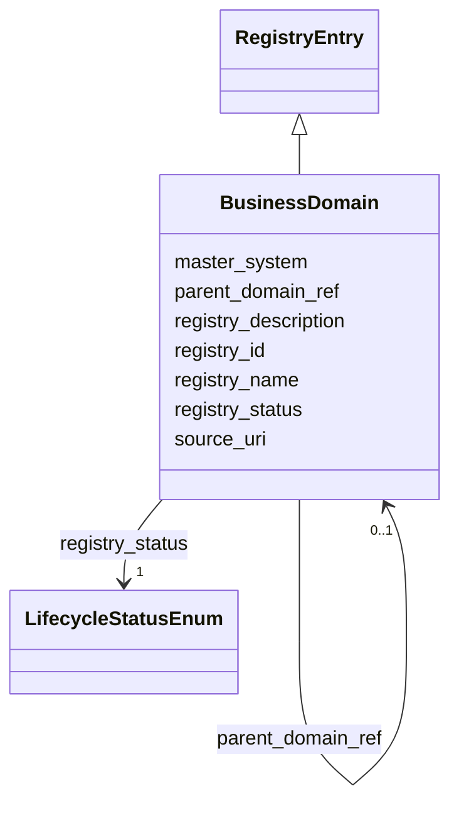

```mermaid
 classDiagram
    class BusinessDomain
    click BusinessDomain href "../BusinessDomain"
      RegistryEntry <|-- BusinessDomain
        click RegistryEntry href "../RegistryEntry"
      
      BusinessDomain : master_system
        
      BusinessDomain : parent_domain_ref
        
          
    
        
        
        BusinessDomain --> "0..1" BusinessDomain : parent_domain_ref
        click BusinessDomain href "../BusinessDomain"
    

        
      BusinessDomain : registry_description
        
      BusinessDomain : registry_id
        
      BusinessDomain : registry_name
        
      BusinessDomain : registry_status
        
          
    
        
        
        BusinessDomain --> "1" LifecycleStatusEnum : registry_status
        click LifecycleStatusEnum href "../LifecycleStatusEnum"
    

        
      BusinessDomain : source_uri
        
      
```
