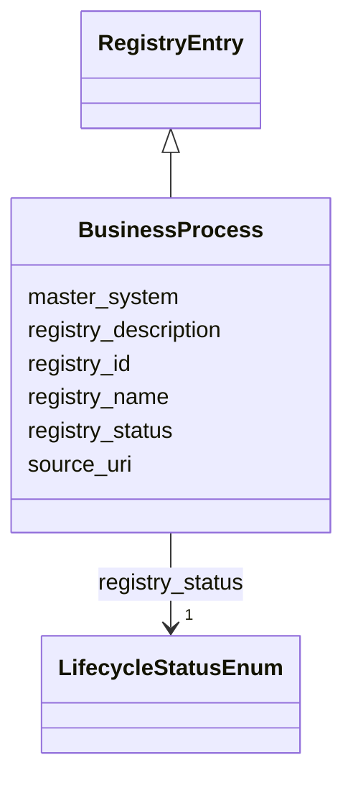

```mermaid
 classDiagram
    class BusinessProcess
    click BusinessProcess href "../BusinessProcess"
      RegistryEntry <|-- BusinessProcess
        click RegistryEntry href "../RegistryEntry"
      
      BusinessProcess : master_system
        
      BusinessProcess : registry_description
        
      BusinessProcess : registry_id
        
      BusinessProcess : registry_name
        
      BusinessProcess : registry_status
        
          
    
        
        
        BusinessProcess --> "1" LifecycleStatusEnum : registry_status
        click LifecycleStatusEnum href "../LifecycleStatusEnum"
    

        
      BusinessProcess : source_uri
        
      
```
