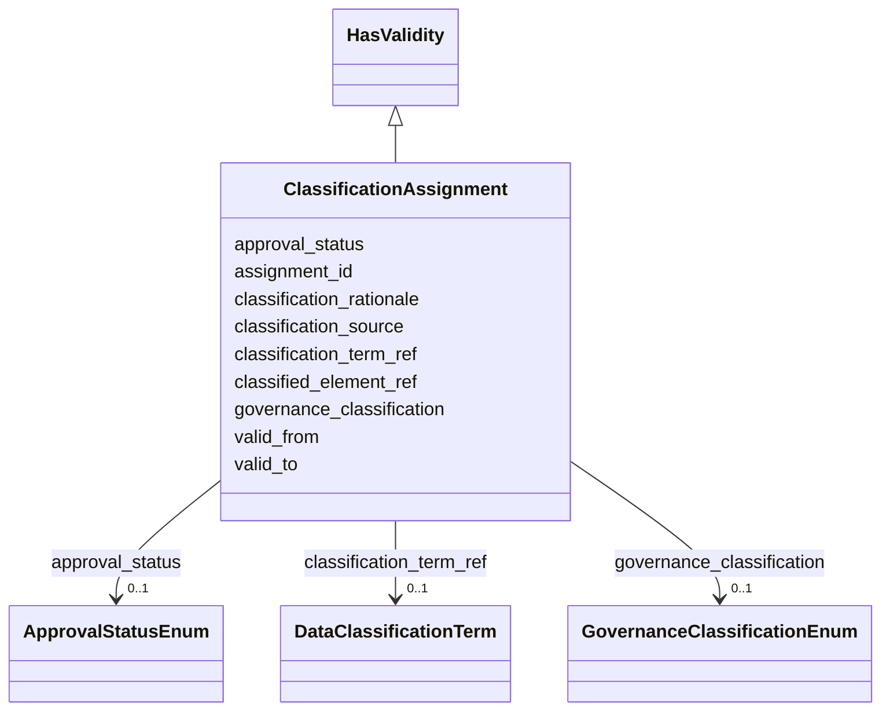

```mermaid
 classDiagram
    class ClassificationAssignment
    click ClassificationAssignment href "../ClassificationAssignment"
      HasValidity <|-- ClassificationAssignment
        click HasValidity href "../HasValidity"
      
      ClassificationAssignment : approval_status
        
          
    
        
        
        ClassificationAssignment --> "0..1" ApprovalStatusEnum : approval_status
        click ApprovalStatusEnum href "../ApprovalStatusEnum"
    

        
      ClassificationAssignment : assignment_id
        
      ClassificationAssignment : classification_rationale
        
      ClassificationAssignment : classification_source
        
      ClassificationAssignment : classification_term_ref
        
          
    
        
        
        ClassificationAssignment --> "0..1" DataClassificationTerm : classification_term_ref
        click DataClassificationTerm href "../DataClassificationTerm"
    

        
      ClassificationAssignment : classified_element_ref
        
      ClassificationAssignment : governance_classification
        
          
    
        
        
        ClassificationAssignment --> "0..1" GovernanceClassificationEnum : governance_classification
        click GovernanceClassificationEnum href "../GovernanceClassificationEnum"
    

        
      ClassificationAssignment : valid_from
        
      ClassificationAssignment : valid_to
        
      
```
