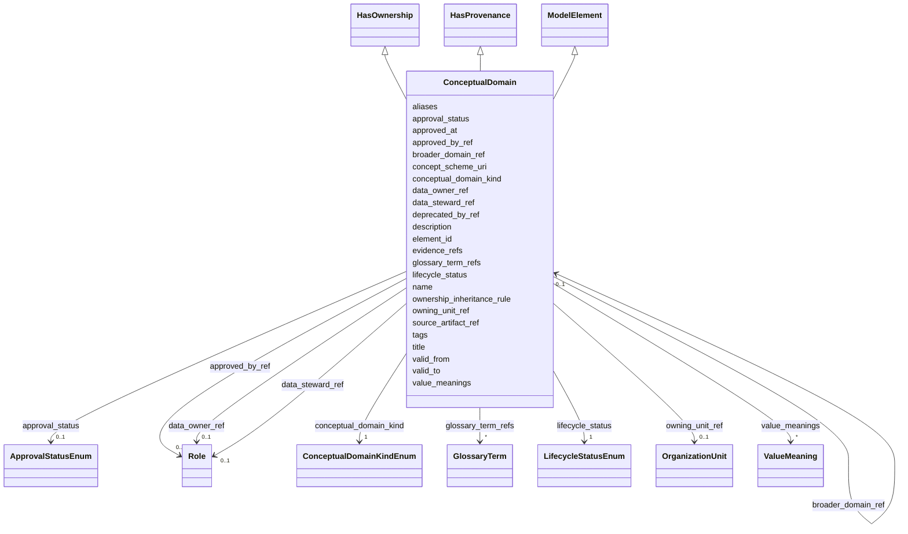

```mermaid
 classDiagram
    class ConceptualDomain
    click ConceptualDomain href "../ConceptualDomain"
      HasOwnership <|-- ConceptualDomain
        click HasOwnership href "../HasOwnership"
      HasProvenance <|-- ConceptualDomain
        click HasProvenance href "../HasProvenance"
      ModelElement <|-- ConceptualDomain
        click ModelElement href "../ModelElement"
      
      ConceptualDomain : aliases
        
      ConceptualDomain : approval_status
        
          
    
        
        
        ConceptualDomain --> "0..1" ApprovalStatusEnum : approval_status
        click ApprovalStatusEnum href "../ApprovalStatusEnum"
    

        
      ConceptualDomain : approved_at
        
      ConceptualDomain : approved_by_ref
        
          
    
        
        
        ConceptualDomain --> "0..1" Role : approved_by_ref
        click Role href "../Role"
    

        
      ConceptualDomain : broader_domain_ref
        
          
    
        
        
        ConceptualDomain --> "0..1" ConceptualDomain : broader_domain_ref
        click ConceptualDomain href "../ConceptualDomain"
    

        
      ConceptualDomain : concept_scheme_uri
        
      ConceptualDomain : conceptual_domain_kind
        
          
    
        
        
        ConceptualDomain --> "1" ConceptualDomainKindEnum : conceptual_domain_kind
        click ConceptualDomainKindEnum href "../ConceptualDomainKindEnum"
    

        
      ConceptualDomain : data_owner_ref
        
          
    
        
        
        ConceptualDomain --> "0..1" Role : data_owner_ref
        click Role href "../Role"
    

        
      ConceptualDomain : data_steward_ref
        
          
    
        
        
        ConceptualDomain --> "0..1" Role : data_steward_ref
        click Role href "../Role"
    

        
      ConceptualDomain : deprecated_by_ref
        
      ConceptualDomain : description
        
      ConceptualDomain : element_id
        
      ConceptualDomain : evidence_refs
        
      ConceptualDomain : glossary_term_refs
        
          
    
        
        
        ConceptualDomain --> "*" GlossaryTerm : glossary_term_refs
        click GlossaryTerm href "../GlossaryTerm"
    

        
      ConceptualDomain : lifecycle_status
        
          
    
        
        
        ConceptualDomain --> "1" LifecycleStatusEnum : lifecycle_status
        click LifecycleStatusEnum href "../LifecycleStatusEnum"
    

        
      ConceptualDomain : name
        
      ConceptualDomain : ownership_inheritance_rule
        
      ConceptualDomain : owning_unit_ref
        
          
    
        
        
        ConceptualDomain --> "0..1" OrganizationUnit : owning_unit_ref
        click OrganizationUnit href "../OrganizationUnit"
    

        
      ConceptualDomain : source_artifact_ref
        
      ConceptualDomain : tags
        
      ConceptualDomain : title
        
      ConceptualDomain : valid_from
        
      ConceptualDomain : valid_to
        
      ConceptualDomain : value_meanings
        
          
    
        
        
        ConceptualDomain --> "*" ValueMeaning : value_meanings
        click ValueMeaning href "../ValueMeaning"
    

        
      
```
