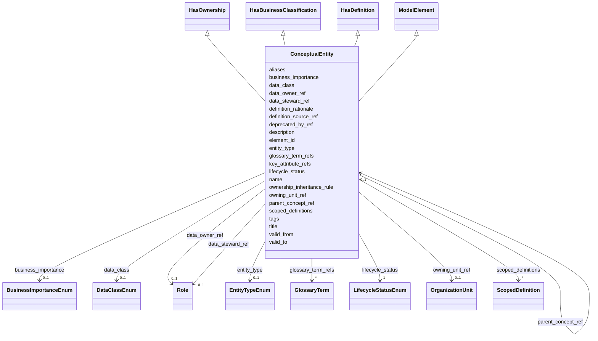

```mermaid
 classDiagram
    class ConceptualEntity
    click ConceptualEntity href "../ConceptualEntity"
      HasOwnership <|-- ConceptualEntity
        click HasOwnership href "../HasOwnership"
      HasBusinessClassification <|-- ConceptualEntity
        click HasBusinessClassification href "../HasBusinessClassification"
      HasDefinition <|-- ConceptualEntity
        click HasDefinition href "../HasDefinition"
      ModelElement <|-- ConceptualEntity
        click ModelElement href "../ModelElement"
      
      ConceptualEntity : aliases
        
      ConceptualEntity : business_importance
        
          
    
        
        
        ConceptualEntity --> "0..1" BusinessImportanceEnum : business_importance
        click BusinessImportanceEnum href "../BusinessImportanceEnum"
    

        
      ConceptualEntity : data_class
        
          
    
        
        
        ConceptualEntity --> "0..1" DataClassEnum : data_class
        click DataClassEnum href "../DataClassEnum"
    

        
      ConceptualEntity : data_owner_ref
        
          
    
        
        
        ConceptualEntity --> "0..1" Role : data_owner_ref
        click Role href "../Role"
    

        
      ConceptualEntity : data_steward_ref
        
          
    
        
        
        ConceptualEntity --> "0..1" Role : data_steward_ref
        click Role href "../Role"
    

        
      ConceptualEntity : definition_rationale
        
      ConceptualEntity : definition_source_ref
        
      ConceptualEntity : deprecated_by_ref
        
      ConceptualEntity : description
        
      ConceptualEntity : element_id
        
      ConceptualEntity : entity_type
        
          
    
        
        
        ConceptualEntity --> "0..1" EntityTypeEnum : entity_type
        click EntityTypeEnum href "../EntityTypeEnum"
    

        
      ConceptualEntity : glossary_term_refs
        
          
    
        
        
        ConceptualEntity --> "*" GlossaryTerm : glossary_term_refs
        click GlossaryTerm href "../GlossaryTerm"
    

        
      ConceptualEntity : key_attribute_refs
        
      ConceptualEntity : lifecycle_status
        
          
    
        
        
        ConceptualEntity --> "1" LifecycleStatusEnum : lifecycle_status
        click LifecycleStatusEnum href "../LifecycleStatusEnum"
    

        
      ConceptualEntity : name
        
      ConceptualEntity : ownership_inheritance_rule
        
      ConceptualEntity : owning_unit_ref
        
          
    
        
        
        ConceptualEntity --> "0..1" OrganizationUnit : owning_unit_ref
        click OrganizationUnit href "../OrganizationUnit"
    

        
      ConceptualEntity : parent_concept_ref
        
          
    
        
        
        ConceptualEntity --> "0..1" ConceptualEntity : parent_concept_ref
        click ConceptualEntity href "../ConceptualEntity"
    

        
      ConceptualEntity : scoped_definitions
        
          
    
        
        
        ConceptualEntity --> "*" ScopedDefinition : scoped_definitions
        click ScopedDefinition href "../ScopedDefinition"
    

        
      ConceptualEntity : tags
        
      ConceptualEntity : title
        
      ConceptualEntity : valid_from
        
      ConceptualEntity : valid_to
        
      
```
