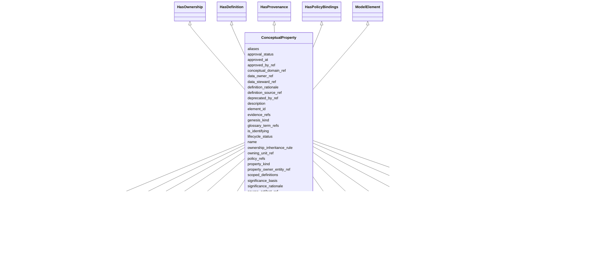

```mermaid
 classDiagram
    class ConceptualProperty
    click ConceptualProperty href "../ConceptualProperty"
      HasOwnership <|-- ConceptualProperty
        click HasOwnership href "../HasOwnership"
      HasDefinition <|-- ConceptualProperty
        click HasDefinition href "../HasDefinition"
      HasProvenance <|-- ConceptualProperty
        click HasProvenance href "../HasProvenance"
      HasPolicyBindings <|-- ConceptualProperty
        click HasPolicyBindings href "../HasPolicyBindings"
      ModelElement <|-- ConceptualProperty
        click ModelElement href "../ModelElement"
      
      ConceptualProperty : aliases
        
      ConceptualProperty : approval_status
        
          
    
        
        
        ConceptualProperty --> "0..1" ApprovalStatusEnum : approval_status
        click ApprovalStatusEnum href "../ApprovalStatusEnum"
    

        
      ConceptualProperty : approved_at
        
      ConceptualProperty : approved_by_ref
        
          
    
        
        
        ConceptualProperty --> "0..1" Role : approved_by_ref
        click Role href "../Role"
    

        
      ConceptualProperty : conceptual_domain_ref
        
          
    
        
        
        ConceptualProperty --> "0..1" ConceptualDomain : conceptual_domain_ref
        click ConceptualDomain href "../ConceptualDomain"
    

        
      ConceptualProperty : data_owner_ref
        
          
    
        
        
        ConceptualProperty --> "0..1" Role : data_owner_ref
        click Role href "../Role"
    

        
      ConceptualProperty : data_steward_ref
        
          
    
        
        
        ConceptualProperty --> "0..1" Role : data_steward_ref
        click Role href "../Role"
    

        
      ConceptualProperty : definition_rationale
        
      ConceptualProperty : definition_source_ref
        
      ConceptualProperty : deprecated_by_ref
        
      ConceptualProperty : description
        
      ConceptualProperty : element_id
        
      ConceptualProperty : evidence_refs
        
      ConceptualProperty : genesis_kind
        
          
    
        
        
        ConceptualProperty --> "1" GenesisKindEnum : genesis_kind
        click GenesisKindEnum href "../GenesisKindEnum"
    

        
      ConceptualProperty : glossary_term_refs
        
          
    
        
        
        ConceptualProperty --> "*" GlossaryTerm : glossary_term_refs
        click GlossaryTerm href "../GlossaryTerm"
    

        
      ConceptualProperty : is_identifying
        
      ConceptualProperty : lifecycle_status
        
          
    
        
        
        ConceptualProperty --> "1" LifecycleStatusEnum : lifecycle_status
        click LifecycleStatusEnum href "../LifecycleStatusEnum"
    

        
      ConceptualProperty : name
        
      ConceptualProperty : ownership_inheritance_rule
        
      ConceptualProperty : owning_unit_ref
        
          
    
        
        
        ConceptualProperty --> "0..1" OrganizationUnit : owning_unit_ref
        click OrganizationUnit href "../OrganizationUnit"
    

        
      ConceptualProperty : policy_refs
        
          
    
        
        
        ConceptualProperty --> "*" Policy : policy_refs
        click Policy href "../Policy"
    

        
      ConceptualProperty : property_kind
        
          
    
        
        
        ConceptualProperty --> "1" PropertyKindEnum : property_kind
        click PropertyKindEnum href "../PropertyKindEnum"
    

        
      ConceptualProperty : property_owner_entity_ref
        
          
    
        
        
        ConceptualProperty --> "1" ConceptualEntity : property_owner_entity_ref
        click ConceptualEntity href "../ConceptualEntity"
    

        
      ConceptualProperty : scoped_definitions
        
          
    
        
        
        ConceptualProperty --> "*" ScopedDefinition : scoped_definitions
        click ScopedDefinition href "../ScopedDefinition"
    

        
      ConceptualProperty : significance_basis
        
          
    
        
        
        ConceptualProperty --> "1..*" SignificanceBasisEnum : significance_basis
        click SignificanceBasisEnum href "../SignificanceBasisEnum"
    

        
      ConceptualProperty : significance_rationale
        
      ConceptualProperty : source_artifact_ref
        
      ConceptualProperty : tags
        
      ConceptualProperty : title
        
      ConceptualProperty : valid_from
        
      ConceptualProperty : valid_to
        
      
```
