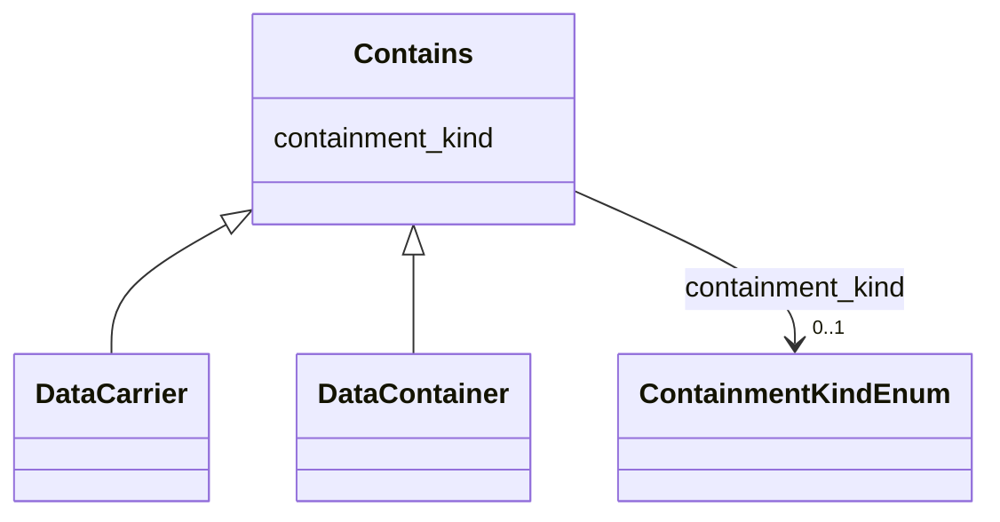

```mermaid
 classDiagram
    class Contains
    click Contains href "../Contains"
      Contains <|-- DataCarrier
        click DataCarrier href "../DataCarrier"
      Contains <|-- DataContainer
        click DataContainer href "../DataContainer"
      
      Contains : containment_kind
        
          
    
        
        
        Contains --> "0..1" ContainmentKindEnum : containment_kind
        click ContainmentKindEnum href "../ContainmentKindEnum"
    

        
      
```
