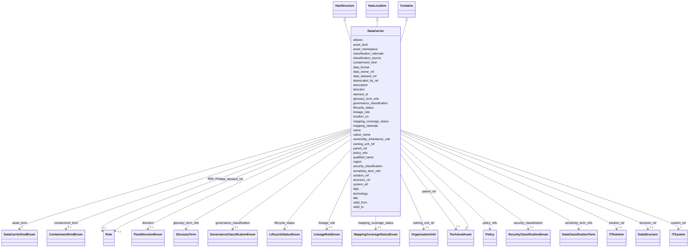

```mermaid
 classDiagram
    class DataCarrier
    click DataCarrier href "../DataCarrier"
      HasStructure <|-- DataCarrier
        click HasStructure href "../HasStructure"
      HasLocation <|-- DataCarrier
        click HasLocation href "../HasLocation"
      Contains <|-- DataCarrier
        click Contains href "../Contains"
      TechnicalAsset <|-- DataCarrier
        click TechnicalAsset href "../TechnicalAsset"
      
      DataCarrier : aliases
        
      DataCarrier : asset_kind
        
          
    
        
        
        DataCarrier --> "1" DataCarrierKindEnum : asset_kind
        click DataCarrierKindEnum href "../DataCarrierKindEnum"
    

        
      DataCarrier : asset_namespace
        
      DataCarrier : classification_rationale
        
      DataCarrier : classification_source
        
      DataCarrier : containment_kind
        
          
    
        
        
        DataCarrier --> "0..1" ContainmentKindEnum : containment_kind
        click ContainmentKindEnum href "../ContainmentKindEnum"
    

        
      DataCarrier : data_format
        
      DataCarrier : data_owner_ref
        
          
    
        
        
        DataCarrier --> "0..1" Role : data_owner_ref
        click Role href "../Role"
    

        
      DataCarrier : data_steward_ref
        
          
    
        
        
        DataCarrier --> "0..1" Role : data_steward_ref
        click Role href "../Role"
    

        
      DataCarrier : deprecated_by_ref
        
      DataCarrier : description
        
      DataCarrier : direction
        
          
    
        
        
        DataCarrier --> "0..1" FlowDirectionEnum : direction
        click FlowDirectionEnum href "../FlowDirectionEnum"
    

        
      DataCarrier : element_id
        
      DataCarrier : glossary_term_refs
        
          
    
        
        
        DataCarrier --> "*" GlossaryTerm : glossary_term_refs
        click GlossaryTerm href "../GlossaryTerm"
    

        
      DataCarrier : governance_classification
        
          
    
        
        
        DataCarrier --> "0..1" GovernanceClassificationEnum : governance_classification
        click GovernanceClassificationEnum href "../GovernanceClassificationEnum"
    

        
      DataCarrier : lifecycle_status
        
          
    
        
        
        DataCarrier --> "1" LifecycleStatusEnum : lifecycle_status
        click LifecycleStatusEnum href "../LifecycleStatusEnum"
    

        
      DataCarrier : lineage_role
        
          
    
        
        
        DataCarrier --> "0..1" LineageRoleEnum : lineage_role
        click LineageRoleEnum href "../LineageRoleEnum"
    

        
      DataCarrier : location_uri
        
      DataCarrier : mapping_coverage_status
        
          
    
        
        
        DataCarrier --> "0..1" MappingCoverageStatusEnum : mapping_coverage_status
        click MappingCoverageStatusEnum href "../MappingCoverageStatusEnum"
    

        
      DataCarrier : mapping_rationale
        
      DataCarrier : name
        
      DataCarrier : native_name
        
      DataCarrier : ownership_inheritance_rule
        
      DataCarrier : owning_unit_ref
        
          
    
        
        
        DataCarrier --> "0..1" OrganizationUnit : owning_unit_ref
        click OrganizationUnit href "../OrganizationUnit"
    

        
      DataCarrier : parent_ref
        
          
    
        
        
        DataCarrier --> "0..1" TechnicalAsset : parent_ref
        click TechnicalAsset href "../TechnicalAsset"
    

        
      DataCarrier : policy_refs
        
          
    
        
        
        DataCarrier --> "*" Policy : policy_refs
        click Policy href "../Policy"
    

        
      DataCarrier : qualified_name
        
      DataCarrier : region
        
      DataCarrier : security_classification
        
          
    
        
        
        DataCarrier --> "0..1" SecurityClassificationEnum : security_classification
        click SecurityClassificationEnum href "../SecurityClassificationEnum"
    

        
      DataCarrier : sensitivity_term_refs
        
          
    
        
        
        DataCarrier --> "*" DataClassificationTerm : sensitivity_term_refs
        click DataClassificationTerm href "../DataClassificationTerm"
    

        
      DataCarrier : solution_ref
        
          
    
        
        
        DataCarrier --> "0..1" ITSolution : solution_ref
        click ITSolution href "../ITSolution"
    

        
      DataCarrier : structure_ref
        
          
    
        
        
        DataCarrier --> "0..1" DataStructure : structure_ref
        click DataStructure href "../DataStructure"
    

        
      DataCarrier : system_ref
        
          
    
        
        
        DataCarrier --> "1" ITSystem : system_ref
        click ITSystem href "../ITSystem"
    

        
      DataCarrier : tags
        
      DataCarrier : technology
        
      DataCarrier : title
        
      DataCarrier : valid_from
        
      DataCarrier : valid_to
        
      
```
