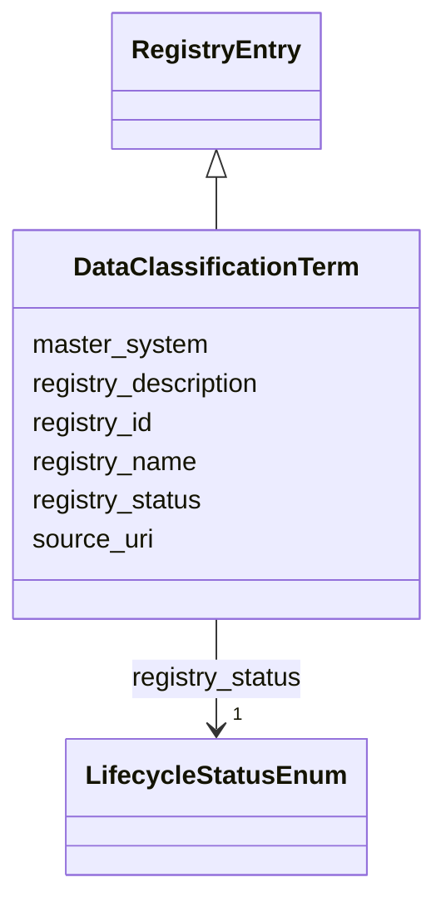

```mermaid
 classDiagram
    class DataClassificationTerm
    click DataClassificationTerm href "../DataClassificationTerm"
      RegistryEntry <|-- DataClassificationTerm
        click RegistryEntry href "../RegistryEntry"
      
      DataClassificationTerm : master_system
        
      DataClassificationTerm : registry_description
        
      DataClassificationTerm : registry_id
        
      DataClassificationTerm : registry_name
        
      DataClassificationTerm : registry_status
        
          
    
        
        
        DataClassificationTerm --> "1" LifecycleStatusEnum : registry_status
        click LifecycleStatusEnum href "../LifecycleStatusEnum"
    

        
      DataClassificationTerm : source_uri
        
      
```
