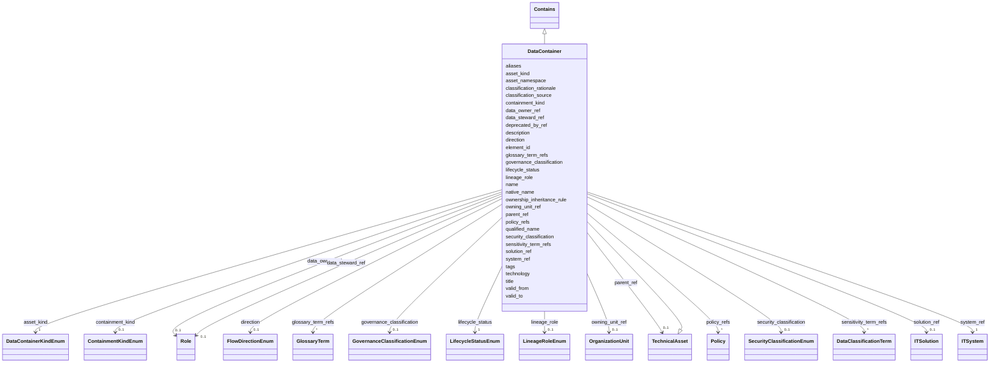

```mermaid
 classDiagram
    class DataContainer
    click DataContainer href "../DataContainer"
      Contains <|-- DataContainer
        click Contains href "../Contains"
      TechnicalAsset <|-- DataContainer
        click TechnicalAsset href "../TechnicalAsset"
      
      DataContainer : aliases
        
      DataContainer : asset_kind
        
          
    
        
        
        DataContainer --> "1" DataContainerKindEnum : asset_kind
        click DataContainerKindEnum href "../DataContainerKindEnum"
    

        
      DataContainer : asset_namespace
        
      DataContainer : classification_rationale
        
      DataContainer : classification_source
        
      DataContainer : containment_kind
        
          
    
        
        
        DataContainer --> "0..1" ContainmentKindEnum : containment_kind
        click ContainmentKindEnum href "../ContainmentKindEnum"
    

        
      DataContainer : data_owner_ref
        
          
    
        
        
        DataContainer --> "0..1" Role : data_owner_ref
        click Role href "../Role"
    

        
      DataContainer : data_steward_ref
        
          
    
        
        
        DataContainer --> "0..1" Role : data_steward_ref
        click Role href "../Role"
    

        
      DataContainer : deprecated_by_ref
        
      DataContainer : description
        
      DataContainer : direction
        
          
    
        
        
        DataContainer --> "0..1" FlowDirectionEnum : direction
        click FlowDirectionEnum href "../FlowDirectionEnum"
    

        
      DataContainer : element_id
        
      DataContainer : glossary_term_refs
        
          
    
        
        
        DataContainer --> "*" GlossaryTerm : glossary_term_refs
        click GlossaryTerm href "../GlossaryTerm"
    

        
      DataContainer : governance_classification
        
          
    
        
        
        DataContainer --> "0..1" GovernanceClassificationEnum : governance_classification
        click GovernanceClassificationEnum href "../GovernanceClassificationEnum"
    

        
      DataContainer : lifecycle_status
        
          
    
        
        
        DataContainer --> "1" LifecycleStatusEnum : lifecycle_status
        click LifecycleStatusEnum href "../LifecycleStatusEnum"
    

        
      DataContainer : lineage_role
        
          
    
        
        
        DataContainer --> "0..1" LineageRoleEnum : lineage_role
        click LineageRoleEnum href "../LineageRoleEnum"
    

        
      DataContainer : name
        
      DataContainer : native_name
        
      DataContainer : ownership_inheritance_rule
        
      DataContainer : owning_unit_ref
        
          
    
        
        
        DataContainer --> "0..1" OrganizationUnit : owning_unit_ref
        click OrganizationUnit href "../OrganizationUnit"
    

        
      DataContainer : parent_ref
        
          
    
        
        
        DataContainer --> "0..1" TechnicalAsset : parent_ref
        click TechnicalAsset href "../TechnicalAsset"
    

        
      DataContainer : policy_refs
        
          
    
        
        
        DataContainer --> "*" Policy : policy_refs
        click Policy href "../Policy"
    

        
      DataContainer : qualified_name
        
      DataContainer : security_classification
        
          
    
        
        
        DataContainer --> "0..1" SecurityClassificationEnum : security_classification
        click SecurityClassificationEnum href "../SecurityClassificationEnum"
    

        
      DataContainer : sensitivity_term_refs
        
          
    
        
        
        DataContainer --> "*" DataClassificationTerm : sensitivity_term_refs
        click DataClassificationTerm href "../DataClassificationTerm"
    

        
      DataContainer : solution_ref
        
          
    
        
        
        DataContainer --> "0..1" ITSolution : solution_ref
        click ITSolution href "../ITSolution"
    

        
      DataContainer : system_ref
        
          
    
        
        
        DataContainer --> "1" ITSystem : system_ref
        click ITSystem href "../ITSystem"
    

        
      DataContainer : tags
        
      DataContainer : technology
        
      DataContainer : title
        
      DataContainer : valid_from
        
      DataContainer : valid_to
        
      
```
