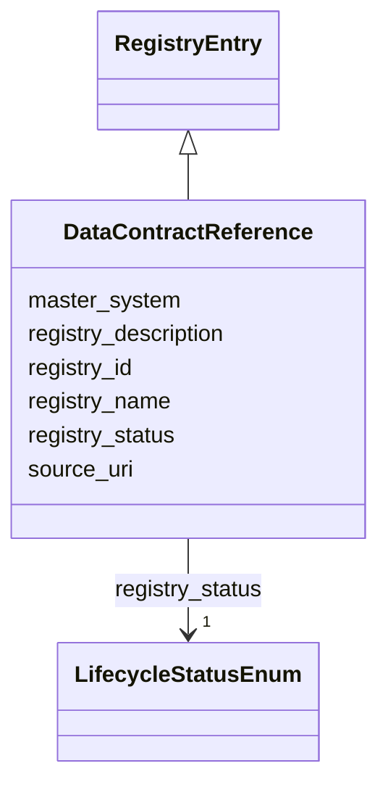

```mermaid
 classDiagram
    class DataContractReference
    click DataContractReference href "../DataContractReference"
      RegistryEntry <|-- DataContractReference
        click RegistryEntry href "../RegistryEntry"
      
      DataContractReference : master_system
        
      DataContractReference : registry_description
        
      DataContractReference : registry_id
        
      DataContractReference : registry_name
        
      DataContractReference : registry_status
        
          
    
        
        
        DataContractReference --> "1" LifecycleStatusEnum : registry_status
        click LifecycleStatusEnum href "../LifecycleStatusEnum"
    

        
      DataContractReference : source_uri
        
      
```
