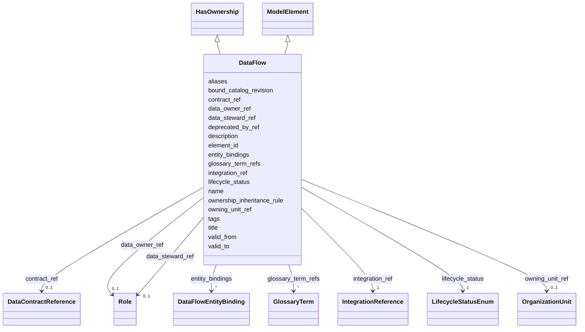

```mermaid
 classDiagram
    class DataFlow
    click DataFlow href "../DataFlow"
      HasOwnership <|-- DataFlow
        click HasOwnership href "../HasOwnership"
      ModelElement <|-- DataFlow
        click ModelElement href "../ModelElement"
      
      DataFlow : aliases
        
      DataFlow : bound_catalog_revision
        
      DataFlow : contract_ref
        
          
    
        
        
        DataFlow --> "0..1" DataContractReference : contract_ref
        click DataContractReference href "../DataContractReference"
    

        
      DataFlow : data_owner_ref
        
          
    
        
        
        DataFlow --> "0..1" Role : data_owner_ref
        click Role href "../Role"
    

        
      DataFlow : data_steward_ref
        
          
    
        
        
        DataFlow --> "0..1" Role : data_steward_ref
        click Role href "../Role"
    

        
      DataFlow : deprecated_by_ref
        
      DataFlow : description
        
      DataFlow : element_id
        
      DataFlow : entity_bindings
        
          
    
        
        
        DataFlow --> "*" DataFlowEntityBinding : entity_bindings
        click DataFlowEntityBinding href "../DataFlowEntityBinding"
    

        
      DataFlow : glossary_term_refs
        
          
    
        
        
        DataFlow --> "*" GlossaryTerm : glossary_term_refs
        click GlossaryTerm href "../GlossaryTerm"
    

        
      DataFlow : integration_ref
        
          
    
        
        
        DataFlow --> "1" IntegrationReference : integration_ref
        click IntegrationReference href "../IntegrationReference"
    

        
      DataFlow : lifecycle_status
        
          
    
        
        
        DataFlow --> "1" LifecycleStatusEnum : lifecycle_status
        click LifecycleStatusEnum href "../LifecycleStatusEnum"
    

        
      DataFlow : name
        
      DataFlow : ownership_inheritance_rule
        
      DataFlow : owning_unit_ref
        
          
    
        
        
        DataFlow --> "0..1" OrganizationUnit : owning_unit_ref
        click OrganizationUnit href "../OrganizationUnit"
    

        
      DataFlow : tags
        
      DataFlow : title
        
      DataFlow : valid_from
        
      DataFlow : valid_to
        
      
```
