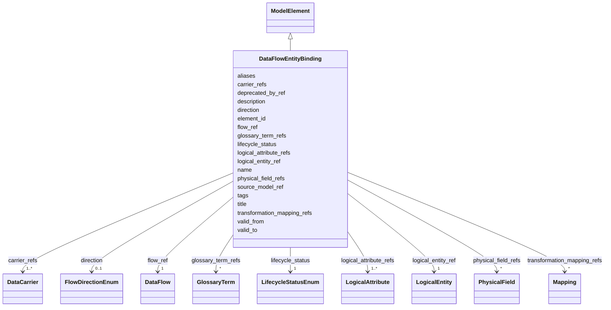

```mermaid
 classDiagram
    class DataFlowEntityBinding
    click DataFlowEntityBinding href "../DataFlowEntityBinding"
      ModelElement <|-- DataFlowEntityBinding
        click ModelElement href "../ModelElement"
      
      DataFlowEntityBinding : aliases
        
      DataFlowEntityBinding : carrier_refs
        
          
    
        
        
        DataFlowEntityBinding --> "1..*" DataCarrier : carrier_refs
        click DataCarrier href "../DataCarrier"
    

        
      DataFlowEntityBinding : deprecated_by_ref
        
      DataFlowEntityBinding : description
        
      DataFlowEntityBinding : direction
        
          
    
        
        
        DataFlowEntityBinding --> "0..1" FlowDirectionEnum : direction
        click FlowDirectionEnum href "../FlowDirectionEnum"
    

        
      DataFlowEntityBinding : element_id
        
      DataFlowEntityBinding : flow_ref
        
          
    
        
        
        DataFlowEntityBinding --> "1" DataFlow : flow_ref
        click DataFlow href "../DataFlow"
    

        
      DataFlowEntityBinding : glossary_term_refs
        
          
    
        
        
        DataFlowEntityBinding --> "*" GlossaryTerm : glossary_term_refs
        click GlossaryTerm href "../GlossaryTerm"
    

        
      DataFlowEntityBinding : lifecycle_status
        
          
    
        
        
        DataFlowEntityBinding --> "1" LifecycleStatusEnum : lifecycle_status
        click LifecycleStatusEnum href "../LifecycleStatusEnum"
    

        
      DataFlowEntityBinding : logical_attribute_refs
        
          
    
        
        
        DataFlowEntityBinding --> "1..*" LogicalAttribute : logical_attribute_refs
        click LogicalAttribute href "../LogicalAttribute"
    

        
      DataFlowEntityBinding : logical_entity_ref
        
          
    
        
        
        DataFlowEntityBinding --> "1" LogicalEntity : logical_entity_ref
        click LogicalEntity href "../LogicalEntity"
    

        
      DataFlowEntityBinding : name
        
      DataFlowEntityBinding : physical_field_refs
        
          
    
        
        
        DataFlowEntityBinding --> "*" PhysicalField : physical_field_refs
        click PhysicalField href "../PhysicalField"
    

        
      DataFlowEntityBinding : source_model_ref
        
      DataFlowEntityBinding : tags
        
      DataFlowEntityBinding : title
        
      DataFlowEntityBinding : transformation_mapping_refs
        
          
    
        
        
        DataFlowEntityBinding --> "*" Mapping : transformation_mapping_refs
        click Mapping href "../Mapping"
    

        
      DataFlowEntityBinding : valid_from
        
      DataFlowEntityBinding : valid_to
        
      
```
