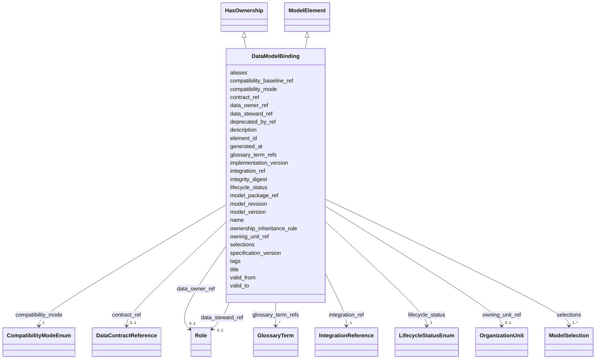

```mermaid
 classDiagram
    class DataModelBinding
    click DataModelBinding href "../DataModelBinding"
      HasOwnership <|-- DataModelBinding
        click HasOwnership href "../HasOwnership"
      ModelElement <|-- DataModelBinding
        click ModelElement href "../ModelElement"
      
      DataModelBinding : aliases
        
      DataModelBinding : compatibility_baseline_ref
        
      DataModelBinding : compatibility_mode
        
          
    
        
        
        DataModelBinding --> "1" CompatibilityModeEnum : compatibility_mode
        click CompatibilityModeEnum href "../CompatibilityModeEnum"
    

        
      DataModelBinding : contract_ref
        
          
    
        
        
        DataModelBinding --> "0..1" DataContractReference : contract_ref
        click DataContractReference href "../DataContractReference"
    

        
      DataModelBinding : data_owner_ref
        
          
    
        
        
        DataModelBinding --> "0..1" Role : data_owner_ref
        click Role href "../Role"
    

        
      DataModelBinding : data_steward_ref
        
          
    
        
        
        DataModelBinding --> "0..1" Role : data_steward_ref
        click Role href "../Role"
    

        
      DataModelBinding : deprecated_by_ref
        
      DataModelBinding : description
        
      DataModelBinding : element_id
        
      DataModelBinding : generated_at
        
      DataModelBinding : glossary_term_refs
        
          
    
        
        
        DataModelBinding --> "*" GlossaryTerm : glossary_term_refs
        click GlossaryTerm href "../GlossaryTerm"
    

        
      DataModelBinding : implementation_version
        
      DataModelBinding : integration_ref
        
          
    
        
        
        DataModelBinding --> "1" IntegrationReference : integration_ref
        click IntegrationReference href "../IntegrationReference"
    

        
      DataModelBinding : integrity_digest
        
      DataModelBinding : lifecycle_status
        
          
    
        
        
        DataModelBinding --> "1" LifecycleStatusEnum : lifecycle_status
        click LifecycleStatusEnum href "../LifecycleStatusEnum"
    

        
      DataModelBinding : model_package_ref
        
      DataModelBinding : model_revision
        
      DataModelBinding : model_version
        
      DataModelBinding : name
        
      DataModelBinding : ownership_inheritance_rule
        
      DataModelBinding : owning_unit_ref
        
          
    
        
        
        DataModelBinding --> "0..1" OrganizationUnit : owning_unit_ref
        click OrganizationUnit href "../OrganizationUnit"
    

        
      DataModelBinding : selections
        
          
    
        
        
        DataModelBinding --> "1..*" ModelSelection : selections
        click ModelSelection href "../ModelSelection"
    

        
      DataModelBinding : specification_version
        
      DataModelBinding : tags
        
      DataModelBinding : title
        
      DataModelBinding : valid_from
        
      DataModelBinding : valid_to
        
      
```
