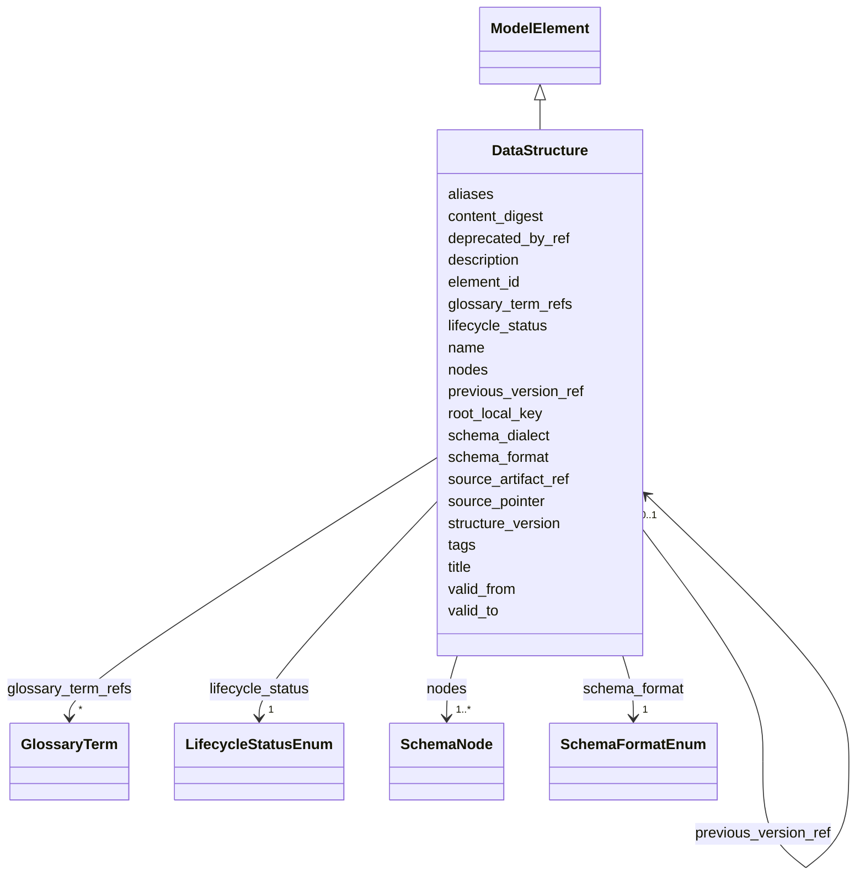

```mermaid
 classDiagram
    class DataStructure
    click DataStructure href "../DataStructure"
      ModelElement <|-- DataStructure
        click ModelElement href "../ModelElement"
      
      DataStructure : aliases
        
      DataStructure : content_digest
        
      DataStructure : deprecated_by_ref
        
      DataStructure : description
        
      DataStructure : element_id
        
      DataStructure : glossary_term_refs
        
          
    
        
        
        DataStructure --> "*" GlossaryTerm : glossary_term_refs
        click GlossaryTerm href "../GlossaryTerm"
    

        
      DataStructure : lifecycle_status
        
          
    
        
        
        DataStructure --> "1" LifecycleStatusEnum : lifecycle_status
        click LifecycleStatusEnum href "../LifecycleStatusEnum"
    

        
      DataStructure : name
        
      DataStructure : nodes
        
          
    
        
        
        DataStructure --> "1..*" SchemaNode : nodes
        click SchemaNode href "../SchemaNode"
    

        
      DataStructure : previous_version_ref
        
          
    
        
        
        DataStructure --> "0..1" DataStructure : previous_version_ref
        click DataStructure href "../DataStructure"
    

        
      DataStructure : root_local_key
        
      DataStructure : schema_dialect
        
      DataStructure : schema_format
        
          
    
        
        
        DataStructure --> "1" SchemaFormatEnum : schema_format
        click SchemaFormatEnum href "../SchemaFormatEnum"
    

        
      DataStructure : source_artifact_ref
        
      DataStructure : source_pointer
        
      DataStructure : structure_version
        
      DataStructure : tags
        
      DataStructure : title
        
      DataStructure : valid_from
        
      DataStructure : valid_to
        
      
```
