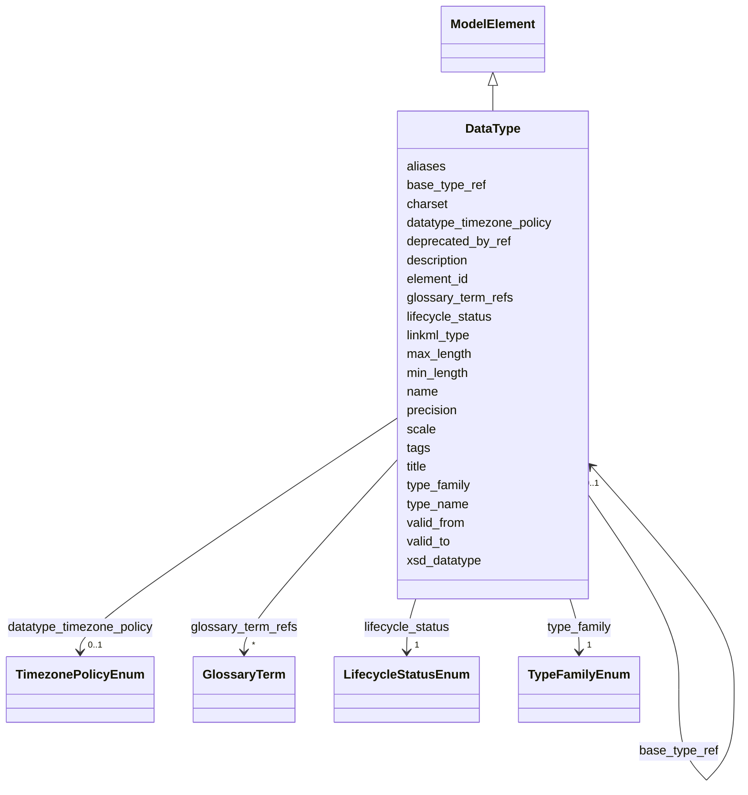

```mermaid
 classDiagram
    class DataType
    click DataType href "../DataType"
      ModelElement <|-- DataType
        click ModelElement href "../ModelElement"
      
      DataType : aliases
        
      DataType : base_type_ref
        
          
    
        
        
        DataType --> "0..1" DataType : base_type_ref
        click DataType href "../DataType"
    

        
      DataType : charset
        
      DataType : datatype_timezone_policy
        
          
    
        
        
        DataType --> "0..1" TimezonePolicyEnum : datatype_timezone_policy
        click TimezonePolicyEnum href "../TimezonePolicyEnum"
    

        
      DataType : deprecated_by_ref
        
      DataType : description
        
      DataType : element_id
        
      DataType : glossary_term_refs
        
          
    
        
        
        DataType --> "*" GlossaryTerm : glossary_term_refs
        click GlossaryTerm href "../GlossaryTerm"
    

        
      DataType : lifecycle_status
        
          
    
        
        
        DataType --> "1" LifecycleStatusEnum : lifecycle_status
        click LifecycleStatusEnum href "../LifecycleStatusEnum"
    

        
      DataType : linkml_type
        
      DataType : max_length
        
      DataType : min_length
        
      DataType : name
        
      DataType : precision
        
      DataType : scale
        
      DataType : tags
        
      DataType : title
        
      DataType : type_family
        
          
    
        
        
        DataType --> "1" TypeFamilyEnum : type_family
        click TypeFamilyEnum href "../TypeFamilyEnum"
    

        
      DataType : type_name
        
      DataType : valid_from
        
      DataType : valid_to
        
      DataType : xsd_datatype
        
      
```
